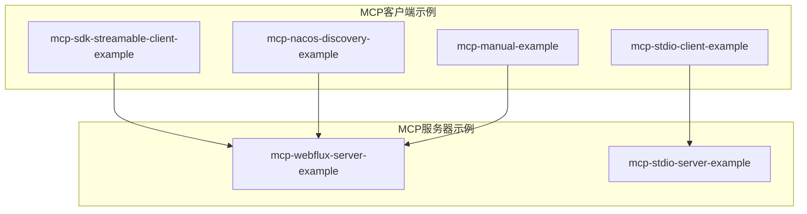
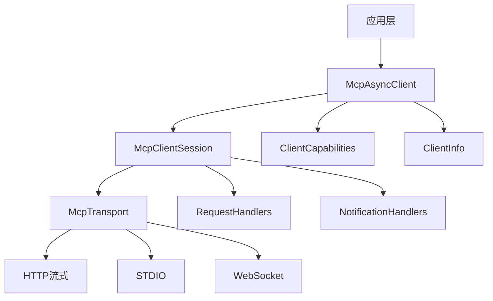
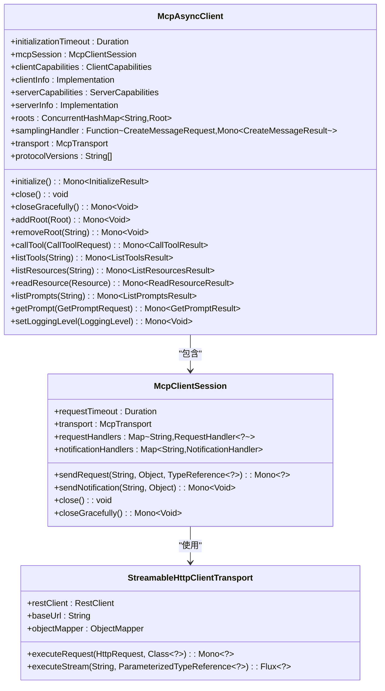
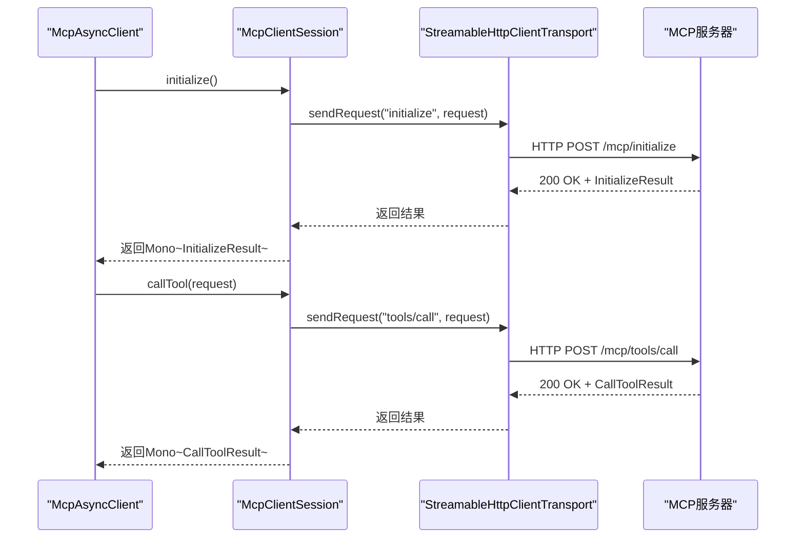
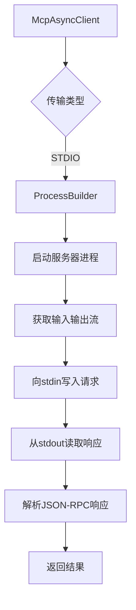
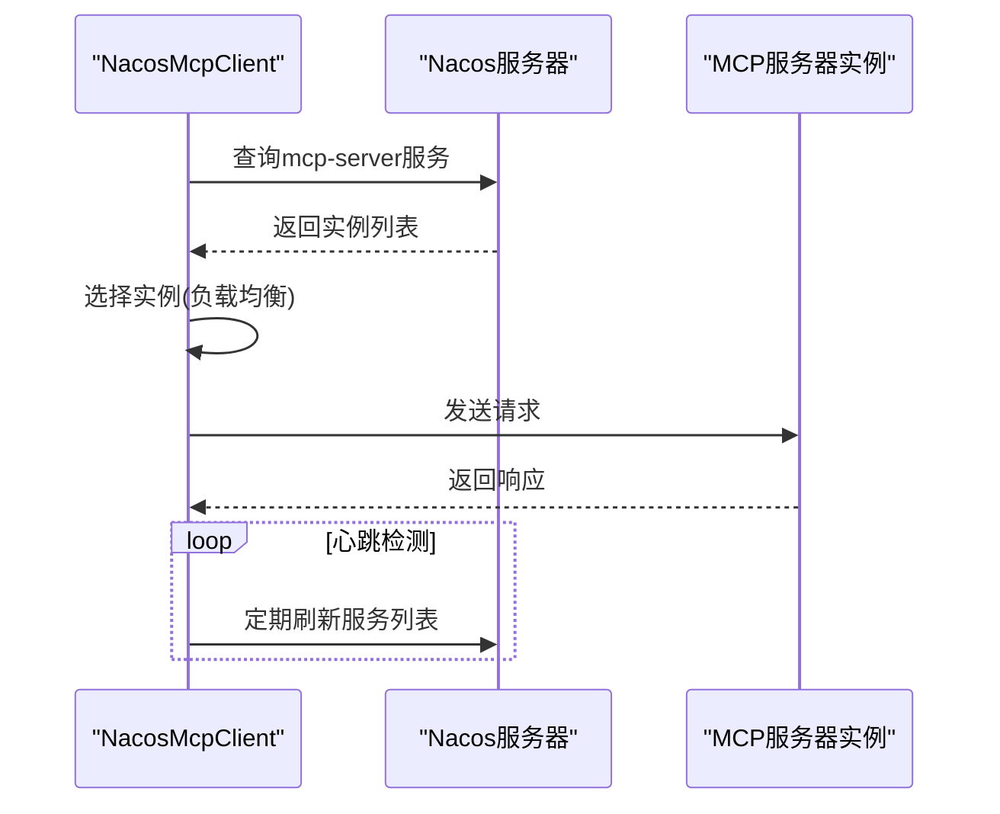
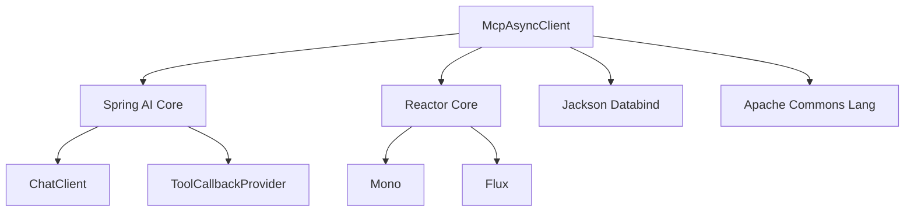

# MCP客户端

<cite>
**本文档引用的文件**  
- [Application.java](file://spring-ai-alibaba-mcp-example/spring-ai-alibaba-mcp-starter-example/client/mcp-sdk-streamable-client-example/src/main/java/com/alibaba/cloud/ai/example/mcp/streamable/Application.java)
- [McpAsyncClient.java](file://spring-ai-alibaba-mcp-example/spring-ai-alibaba-mcp-starter-example/client/mcp-streamable-client-example/src/main/java/io/modelcontextprotocol/client/McpAsyncClient.java)
- [mcp-config.yml](file://spring-ai-alibaba-playground/src/main/resources/mcp-config.yml)
</cite>

## 目录
1. [简介](#简介)
2. [项目结构](#项目结构)
3. [核心组件](#核心组件)
4. [架构概述](#架构概述)
5. [详细组件分析](#详细组件分析)
6. [依赖分析](#依赖分析)
7. [性能考虑](#性能考虑)
8. [故障排除指南](#故障排除指南)
9. [结论](#结论)

## 简介
MCP（Model Context Protocol）客户端是用于与MCP服务器通信的关键组件，支持多种通信模式，包括流式、标准输入输出（STDIO）和基于Nacos的服务发现。本文档全面介绍MCP客户端的实现机制，重点阐述流式客户端、STDIO客户端以及Nacos服务发现客户端的工作原理。通过代码示例和架构图，帮助开发者理解如何配置和使用不同类型的MCP客户端，同时为高级用户提供连接池管理、错误重试机制和性能优化的深入解析。

## 项目结构
MCP客户端相关代码主要分布在`spring-ai-alibaba-mcp-example`模块中，包含多个子模块用于演示不同类型的客户端实现。核心实现位于`mcp-starter-example`和`mcp-manual-example`目录下，其中`mcp-sdk-streamable-client-example`展示了流式客户端的使用，`mcp-stdio-client-example`演示了STDIO通信模式，而`mcp-nacos-discovery-example`则实现了基于Nacos的服务发现机制。

**图示来源**  
- [mcp-config.yml](file://spring-ai-alibaba-playground/src/main/resources/mcp-config.yml#L1-L18)

**本节来源**  
- [mcp-config.yml](file://spring-ai-alibaba-playground/src/main/resources/mcp-config.yml#L1-L18)

## 核心组件
MCP客户端的核心组件包括`McpAsyncClient`、`McpClientSession`和`McpTransport`，它们共同实现了与MCP服务器的双向通信。`McpAsyncClient`作为主要的客户端接口，提供了初始化、工具调用、资源读取和提示管理等功能。`McpClientSession`负责管理JSON-RPC会话，而`McpTransport`则抽象了底层传输机制，支持HTTP流式和STDIO等多种通信方式。

**本节来源**  
- [McpAsyncClient.java](file://spring-ai-alibaba-mcp-example/spring-ai-alibaba-mcp-starter-example/client/mcp-streamable-client-example/src/main/java/io/modelcontextprotocol/client/McpAsyncClient.java#L78-L809)

## 架构概述
MCP客户端采用分层架构设计，上层为应用逻辑，中层为客户端核心，底层为传输适配器。客户端通过`McpAsyncClient`与服务器进行交互，首先通过`initialize()`方法完成协议版本协商和能力交换，然后通过各种方法调用执行具体操作。整个通信过程基于JSON-RPC协议，支持请求-响应和通知两种模式。

**图示来源**  
- [McpAsyncClient.java](file://spring-ai-alibaba-mcp-example/spring-ai-alibaba-mcp-starter-example/client/mcp-streamable-client-example/src/main/java/io/modelcontextprotocol/client/McpAsyncClient.java#L78-L809)

## 详细组件分析

### 流式客户端分析
流式客户端通过SSE（Server-Sent Events）实现双向流式通信，适用于需要实时响应的场景。`McpAsyncClient`使用`StreamableHttpClientTransport`作为传输层，能够处理服务器推送的事件流。

#### 配置McpAsyncClient

**图示来源**  
- [McpAsyncClient.java](file://spring-ai-alibaba-mcp-example/spring-ai-alibaba-mcp-starter-example/client/mcp-streamable-client-example/src/main/java/io/modelcontextprotocol/client/McpAsyncClient.java#L78-L809)

#### 处理SSE流和管理会话
流式客户端通过`executeStream`方法处理SSE流，该方法返回一个`Flux`，可以异步接收服务器推送的事件。会话管理通过`McpClientSession`实现，确保请求和响应的正确匹配。

**图示来源**  
- [McpAsyncClient.java](file://spring-ai-alibaba-mcp-example/spring-ai-alibaba-mcp-starter-example/client/mcp-streamable-client-example/src/main/java/io/modelcontextprotocol/client/McpAsyncClient.java#L78-L809)

**本节来源**  
- [McpAsyncClient.java](file://spring-ai-alibaba-mcp-example/spring-ai-alibaba-mcp-starter-example/client/mcp-streamable-client-example/src/main/java/io/modelcontextprotocol/client/McpAsyncClient.java#L78-L809)
- [Application.java](file://spring-ai-alibaba-mcp-example/spring-ai-alibaba-mcp-starter-example/client/mcp-sdk-streamable-client-example/src/main/java/com/alibaba/cloud/ai/example/mcp/streamable/Application.java#L0-L44)

### STDIO客户端工作机制
STDIO客户端通过标准输入输出与MCP服务器进程通信，适用于本地运行的服务器。客户端将JSON-RPC请求写入服务器的标准输入，从标准输出读取响应。

**图示来源**  
- [mcp-config.yml](file://spring-ai-alibaba-playground/src/main/resources/mcp-config.yml#L1-L18)

### Nacos服务发现客户端
Nacos服务发现客户端利用Nacos注册中心动态发现MCP服务器实例，实现服务的自动发现和负载均衡。

**图示来源**  
- [mcp-config.yml](file://spring-ai-alibaba-playground/src/main/resources/mcp-config.yml#L1-L18)

## 依赖分析
MCP客户端依赖于Spring AI框架的核心模块，通过`spring-ai-alibaba-starter`提供自动配置支持。客户端与服务器之间的通信基于JSON-RPC 2.0协议，使用`RestClient`进行HTTP通信，`ObjectMapper`进行JSON序列化。

**图示来源**  
- [Application.java](file://spring-ai-alibaba-mcp-example/spring-ai-alibaba-mcp-starter-example/client/mcp-sdk-streamable-client-example/src/main/java/com/alibaba/cloud/ai/example/mcp/streamable/Application.java#L0-L44)

**本节来源**  
- [Application.java](file://spring-ai-alibaba-mcp-example/spring-ai-alibaba-mcp-starter-example/client/mcp-sdk-streamable-client-example/src/main/java/com/alibaba/cloud/ai/example/mcp/streamable/Application.java#L0-L44)

## 性能考虑
MCP客户端在性能方面进行了多项优化，包括连接池管理、异步非阻塞I/O和缓存机制。流式客户端使用Reactor模式实现完全异步的通信，避免了线程阻塞。对于频繁调用的API，建议启用客户端缓存以减少网络开销。

## 故障排除指南
常见问题包括初始化超时、工具调用失败和资源读取错误。初始化超时通常是由于网络问题或服务器未正确启动；工具调用失败可能是由于服务器不支持该工具或参数错误；资源读取错误可能源于权限不足或资源不存在。

**本节来源**  
- [McpAsyncClient.java](file://spring-ai-alibaba-mcp-example/spring-ai-alibaba-mcp-starter-example/client/mcp-streamable-client-example/src/main/java/io/modelcontextprotocol/client/McpAsyncClient.java#L78-L809)

## 结论
MCP客户端提供了灵活的通信机制，支持流式、STDIO和基于服务发现的多种模式。通过`McpAsyncClient`的统一接口，开发者可以轻松集成不同类型的MCP服务器。对于初学者，建议从流式客户端开始；对于高级用户，可以深入研究连接池管理和错误重试机制以优化性能。