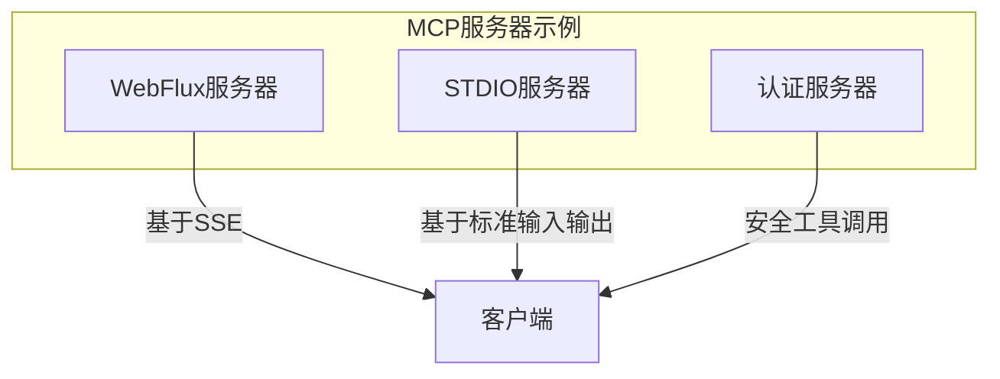
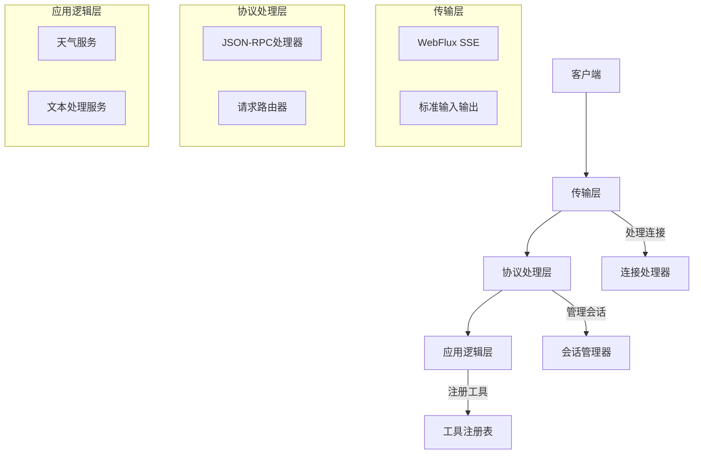
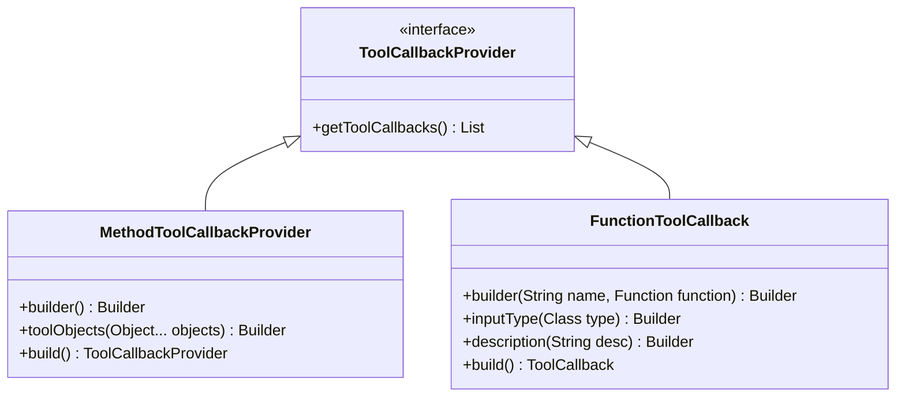
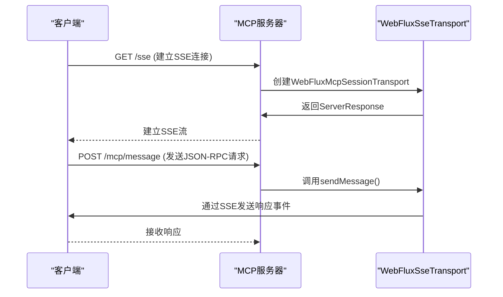
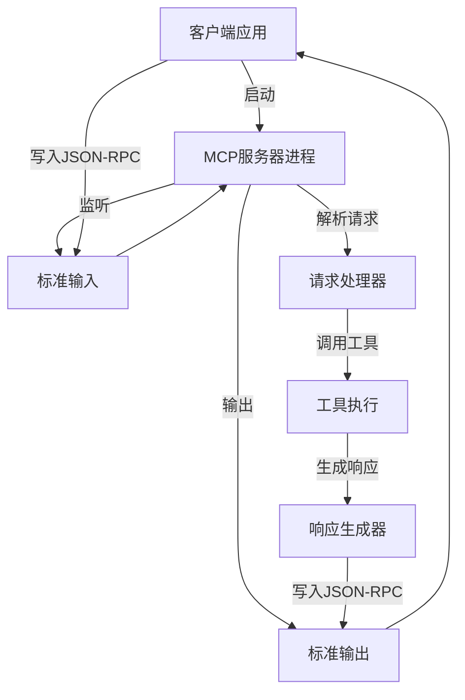
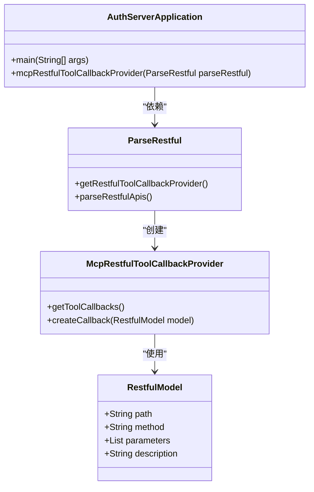
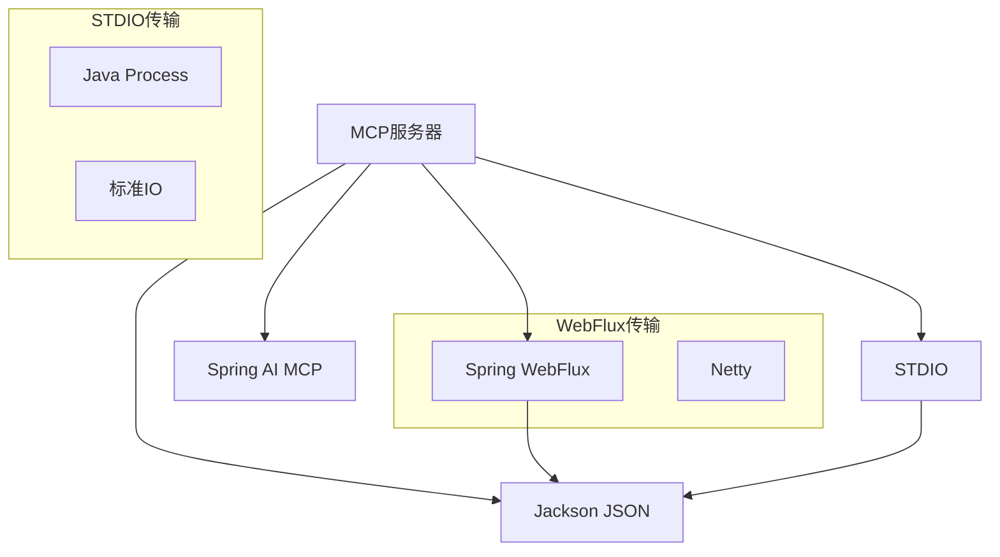

# MCP服务器

<cite>
**本文档引用的文件**
- [McpServerApplication.java](file://spring-ai-alibaba-mcp-example/spring-ai-alibaba-mcp-starter-example/server/mcp-webflux-server-example/src/main/java/org/springframework/ai/mcp/sample/server/McpServerApplication.java)
- [McpServerApplication.java](file://spring-ai-alibaba-mcp-example/spring-ai-alibaba-mcp-starter-example/server/mcp-stdio-server-example/src/main/java/com/alibaba/cloud/ai/mcp/sample/server/McpServerApplication.java)
- [AuthServerApplication.java](file://spring-ai-alibaba-mcp-example/spring-ai-alibaba-mcp-auth-example/server/mcp-auth-server/src/main/java/com/alibaba/cloud/ai/mcp/server/AuthServerApplication.java)
- [WebFluxSseServerTransportProvider.java](file://spring-ai-alibaba-mcp-example/spring-ai-alibaba-mcp-auth-example/server/mcp-auth-server/src/main/java/io/modelcontextprotocol/server/transport/WebFluxSseServerTransportProvider.java)
- [CustomMcpStdioTransportConfigurationBeanPostProcessor.java](file://spring-ai-alibaba-playground/src/main/java/com/alibaba/cloud/ai/application/config/mcp/CustomMcpStdioTransportConfigurationBeanPostProcessor.java)
- [MCP-server.md](file://spring-ai-alibaba-playground/src/main/resources/rag/markdown/MCP-server.md)
</cite>

## 目录
1. [简介](#简介)
2. [项目结构](#项目结构)
3. [核心组件](#核心组件)
4. [架构概述](#架构概述)
5. [详细组件分析](#详细组件分析)
6. [依赖分析](#依赖分析)
7. [性能考虑](#性能考虑)
8. [故障排除指南](#故障排除指南)
9. [结论](#结论)

## 简介
MCP（Model Context Protocol）服务器是一种用于在AI模型和外部工具之间建立通信的标准化协议实现。本文档详细介绍了如何构建和部署MCP服务器，重点阐述了工具注册、JSON-RPC请求处理、会话状态管理等核心机制。文档涵盖了WebFlux服务器和STDIO服务器两种实现方式，以及认证服务器的安全工具调用机制，为初学者和经验丰富的开发者提供全面的技术指导。

## 项目结构
MCP服务器示例项目采用模块化结构，主要包含WebFlux和STDIO两种传输方式的实现。WebFlux服务器使用SSE（Server-Sent Events）进行实时通信，而STDIO服务器通过标准输入输出与客户端交互。项目结构清晰地分离了不同类型的服务器实现，便于开发者根据需求选择合适的通信方式。

**图示来源**
- [McpServerApplication.java](file://spring-ai-alibaba-mcp-example/spring-ai-alibaba-mcp-starter-example/server/mcp-webflux-server-example/src/main/java/org/springframework/ai/mcp/sample/server/McpServerApplication.java)
- [McpServerApplication.java](file://spring-ai-alibaba-mcp-example/spring-ai-alibaba-mcp-starter-example/server/mcp-stdio-server-example/src/main/java/com/alibaba/cloud/ai/mcp/sample/server/McpServerApplication.java)

**本节来源**
- [McpServerApplication.java](file://spring-ai-alibaba-mcp-example/spring-ai-alibaba-mcp-starter-example/server/mcp-webflux-server-example/src/main/java/org/springframework/ai/mcp/sample/server/McpServerApplication.java)
- [McpServerApplication.java](file://spring-ai-alibaba-mcp-example/spring-ai-alibaba-mcp-starter-example/server/mcp-stdio-server-example/src/main/java/com/alibaba/cloud/ai/mcp/sample/server/McpServerApplication.java)

## 核心组件
MCP服务器的核心组件包括工具回调提供者（ToolCallbackProvider）、服务器传输层（ServerTransport）和会话管理机制。工具回调提供者负责注册和管理可调用的工具，服务器传输层处理客户端通信，会话管理机制维护客户端-服务器之间的状态。这些组件共同构成了MCP服务器的基础架构，支持灵活的工具扩展和高效的请求处理。

**本节来源**
- [McpServerApplication.java](file://spring-ai-alibaba-mcp-example/spring-ai-alibaba-mcp-starter-example/server/mcp-webflux-server-example/src/main/java/org/springframework/ai/mcp/sample/server/McpServerApplication.java)
- [AuthServerApplication.java](file://spring-ai-alibaba-mcp-example/spring-ai-alibaba-mcp-auth-example/server/mcp-auth-server/src/main/java/com/alibaba/cloud/ai/mcp/server/AuthServerApplication.java)

## 架构概述
MCP服务器采用分层架构设计，上层为应用逻辑层，中层为协议处理层，底层为传输层。应用逻辑层负责实现具体的业务功能和工具方法；协议处理层实现JSON-RPC协议，处理请求路由和响应生成；传输层提供多种通信方式，包括WebFlux SSE和STDIO。这种分层设计实现了关注点分离，提高了系统的可维护性和可扩展性。

**图示来源**
- [WebFluxSseServerTransportProvider.java](file://spring-ai-alibaba-mcp-example/spring-ai-alibaba-mcp-auth-example/server/mcp-auth-server/src/main/java/io/modelcontextprotocol/server/transport/WebFluxSseServerTransportProvider.java)
- [McpServerApplication.java](file://spring-ai-alibaba-mcp-example/spring-ai-alibaba-mcp-starter-example/server/mcp-webflux-server-example/src/main/java/org/springframework/ai/mcp/sample/server/McpServerApplication.java)

## 详细组件分析

### 工具注册机制分析
MCP服务器通过`ToolCallbackProvider`接口实现工具注册机制。开发者可以通过`@Bean`注解将工具方法注册到Spring容器中，框架会自动将其暴露为可调用的MCP工具。支持两种注册方式：基于方法的`MethodToolCallbackProvider`和基于函数的`FunctionToolCallback`。

**图示来源**
- [McpServerApplication.java](file://spring-ai-alibaba-mcp-example/spring-ai-alibaba-mcp-starter-example/server/mcp-webflux-server-example/src/main/java/org/springframework/ai/mcp/sample/server/McpServerApplication.java)
- [McpServerApplication.java](file://spring-ai-alibaba-mcp-example/spring-ai-alibaba-mcp-starter-example/server/mcp-stdio-server-example/src/main/java/com/alibaba/cloud/ai/mcp/sample/server/McpServerApplication.java)

### WebFlux服务器实现分析
WebFlux服务器使用SSE（Server-Sent Events）作为传输协议，实现服务器到客户端的单向实时通信。服务器通过`WebFluxSseServerTransportProvider`类处理SSE连接，为每个客户端会话创建独立的传输通道。客户端通过HTTP POST请求发送JSON-RPC消息，服务器通过SSE流返回响应。

**图示来源**
- [WebFluxSseServerTransportProvider.java](file://spring-ai-alibaba-mcp-example/spring-ai-alibaba-mcp-auth-example/server/mcp-auth-server/src/main/java/io/modelcontextprotocol/server/transport/WebFluxSseServerTransportProvider.java)
- [McpServerApplication.java](file://spring-ai-alibaba-mcp-example/spring-ai-alibaba-mcp-starter-example/server/mcp-webflux-server-example/src/main/java/org/springframework/ai/mcp/sample/server/McpServerApplication.java)

### STDIO服务器工作机制分析
STDIO服务器通过标准输入输出与客户端通信，适合嵌入式场景。客户端将MCP服务器作为子进程启动，通过stdin发送请求，从stdout接收响应。这种模式不需要网络端口，简化了部署和安全配置，特别适合本地开发和测试环境。

**图示来源**
- [McpServerApplication.java](file://spring-ai-alibaba-mcp-example/spring-ai-alibaba-mcp-starter-example/server/mcp-stdio-server-example/src/main/java/com/alibaba/cloud/ai/mcp/sample/server/McpServerApplication.java)
- [ClientStdio.java](file://spring-ai-alibaba-mcp-example/spring-ai-alibaba-mcp-starter-example/server/mcp-stdio-server-example/src/test/java/com/springframework/ai/mcp/sample/client/ClientStdio.java)

### 认证服务器安全机制分析
认证服务器通过`McpRestfulToolCallbackProvider`实现安全的工具调用。服务器在启动时解析RESTful API定义，为每个端点创建安全的工具回调。通过`ParseRestful`组件处理API元数据，确保工具调用符合安全策略和访问控制规则。

**图示来源**
- [AuthServerApplication.java](file://spring-ai-alibaba-mcp-example/spring-ai-alibaba-mcp-auth-example/server/mcp-auth-server/src/main/java/com/alibaba/cloud/ai/mcp/server/AuthServerApplication.java)
- [ParseRestful.java](file://spring-ai-alibaba-mcp-example/spring-ai-alibaba-mcp-auth-example/server/mcp-auth-server/src/main/java/com/alibaba/cloud/ai/mcp/server/parse/ParseRestful.java)

**本节来源**
- [McpServerApplication.java](file://spring-ai-alibaba-mcp-example/spring-ai-alibaba-mcp-starter-example/server/mcp-webflux-server-example/src/main/java/org/springframework/ai/mcp/sample/server/McpServerApplication.java)
- [McpServerApplication.java](file://spring-ai-alibaba-mcp-example/spring-ai-alibaba-mcp-starter-example/server/mcp-stdio-server-example/src/main/java/com/alibaba/cloud/ai/mcp/sample/server/McpServerApplication.java)
- [AuthServerApplication.java](file://spring-ai-alibaba-mcp-example/spring-ai-alibaba-mcp-auth-example/server/mcp-auth-server/src/main/java/com/alibaba/cloud/ai/mcp/server/AuthServerApplication.java)

## 依赖分析
MCP服务器的依赖关系清晰地分为核心依赖和传输依赖。核心依赖包括Spring AI MCP库和JSON处理库，传输依赖则根据通信方式选择WebFlux或STDIO相关库。通过Maven或Gradle的依赖管理，可以轻松集成和升级这些组件。

**图示来源**
- [pom.xml](file://spring-ai-alibaba-mcp-example/spring-ai-alibaba-mcp-auth-example/server/mcp-auth-server/pom.xml)
- [McpServerApplication.java](file://spring-ai-alibaba-mcp-example/spring-ai-alibaba-mcp-starter-example/server/mcp-webflux-server-example/src/main/java/org/springframework/ai/mcp/sample/server/McpServerApplication.java)

**本节来源**
- [pom.xml](file://spring-ai-alibaba-mcp-example/spring-ai-alibaba-mcp-auth-example/server/mcp-auth-server/pom.xml)
- [McpServerApplication.java](file://spring-ai-alibaba-mcp-example/spring-ai-alibaba-mcp-starter-example/server/mcp-webflux-server-example/src/main/java/org/springframework/ai/mcp/sample/server/McpServerApplication.java)

## 性能考虑
MCP服务器的性能主要受传输方式、工具执行效率和会话管理开销的影响。WebFlux服务器利用非阻塞I/O处理大量并发连接，适合高吞吐量场景；STDIO服务器由于进程间通信开销，更适合低延迟的本地调用。建议根据实际使用场景选择合适的传输方式，并对工具方法进行性能优化。

## 故障排除指南
常见问题包括SSE连接失败、STDIO通信中断和工具调用超时。对于SSE问题，检查服务器端点配置和客户端连接参数；对于STDIO问题，确保服务器进程正确启动且输入输出流未被阻塞；对于超时问题，调整`request-timeout`配置值。日志记录是诊断问题的关键，建议启用详细的调试日志。

**本节来源**
- [MCP-server.md](file://spring-ai-alibaba-playground/src/main/resources/rag/markdown/MCP-server.md)
- [CustomMcpStdioTransportConfigurationBeanPostProcessor.java](file://spring-ai-alibaba-playground/src/main/java/com/alibaba/cloud/ai/application/config/mcp/CustomMcpStdioTransportConfigurationBeanPostProcessor.java)

## 结论
MCP服务器提供了灵活的工具集成框架，支持多种通信方式和安全机制。通过合理的架构设计和配置，可以构建高效、可靠的AI工具服务平台。开发者应根据具体需求选择合适的传输方式，充分利用框架提供的工具注册和会话管理功能，同时注意性能优化和错误处理，确保系统的稳定运行。