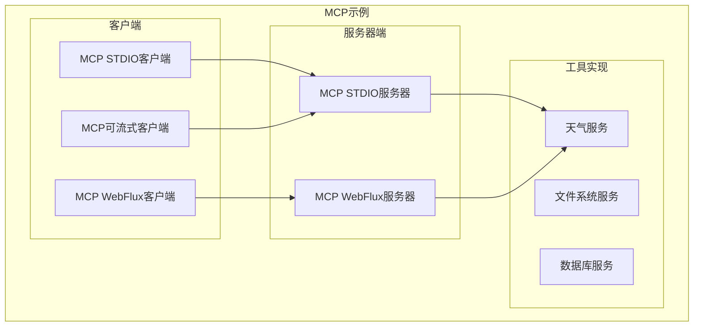
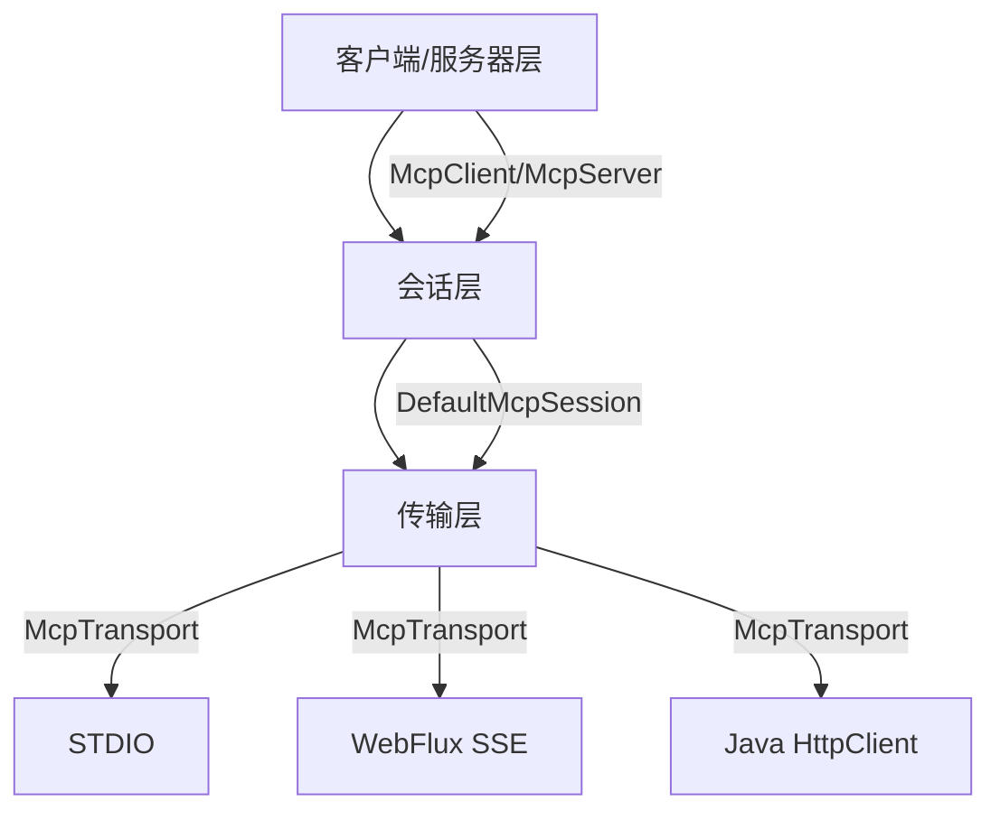
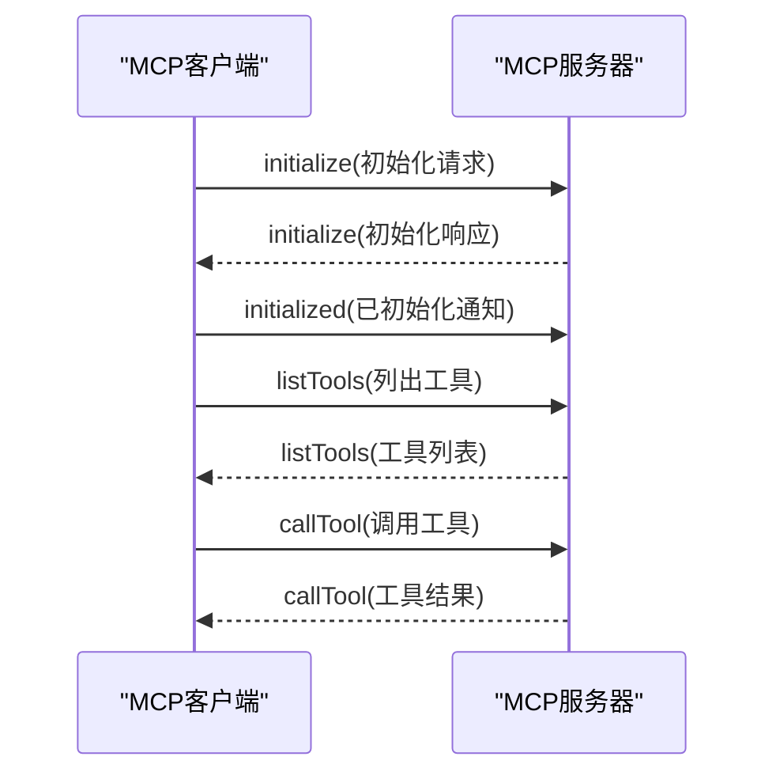
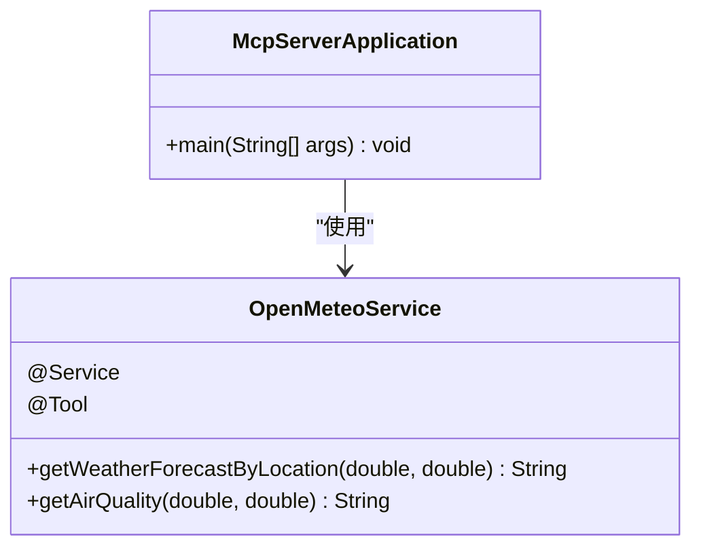
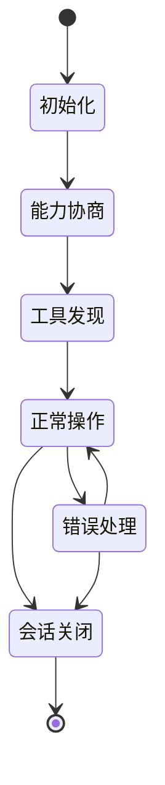
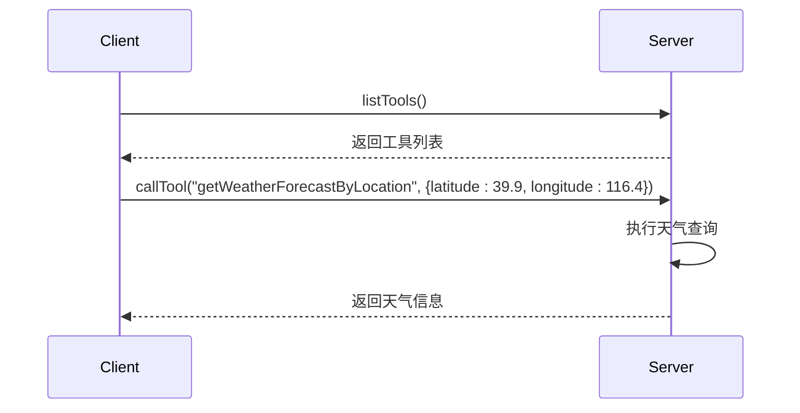

# MCP示例

<cite>
**本文档中引用的文件**  
- [Application.java](file://spring-ai-alibaba-mcp-example/spring-ai-alibaba-mcp-starter-example/client/mcp-stdio-client-example/src/main/java/com/alibaba/alibaba/ai/mcp/samples/client/Application.java)
- [McpServerApplication.java](file://spring-ai-alibaba-mcp-example/spring-ai-alibaba-mcp-starter-example/server/mcp-stdio-server-example/src/main/java/com/alibaba/cloud/ai/mcp/sample/server/McpServerApplication.java)
- [OpenMeteoService.java](file://spring-ai-alibaba-mcp-example/spring-ai-alibaba-mcp-starter-example/server/mcp-stdio-server-example/src/main/java/com/alibaba/cloud/ai/mcp/sample/server/OpenMeteoService.java)
- [mcp-servers-config.json](file://spring-ai-alibaba-mcp-example/spring-ai-alibaba-mcp-starter-example/client/mcp-stdio-client-example/src/main/resources/mcp-servers-config.json)
- [application.properties](file://spring-ai-alibaba-mcp-example/spring-ai-alibaba-mcp-starter-example/client/mcp-stdio-client-example/src/main/resources/application.properties)
- [MCP.md](file://spring-ai-alibaba-playground/src/main/resources/rag/markdown/MCP.md)
- [model-context-protocol.md](file://spring-ai-alibaba-playground/src/main/resources/rag/markdown/model-context-protocol.md)
</cite>

## 目录
1. [简介](#简介)
2. [项目结构](#项目结构)
3. [核心组件](#核心组件)
4. [MCP协议概述](#mcp协议概述)
5. [MCP客户端实现](#mcp客户端实现)
6. [MCP服务器实现](#mcp服务器实现)
7. [传输机制](#传输机制)
8. [会话管理与生命周期](#会话管理与生命周期)
9. [工具注册与发现](#工具注册与发现)
10. [错误处理与安全性](#错误处理与安全性)
11. [配置说明](#配置说明)
12. [使用方法](#使用方法)
13. [结论](#结论)

## 简介

模型上下文协议（Model Context Protocol，MCP）是一种开放协议，旨在规范应用程序如何向大型语言模型（LLM）提供上下文。MCP提供了一种统一的方式将AI模型连接到不同的数据源和工具，定义了智能体（Agent）与外部资源交互的标准方式。通过MCP，开发者可以在LLM之上构建复杂的智能体应用和工作流。

本示例文档详细介绍了MCP协议在Spring AI框架中的实现，重点展示客户端和服务器的构建方式。文档结合协议规范与实际代码实现，为初学者提供MCP的基本概念和价值，同时为经验丰富的开发者提供技术深度。

**Section sources**
- [model-context-protocol.md](file://spring-ai-alibaba-playground/src/main/resources/rag/markdown/model-context-protocol.md#L0-L8)
- [MCP.md](file://spring-ai-alibaba-playground/src/main/resources/rag/markdown/MCP.md#L0-L26)

## 项目结构

MCP示例项目采用模块化设计，包含客户端和服务器端的多种实现方式。主要结构如下：



**Diagram sources**
- [McpServerApplication.java](file://spring-ai-alibaba-mcp-example/spring-ai-alibaba-mcp-starter-example/server/mcp-stdio-server-example/src/main/java/com/alibaba/cloud/ai/mcp/sample/server/McpServerApplication.java)
- [Application.java](file://spring-ai-alibaba-mcp-example/spring-ai-alibaba-mcp-starter-example/client/mcp-stdio-client-example/src/main/java/com/alibaba/alibaba/ai/mcp/samples/client/Application.java)

**Section sources**
- [project_structure](file://workspace_path)

## 核心组件

MCP实现包含三个核心层次：客户端/服务器层、会话层和传输层。这些层次共同构成了MCP的完整通信架构。



**Diagram sources**
- [MCP.md](file://spring-ai-alibaba-playground/src/main/resources/rag/markdown/MCP.md#L28-L62)

**Section sources**
- [MCP.md](file://spring-ai-alibaba-playground/src/main/resources/rag/markdown/MCP.md#L28-L62)

## MCP协议概述

MCP（Model Context Protocol）是一个标准化协议，使AI模型能够以结构化的方式与外部工具和资源交互。协议支持多种传输机制，以在不同环境中提供灵活性。

MCP的核心目标是：
- 提供统一的集成方式
- 规范智能体与数据及工具的交互
- 支持多种传输机制
- 实现协议版本兼容性
- 支持能力协商

协议定义了客户端和服务器之间的标准通信流程，包括初始化、能力协商、工具发现和执行等阶段。



**Diagram sources**
- [McpAsyncClient.java](file://spring-ai-alibaba-mcp-example/spring-ai-alibaba-mcp-starter-example/client/mcp-streamable-client-example/src/main/java/io/modelcontextprotocol/client/McpAsyncClient.java#L290-L321)
- [McpAsyncClient.java](file://spring-ai-alibaba-mcp-example/spring-ai-alibaba-mcp-starter-example/client/mcp-streamable-client-example/src/main/java/io/modelcontextprotocol/client/McpAsyncClient.java#L80-L126)

**Section sources**
- [MCP.md](file://spring-ai-alibaba-playground/src/main/resources/rag/markdown/MCP.md#L0-L26)
- [model-context-protocol.md](file://spring-ai-alibaba-playground/src/main/resources/rag/markdown/model-context-protocol.md#L0-L8)

## MCP客户端实现

MCP客户端负责建立和管理与MCP服务器的连接，实现协议的客户端部分。客户端主要处理协议版本协商、能力协商、消息传输和JSON-RPC通信。

### 客户端初始化

客户端必须首先发送初始化请求，与服务器建立协议兼容性：

```java
public Mono<McpSchema.InitializeResult> initialize() {
    String latestVersion = this.protocolVersions.get(this.protocolVersions.size() - 1);
    
    McpSchema.InitializeRequest initializeRequest = new McpSchema.InitializeRequest(
        latestVersion,
        this.clientCapabilities,
        this.clientInfo);
    
    return this.mcpSession.sendRequest(McpSchema.METHOD_INITIALIZE, 
        initializeRequest, new TypeReference<McpSchema.InitializeResult>() {});
}
```

### 客户端配置

客户端通过配置文件指定服务器连接参数：

```json
{
  "servers": [
    {
      "name": "my-weather-server",
      "url": "stdio",
      "parameters": {
        "command": "java",
        "args": [
          "-jar",
          "/path/to/mcp-stdio-server-example-0.0.1-SNAPSHOT.jar"
        ]
      }
    }
  ]
}
```

### 客户端功能

MCP客户端支持以下功能：
- 协议版本协商
- 能力协商
- 工具发现和执行
- 资源访问和管理
- 提示系统交互
- 同步和异步操作

**Section sources**
- [Application.java](file://spring-ai-alibaba-mcp-example/spring-ai-alibaba-mcp-starter-example/client/mcp-stdio-client-example/src/main/java/com/alibaba/alibaba/ai/mcp/samples/client/Application.java#L27-L53)
- [mcp-servers-config.json](file://spring-ai-alibaba-mcp-example/spring-ai-alibaba-mcp-starter-example/client/mcp-stdio-client-example/src/main/resources/mcp-servers-config.json)

## MCP服务器实现

MCP服务器实现协议的服务器端部分，处理来自客户端的请求并提供工具服务。以`McpServerApplication`为例，服务器的构建包括工具注册、请求处理和会话管理。

### 服务器入口

```java
@SpringBootApplication
public class McpServerApplication {

    public static void main(String[] args) {
        SpringApplication.run(McpServerApplication.class, args);
    }

    @Bean
    public ToolCallbackProvider weatherTools(OpenMeteoService openMeteoService) {
        return MethodToolCallbackProvider.builder().toolObjects(openMeteoService).build();
    }
}
```

### 服务器配置

服务器需要在配置文件中禁用web应用类型和控制台日志，以确保STDIO传输正常工作：

```properties
spring.main.web-application-type=none
spring.main.banner-mode=off
logging.pattern.console=

spring.ai.mcp.server.name=my-weather-server
spring.ai.mcp.server.version=0.0.1
```

### 服务器功能

MCP服务器主要功能包括：
- 处理JSON-RPC请求
- 管理会话状态
- 提供工具服务
- 响应客户端请求



**Diagram sources**
- [McpServerApplication.java](file://spring-ai-alibaba-mcp-example/spring-ai-alibaba-mcp-starter-example/server/mcp-stdio-server-example/src/main/java/com/alibaba/cloud/ai/mcp/sample/server/McpServerApplication.java#L26-L38)
- [OpenMeteoService.java](file://spring-ai-alibaba-mcp-example/spring-ai-alibaba-mcp-starter-example/server/mcp-stdio-server-example/src/main/java/com/alibaba/cloud/ai/mcp/sample/server/OpenMeteoService.java#L0-L363)

**Section sources**
- [McpServerApplication.java](file://spring-ai-alibaba-mcp-example/spring-ai-alibaba-mcp-starter-example/server/mcp-stdio-server-example/src/main/java/com/alibaba/cloud/ai/mcp/sample/server/McpServerApplication.java#L0-L39)
- [OpenMeteoService.java](file://spring-ai-alibaba-mcp-example/spring-ai-alibaba-mcp-starter-example/server/mcp-stdio-server-example/src/main/java/com/alibaba/cloud/ai/mcp/sample/server/OpenMeteoService.java#L0-L363)

## 传输机制

MCP支持多种传输机制，以适应不同的部署环境和性能需求。

### STDIO传输

STDIO传输用于基于进程的通信，服务器作为子进程被客户端启动和管理：

```java
var stdioParams = ServerParameters.builder("java")
    .args("-jar", "target/mcp-stdio-server-example-0.0.1-SNAPSHOT.jar")
    .build();

var transport = new StdioClientTransport(stdioParams);
var client = McpClient.sync(transport).build();
```

### WebFlux SSE传输

WebFlux SSE传输用于反应式HTTP流，支持服务器发送事件（Server-Sent Events）：

```java
@Bean
public McpClientTransport webFluxSseTransport() {
    return new WebFluxSseClientTransport(
        WebClient.builder().build(),
        URI.create("http://localhost:8080/mcp"));
}
```

### 传输机制对比

| 传输机制 | 适用场景 | 特点 | 性能 |
|---------|---------|------|------|
| STDIO | 嵌入式场景 | 进程间通信 | 高 |
| WebFlux SSE | 分布式环境 | HTTP流式通信 | 中 |
| Java HttpClient | 传统HTTP | 同步请求响应 | 低 |

**Section sources**
- [MCP.md](file://spring-ai-alibaba-playground/src/main/resources/rag/markdown/MCP.md#L28-L62)
- [McpAsyncClient.java](file://spring-ai-alibaba-mcp-example/spring-ai-alibaba-mcp-starter-example/client/mcp-streamable-client-example/src/main/java/io/modelcontextprotocol/client/McpAsyncClient.java#L80-L126)

## 会话管理与生命周期

MCP协议定义了明确的会话生命周期，确保客户端和服务器之间的可靠通信。

### 会话生命周期



### 初始化阶段

初始化阶段是客户端和服务器之间的第一次交互，必须完成以下任务：
- 建立协议版本兼容性
- 交换和协商能力
- 共享实现细节

客户端必须首先发送初始化请求，服务器响应后，客户端发送已初始化通知。

### 资源订阅

MCP支持资源变更通知机制：

```java
public Mono<Void> subscribeResource(McpSchema.SubscribeRequest subscribeRequest) {
    return this.withInitializationCheck("subscribing to resources", 
        initializedResult -> this.mcpSession
            .sendRequest(McpSchema.METHOD_RESOURCES_SUBSCRIBE, 
                subscribeRequest, VOID_TYPE_REFERENCE));
}

public Mono<Void> unsubscribeResource(McpSchema.UnsubscribeRequest unsubscribeRequest) {
    return this.withInitializationCheck("unsubscribing from resources", 
        initializedResult -> this.mcpSession
            .sendRequest(McpSchema.METHOD_RESOURCES_UNSUBSCRIBE, 
                unsubscribeRequest, VOID_TYPE_REFERENCE));
}
```

**Diagram sources**
- [McpAsyncClient.java](file://spring-ai-alibaba-mcp-example/spring-ai-alibaba-mcp-starter-example/client/mcp-streamable-client-example/src/main/java/io/modelcontextprotocol/client/McpAsyncClient.java#L661-L687)

**Section sources**
- [McpAsyncClient.java](file://spring-ai-alibaba-mcp-example/spring-ai-alibaba-mcp-starter-example/client/mcp-streamable-client-example/src/main/java/io/modelcontextprotocol/client/McpAsyncClient.java#L290-L321)
- [McpAsyncClient.java](file://spring-ai-alibaba-mcp-example/spring-ai-alibaba-mcp-starter-example/client/mcp-streamable-client-example/src/main/java/io/modelcontextprotocol/client/McpAsyncClient.java#L661-L687)

## 工具注册与发现

MCP服务器通过工具注册机制向客户端暴露可用功能，客户端可以发现并调用这些工具。

### 工具实现

使用`@Tool`注解标记可被调用的方法：

```java
@Service
public class OpenMeteoService {

    @Tool(description = "获取指定经纬度的天气预报")
    public String getWeatherForecastByLocation(double latitude, double longitude) {
        // 实现天气预报逻辑
    }

    @Tool(description = "获取指定位置的空气质量信息（模拟数据）")
    public String getAirQuality(@ToolParam(description = "纬度") double latitude,
                               @ToolParam(description = "经度") double longitude) {
        // 实现空气质量查询逻辑
    }
}
```

### 工具注册

在配置类中注册工具提供者：

```java
@Bean
public ToolCallbackProvider weatherTools(OpenMeteoService openMeteoService) {
    return MethodToolCallbackProvider.builder().toolObjects(openMeteoService).build();
}
```

### 工具发现流程



**Section sources**
- [OpenMeteoService.java](file://spring-ai-alibaba-mcp-example/spring-ai-alibaba-mcp-starter-example/server/mcp-stdio-server-example/src/main/java/com/alibaba/cloud/ai/mcp/sample/server/OpenMeteoService.java#L0-L363)
- [McpServerApplication.java](file://spring-ai-alibaba-mcp-example/spring-ai-alibaba-mcp-starter-example/server/mcp-stdio-server-example/src/main/java/com/alibaba/cloud/ai/mcp/sample/server/McpServerApplication.java#L26-L38)

## 错误处理与安全性

MCP协议包含完善的错误处理机制和安全考虑，确保通信的可靠性和安全性。

### 错误处理

MCP客户端和服务器需要处理各种可能的错误情况：

```java
try {
    var weatherData = restClient.get()
        .uri("/forecast?latitude={latitude}&longitude={longitude}&current=temperature_2m...", 
             latitude, longitude)
        .retrieve()
        .body(WeatherData.class);
} catch (RestClientException e) {
    // 处理HTTP请求错误
    return "天气服务暂时不可用，请稍后重试。";
} catch (Exception e) {
    // 处理其他异常
    return "服务出现未知错误：" + e.getMessage();
}
```

### 安全性考虑

MCP实现中的安全最佳实践：
- API密钥不应硬编码到配置文件中
- 使用环境变量或安全的配置管理工具
- 在生产环境中配置适当的超时和重试策略
- 验证客户端请求的合法性
- 限制服务器的文件系统访问权限

### 常见问题排查

| 问题 | 可能原因 | 解决方案 |
|------|---------|---------|
| 401错误 | API密钥未正确设置 | 检查DASH_SCOPE_API_KEY环境变量 |
| 中文乱码 | 编码设置问题 | 设置JVM参数-Dfile.encoding=UTF-8 |
| 找不到服务端JAR | 路径配置错误 | 检查mcp-servers-config.json中的路径 |

**Section sources**
- [README.md](file://spring-ai-alibaba-mcp-example/spring-ai-alibaba-mcp-starter-example/client/mcp-stdio-client-example/README.md#L0-L127)
- [README.md](file://spring-ai-alibaba-mcp-example/spring-ai-alibaba-mcp-starter-example/server/mcp-stdio-server-example/README.md#L0-L126)

## 配置说明

MCP应用的配置主要分为客户端配置和服务器端配置。

### 客户端配置

**application.properties**
```properties
spring.ai.dashscope.api-key=${DASH_SCOPE_API_KEY}
spring.ai.mcp.client.stdio.servers-configuration=classpath:mcp-servers-config.json
ai.user.input=北京的天气如何？
```

**mcp-servers-config.json**
```json
{
  "servers": [
    {
      "name": "my-weather-server",
      "url": "stdio",
      "parameters": {
        "command": "java",
        "args": [
          "-jar",
          "/absolute/path/to/mcp-stdio-server-example-0.0.1-SNAPSHOT.jar"
        ]
      }
    }
  ]
}
```

### 服务器端配置

**application.properties**
```properties
spring.main.web-application-type=none
spring.main.banner-mode=off
logging.pattern.console=
spring.ai.mcp.server.name=my-weather-server
spring.ai.mcp.server.version=0.0.1
```

**Section sources**
- [application.properties](file://spring-ai-alibaba-mcp-example/spring-ai-alibaba-mcp-starter-example/client/mcp-stdio-client-example/src/main/resources/application.properties)
- [mcp-servers-config.json](file://spring-ai-alibaba-mcp-example/spring-ai-alibaba-mcp-starter-example/client/mcp-stdio-client-example/src/main/resources/mcp-servers-config.json)

## 使用方法

### 环境准备

1. 安装JDK 17或更高版本
2. 安装Maven
3. 获取阿里云DashScope API密钥

### 编译运行

1. 编译MCP服务端：
```bash
cd spring-ai-alibaba-mcp-example/spring-ai-alibaba-mcp-build-example/mcp-stdio-server-example
mvn clean package
```

2. 编译客户端：
```bash
cd spring-ai-alibaba-mcp-example/spring-ai-alibaba-mcp-starter-example/client/mcp-stdio-client-example
mvn clean package
```

3. 设置API密钥：
```bash
export DASH_SCOPE_API_KEY=您的密钥
```

4. 运行客户端：
```bash
mvn spring-boot:run
```

### 自定义问题

可以通过修改`application.properties`文件中的`ai.user.input`属性来自定义问题：
```properties
ai.user.input=上海的天气如何？
```

**Section sources**
- [README.md](file://spring-ai-alibaba-mcp-example/spring-ai-alibaba-mcp-starter-example/client/mcp-stdio-client-example/README.md#L0-L127)
- [Application.java](file://spring-ai-alibaba-mcp-example/spring-ai-alibaba-mcp-starter-example/client/mcp-stdio-client-example/src/main/java/com/alibaba/alibaba/ai/mcp/samples/client/Application.java#L27-L53)

## 结论

MCP（模型上下文协议）为AI模型与外部工具之间的通信提供了标准化的解决方案。通过本示例文档，我们详细介绍了MCP客户端和服务器的实现方式，包括协议细节、传输机制、会话管理和工具注册等关键概念。

MCP的优势在于：
- 提供统一的集成方式
- 支持多种传输机制
- 实现协议版本兼容性
- 支持能力协商
- 易于扩展和维护

通过Spring AI框架的MCP实现，开发者可以轻松构建复杂的智能体应用，将AI模型与各种外部工具和数据源集成，实现更强大的功能。