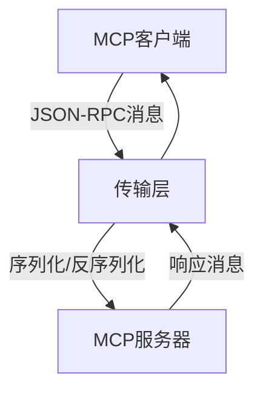
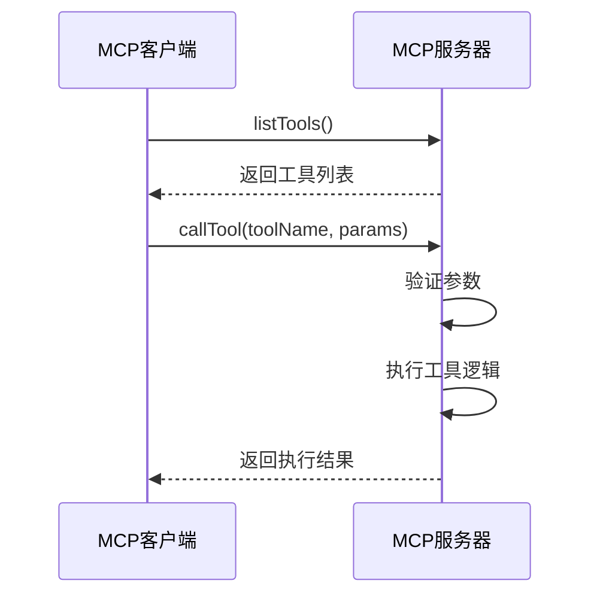
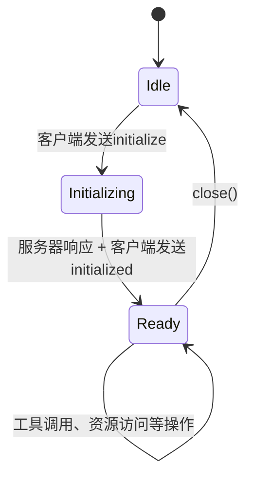
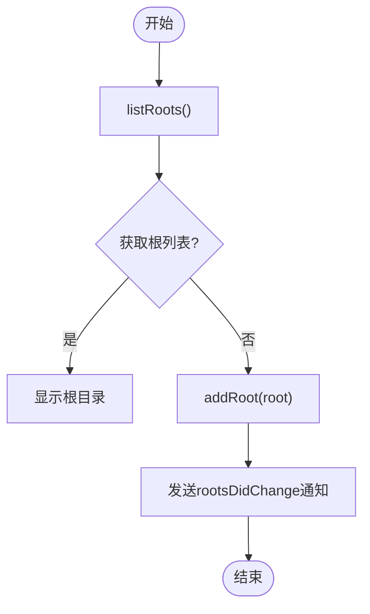
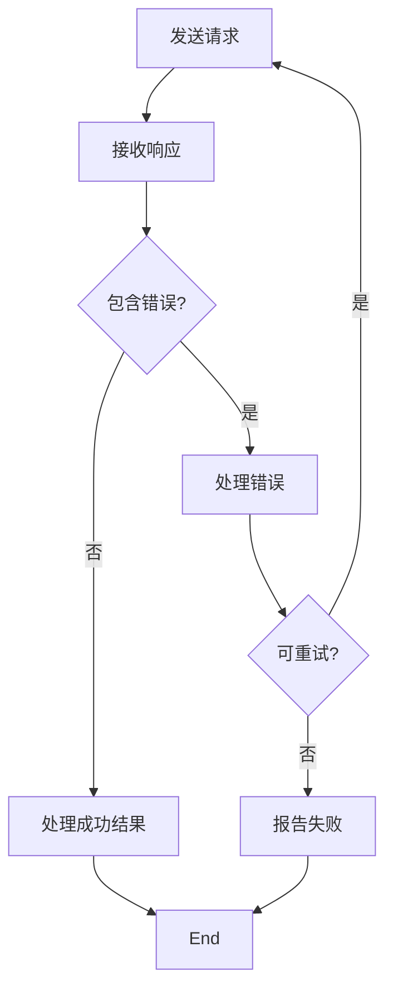

# 协议详解

<cite>
**本文档引用文件**  
- [MCP.md](file://spring-ai-alibaba-playground/src/main/resources/rag/markdown/MCP.md)
- [mcp-config.yml](file://spring-ai-alibaba-playground/src/main/resources/mcp-config.yml)
- [McpAsyncClient.java](file://spring-ai-alibaba-mcp-example/spring-ai-alibaba-mcp-starter-example/client/mcp-streamable-client-example/src/main/java/io/modelcontextprotocol/client/McpAsyncClient.java)
- [McpClientSession.java](file://spring-ai-alibaba-mcp-example/spring-ai-alibaba-mcp-starter-example/client/mcp-streamable-client-example/src/main/java/io/modelcontextprotocol/spec/McpClientSession.java)
- [ToolCallResp.java](file://spring-ai-alibaba-playground/src/main/java/com/alibaba/cloud/ai/application/entity/tools/ToolCallResp.java)
- [McpServerUtils.java](file://spring-ai-alibaba-playground/src/main/java/com/alibaba/cloud/ai/application/mcp/McpServerUtils.java)
- [McpClientToolCallbackProvider.java](file://spring-ai-alibaba-graph-example/mcp-node/src/main/java/com/alibaba/cloud/ai/graph/tool/McpClientToolCallbackProvider.java)
</cite>

## 目录
1. [引言](#引言)
2. [MCP协议概述](#mcp协议概述)
3. [核心概念](#核心概念)
4. [通信机制](#通信机制)
5. [工具定义与调用](#工具定义与调用)
6. [会话与生命周期管理](#会话与生命周期管理)
7. [资源与根管理](#资源与根管理)
8. [错误处理机制](#错误处理机制)
9. [实现架构](#实现架构)
10. [安全性与扩展性](#安全性与扩展性)
11. [实际应用示例](#实际应用示例)
12. [结论](#结论)

## 引言
模型上下文协议（Model Context Protocol，简称MCP）是一种开放协议，旨在规范大型语言模型（LLM）与外部数据源和工具之间的交互方式。该协议为构建智能体（Agent）和复杂工作流提供了标准化的集成方案，使得AI模型能够以结构化的方式访问和操作外部资源。本文档将深入解析MCP协议的规范与实现细节，为开发者提供全面的技术指导。

## MCP协议概述
MCP协议定义了一套标准化的通信机制，使AI模型能够通过统一接口与各种外部工具和服务进行交互。该协议支持多种传输方式，包括基于标准输入输出（Stdio）的进程间通信和基于HTTP的服务器发送事件（SSE）流式传输，从而适应不同的部署环境。

MCP架构由客户端和服务器两部分组成，其中客户端负责发起请求并管理会话，服务器则提供具体的工具实现和资源访问能力。协议采用JSON-RPC作为消息格式，确保了跨平台的兼容性和可扩展性。

**文档来源**
- [MCP.md](file://spring-ai-alibaba-playground/src/main/resources/rag/markdown/MCP.md)

## 核心概念
MCP协议的核心概念包括工具发现、工具调用、资源管理和会话管理。这些概念共同构成了协议的基础功能体系。

### 工具发现
客户端可以通过`listTools`方法获取服务器提供的所有可用工具列表。每个工具都包含名称、描述和输入参数模式等元数据信息，便于客户端进行动态发现和使用。

### 工具调用
工具调用是MCP协议的核心功能之一。客户端通过发送带有工具名称和参数的请求来执行特定操作，服务器处理请求后返回结果。这种机制允许AI模型根据需要调用适当的工具来完成任务。

### 资源管理
MCP协议支持基于URI的资源管理，允许客户端访问服务器上的文件和其他资源。资源可以通过`readResource`等方法进行读取，并支持分页查询以提高效率。

### 会话管理
会话管理确保了客户端与服务器之间的持久化连接和状态同步。通过初始化阶段的握手过程，双方可以协商协议版本、能力和实现细节，建立稳定的通信通道。

**文档来源**
- [MCP.md](file://spring-ai-alibaba-playground/src/main/resources/rag/markdown/MCP.md)
- [McpAsyncClient.java](file://spring-ai-alibaba-mcp-example/spring-ai-alibaba-mcp-starter-example/client/mcp-streamable-client-example/src/main/java/io/modelcontextprotocol/client/McpAsyncClient.java)

## 通信机制
MCP协议采用JSON-RPC作为底层通信协议，实现了客户端与服务器之间的双向消息传递。JSON-RPC是一种轻量级的远程过程调用协议，使用JSON格式编码请求和响应。

### 消息格式
所有MCP消息都遵循JSON-RPC 2.0规范，包含以下字段：
- `jsonrpc`：协议版本号
- `method`：调用的方法名
- `params`：方法参数
- `id`：请求标识符

### 请求/响应结构
客户端发送请求后，服务器必须在规定时间内返回响应。响应消息包含结果或错误信息，以及对应的请求ID，以便客户端正确匹配请求与响应。

### 传输选项
MCP支持多种传输实现：
- 基于Stdio的传输用于进程间通信
- 基于Java HttpClient的SSE客户端传输
- WebFlux SSE客户端传输用于反应式HTTP流



**图示来源**
- [McpClientSession.java](file://spring-ai-alibaba-mcp-example/spring-ai-alibaba-mcp-starter-example/client/mcp-streamable-client-example/src/main/java/io/modelcontextprotocol/spec/McpClientSession.java)

## 工具定义与调用
工具定义是MCP协议中描述外部功能的关键组成部分。每个工具都有一个唯一的名称、详细的描述和明确的输入参数模式。

### 工具定义结构
工具定义包含以下关键属性：
- `name`：工具的唯一标识符
- `description`：工具功能的简要说明
- `inputSchema`：输入参数的JSON模式定义

### 工具调用流程
工具调用的过程如下：
1. 客户端构造包含工具名称和参数的请求
2. 发送请求到服务器
3. 服务器验证参数并执行相应操作
4. 返回执行结果或错误信息



**图示来源**
- [McpAsyncClient.java](file://spring-ai-alibaba-mcp-example/spring-ai-alibaba-mcp-starter-example/client/mcp-streamable-client-example/src/main/java/io/modelcontextprotocol/client/McpAsyncClient.java)
- [ToolCallResp.java](file://spring-ai-alibaba-playground/src/main/java/com/alibaba/cloud/ai/application/entity/tools/ToolCallResp.java)

## 会话与生命周期管理
MCP协议的会话管理确保了客户端与服务器之间稳定可靠的通信。会话的生命周期包括初始化、正常操作和终止三个阶段。

### 初始化阶段
初始化是客户端与服务器之间的首次交互，必须按照以下步骤进行：
1. 客户端发送`initialize`请求，包含支持的协议版本、客户端能力和实现信息
2. 服务器响应，返回自身的功能和信息
3. 客户端发送`initialized`通知，表示已准备好开始正常操作

### 正常操作阶段
在初始化成功后，客户端可以执行各种操作，如工具调用、资源访问等。会话层负责管理请求/响应的匹配和超时处理。

### 会话终止
当通信结束时，客户端应主动关闭连接，释放相关资源。这可以通过调用`close`方法来实现。



**图示来源**
- [McpAsyncClient.java](file://spring-ai-alibaba-mcp-example/spring-ai-alibaba-mcp-starter-example/client/mcp-streamable-client-example/src/main/java/io/modelcontextprotocol/client/McpAsyncClient.java)
- [McpClientSession.java](file://spring-ai-alibaba-mcp-example/spring-ai-alibaba-mcp-starter-example/client/mcp-streamable-client-example/src/main/java/io/modelcontextprotocol/spec/McpClientSession.java)

## 资源与根管理
资源管理是MCP协议的重要组成部分，它允许客户端访问服务器上的文件系统和其他资源。

### 根管理
根（Roots）定义了服务器可以在文件系统中操作的边界。客户端可以添加或移除根目录，服务器可以请求根列表并在其变化时接收通知。

### 资源访问
客户端可以通过URI访问服务器上的资源。资源访问支持分页查询，提高了大规模数据处理的效率。

### 模板管理
MCP协议还支持提示模板的管理，允许客户端获取和使用预定义的提示模板。



**图示来源**
- [McpAsyncClient.java](file://spring-ai-alibaba-mcp-example/spring-ai-alibaba-mcp-starter-example/client/mcp-streamable-client-example/src/main/java/io/modelcontextprotocol/client/McpAsyncClient.java)
- [McpClientSession.java](file://spring-ai-alibaba-mcp-example/spring-ai-alibaba-mcp-starter-example/client/mcp-streamable-client-example/src/main/java/io/modelcontextprotocol/spec/McpClientSession.java)

## 错误处理机制
MCP协议定义了一套完整的错误处理机制，确保通信过程中的异常情况能够被妥善处理。

### 错误码体系
协议定义了标准的错误码，如`METHOD_NOT_FOUND`（方法未找到）和`INTERNAL_ERROR`（内部错误），便于客户端识别和处理不同类型的错误。

### 错误响应结构
错误响应包含以下字段：
- `code`：错误码
- `message`：错误描述
- `data`：附加的错误数据

### 异常处理策略
客户端应实现超时重试机制，并对不同类型的错误采取相应的恢复策略。例如，对于网络错误可以尝试重新连接，而对于参数错误则需要修正请求后再试。



**图示来源**
- [McpClientSession.java](file://spring-ai-alibaba-mcp-example/spring-ai-alibaba-mcp-starter-example/client/mcp-streamable-client-example/src/main/java/io/modelcontextprotocol/spec/McpClientSession.java)

## 实现架构
MCP的Java实现采用了分层架构设计，主要包括客户端/服务器层、会话层和传输层。

### 客户端/服务器层
该层负责具体的协议操作，`McpClient`处理客户端逻辑，`McpServer`管理服务器端功能。

### 会话层
`McpSession`实现管理通信模式和状态，处理请求/响应的匹配和超时控制。

### 传输层
`McpTransport`负责JSON-RPC消息的序列化和反序列化，支持多种传输方式。

```mermaid
graph TB
subgraph "客户端"
McpClient[McpClient]
McpSession[McpSession]
McpTransport[McpTransport]
end
subgraph "服务器"
McpServer[McpServer]
McpSessionS[McpSession]
McpTransportS[McpTransport]
end
McpClient --> McpSession
McpSession --> McpTransport
McpServer --> McpSessionS
McpSessionS --> McpTransportS
McpTransport < --> |JSON-RPC消息| McpTransportS
```

**图示来源**
- [MCP.md](file://spring-ai-alibaba-playground/src/main/resources/rag/markdown/MCP.md)
- [McpClientSession.java](file://spring-ai-alibaba-mcp-example/spring-ai-alibaba-mcp-starter-example/client/mcp-streamable-client-example/src/main/java/io/modelcontextprotocol/spec/McpClientSession.java)

## 安全性与扩展性
MCP协议在设计时充分考虑了安全性和可扩展性需求。

### 安全性考虑
- 通过能力协商限制客户端权限
- 根管理控制文件系统访问范围
- 支持HTTPS等安全传输协议

### 扩展机制
协议支持可选功能的动态发现和使用，允许逐步引入新特性而不破坏现有实现。

### 版本兼容性
通过协议版本协商机制，确保不同版本的客户端和服务器能够协同工作。

**文档来源**
- [MCP.md](file://spring-ai-alibaba-playground/src/main/resources/rag/markdown/MCP.md)
- [mcp-config.yml](file://spring-ai-alibaba-playground/src/main/resources/mcp-config.yml)

## 实际应用示例
在Spring AI生态系统中，MCP协议被广泛应用于各种场景。

### 天气查询服务
通过配置`my-weather-server`，客户端可以调用天气查询工具获取实时气象数据。

### GitHub搜索
集成GitHub MCP服务器，实现代码仓库的智能搜索功能。

### 数据库操作
利用SQLite MCP服务器，实现对本地数据库的查询和管理。

```yaml
mcpServers:
  my-weather-server:
    command: java
    args:
      - "-Dspring.ai.mcp.server.stdio=true"
      - "-jar"
      - "mcp-libs/weather.jar"
```

**配置来源**
- [mcp-config.yml](file://spring-ai-alibaba-playground/src/main/resources/mcp-config.yml)
- [McpServerUtils.java](file://spring-ai-alibaba-playground/src/main/java/com/alibaba/cloud/ai/application/mcp/McpServerUtils.java)

## 结论
MCP协议为AI模型与外部工具的集成提供了一套标准化的解决方案。通过清晰的协议规范和灵活的实现架构，MCP不仅简化了智能体的开发过程，还促进了不同系统间的互操作性。随着更多服务接入MCP生态，这一协议有望成为AI应用开发的重要基础设施。