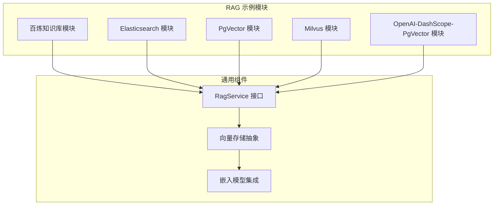
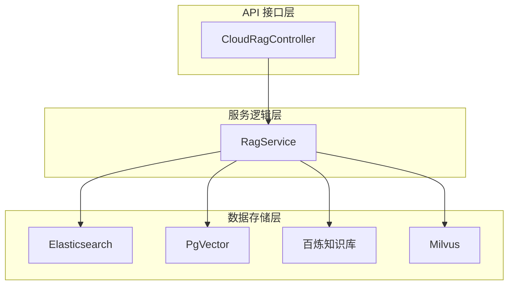
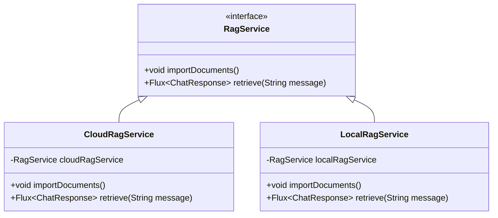
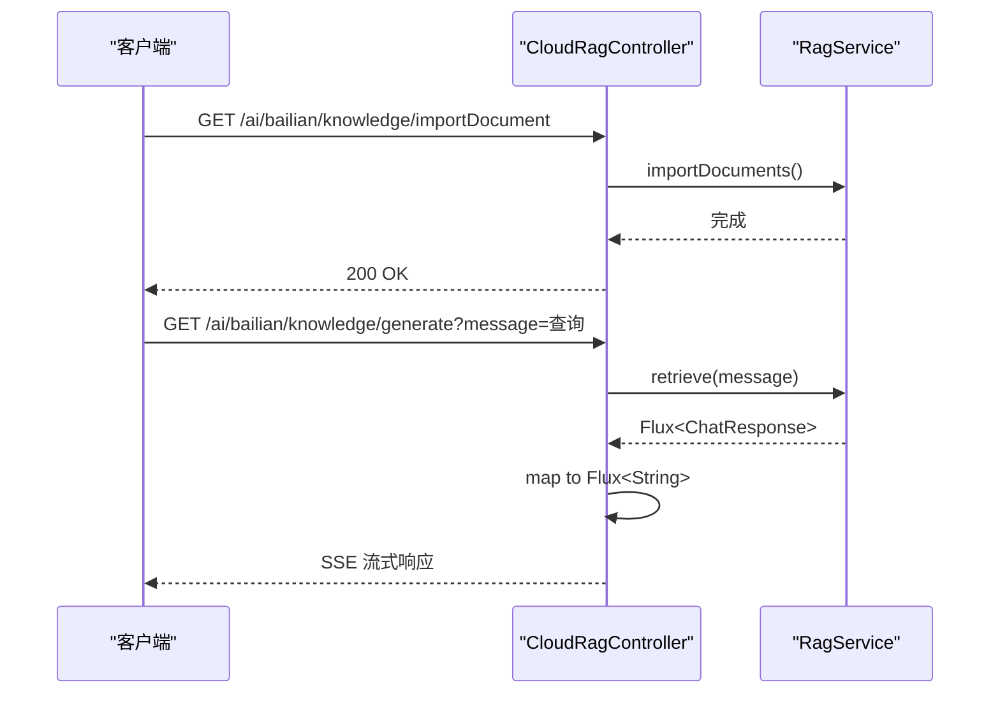
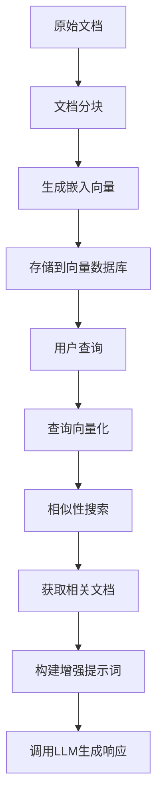
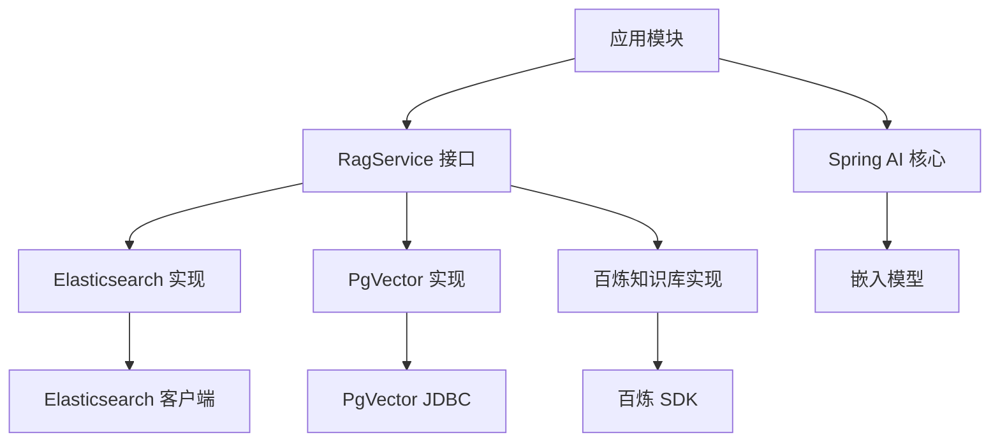

# RAG示例

<cite>
**本文档中引用的文件**  
- [RagService.java](file://spring-ai-alibaba-rag-example/bailian-rag-knowledge/src/main/java/com/alibaba/cloud/ai/example/rag/knowledge/service/RagService.java)
- [CloudRagController.java](file://spring-ai-alibaba-rag-example/bailian-rag-knowledge/src/main/java/com/alibaba/cloud/ai/example/rag/knowledge/controller/CloudRagController.java)
- [RagService.java](file://spring-ai-alibaba-rag-example/rag-elasticsearch-example/src/main/java/com/alibaba/cloud/ai/example/rag/RagService.java)
- [RagService.java](file://spring-ai-alibaba-rag-example/rag-pgvector-example/src/main/java/com/alibaba/cloud/ai/example/rag/RagService.java)
- [RAG.md](file://spring-ai-alibaba-playground/src/main/resources/rag/markdown/RAG.md)
</cite>

## 目录
1. [引言](#引言)
2. [项目结构](#项目结构)
3. [核心组件](#核心组件)
4. [架构概述](#架构概述)
5. [详细组件分析](#详细组件分析)
6. [依赖分析](#依赖分析)
7. [性能考虑](#性能考虑)
8. [故障排除指南](#故障排除指南)
9. [结论](#结论)

## 引言
检索增强生成（RAG）是一种关键技术，用于克服大型语言模型在处理长文本、事实准确性和上下文感知方面的局限性。本示例文档全面介绍了基于Spring AI框架的多种RAG实现方式，涵盖使用百炼平台知识库、Elasticsearch作为向量数据库以及PgVector解决方案的完整流程。文档结合理论与实践，通过`CloudRagController`和`RagService`等具体代码示例，深入解析向量数据库初始化、文档嵌入与索引、相似性搜索机制等核心环节。同时为初学者提供RAG基本工作流程和优势说明，为高级开发者揭示检索策略、结果重排序和上下文注入的实现细节。

## 项目结构
RAG示例项目采用模块化设计，包含多个独立子模块，每个模块演示不同的RAG实现方案。主要模块包括基于百炼平台的知识库集成、使用Elasticsearch的向量检索、基于PgVector的关系型向量数据库应用等。各模块均遵循一致的接口规范，通过统一的`RagService`接口定义文档导入和检索功能，确保架构的一致性和可扩展性。

**图示来源**
- [RagService.java](file://spring-ai-alibaba-rag-example/bailian-rag-knowledge/src/main/java/com/alibaba/cloud/ai/example/rag/knowledge/service/RagService.java#L29-L34)
- [RagService.java](file://spring-ai-alibaba-rag-example/rag-elasticsearch-example/src/main/java/com/alibaba/cloud/ai/example/rag/RagService.java#L29-L34)
- [RagService.java](file://spring-ai-alibaba-rag-example/rag-pgvector-example/src/main/java/com/alibaba/cloud/ai/example/rag/RagService.java#L29-L34)

**章节来源**
- [spring-ai-alibaba-rag-example](file://spring-ai-alibaba-rag-example)

## 核心组件
本项目的核心组件围绕`RagService`接口构建，该接口定义了两个关键方法：`importDocuments()`用于将文档导入知识库并生成向量嵌入，`retrieve(String message)`用于执行基于用户查询的检索增强生成。所有具体实现均遵循此接口规范，确保了不同向量数据库实现之间的互操作性。`CloudRagController`作为REST API入口点，通过依赖注入方式与具体的`RagService`实现解耦，提供标准化的HTTP接口用于文档导入和问答生成。

**章节来源**
- [RagService.java](file://spring-ai-alibaba-rag-example/bailian-rag-knowledge/src/main/java/com/alibaba/cloud/ai/example/rag/knowledge/service/RagService.java#L29-L34)
- [CloudRagController.java](file://spring-ai-alibaba-rag-example/bailian-rag-knowledge/src/main/java/com/alibaba/cloud/ai/example/rag/knowledge/controller/CloudRagController.java#L30-L55)

## 架构概述
系统采用分层架构设计，自下而上分为数据存储层、服务逻辑层和API接口层。数据存储层支持多种向量数据库实现，包括Elasticsearch、PgVector和百炼平台内置知识库；服务逻辑层通过`RagService`接口抽象具体实现细节；API接口层提供统一的RESTful端点。整个架构支持模块化替换，开发者可根据需求选择最适合的向量数据库方案。

**图示来源**
- [CloudRagController.java](file://spring-ai-alibaba-rag-example/bailian-rag-knowledge/src/main/java/com/alibaba/cloud/ai/example/rag/knowledge/controller/CloudRagController.java#L30-L55)
- [RagService.java](file://spring-ai-alibaba-rag-example/bailian-rag-knowledge/src/main/java/com/alibaba/cloud/ai/example/rag/knowledge/service/RagService.java#L29-L34)

## 详细组件分析

### RagService 接口分析
`RagService`接口是整个RAG系统的核心契约，定义了文档导入和检索两个基本操作。该接口采用响应式编程模型，使用`Flux<ChatResponse>`作为返回类型，支持流式响应生成。接口设计简洁而强大，为上层应用提供了统一的访问入口，同时允许底层实现灵活选择不同的向量数据库技术。

**图示来源**
- [RagService.java](file://spring-ai-alibaba-rag-example/bailian-rag-knowledge/src/main/java/com/alibaba/cloud/ai/example/rag/knowledge/service/RagService.java#L29-L34)
- [RagService.java](file://spring-ai-alibaba-rag-example/rag-elasticsearch-example/src/main/java/com/alibaba/cloud/ai/example/rag/RagService.java#L29-L34)

**章节来源**
- [RagService.java](file://spring-ai-alibaba-rag-example/bailian-rag-knowledge/src/main/java/com/alibaba/cloud/ai/example/rag/knowledge/service/RagService.java#L1-L35)

### CloudRagController 分析
`CloudRagController`实现了RESTful API，暴露两个关键端点：`/ai/bailian/knowledge/importDocument`用于触发文档导入流程，`/ai/bailian/knowledge/generate`用于执行基于检索的问答生成。控制器通过构造函数注入`RagService`实例，实现了良好的依赖管理。方法返回类型采用`Flux<String>`，支持服务器发送事件（SSE）流式传输，提升用户体验。

**图示来源**
- [CloudRagController.java](file://spring-ai-alibaba-rag-example/bailian-rag-knowledge/src/main/java/com/alibaba/cloud/ai/example/rag/knowledge/controller/CloudRagController.java#L30-L55)
- [RagService.java](file://spring-ai-alibaba-rag-example/bailian-rag-knowledge/src/main/java/com/alibaba/cloud/ai/example/rag/knowledge/service/RagService.java#L29-L34)

**章节来源**
- [CloudRagController.java](file://spring-ai-alibaba-rag-example/bailian-rag-knowledge/src/main/java/com/alibaba/cloud/ai/example/rag/knowledge/controller/CloudRagController.java#L1-L56)

### RAG 工作流程分析
RAG工作流程包含文档预处理、向量化、索引构建和查询检索四个阶段。文档首先被分割成块，然后通过嵌入模型转换为向量，最后存储到向量数据库中。查询时，用户问题同样被向量化，并在向量空间中进行相似性搜索，检索到的相关文档作为上下文注入到LLM提示词中，生成最终响应。

**图示来源**
- [RAG.md](file://spring-ai-alibaba-playground/src/main/resources/rag/markdown/RAG.md#L1-L399)

## 依赖分析
项目依赖关系清晰，各模块通过Maven进行依赖管理。核心依赖包括Spring AI框架、向量数据库连接器（如Elasticsearch客户端、PgVector JDBC驱动）、嵌入模型服务（如通义千问）等。模块间依赖通过接口抽象，实现了松耦合设计，便于替换和扩展。

**图示来源**
- [pom.xml](file://spring-ai-alibaba-rag-example/pom.xml)
- [RagService.java](file://spring-ai-alibaba-rag-example/bailian-rag-knowledge/src/main/java/com/alibaba/cloud/ai/example/rag/knowledge/service/RagService.java#L29-L34)

**章节来源**
- [pom.xml](file://spring-ai-alibaba-rag-example/pom.xml)

## 性能考虑
在RAG系统中，性能优化主要集中在向量搜索效率和上下文管理两个方面。建议设置合理的相似性阈值（如0.8）以过滤低相关性结果，控制top-k参数避免过多上下文导致模型过载。对于Elasticsearch等外部向量数据库，应优化索引配置和硬件资源；对于PgVector，需合理设计数据库表结构和索引策略。流式响应可显著提升用户体验，减少等待感知时间。

## 故障排除指南
常见问题包括文档导入失败、检索结果不相关、响应延迟高等。排查时应首先检查向量数据库连接状态和嵌入模型服务可用性。对于检索质量差的问题，可调整相似性阈值或检查文档分块策略。若出现性能瓶颈，建议监控向量搜索耗时和LLM调用延迟，必要时对查询进行优化或升级硬件资源配置。

## 结论
本文档全面介绍了Spring AI框架下的多种RAG实现方案，展示了如何通过模块化设计构建灵活、可扩展的检索增强生成系统。通过`RagService`接口和`CloudRagController`的配合，实现了统一的API访问和多样化的后端存储支持。开发者可根据具体需求选择最适合的技术栈，无论是使用云平台知识库还是自建向量数据库，都能快速集成到现有应用中，显著提升LLM应用的事实准确性和上下文感知能力。