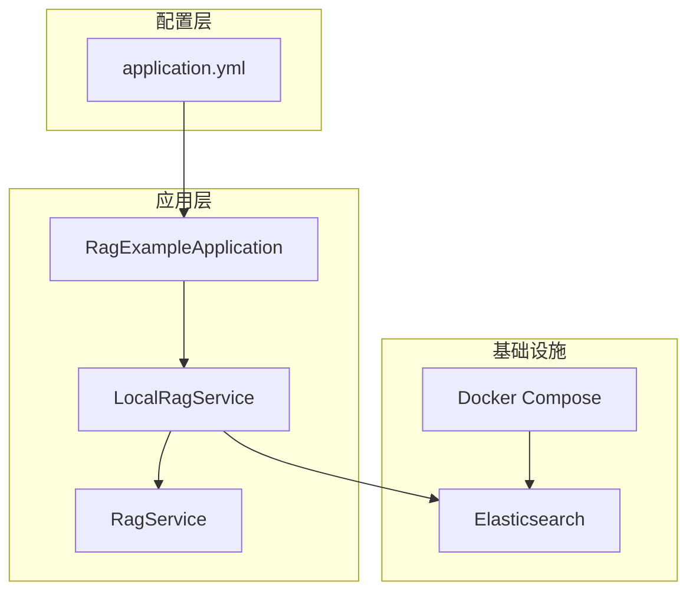
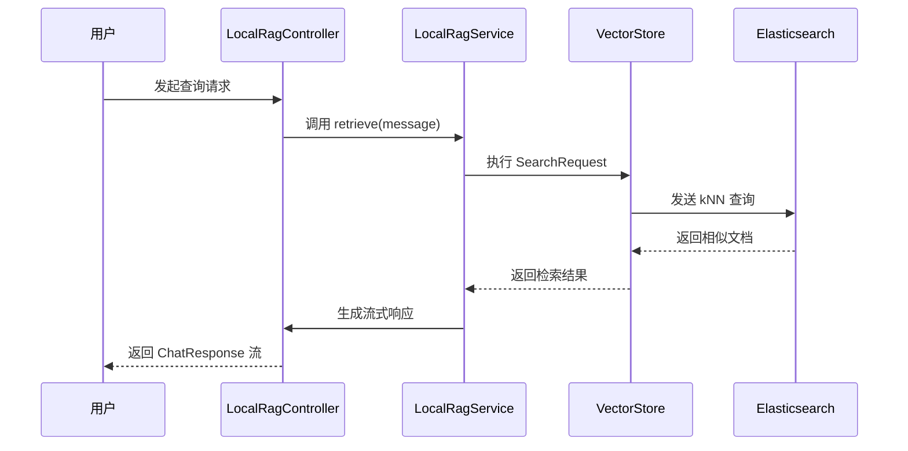
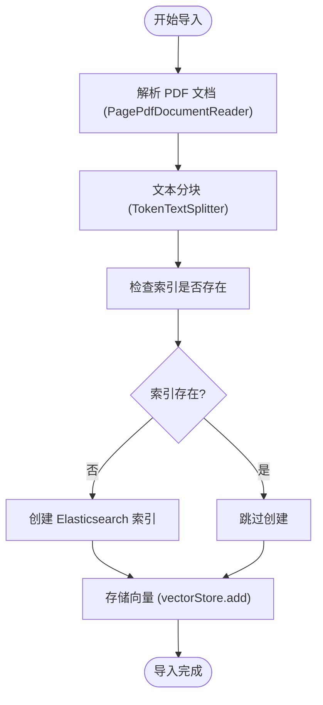
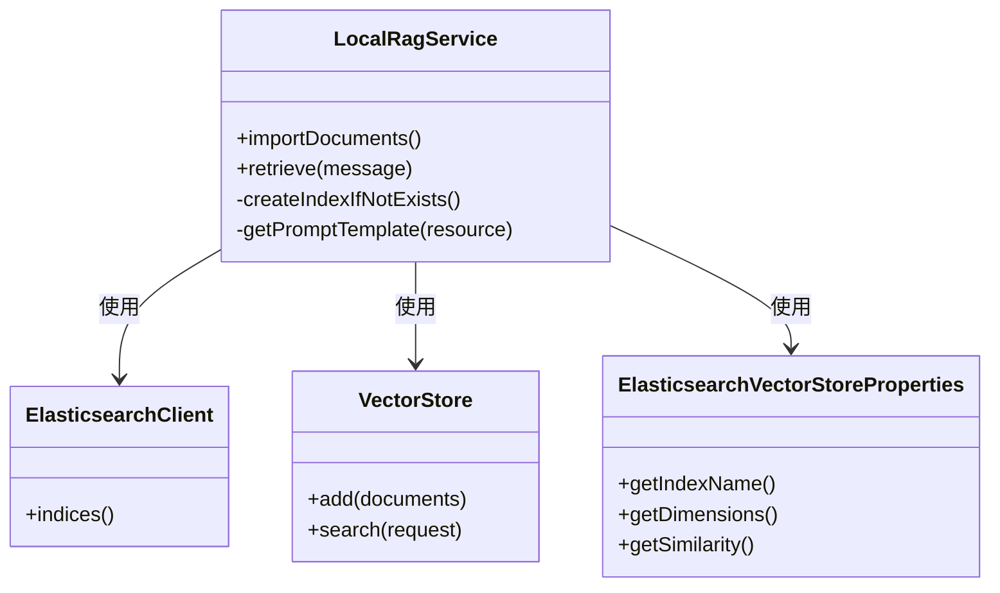

# Elasticsearch集成

<cite>
**本文档中引用的文件**  
- [RagExampleApplication.java](file://spring-ai-alibaba-rag-example/rag-elasticsearch-example/src/main/java/com/alibaba/cloud/ai/example/rag/RagExampleApplication.java)
- [LocalRagService.java](file://spring-ai-alibaba-rag-example/rag-elasticsearch-example/src/main/java/com/alibaba/cloud/ai/example/rag/local/LocalRagService.java)
- [RagService.java](file://spring-ai-alibaba-rag-example/rag-elasticsearch-example/src/main/java/com/alibaba/cloud/ai/example/rag/RagService.java)
- [application.yml](file://spring-ai-alibaba-rag-example/rag-elasticsearch-example/src/main/resources/application.yml)
- [es.yaml](file://docker-compose/es/config/es.yaml)
- [docker-compose.yaml](file://docker-compose/es/docker-compose.yaml)
</cite>

## 目录
1. [简介](#简介)
2. [项目结构](#项目结构)
3. [核心组件](#核心组件)
4. [架构概述](#架构概述)
5. [详细组件分析](#详细组件分析)
6. [依赖分析](#依赖分析)
7. [性能考虑](#性能考虑)
8. [故障排除指南](#故障排除指南)
9. [结论](#结论)

## 简介
本文档详细描述了在 `RagExampleApplication` 中如何集成和配置 Elasticsearch，以支持向量数据的存储与语义搜索。重点分析了 `LocalRagService` 如何通过 `ElasticsearchRepository` 实现向量数据的 CRUD 操作，并深入探讨了 `application.yml` 中的集群地址、索引名称和安全认证配置。同时，文档还展示了文档索引创建、向量嵌入存储和语义搜索查询的具体实现方式，解释了 Elasticsearch 的 kNN 向量搜索功能与 Spring Data 的集成机制，并提供了集群部署、索引优化和性能调优的最佳实践建议。

## 项目结构
本项目基于 Spring Boot 构建，采用模块化设计，主要包含 Elasticsearch 向量数据库集成示例。Elasticsearch 服务通过 Docker Compose 部署，应用通过 Spring AI 提供的 `VectorStore` 接口与 Elasticsearch 交互，实现 RAG（检索增强生成）功能。

**图示来源**  
- [RagExampleApplication.java](file://spring-ai-alibaba-rag-example/rag-elasticsearch-example/src/main/java/com/alibaba/cloud/ai/example/rag/RagExampleApplication.java)
- [LocalRagService.java](file://spring-ai-alibaba-rag-example/rag-elasticsearch-example/src/main/java/com/alibaba/cloud/ai/example/rag/local/LocalRagService.java)
- [application.yml](file://spring-ai-alibaba-rag-example/rag-elasticsearch-example/src/main/resources/application.yml)
- [docker-compose.yaml](file://docker-compose/es/docker-compose.yaml)

**本节来源**  
- [RagExampleApplication.java](file://spring-ai-alibaba-rag-example/rag-elasticsearch-example/src/main/java/com/alibaba/cloud/ai/example/rag/RagExampleApplication.java)
- [docker-compose.yaml](file://docker-compose/es/docker-compose.yaml)

## 核心组件
核心组件包括 `RagExampleApplication` 作为启动类，`LocalRagService` 实现 `RagService` 接口，负责文档导入和检索逻辑。`VectorStore` 接口由 Spring AI 提供，用于与 Elasticsearch 进行向量数据交互。`ElasticsearchClient` 用于直接操作 Elasticsearch 索引。

**本节来源**  
- [RagExampleApplication.java](file://spring-ai-alibaba-rag-example/rag-elasticsearch-example/src/main/java/com/alibaba/cloud/ai/example/rag/RagExampleApplication.java#L1-L37)
- [LocalRagService.java](file://spring-ai-alibaba-rag-example/rag-elasticsearch-example/src/main/java/com/alibaba/cloud/ai/example/rag/local/LocalRagService.java#L1-L185)
- [RagService.java](file://spring-ai-alibaba-rag-example/rag-elasticsearch-example/src/main/java/com/alibaba/cloud/ai/example/rag/RagService.java#L1-L35)

## 架构概述
系统采用典型的 RAG 架构，文档通过 `PagePdfDocumentReader` 解析，经 `TokenTextSplitter` 分块后，由 `VectorStore` 自动生成嵌入并存储至 Elasticsearch。查询时，通过 `SearchRequest` 发起语义搜索，结合 `RetrievalRerankAdvisor` 进行结果重排序，最终由 `ChatClient` 生成响应。

**图示来源**  
- [LocalRagService.java](file://spring-ai-alibaba-rag-example/rag-elasticsearch-example/src/main/java/com/alibaba/cloud/ai/example/rag/local/LocalRagService.java#L127-L153)
- [RagService.java](file://spring-ai-alibaba-rag-example/rag-elasticsearch-example/src/main/java/com/alibaba/cloud/ai/example/rag/RagService.java)

## 详细组件分析

### LocalRagService 分析
`LocalRagService` 是实现 RAG 功能的核心服务类，实现了文档导入和语义检索两大功能。

#### 文档导入流程

**图示来源**  
- [LocalRagService.java](file://spring-ai-alibaba-rag-example/rag-elasticsearch-example/src/main/java/com/alibaba/cloud/ai/example/rag/local/LocalRagService.java#L60-L85)

#### 向量索引创建逻辑
`createIndexIfNotExists()` 方法负责创建 Elasticsearch 索引，配置了向量字段的维度、相似度算法以及分片副本策略。

**图示来源**  
- [LocalRagService.java](file://spring-ai-alibaba-rag-example/rag-elasticsearch-example/src/main/java/com/alibaba/cloud/ai/example/rag/local/LocalRagService.java#L127-L153)

**本节来源**  
- [LocalRagService.java](file://spring-ai-alibaba-rag-example/rag-elasticsearch-example/src/main/java/com/alibaba/cloud/ai/example/rag/local/LocalRagService.java#L1-L185)

## 依赖分析
项目依赖 Spring AI 的 `vectorstore-elasticsearch` 模块，通过自动配置加载 `ElasticsearchVectorStoreProperties`。Docker Compose 定义了 Elasticsearch 容器的网络和端口映射。

**图示来源**  
- [application.yml](file://spring-ai-alibaba-rag-example/rag-elasticsearch-example/src/main/resources/application.yml)
- [docker-compose.yaml](file://docker-compose/es/docker-compose.yaml)

**本节来源**  
- [application.yml](file://spring-ai-alibaba-rag-example/rag-elasticsearch-example/src/main/resources/application.yml#L1-L17)
- [docker-compose.yaml](file://docker-compose/es/docker-compose.yaml)

## 性能考虑
- **分片策略**：当前配置为 1 个主分片和 1 个副本，适用于开发环境，生产环境应根据数据量和查询负载调整。
- **向量维度**：使用 1536 维向量，与 DashScope 嵌入模型兼容。
- **相似度算法**：配置为余弦相似度（cosine），适合高维向量比较。
- **索引设置**：通过 `numberOfShards` 和 `numberOfReplicas` 控制性能与可用性平衡。

## 故障排除指南
- **索引创建失败**：检查 Elasticsearch 服务是否运行，网络是否可达。
- **嵌入生成失败**：确认 `AI_DASHSCOPE_API_KEY` 环境变量已正确设置。
- **文档未被检索到**：检查 `vectorField` 和 `textField` 映射是否正确，确保向量已成功写入。

**本节来源**  
- [LocalRagService.java](file://spring-ai-alibaba-rag-example/rag-elasticsearch-example/src/main/java/com/alibaba/cloud/ai/example/rag/local/LocalRagService.java#L127-L153)
- [application.yml](file://spring-ai-alibaba-rag-example/rag-elasticsearch-example/src/main/resources/application.yml)

## 结论
本文档全面分析了 Spring AI 与 Elasticsearch 的集成方案，展示了从配置、初始化到数据操作的完整流程。通过 `LocalRagService` 的实现，清晰地呈现了向量数据的导入与检索机制。建议在生产环境中根据实际负载优化分片和副本配置，并启用安全认证以保障数据安全。