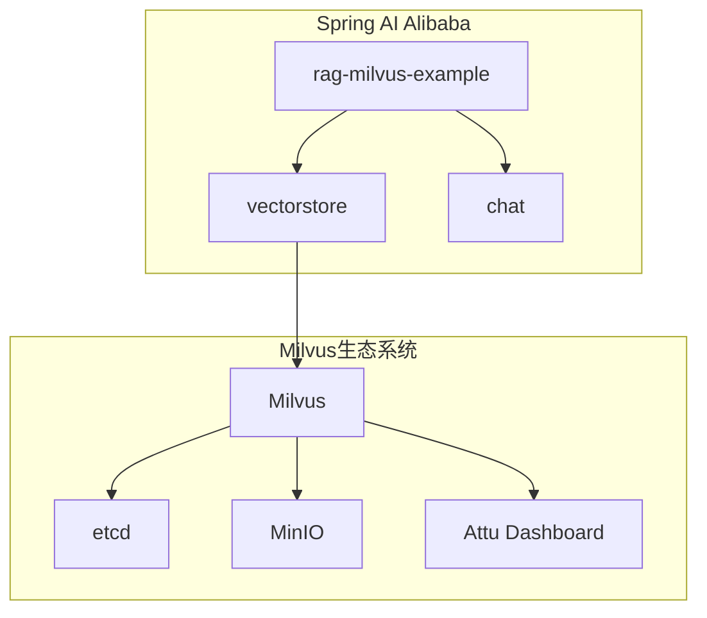
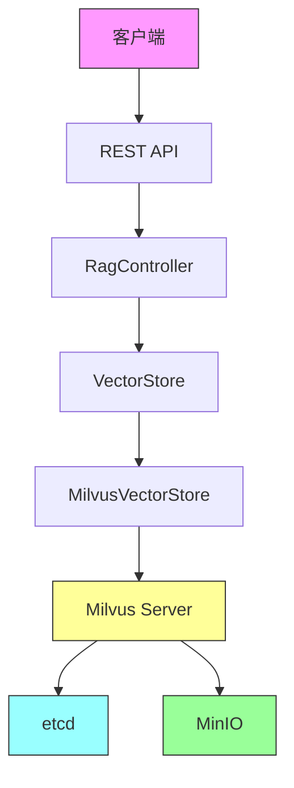
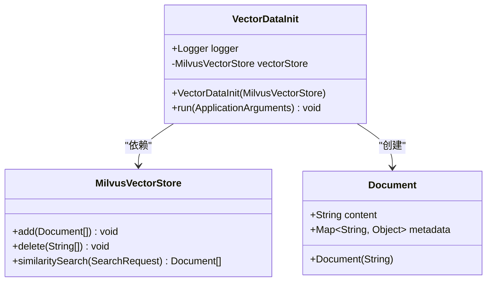
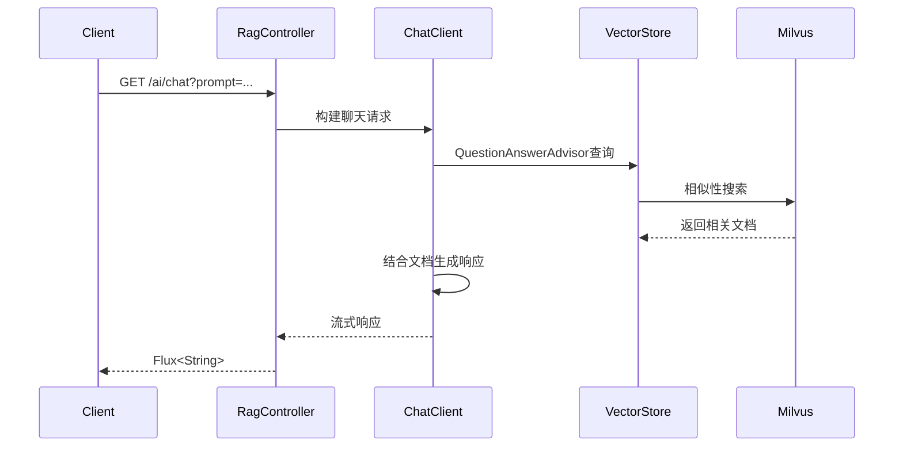
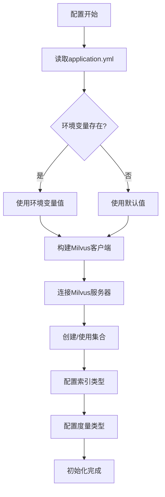
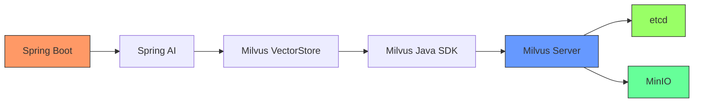

# Milvus集成

<cite>
**本文档中引用的文件**  
- [VectorDataInit.java](file://spring-ai-alibaba-rag-example/rag-milvus-example/src/main/java/com/alibaba/cloud/ai/example/rag/config/VectorDataInit.java)
- [RagController.java](file://spring-ai-alibaba-rag-example/rag-milvus-example/src/main/java/com/alibaba/cloud/ai/example/rag/controller/RagController.java)
- [application.yml](file://spring-ai-alibaba-rag-example/rag-milvus-example/src/main/resources/application.yml)
- [docker-compose.yml](file://docker-compose/milvus/docker-compose.yml)
</cite>

## 目录
1. [简介](#简介)
2. [项目结构](#项目结构)
3. [核心组件](#核心组件)
4. [架构概述](#架构概述)
5. [详细组件分析](#详细组件分析)
6. [依赖分析](#依赖分析)
7. [性能考虑](#性能考虑)
8. [故障排除指南](#故障排除指南)
9. [结论](#结论)

## 简介
本文档详细介绍了Spring AI Alibaba项目中Milvus向量数据库的集成方案。重点分析了向量集合的初始化逻辑、RAG（检索增强生成）控制器的实现机制、Milvus客户端配置以及向量操作的最佳实践。文档涵盖了从环境部署到代码实现的完整技术细节，为开发者提供全面的集成指导。

## 项目结构
项目采用标准的Spring Boot多模块结构，Milvus相关功能集中在`rag-milvus-example`模块中。该模块通过Spring AI的抽象层与Milvus进行交互，实现了向量数据的存储、检索和管理功能。

**图示来源**  
- [docker-compose.yml](file://docker-compose/milvus/docker-compose.yml#L1-L76)
- [pom.xml](file://spring-ai-alibaba-rag-example/rag-milvus-example/pom.xml#L1-L50)

**本节来源**  
- [docker-compose.yml](file://docker-compose/milvus/docker-compose.yml#L1-L76)
- [pom.xml](file://spring-ai-alibaba-rag-example/rag-milvus-example/pom.xml#L1-L50)

## 核心组件
本节分析Milvus集成中的两个核心组件：向量数据初始化器和RAG控制器。`VectorDataInit`类负责在应用启动时初始化向量数据，而`RagController`则提供REST API接口用于向量搜索和聊天功能。

**本节来源**  
- [VectorDataInit.java](file://spring-ai-alibaba-rag-example/rag-milvus-example/src/main/java/com/alibaba/cloud/ai/example/rag/config/VectorDataInit.java#L1-L70)
- [RagController.java](file://spring-ai-alibaba-rag-example/rag-milvus-example/src/main/java/com/alibaba/cloud/ai/example/rag/controller/RagController.java#L1-L94)

## 架构概述
系统采用分层架构设计，上层应用通过Spring AI的VectorStore抽象层与底层Milvus向量数据库进行交互。这种设计实现了业务逻辑与数据存储的解耦，提高了系统的可维护性和可扩展性。

**图示来源**  
- [RagController.java](file://spring-ai-alibaba-rag-example/rag-milvus-example/src/main/java/com/alibaba/cloud/ai/example/rag/controller/RagController.java#L36-L93)
- [VectorDataInit.java](file://spring-ai-alibaba-rag-example/rag-milvus-example/src/main/java/com/alibaba/cloud/ai/example/rag/config/VectorDataInit.java#L30-L69)
- [docker-compose.yml](file://docker-compose/milvus/docker-compose.yml#L1-L76)

## 详细组件分析

### 向量数据初始化分析
`VectorDataInit`类实现了`ApplicationRunner`接口，在Spring应用上下文初始化完成后自动执行向量数据的导入操作。该组件通过依赖注入获取`MilvusVectorStore`实例，并将预定义的文档集合添加到向量数据库中。

**图示来源**  
- [VectorDataInit.java](file://spring-ai-alibaba-rag-example/rag-milvus-example/src/main/java/com/alibaba/cloud/ai/example/rag/config/VectorDataInit.java#L30-L69)

**本节来源**  
- [VectorDataInit.java](file://spring-ai-alibaba-rag-example/rag-milvus-example/src/main/java/com/alibaba/cloud/ai/example/rag/config/VectorDataInit.java#L1-L70)

### RAG控制器分析
`RagController`类提供了两个主要的REST端点：`/ai/chat`用于聊天交互，`/ai/select`用于向量搜索测试。该控制器通过`QuestionAnswerAdvisor`实现RAG模式，将用户查询与向量数据库中的相关文档结合，生成更准确的响应。

**图示来源**  
- [RagController.java](file://spring-ai-alibaba-rag-example/rag-milvus-example/src/main/java/com/alibaba/cloud/ai/example/rag/controller/RagController.java#L36-L93)

**本节来源**  
- [RagController.java](file://spring-ai-alibaba-rag-example/rag-milvus-example/src/main/java/com/alibaba/cloud/ai/example/rag/controller/RagController.java#L1-L94)

### 配置分析
Milvus的连接和操作参数通过`application.yml`文件进行配置，支持环境变量覆盖，便于在不同环境中灵活调整。配置项涵盖了服务器地址、认证信息、集合名称和索引参数等关键设置。

**图示来源**  
- [application.yml](file://spring-ai-alibaba-rag-example/rag-milvus-example/src/main/resources/application.yml#L1-L19)

**本节来源**  
- [application.yml](file://spring-ai-alibaba-rag-example/rag-milvus-example/src/main/resources/application.yml#L1-L19)

## 依赖分析
项目依赖关系清晰，上层应用通过Spring AI的抽象接口与Milvus进行交互，避免了对具体实现的硬编码依赖。Docker Compose文件定义了Milvus运行所需的完整生态系统，包括etcd用于元数据存储和MinIO用于对象存储。

**图示来源**  
- [pom.xml](file://spring-ai-alibaba-rag-example/rag-milvus-example/pom.xml#L1-L50)
- [docker-compose.yml](file://docker-compose/milvus/docker-compose.yml#L1-L76)

**本节来源**  
- [pom.xml](file://spring-ai-alibaba-rag-example/rag-milvus-example/pom.xml#L1-L50)
- [docker-compose.yml](file://docker-compose/milvus/docker-compose.yml#L1-L76)

## 性能考虑
Milvus的性能受索引类型、度量方式和硬件资源配置的显著影响。IVF_FLAT索引适合精确搜索，而HNSW索引在高维向量搜索中表现更优。合理配置`topK`参数和相似度阈值可以平衡搜索精度和响应速度。

## 故障排除指南
常见问题包括Milvus服务未启动、连接超时和认证失败。确保Docker Compose中的所有服务（etcd、MinIO、Milvus）都处于健康状态，并检查`application.yml`中的连接参数是否正确。使用Attu Dashboard可以直观地监控集合状态和执行手动操作。

**本节来源**  
- [docker-compose.yml](file://docker-compose/milvus/docker-compose.yml#L1-L76)
- [README.md](file://spring-ai-alibaba-rag-example/rag-milvus-example/README.md#L1-L27)

## 结论
本文档全面介绍了Spring AI Alibaba项目中Milvus向量数据库的集成方案。通过分析核心组件、架构设计和配置细节，为开发者提供了完整的实现参考。该集成方案展示了如何利用RAG技术提升AI应用的准确性和可靠性，为构建智能应用提供了坚实的基础。