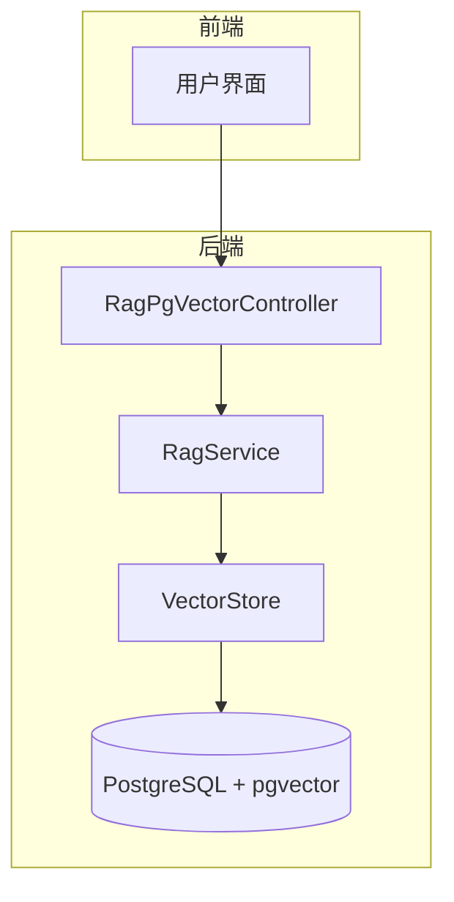
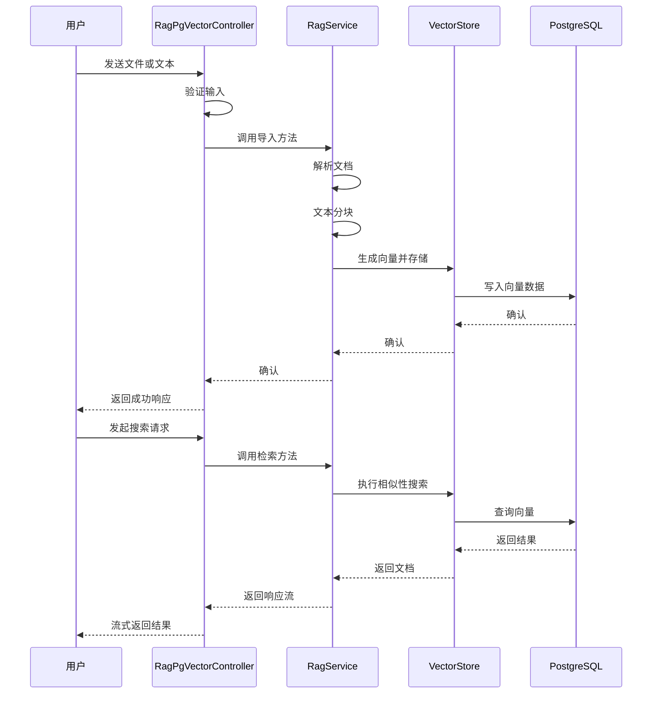
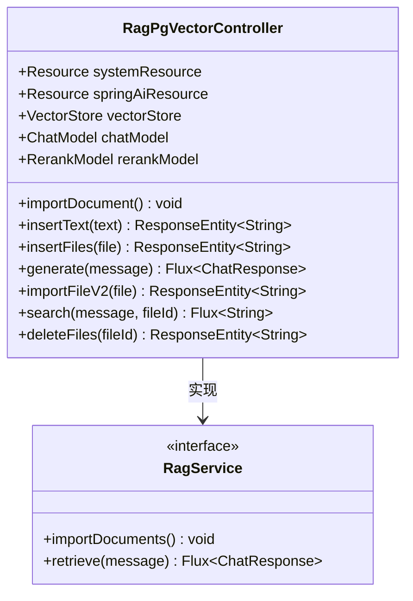
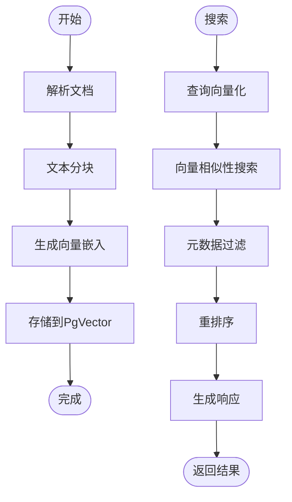
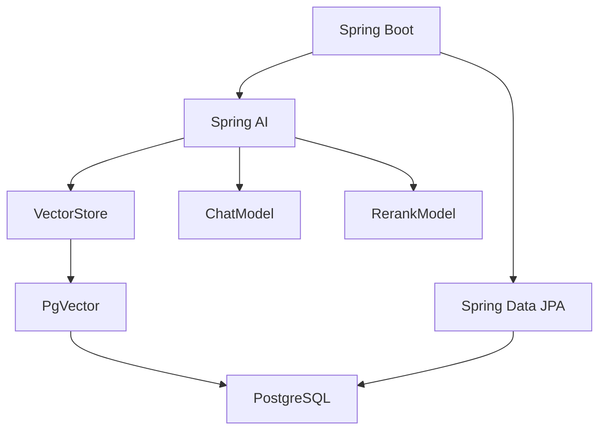

# PgVector集成

<cite>
**本文档中引用的文件**  
- [RagPgVectorController.java](file://spring-ai-alibaba-rag-example/rag-pgvector-example/src/main/java/com/alibaba/cloud/ai/example/rag/controller/RagPgVectorController.java)
- [RagService.java](file://spring-ai-alibaba-rag-example/rag-pgvector-example/src/main/java/com/alibaba/cloud/ai/example/rag/RagService.java)
- [application.yml](file://spring-ai-alibaba-rag-example/rag-pgvector-example/src/main/resources/application.yml)
- [docker-compose.yml](file://docker-compose/pgvector/docker-compose.yml)
</cite>

## 目录
1. [简介](#简介)
2. [项目结构](#项目结构)
3. [核心组件](#核心组件)
4. [架构概述](#架构概述)
5. [详细组件分析](#详细组件分析)
6. [依赖分析](#依赖分析)
7. [性能考虑](#性能考虑)
8. [故障排除指南](#故障排除指南)
9. [结论](#结论)

## 简介
本文档详细介绍了在Spring Boot应用中集成PgVector的技术实现。重点分析了`RagPgVectorController`中REST API的设计与实现，阐述了如何通过JPA和Spring Data JPA与PostgreSQL数据库交互。文档还详细说明了`application.yml`中的数据源配置、向量维度设置和连接池参数，并通过`RagService`中的代码示例展示向量的生成、存储和相似性搜索的具体实现。此外，文档涵盖了pgvector扩展的安装与配置步骤，以及性能优化建议、事务管理、错误处理和连接超时等高级主题。

## 项目结构
本项目基于Spring Boot构建，采用模块化设计，主要包含REST控制器、服务层、数据访问层和配置文件。核心功能集中在`rag-pgvector-example`模块中，该模块实现了RAG（检索增强生成）功能，并通过PgVector扩展与PostgreSQL数据库进行向量数据交互。

**图示来源**  
- [RagPgVectorController.java](file://spring-ai-alibaba-rag-example/rag-pgvector-example/src/main/java/com/alibaba/cloud/ai/example/rag/controller/RagPgVectorController.java)
- [RagService.java](file://spring-ai-alibaba-rag-example/rag-pgvector-example/src/main/java/com/alibaba/cloud/ai/example/rag/RagService.java)
- [application.yml](file://spring-ai-alibaba-rag-example/rag-pgvector-example/src/main/resources/application.yml)

**本节来源**  
- [RagPgVectorController.java](file://spring-ai-alibaba-rag-example/rag-pgvector-example/src/main/java/com/alibaba/cloud/ai/example/rag/controller/RagPgVectorController.java)
- [application.yml](file://spring-ai-alibaba-rag-example/rag-pgvector-example/src/main/resources/application.yml)
- [docker-compose.yml](file://docker-compose/pgvector/docker-compose.yml)

## 核心组件
核心组件包括`RagPgVectorController`、`RagService`接口以及PgVector向量存储的配置。`RagPgVectorController`负责处理所有REST请求，包括文档导入、文本插入、文件上传、向量搜索和删除操作。`RagService`定义了RAG功能的核心方法，如文档导入和信息检索。

**本节来源**  
- [RagPgVectorController.java](file://spring-ai-alibaba-rag-example/rag-pgvector-example/src/main/java/com/alibaba/cloud/ai/example/rag/controller/RagPgVectorController.java#L1-L50)
- [RagService.java](file://spring-ai-alibaba-rag-example/rag-pgvector-example/src/main/java/com/alibaba/cloud/ai/example/rag/RagService.java#L1-L35)

## 架构概述
系统采用典型的分层架构，前端通过HTTP请求与`RagPgVectorController`交互，控制器调用`RagService`进行业务处理，服务层通过`VectorStore`接口与PgVector数据库进行数据交互。整个流程包括文档解析、文本分块、向量化、存储和检索。

**图示来源**  
- [RagPgVectorController.java](file://spring-ai-alibaba-rag-example/rag-pgvector-example/src/main/java/com/alibaba/cloud/ai/example/rag/controller/RagPgVectorController.java#L50-L221)
- [RagService.java](file://spring-ai-alibaba-rag-example/rag-pgvector-example/src/main/java/com/alibaba/cloud/ai/example/rag/RagService.java#L1-L35)

## 详细组件分析

### RagPgVectorController分析
`RagPgVectorController`是系统的核心REST控制器，提供了多个端点用于RAG功能的实现。

#### REST API设计
控制器提供了以下主要API：
- `GET /ai/rag/importDocument`：导入预设PDF文档
- `GET /ai/rag/importText`：导入纯文本
- `POST /ai/rag/importFile`：上传并导入文件
- `GET /ai/rag`：执行RAG查询
- `POST /ai/rag/deleteFilesV2`：根据fileId删除向量数据

**图示来源**  
- [RagPgVectorController.java](file://spring-ai-alibaba-rag-example/rag-pgvector-example/src/main/java/com/alibaba/cloud/ai/example/rag/controller/RagPgVectorController.java#L1-L222)
- [RagService.java](file://spring-ai-alibaba-rag-example/rag-pgvector-example/src/main/java/com/alibaba/cloud/ai/example/rag/RagService.java#L1-L35)

#### 向量存储与检索流程
系统使用`TokenTextSplitter`对文档进行分块，然后通过向量模型生成嵌入向量并存储到PgVector中。检索时使用余弦相似度进行向量搜索，并可结合元数据过滤。

**图示来源**  
- [RagPgVectorController.java](file://spring-ai-alibaba-rag-example/rag-pgvector-example/src/main/java/com/alibaba/cloud/ai/example/rag/controller/RagPgVectorController.java#L50-L221)

**本节来源**  
- [RagPgVectorController.java](file://spring-ai-alibaba-rag-example/rag-pgvector-example/src/main/java/com/alibaba/cloud/ai/example/rag/controller/RagPgVectorController.java#L1-L222)

## 依赖分析
系统依赖于Spring AI框架提供的`VectorStore`接口与PgVector数据库交互，通过Spring Data JPA配置数据源。应用通过`application.yml`配置数据库连接和向量存储参数。

**图示来源**  
- [application.yml](file://spring-ai-alibaba-rag-example/rag-pgvector-example/src/main/resources/application.yml#L1-L17)
- [RagPgVectorController.java](file://spring-ai-alibaba-rag-example/rag-pgvector-example/src/main/java/com/alibaba/cloud/ai/example/rag/controller/RagPgVectorController.java#L1-L222)

**本节来源**  
- [application.yml](file://spring-ai-alibaba-rag-example/rag-pgvector-example/src/main/resources/application.yml#L1-L17)
- [docker-compose.yml](file://docker-compose/pgvector/docker-compose.yml#L1-L18)

## 性能考虑
为优化PgVector性能，建议采用HNSW索引类型，设置合适的向量维度（如1536），并合理配置连接池。在查询时使用元数据过滤可以显著提高检索效率。对于大规模数据，建议实施数据分片和定期维护索引。

## 故障排除指南
常见问题包括数据库连接失败、向量维度不匹配和扩展未安装。确保PostgreSQL中已启用pgvector扩展，数据库连接参数正确，且向量维度与模型输出一致。监控连接池状态，避免连接泄漏。

**本节来源**  
- [application.yml](file://spring-ai-alibaba-rag-example/rag-pgvector-example/src/main/resources/application.yml#L1-L17)
- [docker-compose.yml](file://docker-compose/pgvector/docker-compose.yml#L1-L18)
- [RagPgVectorController.java](file://spring-ai-alibaba-rag-example/rag-pgvector-example/src/main/java/com/alibaba/cloud/ai/example/rag/controller/RagPgVectorController.java#L1-L222)

## 结论
本文档全面介绍了Spring Boot应用中PgVector的集成方案。通过`RagPgVectorController`实现了完整的RAG功能，利用Spring Data JPA与PostgreSQL高效交互。合理的配置和优化策略确保了系统的高性能和可靠性，为构建智能应用提供了坚实的基础。