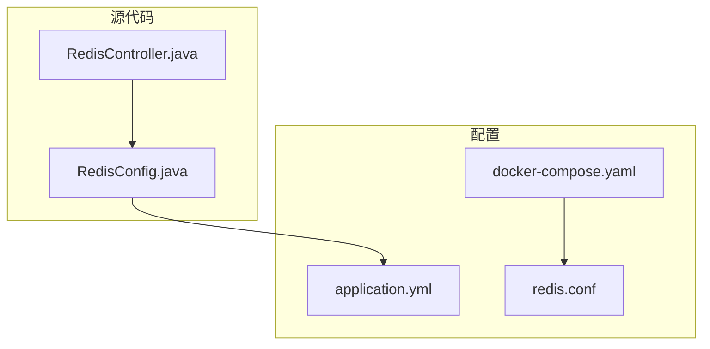
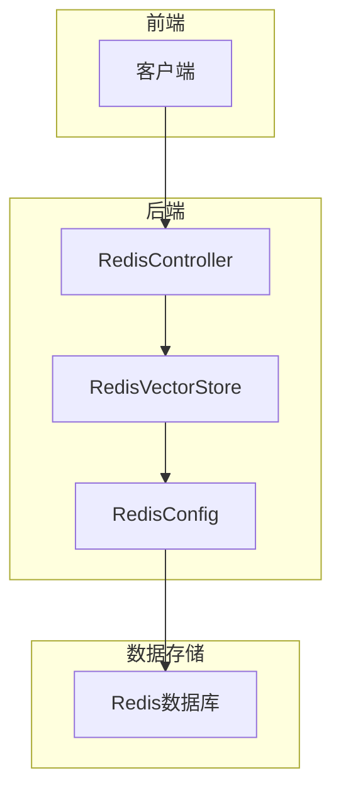
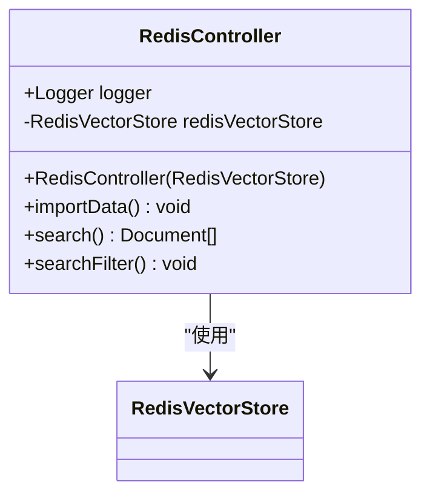
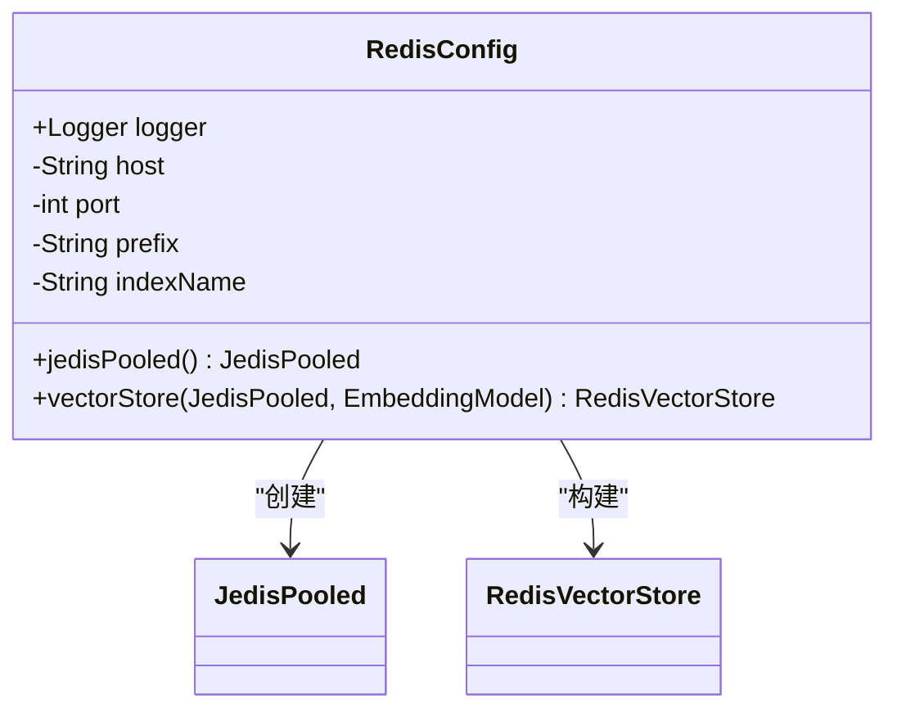
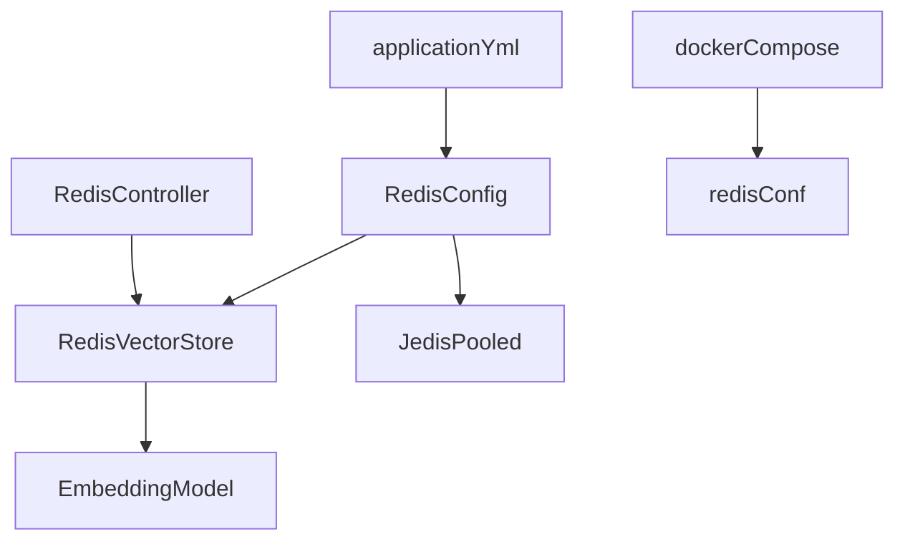

# Redis集成

<cite>
**本文档引用的文件**
- [RedisController.java](file://spring-ai-alibaba-rag-example/spring-ai-alibaba-vector-databases-example/vector-redis-example/src/main/java/com/alibaba/cloud/ai/example/vector/redis/controller/RedisController.java)
- [RedisConfig.java](file://spring-ai-alibaba-rag-example/spring-ai-alibaba-vector-databases-example/vector-redis-example/src/main/java/com/alibaba/cloud/ai/example/vector/redis/config/RedisConfig.java)
- [application.yml](file://spring-ai-alibaba-rag-example/spring-ai-alibaba-vector-databases-example/vector-redis-example/src/main/resources/application.yml)
- [docker-compose.yaml](file://docker-compose/redis/docker-compose.yaml)
- [redis.conf](file://docker-compose/redis/conf/redis.conf)
</cite>

## 目录
1. [项目结构](#项目结构)
2. [核心组件](#核心组件)
3. [架构概述](#架构概述)
4. [详细组件分析](#详细组件分析)
5. [依赖分析](#依赖分析)
6. [性能考虑](#性能考虑)
7. [故障排除指南](#故障排除指南)
8. [结论](#结论)

## 项目结构

本项目展示了如何在Spring AI应用中集成Redis作为向量数据库。项目结构清晰地分离了配置、控制器和资源文件。

**Diagram sources**
- [RedisController.java](file://spring-ai-alibaba-rag-example/spring-ai-alibaba-vector-databases-example/vector-redis-example/src/main/java/com/alibaba/cloud/ai/example/vector/redis/controller/RedisController.java)
- [RedisConfig.java](file://spring-ai-alibaba-rag-example/spring-ai-alibaba-vector-databases-example/vector-redis-example/src/main/java/com/alibaba/cloud/ai/example/vector/redis/config/RedisConfig.java)
- [application.yml](file://spring-ai-alibaba-rag-example/spring-ai-alibaba-vector-databases-example/vector-redis-example/src/main/resources/application.yml)
- [docker-compose.yaml](file://docker-compose/redis/docker-compose.yaml)
- [redis.conf](file://docker-compose/redis/conf/redis.conf)

**Section sources**
- [RedisController.java](file://spring-ai-alibaba-rag-example/spring-ai-alibaba-vector-databases-example/vector-redis-example/src/main/java/com/alibaba/cloud/ai/example/vector/redis/controller/RedisController.java)
- [RedisConfig.java](file://spring-ai-alibaba-rag-example/spring-ai-alibaba-vector-databases-example/vector-redis-example/src/main/java/com/alibaba/cloud/ai/example/vector/redis/config/RedisConfig.java)
- [application.yml](file://spring-ai-alibaba-rag-example/spring-ai-alibaba-vector-databases-example/vector-redis-example/src/main/resources/application.yml)

## 核心组件

本项目的核心组件包括RedisController、RedisConfig和相关的配置文件。RedisController负责处理向量数据的导入、搜索和删除操作，而RedisConfig则负责配置Redis连接和向量存储。

**Section sources**
- [RedisController.java](file://spring-ai-alibaba-rag-example/spring-ai-alibaba-vector-databases-example/vector-redis-example/src/main/java/com/alibaba/cloud/ai/example/vector/redis/controller/RedisController.java)
- [RedisConfig.java](file://spring-ai-alibaba-rag-example/spring-ai-alibaba-vector-databases-example/vector-redis-example/src/main/java/com/alibaba/cloud/ai/example/vector/redis/config/RedisConfig.java)

## 架构概述

本项目采用分层架构，将业务逻辑、数据访问和配置管理分离。Redis作为向量数据库，通过RedisVectorStore与Spring AI应用集成。

**Diagram sources**
- [RedisController.java](file://spring-ai-alibaba-rag-example/spring-ai-alibaba-vector-databases-example/vector-redis-example/src/main/java/com/alibaba/cloud/ai/example/vector/redis/controller/RedisController.java)
- [RedisConfig.java](file://spring-ai-alibaba-rag-example/spring-ai-alibaba-vector-databases-example/vector-redis-example/src/main/java/com/alibaba/cloud/ai/example/vector/redis/config/RedisConfig.java)

## 详细组件分析

### RedisController分析

RedisController提供了向量数据的CRUD操作接口，包括数据导入、相似性搜索和基于过滤条件的删除。

#### 向量操作API设计

**Diagram sources**
- [RedisController.java](file://spring-ai-alibaba-rag-example/spring-ai-alibaba-vector-databases-example/vector-redis-example/src/main/java/com/alibaba/cloud/ai/example/vector/redis/controller/RedisController.java)

**Section sources**
- [RedisController.java](file://spring-ai-alibaba-rag-example/spring-ai-alibaba-vector-databases-example/vector-redis-example/src/main/java/com/alibaba/cloud/ai/example/vector/redis/controller/RedisController.java)

### RedisConfig分析

RedisConfig类负责配置Redis连接工厂和向量存储，通过Spring的依赖注入机制管理Redis资源。

#### Redis连接工厂和模板配置

**Diagram sources**
- [RedisConfig.java](file://spring-ai-alibaba-rag-example/spring-ai-alibaba-vector-databases-example/vector-redis-example/src/main/java/com/alibaba/cloud/ai/example/vector/redis/config/RedisConfig.java)

**Section sources**
- [RedisConfig.java](file://spring-ai-alibaba-rag-example/spring-ai-alibaba-vector-databases-example/vector-redis-example/src/main/java/com/alibaba/cloud/ai/example/vector/redis/config/RedisConfig.java)

## 依赖分析

本项目依赖于Spring AI框架、Redis客户端库和相关的配置管理组件。

**Diagram sources**
- [RedisController.java](file://spring-ai-alibaba-rag-example/spring-ai-alibaba-vector-databases-example/vector-redis-example/src/main/java/com/alibaba/cloud/ai/example/vector/redis/controller/RedisController.java)
- [RedisConfig.java](file://spring-ai-alibaba-rag-example/spring-ai-alibaba-vector-databases-example/vector-redis-example/src/main/java/com/alibaba/cloud/ai/example/vector/redis/config/RedisConfig.java)
- [application.yml](file://spring-ai-alibaba-rag-example/spring-ai-alibaba-vector-databases-example/vector-redis-example/src/main/resources/application.yml)
- [docker-compose.yaml](file://docker-compose/redis/docker-compose.yaml)
- [redis.conf](file://docker-compose/redis/conf/redis.conf)

**Section sources**
- [RedisController.java](file://spring-ai-alibaba-rag-example/spring-ai-alibaba-vector-databases-example/vector-redis-example/src/main/java/com/alibaba/cloud/ai/example/vector/redis/controller/RedisController.java)
- [RedisConfig.java](file://spring-ai-alibaba-rag-example/spring-ai-alibaba-vector-databases-example/vector-redis-example/src/main/java/com/alibaba/cloud/ai/example/vector/redis/config/RedisConfig.java)
- [application.yml](file://spring-ai-alibaba-rag-example/spring-ai-alibaba-vector-databases-example/vector-redis-example/src/main/resources/application.yml)

## 性能考虑

在使用Redis作为向量数据库时，需要考虑以下性能因素：

1. **批量处理策略**：使用TokenCountBatchingStrategy优化向量嵌入的批量处理
2. **索引配置**：合理配置向量索引以提高搜索效率
3. **连接池管理**：通过JedisPooled有效管理Redis连接
4. **内存优化**：合理设置Redis内存限制和淘汰策略

## 故障排除指南

### 常见问题及解决方案

1. **连接失败**：检查application.yml中的主机地址和端口配置，确保Redis服务正在运行
2. **认证问题**：如果Redis配置了密码，需要在配置中添加相应的密码参数
3. **索引创建失败**：确保Redis服务器支持RediSearch模块
4. **性能瓶颈**：监控Redis内存使用情况，必要时调整批量处理策略

**Section sources**
- [application.yml](file://spring-ai-alibaba-rag-example/spring-ai-alibaba-vector-databases-example/vector-redis-example/src/main/resources/application.yml)
- [docker-compose.yaml](file://docker-compose/redis/docker-compose.yaml)
- [redis.conf](file://docker-compose/redis/conf/redis.conf)

## 结论

本项目展示了如何在Spring AI应用中集成Redis作为向量数据库。通过合理的配置和API设计，实现了高效的向量数据存储和检索功能。建议在生产环境中考虑使用Redis Sentinel或Redis Cluster来提高可用性和扩展性。