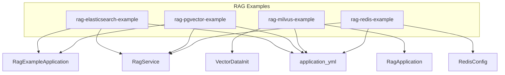
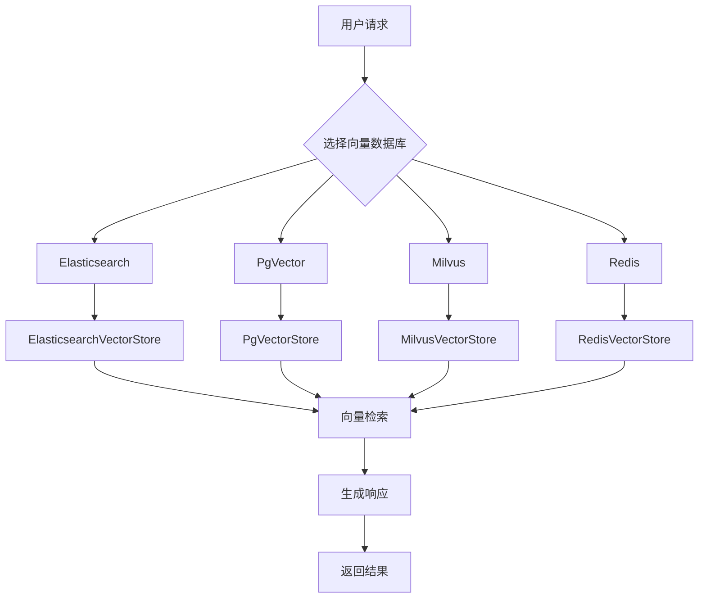
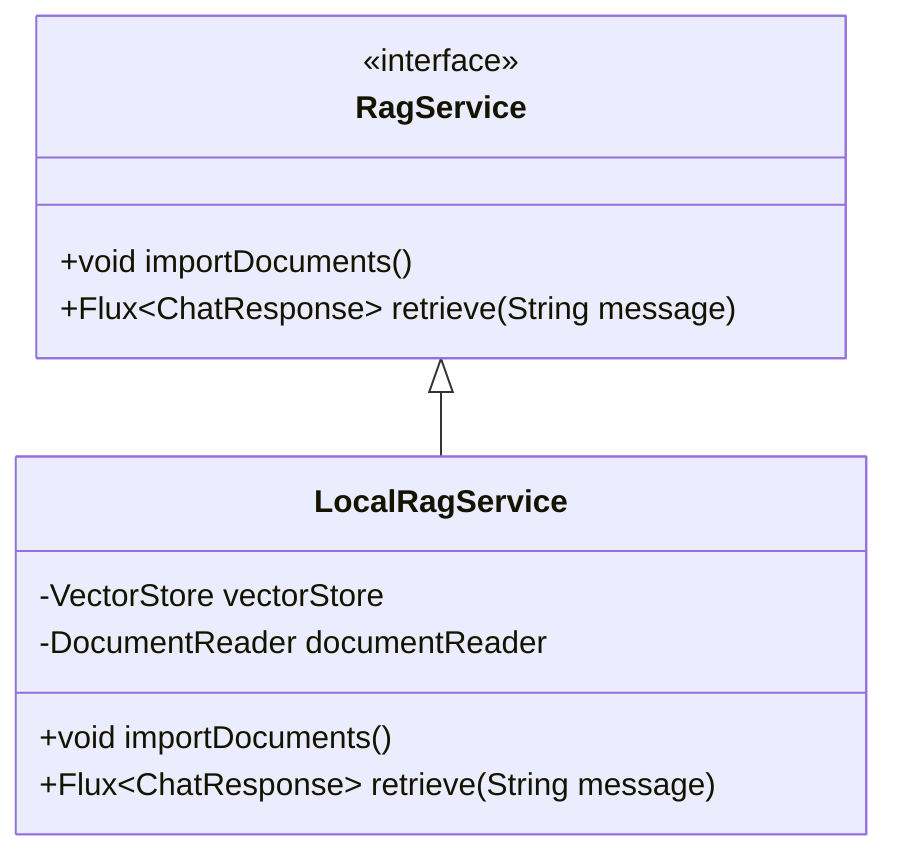
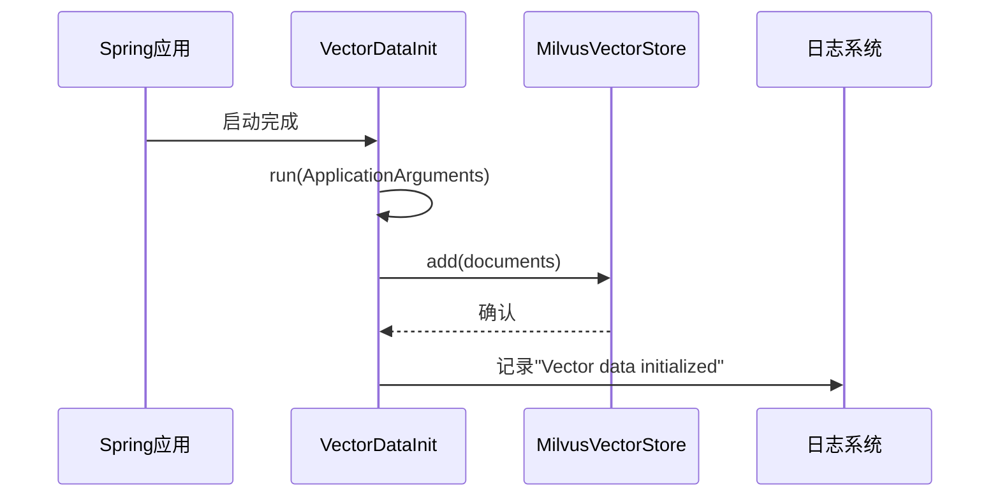
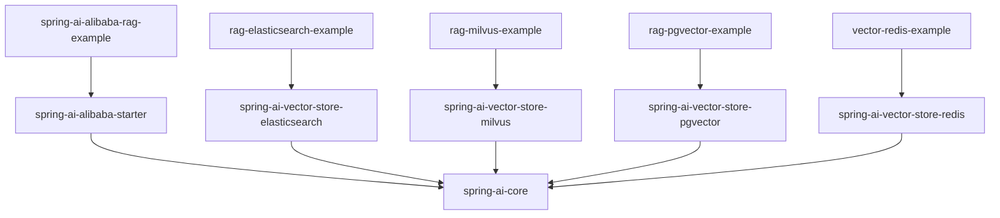

# 向量数据库集成

<cite>
**本文档中引用的文件**  
- [RagExampleApplication.java](file://spring-ai-alibaba-rag-example/rag-elasticsearch-example/src/main/java/com/alibaba/cloud/ai/example/rag/RagExampleApplication.java)
- [RagExampleApplication.java](file://spring-ai-alibaba-rag-example/rag-pgvector-example/src/main/java/com/alibaba/cloud/ai/example/rag/RagExampleApplication.java)
- [RagService.java](file://spring-ai-alibaba-rag-example/bailian-rag-knowledge/src/main/java/com/alibaba/cloud/ai/example/rag/knowledge/service/RagService.java)
- [RagService.java](file://spring-ai-alibaba-rag-example/rag-elasticsearch-example/src/main/java/com/alibaba/cloud/ai/example/rag/RagService.java)
- [RagService.java](file://spring-ai-alibaba-rag-example/rag-pgvector-example/src/main/java/com/alibaba/cloud/ai/example/rag/RagService.java)
- [VectorDataInit.java](file://spring-ai-alibaba-rag-example/rag-milvus-example/src/main/java/com/alibaba/cloud/ai/example/rag/config/VectorDataInit.java)
- [application.yml](file://spring-ai-alibaba-rag-example/rag-elasticsearch-example/src/main/resources/application.yml)
- [application.yml](file://spring-ai-alibaba-rag-example/rag-pgvector-example/src/main/resources/application.yml)
- [application.yml](file://spring-ai-alibaba-rag-example/rag-milvus-example/src/main/resources/application.yml)
</cite>

## 目录
1. [简介](#简介)
2. [项目结构](#项目结构)
3. [核心组件](#核心组件)
4. [架构概述](#架构概述)
5. [详细组件分析](#详细组件分析)
6. [依赖分析](#依赖分析)
7. [性能考量](#性能考量)
8. [故障排除指南](#故障排除指南)
9. [结论](#结论)

## 简介
本文档详细介绍了Spring AI Alibaba如何与多种向量数据库（包括PgVector、Elasticsearch、Redis和Milvus）集成，以支持检索增强生成（RAG）应用。通过分析RagExampleApplication和RagService中的代码实现，深入探讨了每种数据库的配置方式、连接参数及性能特点。同时，文档还解释了向量数据初始化的通用模式，并为开发者提供了选择合适向量数据库的决策指南。

## 项目结构
Spring AI Alibaba的RAG示例项目按不同向量数据库分别组织，每个子模块独立配置并实现与特定数据库的集成。主要模块包括rag-elasticsearch-example、rag-pgvector-example和rag-milvus-example，分别对应Elasticsearch、PgVector和Milvus的集成实现。

**图示来源**
- [rag-elasticsearch-example](file://spring-ai-alibaba-rag-example/rag-elasticsearch-example)
- [rag-pgvector-example](file://spring-ai-alibaba-rag-example/rag-pgvector-example)
- [rag-milvus-example](file://spring-ai-alibaba-rag-example/rag-milvus-example)
- [vector-redis-example](file://spring-ai-alibaba-rag-example/spring-ai-alibaba-vector-databases-example/vector-redis-example)

**本节来源**
- [spring-ai-alibaba-rag-example](file://spring-ai-alibaba-rag-example)

## 核心组件
核心组件包括RagExampleApplication作为启动类，RagService定义了文档导入和检索的核心接口，以及针对不同向量数据库的具体实现。VectorDataInit类负责在应用启动时初始化向量数据。

**本节来源**
- [RagExampleApplication.java](file://spring-ai-alibaba-rag-example/rag-elasticsearch-example/src/main/java/com/alibaba/cloud/ai/example/rag/RagExampleApplication.java)
- [RagService.java](file://spring-ai-alibaba-rag-example/rag-elasticsearch-example/src/main/java/com/alibaba/cloud/ai/example/rag/RagService.java)
- [VectorDataInit.java](file://spring-ai-alibaba-rag-example/rag-milvus-example/src/main/java/com/alibaba/cloud/ai/example/rag/config/VectorDataInit.java)

## 架构概述
系统采用Spring Boot架构，通过Spring AI模块与底层向量数据库交互。RAG流程包括文档加载、向量化、存储和检索四个阶段。不同数据库通过各自的VectorStore实现与Spring AI的集成。

**图示来源**
- [RagService.java](file://spring-ai-alibaba-rag-example/rag-elasticsearch-example/src/main/java/com/alibaba/cloud/ai/example/rag/RagService.java)
- [VectorDataInit.java](file://spring-ai-alibaba-rag-example/rag-milvus-example/src/main/java/com/alibaba/cloud/ai/example/rag/config/VectorDataInit.java)

## 详细组件分析

### RagService分析
RagService接口定义了两个核心方法：importDocuments用于导入文档，retrieve用于执行语义检索。该接口为所有向量数据库实现提供了统一契约。

**图示来源**
- [RagService.java](file://spring-ai-alibaba-rag-example/rag-elasticsearch-example/src/main/java/com/alibaba/cloud/ai/example/rag/RagService.java)

**本节来源**
- [RagService.java](file://spring-ai-alibaba-rag-example/rag-elasticsearch-example/src/main/java/com/alibaba/cloud/ai/example/rag/RagService.java)

### 向量数据初始化分析
VectorDataInit类实现了ApplicationRunner接口，在应用启动时自动执行向量数据初始化。该类通过依赖注入获取MilvusVectorStore实例，并将预定义的文档集合添加到向量数据库中。

**图示来源**
- [VectorDataInit.java](file://spring-ai-alibaba-rag-example/rag-milvus-example/src/main/java/com/alibaba/cloud/ai/example/rag/config/VectorDataInit.java)

**本节来源**
- [VectorDataInit.java](file://spring-ai-alibaba-rag-example/rag-milvus-example/src/main/java/com/alibaba/cloud/ai/example/rag/config/VectorDataInit.java)

## 依赖分析
各向量数据库示例模块依赖于spring-ai-alibaba-starter核心模块，并根据具体数据库类型引入相应的向量存储实现依赖。Elasticsearch和Milvus通过专用的VectorStore实现与Spring AI集成。

**图示来源**
- [pom.xml](file://spring-ai-alibaba-rag-example/rag-elasticsearch-example/pom.xml)
- [pom.xml](file://spring-ai-alibaba-rag-example/rag-milvus-example/pom.xml)
- [pom.xml](file://spring-ai-alibaba-rag-example/rag-pgvector-example/pom.xml)

**本节来源**
- [pom.xml](file://spring-ai-alibaba-rag-example/rag-elasticsearch-example/pom.xml)
- [pom.xml](file://spring-ai-alibaba-rag-example/rag-milvus-example/pom.xml)

## 性能考量
不同向量数据库在吞吐量、延迟和可扩展性方面表现各异。Milvus专为大规模向量搜索优化，PgVector适合已使用PostgreSQL的场景，Elasticsearch提供全文检索与向量搜索的混合能力，Redis则以低延迟著称。

| 数据库 | 吞吐量 | 延迟 | 成本 | 特性 |
|--------|--------|------|------|------|
| Milvus | 高 | 低 | 中等 | 专为向量优化，支持GPU加速 |
| PgVector | 中等 | 中等 | 低 | 与关系型数据共存，事务支持 |
| Elasticsearch | 高 | 低 | 高 | 混合搜索，丰富生态系统 |
| Redis | 非常高 | 非常低 | 中等 | 内存存储，超高性能 |

**本节来源**
- [application.yml](file://spring-ai-alibaba-rag-example/rag-milvus-example/src/main/resources/application.yml)
- [application.yml](file://spring-ai-alibaba-rag-example/rag-pgvector-example/src/main/resources/application.yml)

## 故障排除指南
常见问题包括连接失败、向量维度不匹配和索引未创建。确保application.yml中的连接参数正确，向量模型与数据库配置的维度一致，并在首次运行时允许足够的数据初始化时间。

**本节来源**
- [application.yml](file://spring-ai-alibaba-rag-example/rag-elasticsearch-example/src/main/resources/application.yml)
- [VectorDataInit.java](file://spring-ai-alibaba-rag-example/rag-milvus-example/src/main/java/com/alibaba/cloud/ai/example/rag/config/VectorDataInit.java)

## 结论
Spring AI Alibaba通过统一的抽象层简化了与多种向量数据库的集成。开发者可根据具体需求选择合适的数据库：需要高性能时选择Milvus或Redis，需要混合搜索时选择Elasticsearch，已有PostgreSQL环境时选择PgVector。统一的RagService接口和配置模式降低了切换数据库的成本。