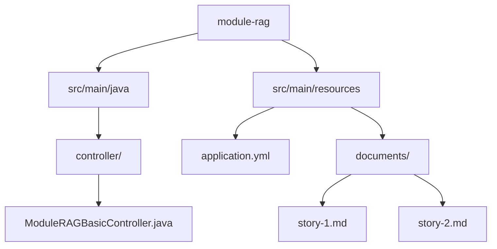
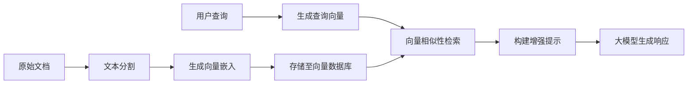
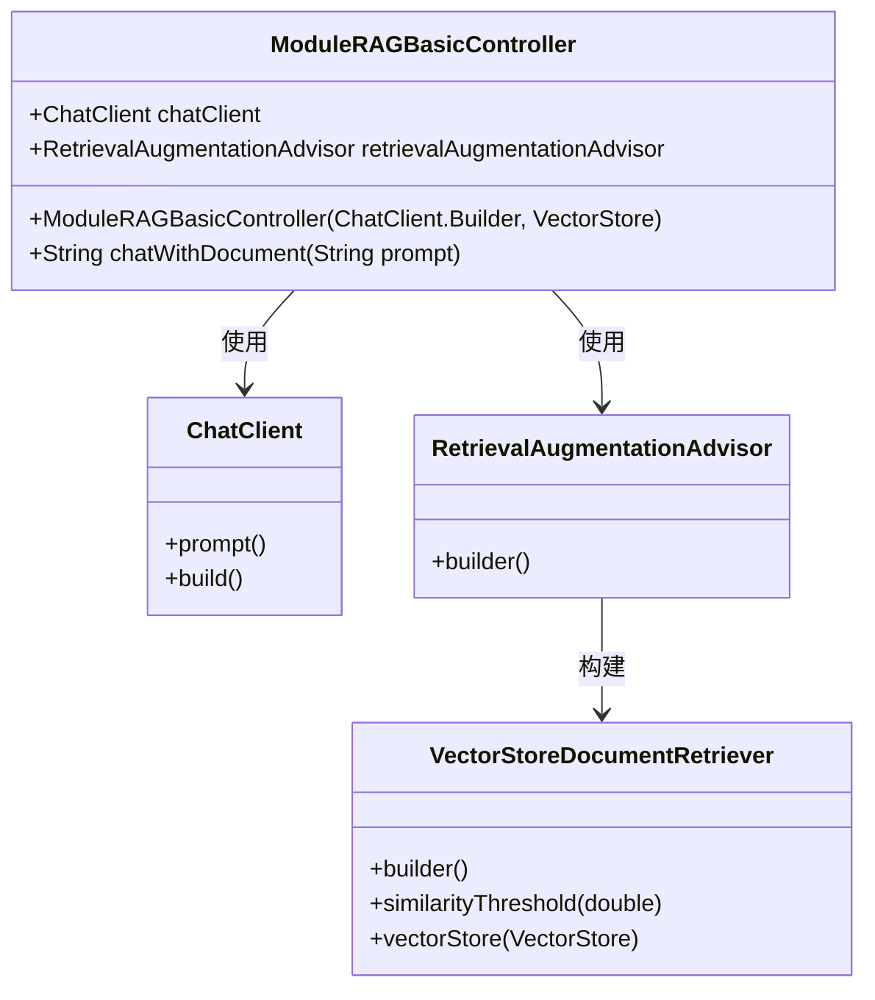
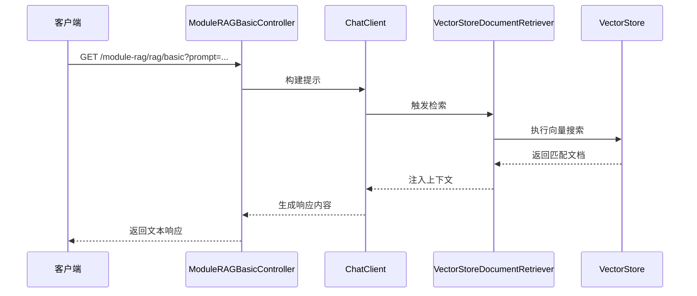
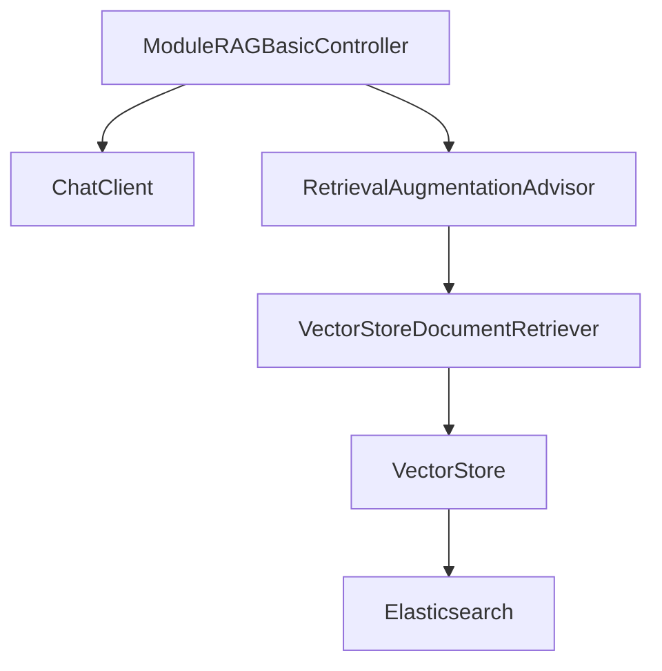

# 基础RAG实现

<cite>
**本文档中引用的文件**  
- [ModuleRAGBasicController.java](file://spring-ai-alibaba-rag-example/module-rag/src/main/java/com/alibaba/cloud/ai/example/rag/controller/ModuleRAGBasicController.java)
- [application.yml](file://spring-ai-alibaba-rag-example/module-rag/src/main/resources/application.yml)
- [story-1.md](file://spring-ai-alibaba-rag-example/module-rag/src/main/resources/documents/story-1.md)
</cite>

## 目录
1. [简介](#简介)
2. [项目结构](#项目结构)
3. [核心组件](#核心组件)
4. [架构概述](#架构概述)
5. [详细组件分析](#详细组件分析)
6. [依赖分析](#依赖分析)
7. [性能考虑](#性能考虑)
8. [故障排除指南](#故障排除指南)
9. [结论](#结论)

## 简介
本文档旨在为初学者提供一个关于模块化RAG（Retrieval-Augmented Generation）实现的详细指南。重点介绍基于Spring AI Alibaba框架的基础RAG工作流程，涵盖从文档加载、文本分割、向量嵌入到检索的完整过程。通过`ModuleRAGBasicController`中的代码作为主要示例，解释如何配置和使用Spring AI Alibaba的RAG功能。同时，说明`story-1.md`等文档如何被处理和索引，以及`application.yml`中的相关配置项。此外，还涵盖常见问题如文档格式支持、文本分割策略和基本检索性能优化。

## 项目结构
该模块位于`spring-ai-alibaba-rag-example/module-rag`目录下，采用标准的Spring Boot项目结构。主要包含控制器类、资源文件和配置文件。

**Diagram sources**
- [application.yml](file://spring-ai-alibaba-rag-example/module-rag/src/main/resources/application.yml)
- [story-1.md](file://spring-ai-alibaba-rag-example/module-rag/src/main/resources/documents/story-1.md)
- [ModuleRAGBasicController.java](file://spring-ai-alibaba-rag-example/module-rag/src/main/java/com/alibaba/cloud/ai/example/rag/controller/ModuleRAGBasicController.java)

**Section sources**
- [application.yml](file://spring-ai-alibaba-rag-example/module-rag/src/main/resources/application.yml)
- [story-1.md](file://spring-ai-alibaba-rag-example/module-rag/src/main/resources/documents/story-1.md)
- [ModuleRAGBasicController.java](file://spring-ai-alibaba-rag-example/module-rag/src/main/java/com/alibaba/cloud/ai/example/rag/controller/ModuleRAGBasicController.java)

## 核心组件
本模块的核心是`ModuleRAGBasicController`，它利用Spring AI Alibaba提供的RAG能力，实现了基于向量存储的检索增强生成功能。通过`ChatClient`与大模型交互，并结合`RetrievalAugmentationAdvisor`实现从向量数据库中检索相关信息并注入提示词的过程。

**Section sources**
- [ModuleRAGBasicController.java](file://spring-ai-alibaba-rag-example/module-rag/src/main/java/com/alibaba/cloud/ai/example/rag/controller/ModuleRAGBasicController.java)

## 架构概述
系统整体架构遵循典型的RAG模式：首先将原始文档加载并切分为片段，然后通过嵌入模型生成向量并存入向量数据库；在查询阶段，用户输入被转换为向量，在向量库中进行相似性搜索，检索出的相关文档片段与原始查询一起送入大模型生成最终响应。

**Diagram sources**
- [ModuleRAGBasicController.java](file://spring-ai-alibaba-rag-example/module-rag/src/main/java/com/alibaba/cloud/ai/example/rag/controller/ModuleRAGBasicController.java)
- [application.yml](file://spring-ai-alibaba-rag-example/module-rag/src/main/resources/application.yml)

## 详细组件分析

### ModuleRAGBasicController 分析
该控制器实现了最基础的RAG功能，通过REST接口接收用户查询，并自动从向量数据库中检索相关内容以增强生成结果。

#### 类结构与依赖关系

**Diagram sources**
- [ModuleRAGBasicController.java](file://spring-ai-alibaba-rag-example/module-rag/src/main/java/com/alibaba/cloud/ai/example/rag/controller/ModuleRAGBasicController.java)

#### 请求处理流程

**Diagram sources**
- [ModuleRAGBasicController.java](file://spring-ai-alibaba-rag-example/module-rag/src/main/java/com/alibaba/cloud/ai/example/rag/controller/ModuleRAGBasicController.java)

**Section sources**
- [ModuleRAGBasicController.java](file://spring-ai-alibaba-rag-example/module-rag/src/main/java/com/alibaba/cloud/ai/example/rag/controller/ModuleRAGBasicController.java)

## 依赖分析
该模块依赖于Spring AI Alibaba的核心组件，包括`ChatClient`、`VectorStore`和RAG相关的顾问组件。向量存储后端配置为Elasticsearch，通过`spring.ai.vectorstore.elasticsearch`进行配置。

**Diagram sources**
- [application.yml](file://spring-ai-alibaba-rag-example/module-rag/src/main/resources/application.yml)
- [ModuleRAGBasicController.java](file://spring-ai-alibaba-rag-example/module-rag/src/main/java/com/alibaba/cloud/ai/example/rag/controller/ModuleRAGBasicController.java)

**Section sources**
- [application.yml](file://spring-ai-alibaba-rag-example/module-rag/src/main/resources/application.yml)

## 性能考虑
- **相似度阈值设置**：在`RetrievalAugmentationAdvisor`中设置了0.50的相似度阈值，确保只返回足够相关的文档片段。
- **向量维度配置**：`application.yml`中明确指定向量维度为1536，匹配所用嵌入模型的输出。
- **索引名称规范**：使用统一的索引名`spring-ai-alibaba-index`便于管理和监控。

## 故障排除指南
- **文档未被检索到**：检查`story-1.md`是否已正确加载并完成向量化，确认向量数据库中存在对应条目。
- **响应质量差**：调整`similarityThreshold`参数，或检查嵌入模型是否与查询语义匹配。
- **连接失败**：验证Elasticsearch服务是否运行在`http://127.0.0.1:9200`，并检查网络配置。

**Section sources**
- [story-1.md](file://spring-ai-alibaba-rag-example/module-rag/src/main/resources/documents/story-1.md)
- [application.yml](file://spring-ai-alibaba-rag-example/module-rag/src/main/resources/application.yml)

## 结论
本文档详细介绍了Spring AI Alibaba中模块化RAG的基础实现方式。通过`ModuleRAGBasicController`展示了从配置到查询的完整流程，帮助开发者理解如何集成RAG功能。建议初学者按照文档准备自己的文本数据，配置合适的向量数据库，并逐步调试检索效果以优化应用性能。