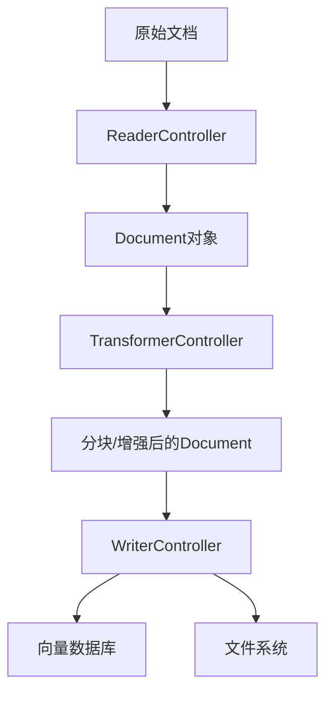
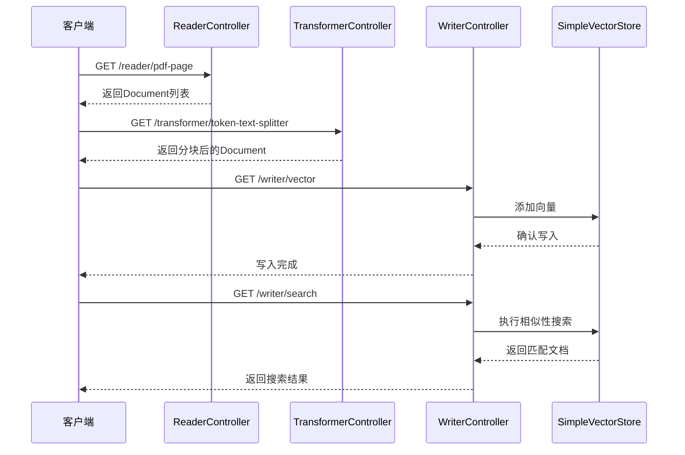
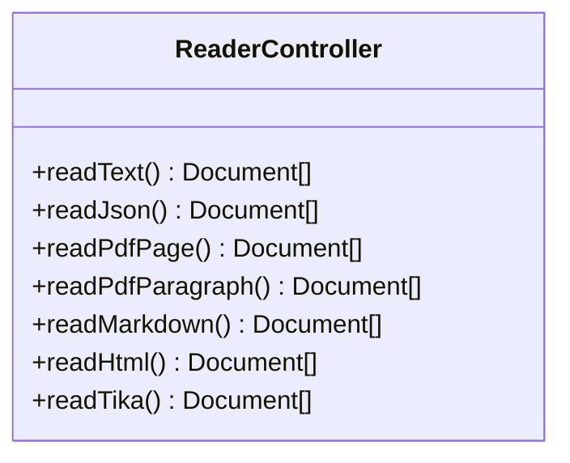
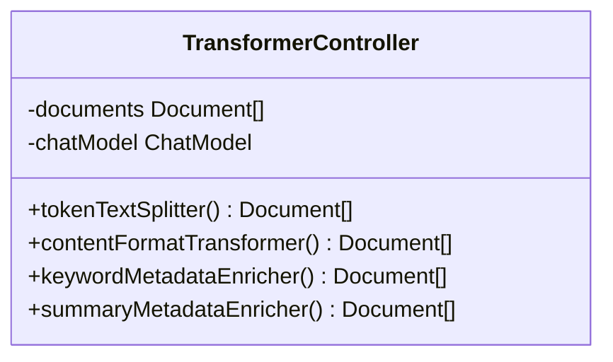
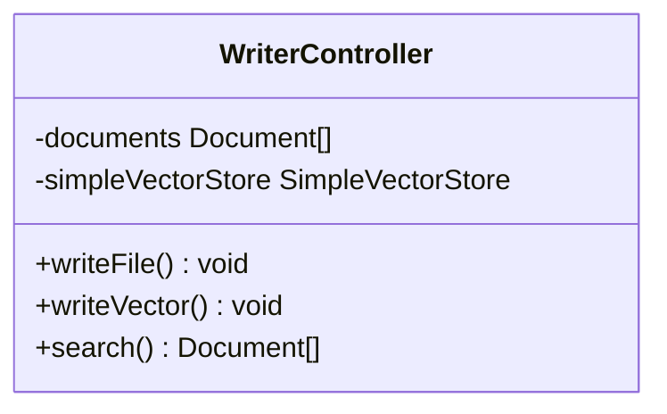
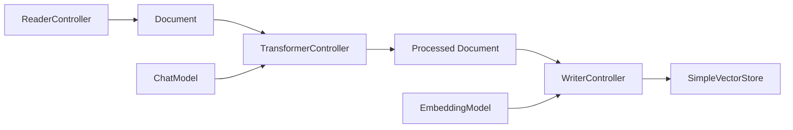

# ETL管道

<cite>
**本文档中引用的文件**  
- [RagEtlPipelineApplication.java](file://spring-ai-alibaba-rag-example/rag-etl-pipeline-example/src/main/java/com/alibaba/cloud/ai/example/rag/RagEtlPipelineApplication.java)
- [ReaderController.java](file://spring-ai-alibaba-rag-example/rag-etl-pipeline-example/src/main/java/com/alibaba/cloud/ai/example/rag/controller/ReaderController.java)
- [TransformerController.java](file://spring-ai-alibaba-rag-example/rag-etl-pipeline-example/src/main/java/com/alibaba/cloud/ai/example/rag/controller/TransformerController.java)
- [WriterController.java](file://spring-ai-alibaba-rag-example/rag-etl-pipeline-example/src/main/java/com/alibaba/cloud/ai/example/rag/controller/WriterController.java)
- [Constant.java](file://spring-ai-alibaba-rag-example/rag-etl-pipeline-example/src/main/java/com/alibaba/cloud/ai/example/rag/model/Constant.java)
- [application.yml](file://spring-ai-alibaba-rag-example/rag-etl-pipeline-example/src/main/resources/application.yml)
</cite>

## 目录
1. [简介](#简介)
2. [项目结构](#项目结构)
3. [核心组件](#核心组件)
4. [ETL管道架构概述](#etl管道架构概述)
5. [详细组件分析](#详细组件分析)
6. [依赖关系分析](#依赖关系分析)
7. [性能监控与错误处理最佳实践](#性能监控与错误处理最佳实践)
8. [配置与扩展指南](#配置与扩展指南)
9. [结论](#结论)

## 简介
本文档全面介绍基于Spring AI Alibaba实现的ETL（提取、转换、加载）管道系统，重点阐述数据从原始文档到向量存储的完整处理流程。通过分析`ReaderController`、`TransformerController`和`WriterController`三个核心控制器，详细说明每个阶段的数据转换逻辑。同时提供系统配置、扩展方法以及性能优化建议，帮助开发者高效构建和维护RAG（检索增强生成）应用的数据处理流程。

## 项目结构
该ETL管道项目遵循标准的Spring Boot应用结构，主要包含控制器层、模型定义和资源配置。数据处理流程由三个主要控制器驱动：`ReaderController`负责多种格式文档的读取，`TransformerController`执行内容切分与元数据增强，`WriterController`完成向量存储写入与检索功能。所有测试数据文件均存放于`classpath:data/`路径下，便于资源加载。

**Diagram sources**
- [ReaderController.java](file://spring-ai-alibaba-rag-example/rag-etl-pipeline-example/src/main/java/com/alibaba/cloud/ai/example/rag/controller/ReaderController.java#L1-L87)
- [TransformerController.java](file://spring-ai-alibaba-rag-example/rag-etl-pipeline-example/src/main/java/com/alibaba/cloud/ai/example/rag/controller/TransformerController.java#L1-L91)
- [WriterController.java](file://spring-ai-alibaba-rag-example/rag-etl-pipeline-example/src/main/java/com/alibaba/cloud/ai/example/rag/controller/WriterController.java#L1-L68)

**Section sources**
- [ReaderController.java](file://spring-ai-alibaba-rag-example/rag-etl-pipeline-example/src/main/java/com/alibaba/cloud/ai/example/rag/controller/ReaderController.java#L1-L87)
- [TransformerController.java](file://spring-ai-alibaba-rag-example/rag-etl-pipeline-example/src/main/java/com/alibaba/cloud/ai/example/rag/controller/TransformerController.java#L1-L91)
- [WriterController.java](file://spring-ai-alibaba-rag-example/rag-etl-pipeline-example/src/main/java/com/alibaba/cloud/ai/example/rag/controller/WriterController.java#L1-L68)

## 核心组件
本ETL管道的核心由三个控制器构成：`ReaderController`实现多格式文档解析，`TransformerController`负责内容结构化处理，`WriterController`完成数据持久化。这些组件协同工作，形成完整的数据处理流水线，支持从文本、JSON、PDF到HTML等多种输入格式，并最终将嵌入向量写入向量存储。

**Section sources**
- [ReaderController.java](file://spring-ai-alibaba-rag-example/rag-etl-pipeline-example/src/main/java/com/alibaba/cloud/ai/example/rag/controller/ReaderController.java#L1-L87)
- [TransformerController.java](file://spring-ai-alibaba-rag-example/rag-etl-pipeline-example/src/main/java/com/alibaba/cloud/ai/example/rag/controller/TransformerController.java#L1-L91)
- [WriterController.java](file://spring-ai-alibaba-rag-example/rag-etl-pipeline-example/src/main/java/com/alibaba/cloud/ai/example/rag/controller/WriterController.java#L1-L68)

## ETL管道架构概述
整个ETL流程分为三个明确阶段：提取（Extract）、转换（Transform）和加载（Load）。系统通过REST API暴露各阶段功能，允许按需调用。在提取阶段，使用Spring AI提供的多种Reader实现对不同格式文档的解析；转换阶段利用文本切分器和元数据增强器优化内容结构；加载阶段则将处理后的文档写入向量数据库或文件系统，支持后续检索。

**Diagram sources**
- [ReaderController.java](file://spring-ai-alibaba-rag-example/rag-etl-pipeline-example/src/main/java/com/alibaba/cloud/ai/example/rag/controller/ReaderController.java#L1-L87)
- [TransformerController.java](file://spring-ai-alibaba-rag-example/rag-etl-pipeline-example/src/main/java/com/alibaba/cloud/ai/example/rag/controller/TransformerController.java#L1-L91)
- [WriterController.java](file://spring-ai-alibaba-rag-example/rag-etl-pipeline-example/src/main/java/com/alibaba/cloud/ai/example/rag/controller/WriterController.java#L1-L68)

## 详细组件分析
### ReaderController分析
`ReaderController`提供多种文档读取接口，支持文本、JSON、PDF、Markdown、HTML等多种格式。每种读取方式对应特定的Spring AI Reader实现，确保格式兼容性和解析准确性。

#### 支持的读取方式

**Diagram sources**
- [ReaderController.java](file://spring-ai-alibaba-rag-example/rag-etl-pipeline-example/src/main/java/com/alibaba/cloud/ai/example/rag/controller/ReaderController.java#L1-L87)

**Section sources**
- [ReaderController.java](file://spring-ai-alibaba-rag-example/rag-etl-pipeline-example/src/main/java/com/alibaba/cloud/ai/example/rag/controller/ReaderController.java#L1-L87)

### TransformerController分析
`TransformerController`负责对原始文档进行结构化处理，包括文本切分、内容格式化以及元数据增强，提升后续检索的准确性和效率。

#### 转换功能实现

**Diagram sources**
- [TransformerController.java](file://spring-ai-alibaba-rag-example/rag-etl-pipeline-example/src/main/java/com/alibaba/cloud/ai/example/rag/controller/TransformerController.java#L1-L91)

**Section sources**
- [TransformerController.java](file://spring-ai-alibaba-rag-example/rag-etl-pipeline-example/src/main/java/com/alibaba/cloud/ai/example/rag/controller/TransformerController.java#L1-L91)

### WriterController分析
`WriterController`实现数据的持久化存储，支持写入文件系统和向量数据库两种模式，并提供基于语义的相似性搜索功能。

#### 写入与检索功能

**Diagram sources**
- [WriterController.java](file://spring-ai-alibaba-rag-example/rag-etl-pipeline-example/src/main/java/com/alibaba/cloud/ai/example/rag/controller/WriterController.java#L1-L68)

**Section sources**
- [WriterController.java](file://spring-ai-alibaba-rag-example/rag-etl-pipeline-example/src/main/java/com/alibaba/cloud/ai/example/rag/controller/WriterController.java#L1-L68)

## 依赖关系分析
系统依赖关系清晰，各组件通过Spring依赖注入机制解耦。`TransformerController`和`WriterController`在构造函数中初始化文档数据，确保处理一致性。外部依赖主要来自Spring AI框架，包括文档读取器、转换器、嵌入模型和向量存储等核心组件。

**Diagram sources**
- [ReaderController.java](file://spring-ai-alibaba-rag-example/rag-etl-pipeline-example/src/main/java/com/alibaba/cloud/ai/example/rag/controller/ReaderController.java#L1-L87)
- [TransformerController.java](file://spring-ai-alibaba-rag-example/rag-etl-pipeline-example/src/main/java/com/alibaba/cloud/ai/example/rag/controller/TransformerController.java#L1-L91)
- [WriterController.java](file://spring-ai-alibaba-rag-example/rag-etl-pipeline-example/src/main/java/com/alibaba/cloud/ai/example/rag/controller/WriterController.java#L1-L68)
- [application.yml](file://spring-ai-alibaba-rag-example/rag-etl-pipeline-example/src/main/resources/application.yml#L1-L17)

**Section sources**
- [TransformerController.java](file://spring-ai-alibaba-rag-example/rag-etl-pipeline-example/src/main/java/com/alibaba/cloud/ai/example/rag/controller/TransformerController.java#L1-L91)
- [WriterController.java](file://spring-ai-alibaba-rag-example/rag-etl-pipeline-example/src/main/java/com/alibaba/cloud/ai/example/rag/controller/WriterController.java#L1-L68)
- [application.yml](file://spring-ai-alibaba-rag-example/rag-etl-pipeline-example/src/main/resources/application.yml#L1-L17)

## 性能监控与错误处理最佳实践
系统通过SLF4J日志框架记录关键操作，便于监控和调试。建议在生产环境中集成分布式追踪系统（如Zipkin）以监控ETL各阶段耗时。对于错误处理，应捕获`IOException`和`RuntimeException`，并返回适当的HTTP状态码。建议设置重试机制处理临时性故障，并对大文件处理实施超时控制。

**Section sources**
- [ReaderController.java](file://spring-ai-alibaba-rag-example/rag-etl-pipeline-example/src/main/java/com/alibaba/cloud/ai/example/rag/controller/ReaderController.java#L1-L87)
- [TransformerController.java](file://spring-ai-alibaba-rag-example/rag-etl-pipeline-example/src/main/java/com/alibaba/cloud/ai/example/rag/controller/TransformerController.java#L1-L91)
- [WriterController.java](file://spring-ai-alibaba-rag-example/rag-etl-pipeline-example/src/main/java/com/alibaba/cloud/ai/example/rag/controller/WriterController.java#L1-L68)

## 配置与扩展指南
### 配置说明
系统通过`application.yml`配置AI服务参数，包括API密钥、模型名称和端口设置。`Constant`类定义了所有测试文件的路径前缀和具体位置，便于统一管理。

### 扩展新文档格式
要支持新的文档格式，可继承`DocumentReader`接口或使用`TikaDocumentReader`实现通用解析。新增读取方法时，应在`ReaderController`中添加对应的REST端点。

### 扩展处理逻辑
可通过实现`DocumentTransformer`接口自定义转换逻辑。例如，添加实体识别、情感分析等NLP处理步骤，并在`TransformerController`中暴露新接口。

### 集成其他向量数据库
系统当前使用`SimpleVectorStore`，可通过实现`VectorStore`接口集成Milvus、Pinecone等其他向量数据库。替换`WriterController`中的存储实现即可完成迁移。

**Section sources**
- [Constant.java](file://spring-ai-alibaba-rag-example/rag-etl-pipeline-example/src/main/java/com/alibaba/cloud/ai/example/rag/model/Constant.java#L1-L21)
- [application.yml](file://spring-ai-alibaba-rag-example/rag-etl-pipeline-example/src/main/resources/application.yml#L1-L17)

## 结论
本文档详细解析了基于Spring AI Alibaba的ETL管道实现，涵盖数据提取、转换和加载的完整流程。该设计具有良好的模块化和可扩展性，支持多种文档格式和处理需求。通过合理配置和扩展，可构建高效可靠的RAG系统数据处理基础设施，为上层AI应用提供高质量的知识检索能力。