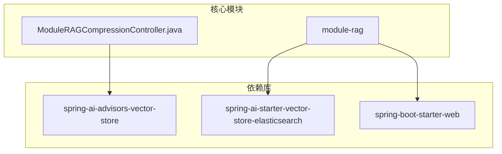
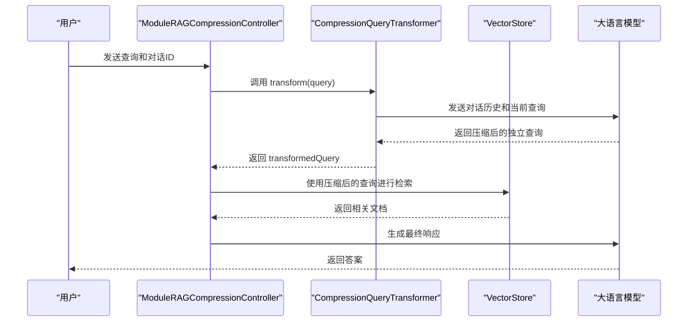
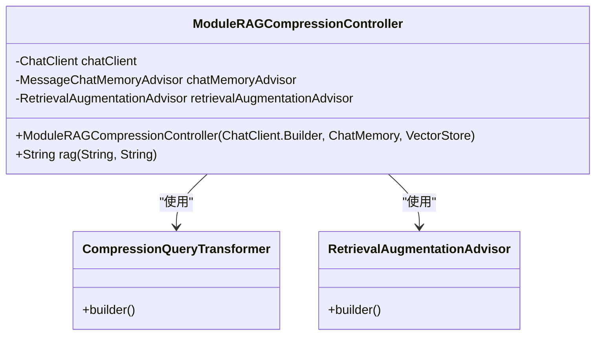
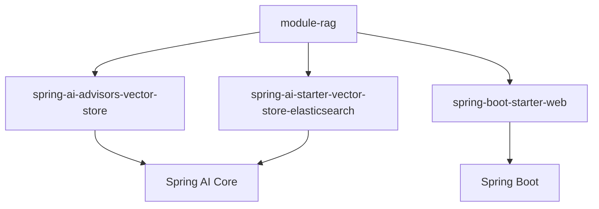

# 查询压缩

<cite>
**本文档中引用的文件**   
- [ModuleRAGCompressionController.java](file://spring-ai-alibaba-rag-example/module-rag/src/main/java/com/alibaba/cloud/ai/example/rag/controller/ModuleRAGCompressionController.java)
- [RAG.md](file://spring-ai-alibaba-playground/src/main/resources/rag/markdown/RAG.md)
- [pom.xml](file://spring-ai-alibaba-rag-example/module-rag/pom.xml)
</cite>

## 目录
1. [简介](#简介)
2. [项目结构](#项目结构)
3. [核心组件](#核心组件)
4. [架构概述](#架构概述)
5. [详细组件分析](#详细组件分析)
6. [依赖分析](#依赖分析)
7. [性能考量](#性能考量)
8. [故障排除指南](#故障排除指南)
9. [结论](#结论)

## 简介
本文档详细介绍了查询压缩技术，重点阐述如何通过减少查询中的冗余信息来提升检索效率。以 `ModuleRAGCompressionController` 的实现为案例，深入解析压缩算法的工作原理及其集成方式。文档涵盖配置选项、性能指标和实际应用效果，并为开发者提供优化压缩策略的指导，包括如何根据具体应用场景调整压缩强度。

## 项目结构
本项目是 Spring AI 框架下模块化 RAG（检索增强生成）示例的一部分，专注于查询压缩技术的实现。其结构遵循典型的 Spring Boot 应用模式，核心功能位于 `module-rag` 模块中。

**图示来源**
- [ModuleRAGCompressionController.java](file://spring-ai-alibaba-rag-example/module-rag/src/main/java/com/alibaba/cloud/ai/example/rag/controller/ModuleRAGCompressionController.java#L1-L72)
- [pom.xml](file://spring-ai-alibaba-rag-example/module-rag/pom.xml#L1-L119)

**本节来源**
- [ModuleRAGCompressionController.java](file://spring-ai-alibaba-rag-example/module-rag/src/main/java/com/alibaba/cloud/ai/example/rag/controller/ModuleRAGCompressionController.java#L1-L72)
- [pom.xml](file://spring-ai-alibaba-rag-example/module-rag/pom.xml#L1-L119)

## 核心组件
`ModuleRAGCompressionController` 是实现查询压缩功能的核心控制器。它利用 Spring AI 的 `CompressionQueryTransformer` 组件，在检索前对用户查询和对话历史进行压缩，生成一个更精炼、独立的查询，从而提高后续检索的准确性和效率。

**本节来源**
- [ModuleRAGCompressionController.java](file://spring-ai-alibaba-rag-example/module-rag/src/main/java/com/alibaba/cloud/ai/example/rag/controller/ModuleRAGCompressionController.java#L1-L72)

## 架构概述
该查询压缩功能是模块化 RAG 架构中“预检索”阶段的关键组成部分。其核心思想是利用大语言模型（LLM）来理解并压缩冗长的对话历史，将多轮对话的上下文与当前查询融合，生成一个高质量的、自包含的查询语句。

**图示来源**
- [ModuleRAGCompressionController.java](file://spring-ai-alibaba-rag-example/module-rag/src/main/java/com/alibaba/cloud/ai/example/rag/controller/ModuleRAGCompressionController.java#L36-L70)
- [RAG.md](file://spring-ai-alibaba-playground/src/main/resources/rag/markdown/RAG.md#L204-L238)

## 详细组件分析

### ModuleRAGCompressionController 分析
`ModuleRAGCompressionController` 类负责协调整个 RAG 流程，其核心在于 `CompressionQueryTransformer` 的集成。

#### 类结构与依赖

**图示来源**
- [ModuleRAGCompressionController.java](file://spring-ai-alibaba-rag-example/module-rag/src/main/java/com/alibaba/cloud/ai/example/rag/controller/ModuleRAGCompressionController.java#L1-L72)

#### 构造函数与初始化
控制器的构造函数完成了所有核心组件的初始化。它创建了 `CompressionQueryTransformer` 实例，并将其作为查询转换器注入到 `RetrievalAugmentationAdvisor` 中。这确保了在每次检索前，用户的查询都会经过压缩处理。

**本节来源**
- [ModuleRAGCompressionController.java](file://spring-ai-alibaba-rag-example/module-rag/src/main/java/com/alibaba/cloud/ai/example/rag/controller/ModuleRAGCompressionController.java#L36-L58)

#### 核心处理流程
`rag` 方法是处理用户请求的入口。它通过 `ChatClient` 调用预配置的 `RetrievalAugmentationAdvisor`，后者会自动触发 `CompressionQueryTransformer` 对查询进行压缩，然后执行检索和生成。

**本节来源**
- [ModuleRAGCompressionController.java](file://spring-ai-alibaba-rag-example/module-rag/src/main/java/com/alibaba/cloud/ai/example/rag/controller/ModuleRAGCompressionController.java#L60-L70)

## 依赖分析
`module-rag` 模块的正常运行依赖于多个关键库。

**图示来源**
- [pom.xml](file://spring-ai-alibaba-rag-example/module-rag/pom.xml#L1-L119)

**本节来源**
- [pom.xml](file://spring-ai-alibaba-rag-example/module-rag/pom.xml#L1-L119)

## 性能考量
使用 `CompressionQueryTransformer` 会引入一次额外的 LLM 调用，这会增加整体的延迟。然而，这种开销通常被更精准的检索结果所抵消。为了优化性能，建议：
1.  **配置低温度**：如文档所述，应将用于 `CompressionQueryTransformer` 的 `ChatClient.Builder` 配置为低温度（例如 0.0），以确保输出的确定性和准确性，避免因模型“创造性”发挥而引入噪声。
2.  **评估必要性**：在对话历史较短或查询本身已很清晰的场景下，压缩可能带来不必要的开销。开发者应根据实际场景评估是否启用压缩。

## 故障排除指南
当查询压缩功能未按预期工作时，可参考以下步骤进行排查：
1.  **检查日志**：确认 `CompressionQueryTransformer` 是否被成功调用，以及LLM返回的压缩后查询内容。
2.  **验证依赖**：确保 `spring-ai-advisors-vector-store` 依赖已正确添加。
3.  **检查配置**：确认 `ChatClient.Builder` 的配置，特别是温度设置，是否适合查询转换任务。

**本节来源**
- [RAG.md](file://spring-ai-alibaba-playground/src/main/resources/rag/markdown/RAG.md#L204-L238)

## 结论
`CompressionQueryTransformer` 是一种强大的预检索技术，它通过利用LLM的语义理解能力，将复杂的多轮对话压缩为一个简洁、独立的查询，显著提升了RAG系统的检索效率和准确性。`ModuleRAGCompressionController` 提供了一个清晰的集成范例，展示了如何在Spring AI框架中实现这一功能。开发者应根据具体的应用场景权衡其带来的性能开销与检索质量提升，以实现最佳的系统表现。