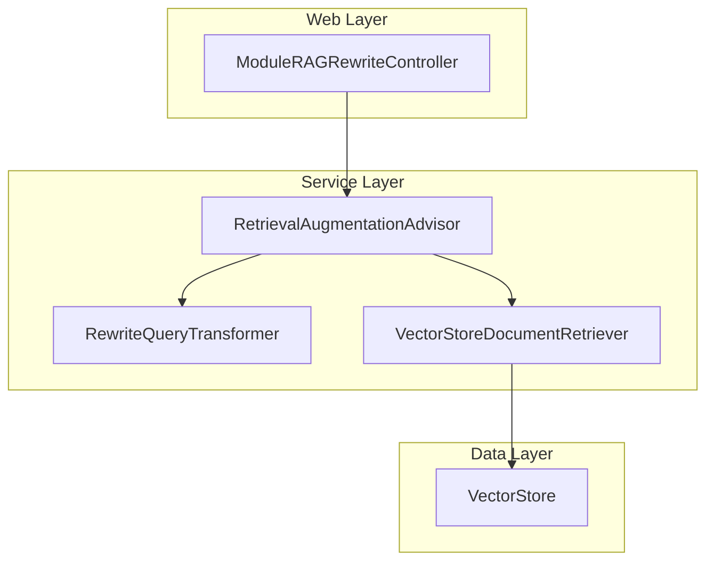
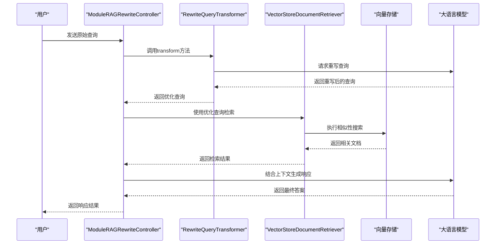
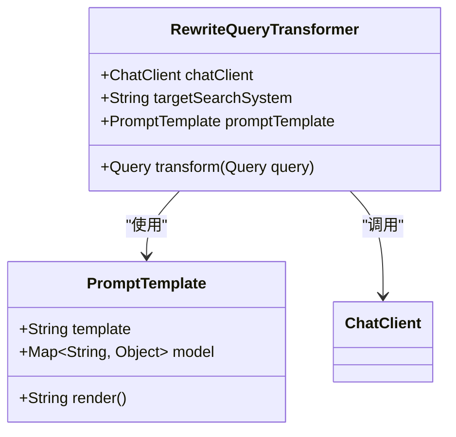
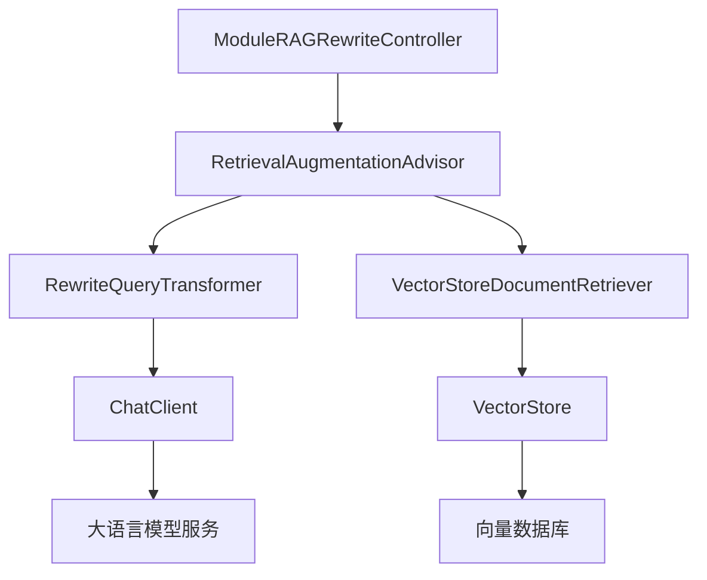

# 查询重写

<cite>
**本文档引用的文件**
- [ModuleRAGRewriteController.java](file://spring-ai-alibaba-rag-example/module-rag/src/main/java/com/alibaba/cloud/ai/example/rag/controller/ModuleRAGRewriteController.java)
- [RAG.md](file://spring-ai-alibaba-playground/src/main/resources/rag/markdown/RAG.md)
- [PromptTemplateConfig.java](file://spring-ai-alibaba-playground/src/main/java/com/alibaba/cloud/ai/application/modulerag/prompt/PromptTemplateConfig.java)
</cite>

## 目录
1. [简介](#简介)
2. [项目结构](#项目结构)
3. [核心组件](#核心组件)
4. [架构概述](#架构概述)
5. [详细组件分析](#详细组件分析)
6. [依赖分析](#依赖分析)
7. [性能考虑](#性能考虑)
8. [故障排除指南](#故障排除指南)
9. [结论](#结论)

## 简介
本文档深入探讨了基于 `ModuleRAGRewriteController` 实现的查询重写功能。该功能利用语义分析和上下文理解技术，通过重写用户原始查询来优化检索增强生成（RAG）系统的性能。文档详细阐述了重写规则的定义、匹配和应用过程，包括重写策略的配置方法、效果评估指标以及常见问题解决方案。通过实际案例展示重写前后的查询差异及其对检索结果的影响，为开发者提供全面的技术指导。

## 项目结构
查询重写功能主要位于 `spring-ai-alibaba-rag-example` 模块中，核心实现位于 `module-rag` 子模块的控制器层。系统采用分层架构，将查询处理、文档检索和响应生成分离，确保了良好的可维护性和扩展性。

**图示来源**
- [ModuleRAGRewriteController.java](file://spring-ai-alibaba-rag-example/module-rag/src/main/java/com/alibaba/cloud/ai/example/rag/controller/ModuleRAGRewriteController.java#L20-L54)

**本节来源**
- [ModuleRAGRewriteController.java](file://spring-ai-alibaba-rag-example/module-rag/src/main/java/com/alibaba/cloud/ai/example/rag/controller/ModuleRAGRewriteController.java#L1-L55)
- [RAG.md](file://spring-ai-alibaba-playground/src/main/resources/rag/markdown/RAG.md#L1-L398)

## 核心组件
查询重写功能的核心组件包括 `RewriteQueryTransformer`、`RetrievalAugmentationAdvisor` 和 `VectorStoreDocumentRetriever`。这些组件协同工作，实现了从原始查询接收、语义重写、向量检索到最终响应生成的完整流程。`RewriteQueryTransformer` 负责利用大语言模型对用户查询进行语义分析和优化重写，`RetrievalAugmentationAdvisor` 作为协调者整合了查询转换和文档检索的逻辑，而 `VectorStoreDocumentRetriever` 则负责与底层向量数据库交互，执行相似性搜索。

**本节来源**
- [ModuleRAGRewriteController.java](file://spring-ai-alibaba-rag-example/module-rag/src/main/java/com/alibaba/cloud/ai/example/rag/controller/ModuleRAGRewriteController.java#L20-L54)
- [RAG.md](file://spring-ai-alibaba-playground/src/main/resources/rag/markdown/RAG.md#L240-L279)

## 架构概述
系统采用模块化RAG架构，将查询处理流程分解为预检索、检索和后检索三个阶段。在预检索阶段，`RewriteQueryTransformer` 对用户输入的原始查询进行语义重写，去除无关信息，使其更加简洁和具体，从而提高后续检索的准确性。重写后的查询被传递给 `VectorStoreDocumentRetriever`，该组件在向量存储中执行相似性搜索，检索出与查询最相关的文档。最后，检索到的上下文与用户查询一起被送入大语言模型，生成最终的响应。

**图示来源**
- [ModuleRAGRewriteController.java](file://spring-ai-alibaba-rag-example/module-rag/src/main/java/com/alibaba/cloud/ai/example/rag/controller/ModuleRAGRewriteController.java#L37-L54)
- [RAG.md](file://spring-ai-alibaba-playground/src/main/resources/rag/markdown/RAG.md#L240-L279)

## 详细组件分析

### RewriteQueryTransformer 分析
`RewriteQueryTransformer` 是查询重写功能的核心组件，它利用大语言模型的能力对用户查询进行语义层面的优化。该组件通过构建器模式进行配置，接收 `ChatClient.Builder` 实例以创建用于执行重写的语言模型客户端，并指定目标搜索系统（如向量存储）的名称。

#### 重写规则与提示词模板
重写过程由一个精心设计的提示词模板驱动，该模板定义了重写应遵循的规则：
1. 去除任何无关信息，确保查询简洁且具体；
2. 输出必须与用户查询的语言保持一致；
3. 从大模型的角度确保更好的理解和回答。

**图示来源**
- [PromptTemplateConfig.java](file://spring-ai-alibaba-playground/src/main/java/com/alibaba/cloud/ai/application/modulerag/prompt/PromptTemplateConfig.java#L38-L58)
- [RAG.md](file://spring-ai-alibaba-playground/src/main/resources/rag/markdown/RAG.md#L240-L279)

### RetrievalAugmentationAdvisor 分析
`RetrievalAugmentationAdvisor` 作为高级顾问组件，整合了查询转换和文档检索的逻辑。它接收一个或多个 `QueryTransformer` 实例（如 `RewriteQueryTransformer`）和一个 `DocumentRetriever` 实例，在生成响应前自动执行查询重写和文档检索。

#### 配置与工作流程
该组件通过构建器模式进行配置，允许开发者灵活地组合不同的查询转换器和文档检索器。其工作流程是顺序的：首先应用所有查询转换器对原始查询进行优化，然后使用优化后的查询执行文档检索，最后将检索到的上下文与用户查询结合，送入大语言模型生成最终响应。

**本节来源**
- [ModuleRAGRewriteController.java](file://spring-ai-alibaba-rag-example/module-rag/src/main/java/com/alibaba/cloud/ai/example/rag/controller/ModuleRAGRewriteController.java#L20-L54)
- [RAG.md](file://spring-ai-alibaba-playground/src/main/resources/rag/markdown/RAG.md#L344-L356)

## 依赖分析
查询重写功能依赖于多个关键组件和库。核心依赖包括 `spring-ai-advisors-vector-store` 库，它提供了 `RetrievalAugmentationAdvisor` 和 `RewriteQueryTransformer` 等高级功能。系统通过 `ChatClient.Builder` 依赖于特定的大语言模型服务（如通义千问），用于执行查询重写和最终的响应生成。数据检索层依赖于 `VectorStore` 接口的实现，如基于DashScope的向量存储，用于存储和检索文档嵌入。

**图示来源**
- [go.mod](file://go.mod#L1-L20)
- [ModuleRAGRewriteController.java](file://spring-ai-alibaba-rag-example/module-rag/src/main/java/com/alibaba/cloud/ai/example/rag/controller/ModuleRAGRewriteController.java#L20-L54)

**本节来源**
- [ModuleRAGRewriteController.java](file://spring-ai-alibaba-rag-example/module-rag/src/main/java/com/alibaba/cloud/ai/example/rag/controller/ModuleRAGRewriteController.java#L1-L55)
- [RAG.md](file://spring-ai-alibaba-playground/src/main/resources/rag/markdown/RAG.md#L1-L398)

## 性能考虑
查询重写功能的性能主要受大语言模型调用延迟的影响，因为每次查询都需要额外的模型推理来执行重写。为了优化性能，建议将 `ChatClient` 的温度参数设置为较低值（如0.0），以确保重写结果的确定性和一致性，避免因随机性导致的检索质量波动。此外，合理的相似性阈值（如0.50）可以平衡检索的准确性和召回率，避免返回过多不相关的文档。

## 故障排除指南
常见问题包括重写后的查询未能有效提升检索结果、大语言模型服务调用失败或向量数据库连接异常。对于检索效果不佳的问题，应检查提示词模板是否合理，以及重写规则是否符合业务场景。对于服务调用失败，需确认API密钥配置正确且服务处于可用状态。连接异常通常与网络配置或数据库服务状态有关，应检查相关配置文件和日志。

**本节来源**
- [ModuleRAGRewriteController.java](file://spring-ai-alibaba-rag-example/module-rag/src/main/java/com/alibaba/cloud/ai/example/rag/controller/ModuleRAGRewriteController.java#L20-L54)
- [RAG.md](file://spring-ai-alibaba-playground/src/main/resources/rag/markdown/RAG.md#L240-L279)

## 结论
本文档详细阐述了基于 `ModuleRAGRewriteController` 的查询重写功能。该功能通过引入 `RewriteQueryTransformer` 组件，利用大语言模型的语义理解能力，有效优化了用户查询，显著提升了RAG系统的检索准确性和最终响应质量。通过灵活的配置和模块化的设计，该方案为构建高性能的智能问答系统提供了坚实的技术基础。