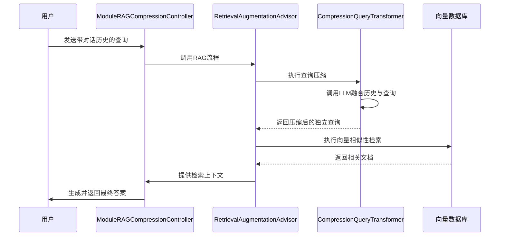
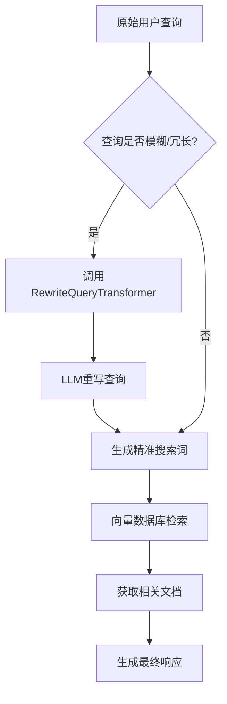
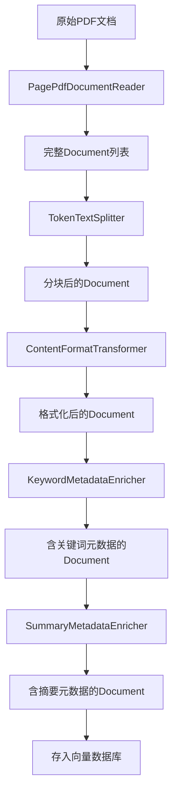

# 高级RAG模式

<cite>
**本文档中引用的文件**  
- [ModuleRAGCompressionController.java](file://spring-ai-alibaba-rag-example/module-rag/src/main/java/com/alibaba/cloud/ai/example/rag/controller/ModuleRAGCompressionController.java)
- [ModuleRAGRewriteController.java](file://spring-ai-alibaba-rag-example/module-rag/src/main/java/com/alibaba/cloud/ai/example/rag/controller/ModuleRAGRewriteController.java)
- [TransformerController.java](file://spring-ai-alibaba-rag-example/rag-etl-pipeline-example/src/main/java/com/alibaba/cloud/ai/example/rag/controller/TransformerController.java)
- [RAG.md](file://spring-ai-alibaba-playground/src/main/resources/rag/markdown/RAG.md)
</cite>

## 目录
1. [引言](#引言)  
2. [高级查询处理技术](#高级查询处理技术)  
   2.1 [查询压缩](#查询压缩)  
   2.2 [查询重写](#查询重写)  
3. [ETL管道与文档转换](#etl管道与文档转换)  
4. [高级RAG架构设计](#高级rag架构设计)  
5. [性能优化与最佳实践](#性能优化与最佳实践)  
6. [应用场景与效果评估](#应用场景与效果评估)  
7. [结论](#结论)

## 引言

检索增强生成（Retrieval-Augmented Generation, RAG）是一种融合信息检索与语言生成的技术，旨在提升大语言模型在事实准确性、上下文感知和长文本处理方面的能力。传统的RAG流程通常采用“朴素检索-直接生成”模式，而现代高级RAG模式通过引入预检索优化、后检索处理和复杂文档转换流程，显著提升了检索质量和生成结果的相关性。

本文档深入探讨基于Spring AI框架实现的高级RAG模式，重点分析查询压缩、查询重写和ETL管道等核心技术。通过解析`ModuleRAGCompressionController`、`ModuleRAGRewriteController`和`TransformerController`中的具体实现，结合`RAG.md`中的理论框架，为经验丰富的开发者提供可落地的技术方案、性能优化建议和实际应用指导。

**本节来源**  
- [RAG.md](file://spring-ai-alibaba-playground/src/main/resources/rag/markdown/RAG.md#L0-L50)

## 高级查询处理技术

高级RAG系统的核心优势在于其对用户查询的深度预处理能力。通过在检索前对原始查询进行转换或扩展，系统能够显著提升向量数据库的检索精度和召回率。以下将详细阐述两种关键的预检索技术：查询压缩与查询重写。

### 查询压缩

查询压缩技术主要用于处理多轮对话场景下的后续查询。当用户提出一个指代性问题（如“它第二大城市是什么？”）时，该问题本身缺乏独立语义，直接检索将导致失败。`CompressionQueryTransformer`通过调用大语言模型，将对话历史与当前查询融合，生成一个语义完整的独立查询。

在`ModuleRAGCompressionController`中，该技术被集成到`RetrievalAugmentationAdvisor`中，作为预检索阶段的`queryTransformer`。其核心实现依赖于`ChatClient`，建议配置为低温度（如0.0），以确保生成的压缩查询具有确定性和准确性，避免因模型随机性导致检索质量下降。

**图示来源**  
- [ModuleRAGCompressionController.java](file://spring-ai-alibaba-rag-example/module-rag/src/main/java/com/alibaba/cloud/ai/example/rag/controller/ModuleRAGCompressionController.java#L30-L50)

**本节来源**  
- [ModuleRAGCompressionController.java](file://spring-ai-alibaba-rag-example/module-rag/src/main/java/com/alibaba/cloud/ai/example/rag/controller/ModuleRAGCompressionController.java#L1-L71)
- [RAG.md](file://spring-ai-alibaba-playground/src/main/resources/rag/markdown/RAG.md#L200-L220)

### 查询重写

查询重写技术旨在优化原始用户查询的表述，使其更符合目标检索系统的搜索逻辑。用户输入的查询往往冗长、模糊或包含无关信息（如“我正在学习机器学习。什么是LLM？”），直接检索效率低下。`RewriteQueryTransformer`利用大语言模型将此类查询重写为简洁、精准的搜索关键词（如“LLM定义”）。

`ModuleRAGRewriteController`展示了该技术的典型应用。与压缩器类似，它同样作为`RetrievalAugmentationAdvisor`的`queryTransformer`被调用。一个关键配置是`targetSearchSystem`，它告知模型目标检索系统（如“向量存储”），使重写过程更具针对性。此技术特别适用于提升在模糊查询或自然语言提问下的检索性能。

**图示来源**  
- [ModuleRAGRewriteController.java](file://spring-ai-alibaba-rag-example/module-rag/src/main/java/com/alibaba/cloud/ai/example/rag/controller/ModuleRAGRewriteController.java#L25-L40)

**本节来源**  
- [ModuleRAGRewriteController.java](file://spring-ai-alibaba-rag-example/module-rag/src/main/java/com/alibaba/cloud/ai/example/rag/controller/ModuleRAGRewriteController.java#L1-L55)
- [RAG.md](file://spring-ai-alibaba-playground/src/main/resources/rag/markdown/RAG.md#L221-L235)

## ETL管道与文档转换

高质量的RAG系统不仅依赖于查询优化，更依赖于对原始文档的预处理（ETL：提取、转换、加载）。`TransformerController`提供了一套完整的文档转换流程，确保输入向量数据库的文本块是结构化、丰富且适合检索的。

该控制器实现了多种转换器，共同构成了一个强大的ETL管道：

- **TokenTextSplitter**: 将长文档按Token数量分割成小块，确保每个文本块适合嵌入模型处理，同时通过`withKeepSeparator`等参数保留上下文连贯性。
- **ContentFormatTransformer**: 标准化文档内容格式，去除无关的HTML标签、特殊字符等，提高嵌入质量。
- **KeywordMetadataEnricher**: 调用大语言模型为每个文档块提取关键词，并作为元数据存储。这些关键词可用于后续的元数据过滤，实现更精确的检索。
- **SummaryMetadataEnricher**: 为文档块生成摘要（包括当前、前一个和后一个块的摘要），极大地丰富了文档的元信息，使得即使在不加载全文的情况下，也能基于摘要进行初步筛选。

**图示来源**  
- [TransformerController.java](file://spring-ai-alibaba-rag-example/rag-etl-pipeline-example/src/main/java/com/alibaba/cloud/ai/example/rag/controller/TransformerController.java#L50-L90)

**本节来源**  
- [TransformerController.java](file://spring-ai-alibaba-rag-example/rag-etl-pipeline-example/src/main/java/com/alibaba/cloud/ai/example/rag/controller/TransformerController.java#L1-L90)
- [RAG.md](file://spring-ai-alibaba-playground/src/main/resources/rag/markdown/RAG.md#L150-L160)

## 高级RAG架构设计

综合上述组件，一个完整的高级RAG系统呈现出模块化、可配置的架构。其核心思想是将RAG流程分解为独立的、可插拔的模块，开发者可以根据具体需求进行组合。

在Spring AI中，`RetrievalAugmentationAdvisor`是这一架构的集大成者。它允许开发者通过构建器模式，灵活地组装预检索、检索和后检索模块。例如，一个典型的高级RAG流程可以配置为：
1.  **预检索**: 同时使用`CompressionQueryTransformer`和`RewriteQueryTransformer`，先压缩对话历史，再重写查询。
2.  **检索**: 使用`VectorStoreDocumentRetriever`，并结合`FilterExpression`进行元数据过滤。
3.  **后检索**: 可选地使用`DocumentPostProcessor`对检索结果进行重排序或压缩。

这种模块化设计（Modular RAG）如同“乐高积木”，使得系统具有极高的灵活性和可维护性，能够快速适应不同的业务场景。

**本节来源**  
- [ModuleRAGCompressionController.java](file://spring-ai-alibaba-rag-example/module-rag/src/main/java/com/alibaba/cloud/ai/example/rag/controller/ModuleRAGCompressionController.java#L30-L50)
- [ModuleRAGRewriteController.java](file://spring-ai-alibaba-rag-example/module-rag/src/main/java/com/alibaba/cloud/ai/example/rag/controller/ModuleRAGRewriteController.java#L30-L45)
- [RAG.md](file://spring-ai-alibaba-playground/src/main/resources/rag/markdown/RAG.md#L140-L145)

## 性能优化与最佳实践

在实施高级RAG模式时，必须在检索精度和系统延迟之间找到平衡。以下是一些关键的性能优化技巧和最佳实践：

- **温度参数调优**: 在使用`CompressionQueryTransformer`或`RewriteQueryTransformer`时，务必为底层的`ChatClient`设置低温度（如0.0或0.1），以保证输出的稳定性和可预测性。
- **相似性阈值设定**: `similarityThreshold`是控制检索精度的关键。过高的阈值（如0.9）可能导致召回率过低，而过低的阈值（如0.3）会引入大量噪声。建议通过A/B测试找到最佳值（示例中使用0.50）。
- **Top-K选择**: `topK`参数决定了返回的文档数量。数量过少可能遗漏关键信息，过多则会增加生成模型的负担和延迟。通常5-10个是合理的范围。
- **异步ETL处理**: 文档的转换（如关键词提取、摘要生成）计算成本高，应作为后台异步任务执行，避免阻塞在线查询。
- **缓存策略**: 对于频繁查询或热门文档的转换结果，应建立缓存机制，显著降低重复计算的开销。

**本节来源**  
- [ModuleRAGCompressionController.java](file://spring-ai-alibaba-rag-example/module-rag/src/main/java/com/alibaba/cloud/ai/example/rag/controller/ModuleRAGCompressionController.java#L40-L45)
- [ModuleRAGRewriteController.java](file://spring-ai-alibaba-rag-example/module-rag/src/main/java/com/alibaba/cloud/ai/example/rag/controller/ModuleRAGRewriteController.java#L40-L45)
- [TransformerController.java](file://spring-ai-alibaba-rag-example/rag-etl-pipeline-example/src/main/java/com/alibaba/cloud/ai/example/rag/controller/TransformerController.java#L60-L85)

## 应用场景与效果评估

高级RAG模式特别适用于以下场景：
- **智能客服**: 处理用户多轮对话，准确理解指代和上下文。
- **企业知识库问答**: 从大量非结构化文档（PDF、报告）中精准提取信息。
- **学术研究助手**: 重写复杂问题，从海量文献中检索相关论文。

评估其效果应采用多维度指标：
- **检索质量**: 使用MRR（Mean Reciprocal Rank）、Hit Rate等指标衡量检索结果的相关性。
- **生成质量**: 使用BLEU、ROUGE等指标评估生成答案的准确性和流畅性。
- **端到端延迟**: 测量从用户提问到收到回答的总时间，确保用户体验。

通过对比“朴素RAG”和“高级RAG”的A/B测试，可以量化查询压缩和重写带来的性能提升。

**本节来源**  
- [RAG.md](file://spring-ai-alibaba-playground/src/main/resources/rag/markdown/RAG.md#L10-L30)

## 结论

高级RAG模式通过引入查询压缩、查询重写和复杂的ETL管道，极大地提升了传统RAG系统的性能。本文档通过分析Spring AI框架中的具体实现，展示了如何构建一个模块化、高性能的RAG系统。对于开发者而言，理解这些高级技术的原理和最佳实践，是构建下一代智能应用的关键。未来，随着模块化RAG框架的成熟，构建和优化RAG系统将变得更加高效和可预测。