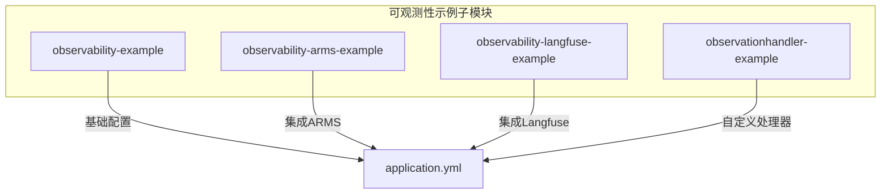
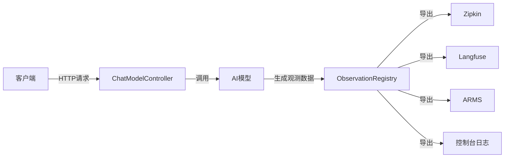
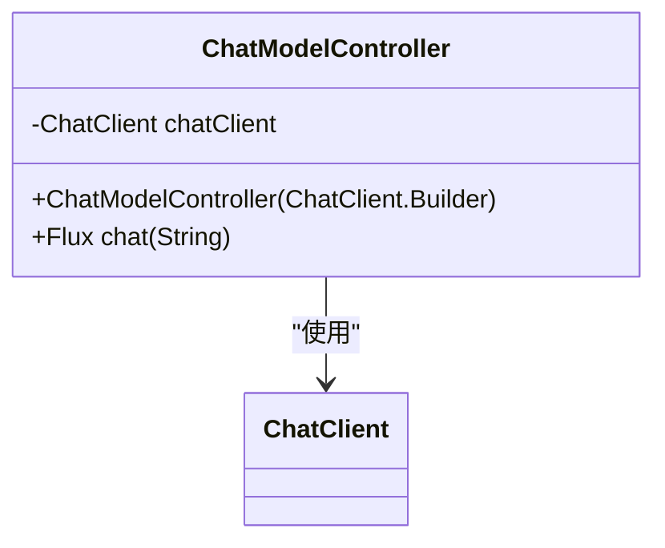
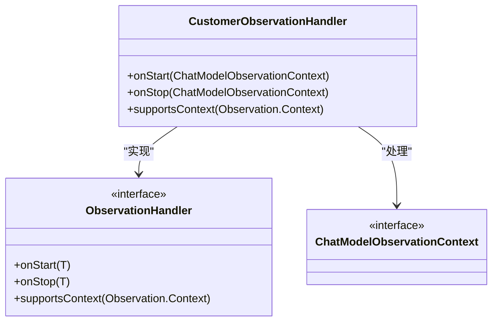
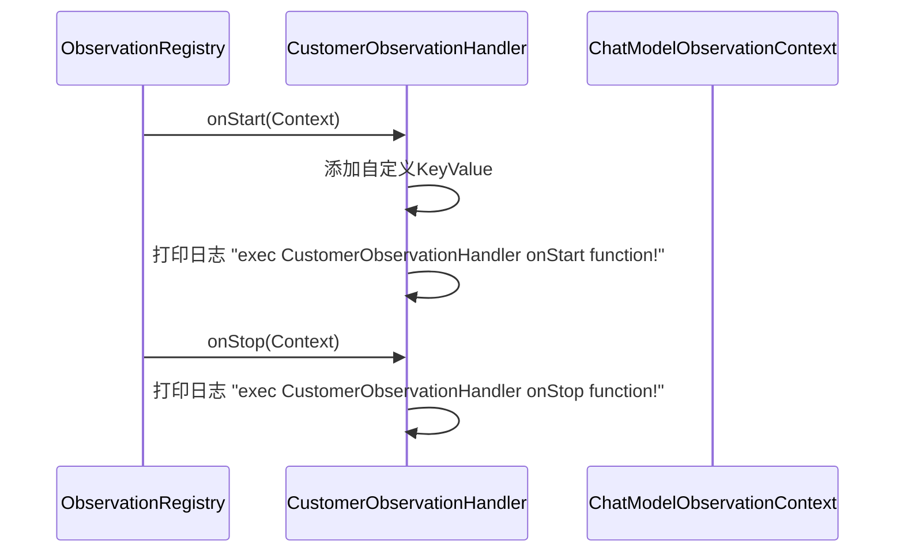
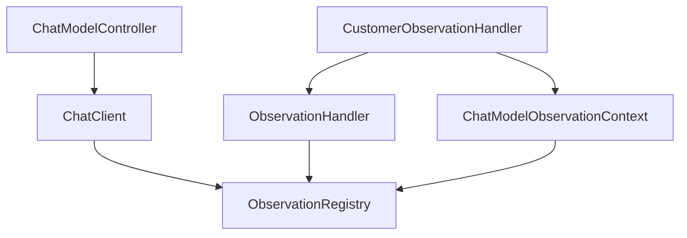

# 可观测性示例

<cite>
**本文档中引用的文件**  
- [ChatModelController.java](file://spring-ai-alibaba-observability-example/observability-example/src/main/java/com/alibaba/cloud/ai/example/observability/controller/ChatModelController.java)
- [CustomerObservationHandler.java](file://spring-ai-alibaba-observability-example/observationhandler-example/src/main/java/com/alibaba/cloud/ai/observationhandlerexample/observationHandler/CustomerObservationHandler.java)
- [ChatModelController.java](file://spring-ai-alibaba-observability-example/observationhandler-example/src/main/java/com/alibaba/cloud/ai/observationhandlerexample/controller/ChatModelController.java)
- [application.yml](file://spring-ai-alibaba-observability-example/observability-example/src/main/resources/application.yml)
- [application.yml](file://spring-ai-alibaba-observability-example/observability-langfuse-example/src/main/resources/application.yml)
</cite>

## 目录
1. [引言](#引言)
2. [项目结构](#项目结构)
3. [核心组件](#核心组件)
4. [架构概述](#架构概述)
5. [详细组件分析](#详细组件分析)
6. [依赖分析](#依赖分析)
7. [性能考虑](#性能考虑)
8. [故障排除指南](#故障排除指南)
9. [结论](#结论)

## 引言

在现代AI应用开发中，可观测性（Observability）是确保系统稳定、可维护和可优化的关键。AI应用通常涉及复杂的模型调用、非确定性输出和长链路处理，这使得传统的监控方法难以有效。本示例文档旨在全面介绍如何在Spring AI Alibaba框架中集成和使用可观测性工具，以监控和调试AI应用。

文档将重点介绍如何集成ARMS和Langfuse等外部可观测性后端，详细说明日志记录、指标收集和链路追踪等基本功能的实现。通过分析`ChatModelController`中的具体实现，我们将展示如何配置这些功能。此外，文档还将深入探讨如何通过实现`ObservationHandler`接口来自定义监控逻辑，并以`CustomerObservationHandler`为例进行说明。

本指南旨在为初学者解释为什么可观测性对AI应用至关重要，同时为经验丰富的开发者提供配置监控后端、定义自定义指标和分析调用链路的技术细节。

## 项目结构

可观测性示例项目包含多个子模块，每个模块演示了不同的可观测性集成方式。

**Diagram sources**
- [observability-example](file://spring-ai-alibaba-observability-example/observability-example)
- [observability-arms-example](file://spring-ai-alibaba-observability-example/observability-arms-example)
- [observability-langfuse-example](file://spring-ai-alibaba-observability-example/observability-langfuse-example)
- [observationhandler-example](file://spring-ai-alibaba-observability-example/observationhandler-example)

**Section sources**
- [spring-ai-alibaba-observability-example](file://spring-ai-alibaba-observability-example)

## 核心组件

本项目的核心组件围绕Spring AI的Observation机制构建，主要包括：
1.  **控制器（Controller）**: 如`ChatModelController`，作为API入口，处理HTTP请求。
2.  **观测处理器（Observation Handler）**: 如`CustomerObservationHandler`，用于拦截和处理观测事件，实现自定义逻辑。
3.  **配置文件（Configuration）**: `application.yml`文件，用于启用和配置各种可观测性功能。

这些组件协同工作，使得开发者能够全面监控AI模型的调用过程。

**Section sources**
- [ChatModelController.java](file://spring-ai-alibaba-observability-example/observability-example/src/main/java/com/alibaba/cloud/ai/example/observability/controller/ChatModelController.java)
- [CustomerObservationHandler.java](file://spring-ai-alibaba-observability-example/observationhandler-example/src/main/java/com/alibaba/cloud/ai/observationhandlerexample/observationHandler/CustomerObservationHandler.java)
- [application.yml](file://spring-ai-alibaba-observability-example/observability-example/src/main/resources/application.yml)

## 架构概述

系统的架构基于Spring Boot和Spring AI框架，利用Micrometer Observation进行可观测性数据的收集，并通过不同的导出器（Exporter）将数据发送到后端系统。

**Diagram sources**
- [ChatModelController.java](file://spring-ai-alibaba-observability-example/observability-example/src/main/java/com/alibaba/cloud/ai/example/observability/controller/ChatModelController.java)
- [application.yml](file://spring-ai-alibaba-observability-example/observability-example/src/main/resources/application.yml)
- [application.yml](file://spring-ai-alibaba-observability-example/observability-langfuse-example/src/main/resources/application.yml)

## 详细组件分析

### ChatModelController 分析

`ChatModelController`是处理聊天模型请求的核心控制器。它通过依赖注入获取`ChatClient`，并将其用于处理来自客户端的聊天请求。

#### 控制器实现

**Diagram sources**
- [ChatModelController.java](file://spring-ai-alibaba-observability-example/observability-example/src/main/java/com/alibaba/cloud/ai/example/observability/controller/ChatModelController.java)

**Section sources**
- [ChatModelController.java](file://spring-ai-alibaba-observability-example/observability-example/src/main/java/com/alibaba/cloud/ai/example/observability/controller/ChatModelController.java)

### CustomerObservationHandler 分析

`CustomerObservationHandler`是一个自定义的观测处理器，它实现了`ObservationHandler`接口，允许开发者在观测生命周期的特定阶段（如开始和结束）插入自定义逻辑。

#### 自定义处理器实现

**Diagram sources**
- [CustomerObservationHandler.java](file://spring-ai-alibaba-observability-example/observationhandler-example/src/main/java/com/alibaba/cloud/ai/observationhandlerexample/observationHandler/CustomerObservationHandler.java)

#### 处理器调用流程

**Diagram sources**
- [CustomerObservationHandler.java](file://spring-ai-alibaba-observability-example/observationhandler-example/src/main/java/com/alibaba/cloud/ai/observationhandlerexample/observationHandler/CustomerObservationHandler.java)

**Section sources**
- [CustomerObservationHandler.java](file://spring-ai-alibaba-observability-example/observationhandler-example/src/main/java/com/alibaba/cloud/ai/observationhandlerexample/observationHandler/CustomerObservationHandler.java)
- [ChatModelController.java](file://spring-ai-alibaba-observability-example/observationhandler-example/src/main/java/com/alibaba/cloud/ai/observationhandlerexample/controller/ChatModelController.java)

## 依赖分析

项目依赖于Spring AI Alibaba的核心库以及Micrometer Observation框架来实现可观测性。

**Diagram sources**
- [ChatModelController.java](file://spring-ai-alibaba-observability-example/observability-example/src/main/java/com/alibaba/cloud/ai/example/observability/controller/ChatModelController.java)
- [CustomerObservationHandler.java](file://spring-ai-alibaba-observability-example/observationhandler-example/src/main/java/com/alibaba/cloud/ai/observationhandlerexample/observationHandler/CustomerObservationHandler.java)

**Section sources**
- [pom.xml](file://spring-ai-alibaba-observability-example/pom.xml)

## 性能考虑

在启用可观测性时，需要考虑其对应用性能的影响。`application.yml`中的配置项`management.tracing.sampling.probability`设置为`1.0`，这意味着每个请求都会被追踪。在生产环境中，建议根据实际需求调整采样率，以平衡监控粒度和性能开销。

此外，向外部系统（如Langfuse或ARMS）发送数据会产生网络I/O开销。应确保网络连接稳定，并监控相关延迟。

## 故障排除指南

如果可观测性功能未按预期工作，请检查以下几点：
1.  **配置文件**: 确认`application.yml`中相关观测功能已启用（如`log-prompt: true`）。
2.  **依赖注入**: 确保`ObservationRegistry`已正确注入到需要它的组件中。
3.  **处理器注册**: 如果使用自定义处理器，确认已在`ObservationRegistry`中注册（如`observationRegistry.observationConfig().observationHandler(new CustomerObservationHandler())`）。
4.  **后端连接**: 检查与外部可观测性后端（如Langfuse）的连接配置，包括端点URL和认证凭据。

**Section sources**
- [application.yml](file://spring-ai-alibaba-observability-example/observability-example/src/main/resources/application.yml)
- [application.yml](file://spring-ai-alibaba-observability-example/observability-langfuse-example/src/main/resources/application.yml)
- [ChatModelController.java](file://spring-ai-alibaba-observability-example/observationhandler-example/src/main/java/com/alibaba/cloud/ai/observationhandlerexample/controller/ChatModelController.java)

## 结论

本示例文档全面介绍了如何在Spring AI Alibaba应用中实现和利用可观测性。通过集成ARMS和Langfuse等工具，开发者可以获得AI调用的详细洞察，包括输入提示、模型输出、执行时间以及自定义的业务指标。自定义`ObservationHandler`的能力为扩展监控逻辑提供了极大的灵活性。

掌握这些可观测性技术对于构建可靠、可调试和可优化的AI应用至关重要。它不仅帮助开发者在出现问题时快速定位，还能通过分析调用模式和性能数据来持续改进应用。