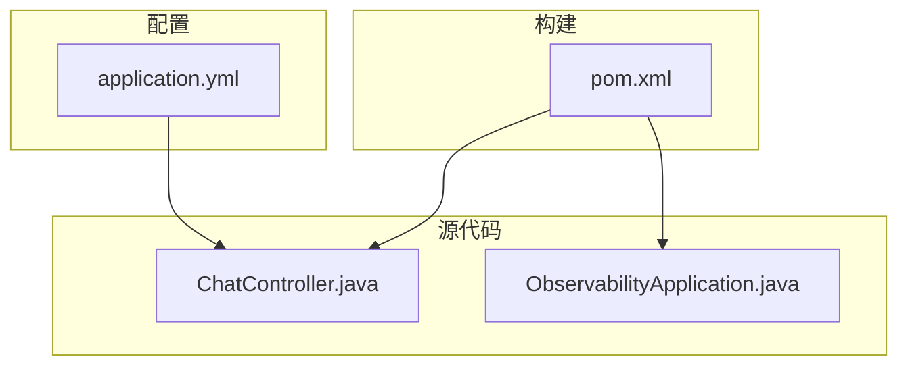
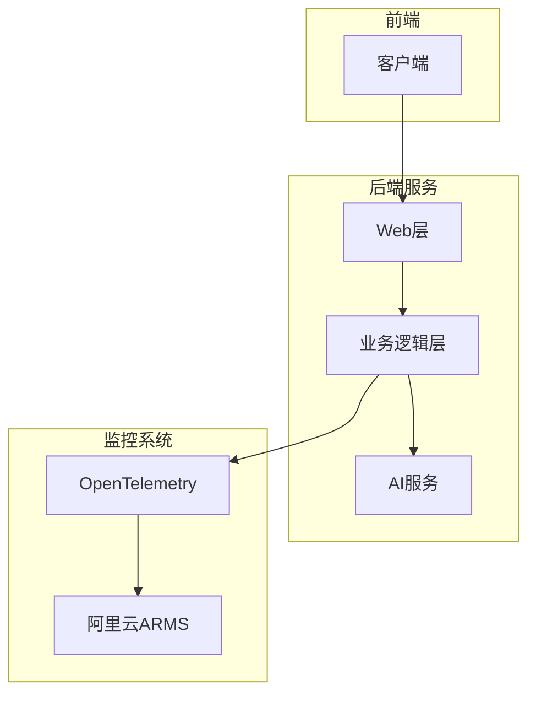
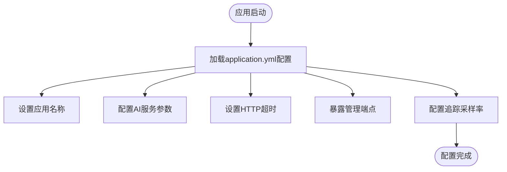
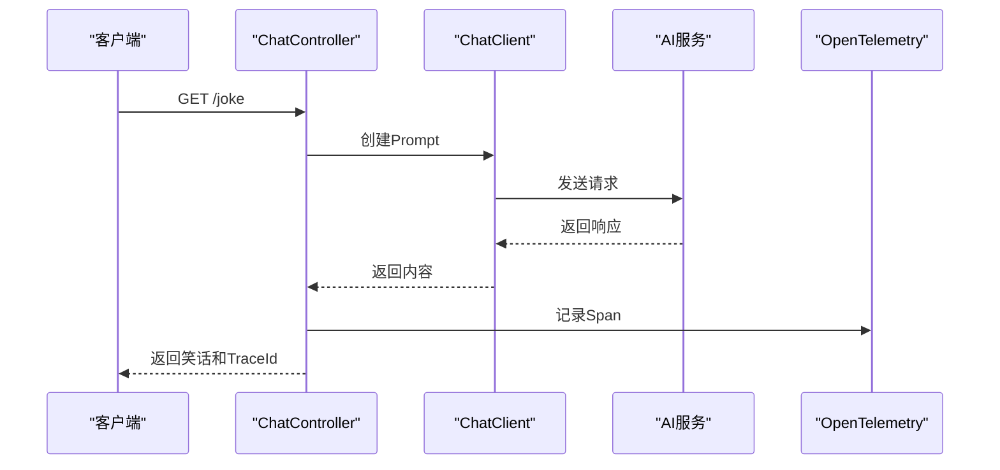
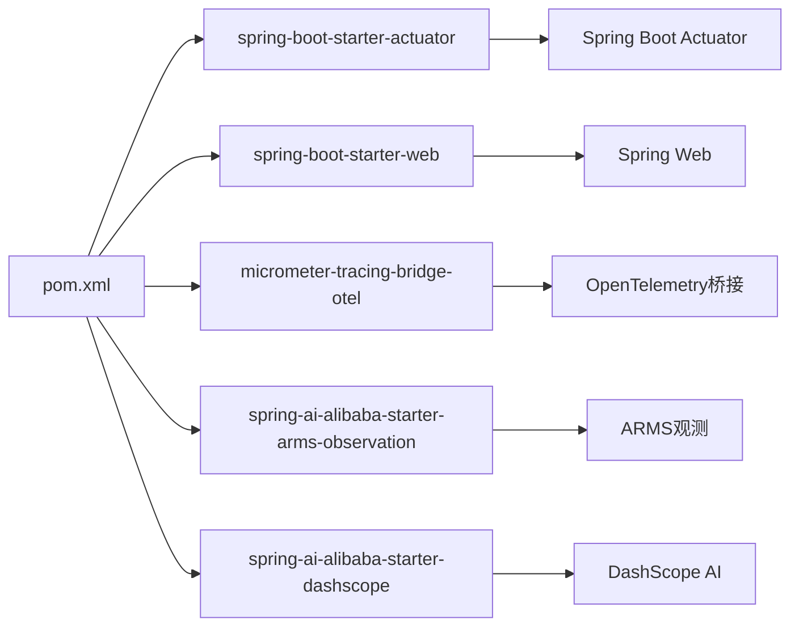

# ARMS集成

<cite>
**Referenced Files in This Document**   
- [application.yml](file://spring-ai-alibaba-observability-example/observability-arms-example/src/main/resources/application.yml)
- [pom.xml](file://spring-ai-alibaba-observability-example/observability-arms-example/pom.xml)
- [ChatController.java](file://spring-ai-alibaba-observability-example/observability-arms-example/src/main/java/com/alibaba/cloud/ai/example/observability/arms/controller/ChatController.java)
- [README.md](file://spring-ai-alibaba-observability-example/observability-arms-example/README.md)
</cite>

## 目录
1. [简介](#简介)
2. [项目结构](#项目结构)
3. [核心组件](#核心组件)
4. [架构概述](#架构概述)
5. [详细组件分析](#详细组件分析)
6. [依赖分析](#依赖分析)
7. [性能考虑](#性能考虑)
8. [故障排除指南](#故障排除指南)
9. [结论](#结论)

## 简介

本文档详细介绍了如何将Spring AI Alibaba应用与阿里云ARMS（Application Real-Time Monitoring Service）集成。文档重点阐述了在application.yml中配置ARMS所需的参数，提供了在pom.xml中添加ARMS SDK依赖的分步指南，并结合ChatController中的实际代码展示了监控数据的采集点和上报机制。通过本集成，开发者可以获得应用性能监控、调用链路追踪和异常诊断等能力。

**Section sources**
- [README.md](file://spring-ai-alibaba-observability-example/observability-arms-example/README.md)

## 项目结构

本项目结构清晰，主要包含配置文件、源代码和依赖管理文件。核心配置文件位于`src/main/resources/`目录下，主应用程序代码位于`src/main/java/`目录中，而项目依赖则通过根目录下的pom.xml文件进行管理。

**Diagram sources **
- [application.yml](file://spring-ai-alibaba-observability-example/observability-arms-example/src/main/resources/application.yml)
- [ChatController.java](file://spring-ai-alibaba-observability-example/observability-arms-example/src/main/java/com/alibaba/cloud/ai/example/observability/arms/controller/ChatController.java)
- [pom.xml](file://spring-ai-alibaba-observability-example/observability-arms-example/pom.xml)

**Section sources**
- [application.yml](file://spring-ai-alibaba-observability-example/observability-arms-example/src/main/resources/application.yml)
- [pom.xml](file://spring-ai-alibaba-observability-example/observability-arms-example/pom.xml)

## 核心组件

本项目的核心组件包括配置管理、ARMS监控集成和聊天功能实现。通过application.yml文件进行全局配置，利用ARMS SDK实现应用监控，并通过ChatController提供具体的业务功能。

**Section sources**
- [application.yml](file://spring-ai-alibaba-observability-example/observability-arms-example/src/main/resources/application.yml)
- [ChatController.java](file://spring-ai-alibaba-observability-example/observability-arms-example/src/main/java/com/alibaba/cloud/ai/example/observability/arms/controller/ChatController.java)

## 架构概述

本系统采用Spring Boot微服务架构，集成了阿里云ARMS进行应用性能监控。系统通过OpenTelemetry标准收集追踪数据，并将其上报至ARMS平台，实现对AI应用的全面可观测性。

**Diagram sources **
- [pom.xml](file://spring-ai-alibaba-observability-example/observability-arms-example/pom.xml)
- [ChatController.java](file://spring-ai-alibaba-observability-example/observability-arms-example/src/main/java/com/alibaba/cloud/ai/example/observability/arms/controller/ChatController.java)

## 详细组件分析

### 配置组件分析

#### 配置文件分析
本项目的application.yml文件配置了应用名称、AI服务参数、HTTP客户端超时设置以及管理端点的暴露。特别地，通过management.tracing.sampling.probability配置了追踪采样率为100%。

**Diagram sources **
- [application.yml](file://spring-ai-alibaba-observability-example/observability-arms-example/src/main/resources/application.yml)

**Section sources**
- [application.yml](file://spring-ai-alibaba-observability-example/observability-arms-example/src/main/resources/application.yml)

### 业务组件分析

#### ChatController分析
ChatController实现了简单的笑话生成API，通过Spring AI的ChatClient与大模型交互。该组件是监控数据的主要采集点，每次请求都会生成相应的追踪信息。

**Diagram sources **
- [ChatController.java](file://spring-ai-alibaba-observability-example/observability-arms-example/src/main/java/com/alibaba/cloud/ai/example/observability/arms/controller/ChatController.java)

**Section sources**
- [ChatController.java](file://spring-ai-alibaba-observability-example/observability-arms-example/src/main/java/com/alibaba/cloud/ai/example/observability/arms/controller/ChatController.java)

## 依赖分析

本项目依赖于Spring Boot生态系统和阿里云ARMS观测组件。通过pom.xml文件管理这些依赖关系，确保了项目的可维护性和可扩展性。

**Diagram sources **
- [pom.xml](file://spring-ai-alibaba-observability-example/observability-arms-example/pom.xml)

**Section sources**
- [pom.xml](file://spring-ai-alibaba-observability-example/observability-arms-example/pom.xml)

## 性能考虑

本项目通过配置HTTP客户端读取超时为60秒，确保了与AI服务交互时的稳定性。同时，通过设置追踪采样率为100%，可以全面收集应用的性能数据，便于后续分析和优化。

## 故障排除指南

当遇到ARMS集成问题时，首先检查Java Agent是否正确加载，确认arms.licenseKey、arms.appName和aliyun.javaagent.regionId等系统属性是否正确设置。同时，确保网络可以访问ARMS服务端点。

**Section sources**
- [README.md](file://spring-ai-alibaba-observability-example/observability-arms-example/README.md)

## 结论

通过本文档的指导，开发者可以成功将Spring AI Alibaba应用与阿里云ARMS集成，实现全面的应用性能监控。这种集成不仅提供了调用链路追踪能力，还为异常诊断和性能优化提供了有力支持。