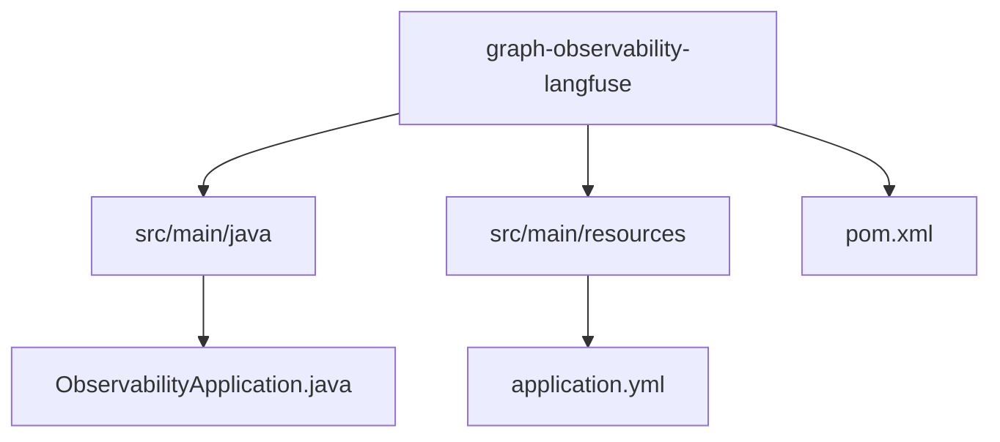
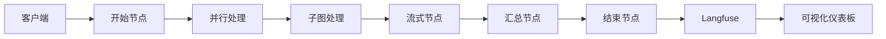
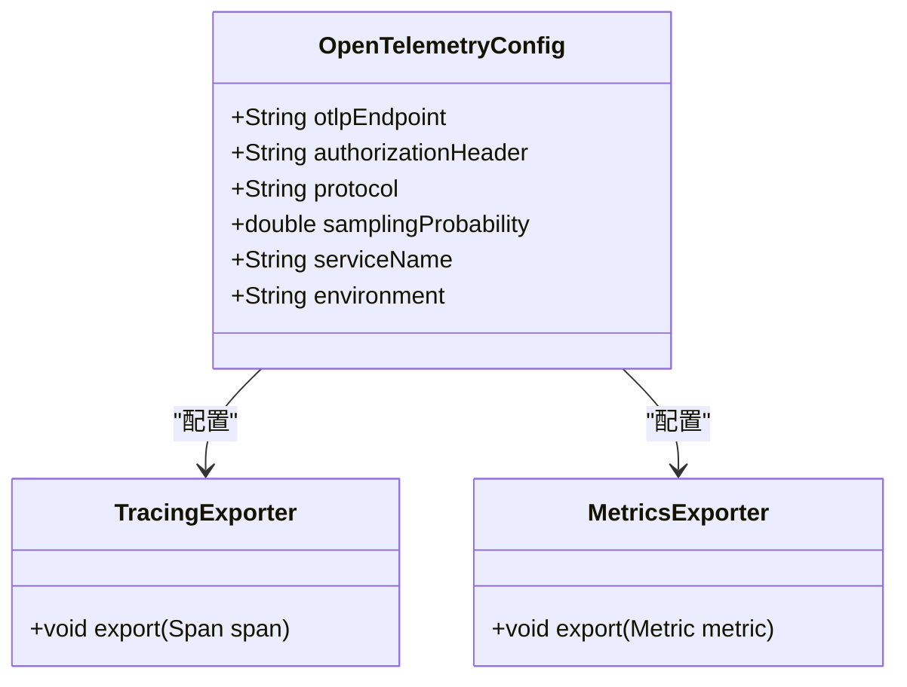
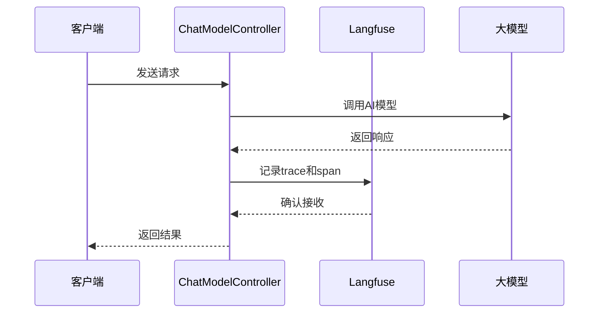
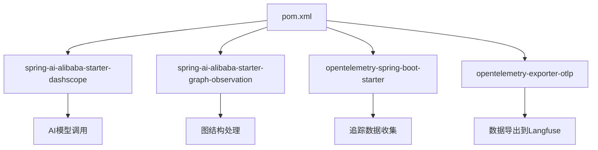

# Langfuse集成

<cite>
**本文档中引用的文件**  
- [application.yml](file://spring-ai-alibaba-graph-example/graph-observability-langfuse/src/main/resources/application.yml)
- [pom.xml](file://spring-ai-alibaba-graph-example/graph-observability-langfuse/pom.xml)
- [ObservabilityApplication.java](file://spring-ai-alibaba-graph-example/graph-observability-langfuse/src/main/java/com/alibaba/cloud/ai/graph/ObservabilityApplication.java)
- [ChatModelController.java](file://spring-ai-alibaba-observability-example/observability-langfuse-example/src/main/java/com/alibaba/cloud/ai/example/observability/controller/ChatModelController.java)
- [README.md](file://spring-ai-alibaba-graph-example/graph-observability-langfuse/README.md)
</cite>

## 目录
1. [简介](#简介)
2. [项目结构](#项目结构)
3. [核心组件](#核心组件)
4. [架构概述](#架构概述)
5. [详细组件分析](#详细组件分析)
6. [依赖分析](#依赖分析)
7. [性能考虑](#性能考虑)
8. [故障排除指南](#故障排除指南)
9. [结论](#结论)

## 简介
本文档详细介绍了如何将Spring AI Alibaba应用与Langfuse可观测性平台集成。通过配置`application.yml`中的参数（如`langfuse.secret-key`、`langfuse.public-key`、`langfuse.host`等），并添加必要的Maven依赖，开发者可以实现对LLM调用的全面追踪、Prompt版本管理、生成质量评估和成本分析。文档还结合实际代码示例，展示如何通过Langfuse注解或API标记和追踪AI调用。

## 项目结构
本项目位于`spring-ai-alibaba-graph-example/graph-observability-langfuse`目录下，主要包含以下部分：
- `src/main/java`: Java源码，包括启动类和控制器
- `src/main/resources`: 配置文件，如`application.yml`
- `pom.xml`: Maven依赖管理文件



**图示来源**
- [application.yml](file://spring-ai-alibaba-graph-example/graph-observability-langfuse/src/main/resources/application.yml)
- [ObservabilityApplication.java](file://spring-ai-alibaba-graph-example/graph-observability-langfuse/src/main/java/com/alibaba/cloud/ai/graph/ObservabilityApplication.java)

**本节来源**
- [application.yml](file://spring-ai-alibaba-graph-example/graph-observability-langfuse/src/main/resources/application.yml)
- [pom.xml](file://spring-ai-alibaba-graph-example/graph-observability-langfuse/pom.xml)

## 核心组件
本项目的核心是通过OpenTelemetry将AI调用数据导出到Langfuse平台。关键配置包括OTLP导出器的端点设置、认证信息以及追踪采样率。`ObservabilityApplication`作为主启动类，启用了图结构处理和观测功能。

**本节来源**
- [ObservabilityApplication.java](file://spring-ai-alibaba-graph-example/graph-observability-langfuse/src/main/java/com/alibaba/cloud/ai/graph/ObservabilityApplication.java)
- [application.yml](file://spring-ai-alibaba-graph-example/graph-observability-langfuse/src/main/resources/application.yml)

## 架构概述
系统架构基于Spring AI Alibaba Graph，结合Langfuse实现完整的可观测性。AI请求经过多个节点（并行、串行、子图、流式）处理，并通过OpenTelemetry收集追踪数据，最终发送至Langfuse进行可视化和分析。



**图示来源**
- [README.md](file://spring-ai-alibaba-graph-example/graph-observability-langfuse/README.md)

## 详细组件分析

### Langfuse配置分析
Langfuse可通过云端服务或自托管方式部署。若使用云端服务，需在[https://cloud.langfuse.com](https://cloud.langfuse.com)注册并生成API密钥；若自托管，则使用Docker部署。

#### 配置参数说明
```mermaid
flowchart TD
A[Langfuse配置] --> B[公钥和私钥]
A --> C[Base64编码]
A --> D[OTLP端点]
A --> E[认证头]
B --> F[生成凭证]
C --> G[echo -n \"public_key:secret_key\" | base64]
D --> H[https://cloud.langfuse.com/api/public/otel]
E --> I[Authorization: Basic ${YOUR_BASE64_ENCODED_CREDENTIALS}]
```

**图示来源**
- [application.yml](file://spring-ai-alibaba-graph-example/graph-observability-langfuse/src/main/resources/application.yml)
- [README.md](file://spring-ai-alibaba-graph-example/graph-observability-langfuse/README.md)

#### 数据导出管道配置


**图示来源**
- [application.yml](file://spring-ai-alibaba-graph-example/graph-observability-langfuse/src/main/resources/application.yml)

**本节来源**
- [application.yml](file://spring-ai-alibaba-graph-example/graph-observability-langfuse/src/main/resources/application.yml)
- [README.md](file://spring-ai-alibaba-graph-example/graph-observability-langfuse/README.md)

### AI调用追踪示例
通过`ChatModelController`可实现对AI调用的追踪。该控制器利用Langfuse的API自动记录每次调用的上下文、输入输出、耗时及成本信息。



**图示来源**
- [ChatModelController.java](file://spring-ai-alibaba-observability-example/observability-langfuse-example/src/main/java/com/alibaba/cloud/ai/example/observability/controller/ChatModelController.java)

**本节来源**
- [ChatModelController.java](file://spring-ai-alibaba-observability-example/observability-langfuse-example/src/main/java/com/alibaba/cloud/ai/example/observability/controller/ChatModelController.java)

## 依赖分析
项目通过Maven管理依赖，关键依赖包括：
- `spring-ai-alibaba-starter-dashscope`: 阿里云通义千问集成
- `spring-ai-alibaba-starter-graph-observation`: 图结构观测支持
- `opentelemetry-spring-boot-starter`: OpenTelemetry自动配置
- `opentelemetry-exporter-otlp`: OTLP协议导出器



**图示来源**
- [pom.xml](file://spring-ai-alibaba-graph-example/graph-observability-langfuse/pom.xml)

**本节来源**
- [pom.xml](file://spring-ai-alibaba-graph-example/graph-observability-langfuse/pom.xml)

## 性能考虑
为确保追踪数据的完整性，建议将采样率设为1.0（即100%采样）。同时，禁用日志导出以避免Langfuse平台不支持的问题。生产环境中可根据需要调整采样率以平衡性能与监控粒度。

## 故障排除指南
常见问题包括：
- **无法连接Langfuse**：检查`application.yml`中的OTLP端点和认证信息是否正确
- **追踪数据缺失**：确认`management.tracing.sampling.probability`是否设置为1.0
- **Base64编码错误**：使用正确的命令生成凭证，Windows用户可使用PowerShell命令

**本节来源**
- [README.md](file://spring-ai-alibaba-graph-example/graph-observability-langfuse/README.md)
- [application.yml](file://spring-ai-alibaba-graph-example/graph-observability-langfuse/src/main/resources/application.yml)

## 结论
通过集成Langfuse，Spring AI Alibaba应用能够获得强大的可观测性能力，涵盖LLM调用追踪、Prompt版本管理、生成质量评估和成本分析。开发者只需简单配置即可实现全面监控，极大提升了AI应用的可维护性和调试效率。