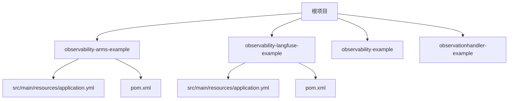
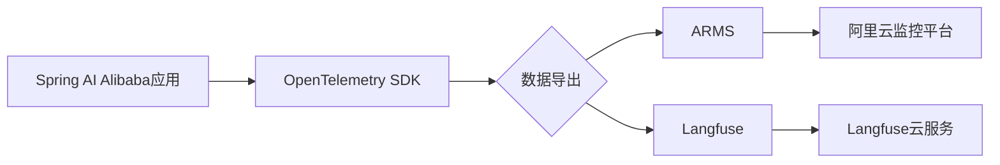
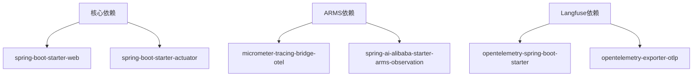

# 第三方工具集成

<cite>
**本文档中引用的文件**  
- [application.yml](file://spring-ai-alibaba-observability-example/observability-arms-example/src/main/resources/application.yml)
- [application.yml](file://spring-ai-alibaba-observability-example/observability-langfuse-example/src/main/resources/application.yml)
- [pom.xml](file://spring-ai-alibaba-observability-example/observability-arms-example/pom.xml)
- [pom.xml](file://spring-ai-alibaba-observability-example/observability-langfuse-example/pom.xml)
- [ObservabilityApplication.java](file://spring-ai-alibaba-observability-example/observability-arms-example/src/main/java/com/alibaba/cloud/ai/example/observability/arms/ObservabilityApplication.java)
- [ObservabilityApplication.java](file://spring-ai-alibaba-observability-example/observability-langfuse-example/src/main/java/com/alibaba/cloud/ai/example/observability/ObservabilityApplication.java)
</cite>

## 目录
1. [简介](#简介)
2. [项目结构](#项目结构)
3. [核心组件](#核心组件)
4. [架构概览](#架构概览)
5. [详细组件分析](#详细组件分析)
6. [依赖分析](#依赖分析)
7. [性能考虑](#性能考虑)
8. [故障排除指南](#故障排除指南)
9. [结论](#结论)

## 简介
本文档详细介绍了如何将Spring AI Alibaba应用与外部监控平台ARMS和Langfuse集成。重点涵盖在`application.yml`中配置ARMS和Langfuse的具体参数，包括API密钥、服务端点和采样率。提供分步指南，说明如何添加必要的依赖项并配置数据导出管道。为初学者提供简单示例，同时为高级开发者提供自定义数据过滤、批处理上传和错误重试策略等高级配置选项。解释这些工具集成的优势，以及它们如何提供比基础监控更深入的洞察，如用户行为分析和调用链路可视化。

## 项目结构
Spring AI Alibaba的可观测性示例项目包含多个子模块，分别用于演示与不同监控平台的集成。主要模块包括`observability-arms-example`和`observability-langfuse-example`，每个模块都包含独立的`pom.xml`和`application.yml`配置文件。项目采用标准的Maven多模块结构，便于管理和扩展。



**图示来源**  
- [pom.xml](file://spring-ai-alibaba-observability-example/observability-arms-example/pom.xml)
- [pom.xml](file://spring-ai-alibaba-observability-example/observability-langfuse-example/pom.xml)

**本节来源**  
- [pom.xml](file://spring-ai-alibaba-observability-example/observability-arms-example/pom.xml)
- [pom.xml](file://spring-ai-alibaba-observability-example/observability-langfuse-example/pom.xml)

## 核心组件
核心组件包括ARMS和Langfuse的配置文件、依赖项和启动类。`application.yml`文件中定义了监控相关的配置参数，如API密钥、服务端点和采样率。`pom.xml`文件中声明了必要的依赖项，确保应用能够与外部监控平台通信。启动类通过Spring Boot的自动配置机制初始化监控功能。

**本节来源**  
- [application.yml](file://spring-ai-alibaba-observability-example/observability-arms-example/src/main/resources/application.yml)
- [application.yml](file://spring-ai-alibaba-observability-example/observability-langfuse-example/src/main/resources/application.yml)
- [pom.xml](file://spring-ai-alibaba-observability-example/observability-arms-example/pom.xml)
- [pom.xml](file://spring-ai-alibaba-observability-example/observability-langfuse-example/pom.xml)

## 架构概览
系统架构基于Spring Boot和OpenTelemetry，通过Micrometer Tracing桥接器将监控数据导出到ARMS和Langfuse。ARMS集成使用`micrometer-tracing-bridge-otel`和`spring-ai-alibaba-starter-arms-observation`依赖，而Langfuse集成使用`opentelemetry-spring-boot-starter`和`opentelemetry-exporter-otlp`依赖。监控数据通过OTLP协议发送到指定的服务端点。



**图示来源**  
- [pom.xml](file://spring-ai-alibaba-observability-example/observability-arms-example/pom.xml)
- [pom.xml](file://spring-ai-alibaba-observability-example/observability-langfuse-example/pom.xml)
- [application.yml](file://spring-ai-alibaba-observability-example/observability-langfuse-example/src/main/resources/application.yml)

## 详细组件分析

### ARMS集成分析
ARMS集成通过配置`application.yml`中的`management.tracing.sampling.probability`参数来控制采样率，并使用环境变量`AI_DASHSCOPE_API_KEY`和`WEATHER_API_KEY`来管理API密钥。`pom.xml`中声明了`spring-ai-alibaba-starter-arms-observation`依赖，确保应用能够与ARMS平台通信。

#### 配置示例
```yaml
management:
  tracing:
    sampling:
      probability: 1.0
```

**图示来源**  
- [application.yml](file://spring-ai-alibaba-observability-example/observability-arms-example/src/main/resources/application.yml)

### Langfuse集成分析
Langfuse集成通过OpenTelemetry的OTLP导出器将监控数据发送到Langfuse平台。`application.yml`中配置了`otel.exporter.otlp.endpoint`和`Authorization`头信息，确保数据能够安全传输。`pom.xml`中声明了`opentelemetry-spring-boot-starter`和`opentelemetry-exporter-otlp`依赖。

#### 配置示例
```yaml
otel:
  exporter:
    otlp:
      endpoint: "https://cloud.langfuse.com/api/public/otel"
      headers:
        Authorization: "Basic ${YOUR_BASE64_ENCODED_CREDENTIALS}"
```

**图示来源**  
- [application.yml](file://spring-ai-alibaba-observability-example/observability-langfuse-example/src/main/resources/application.yml)
- [pom.xml](file://spring-ai-alibaba-observability-example/observability-langfuse-example/pom.xml)

**本节来源**  
- [application.yml](file://spring-ai-alibaba-observability-example/observability-langfuse-example/src/main/resources/application.yml)
- [pom.xml](file://spring-ai-alibaba-observability-example/observability-langfuse-example/pom.xml)

## 依赖分析
项目依赖分为核心依赖和监控依赖。核心依赖包括`spring-boot-starter-web`和`spring-boot-starter-actuator`，用于构建Web应用和提供监控端点。监控依赖根据目标平台不同而有所区别：ARMS使用`micrometer-tracing-bridge-otel`和`spring-ai-alibaba-starter-arms-observation`，Langfuse使用`opentelemetry-spring-boot-starter`和`opentelemetry-exporter-otlp`。



**图示来源**  
- [pom.xml](file://spring-ai-alibaba-observability-example/observability-arms-example/pom.xml)
- [pom.xml](file://spring-ai-alibaba-observability-example/observability-langfuse-example/pom.xml)

**本节来源**  
- [pom.xml](file://spring-ai-alibaba-observability-example/observability-arms-example/pom.xml)
- [pom.xml](file://spring-ai-alibaba-observability-example/observability-langfuse-example/pom.xml)

## 性能考虑
在配置监控时，采样率是一个关键性能参数。设置`management.tracing.sampling.probability`为1.0表示记录所有请求，适用于调试环境，但在生产环境中应降低采样率以减少性能开销。此外，批量上传和错误重试策略可以通过配置OpenTelemetry的导出器来实现，确保在网络不稳定时数据不会丢失。

## 故障排除指南
常见问题包括API密钥无效、服务端点不可达和数据采样率过低。确保环境变量正确设置，服务端点URL有效，并根据需要调整采样率。使用`/actuator/health`端点检查应用健康状态，使用`/actuator/metrics`查看监控数据上报情况。

**本节来源**  
- [application.yml](file://spring-ai-alibaba-observability-example/observability-arms-example/src/main/resources/application.yml)
- [application.yml](file://spring-ai-alibaba-observability-example/observability-langfuse-example/src/main/resources/application.yml)

## 结论
通过集成ARMS和Langfuse，Spring AI Alibaba应用可以获得更深入的可观测性洞察。ARMS适合阿里云环境下的监控，而Langfuse提供了更灵活的开源监控解决方案。合理配置采样率和数据导出策略，可以在性能和监控深度之间取得平衡，帮助开发者更好地理解和优化应用行为。