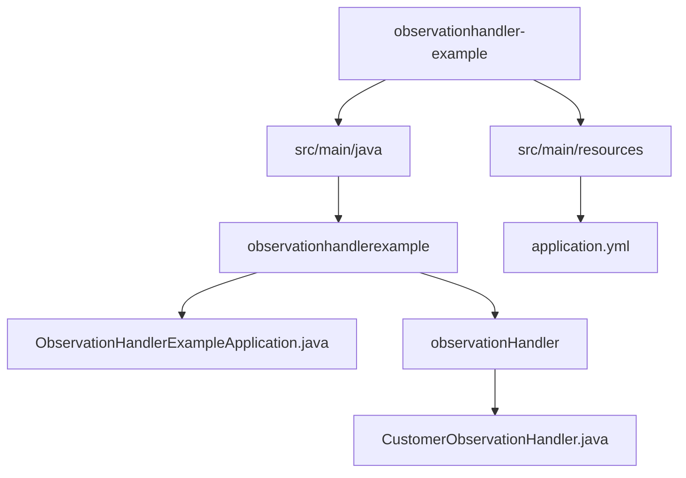
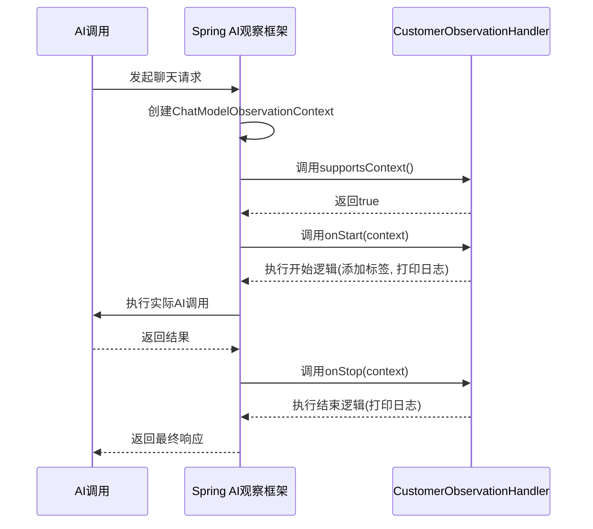
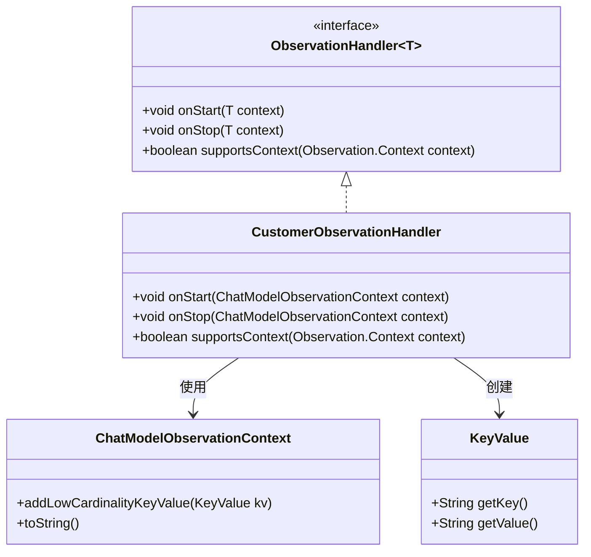
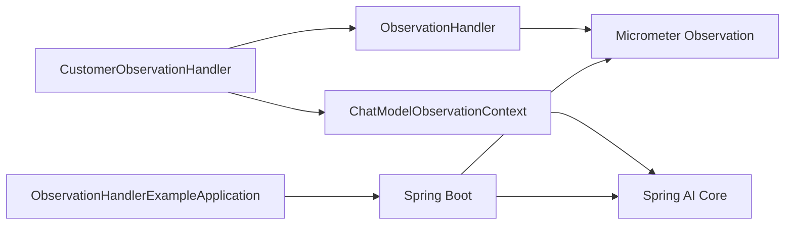

# 自定义观察处理器

<cite>
**本文档中引用的文件**  
- [CustomerObservationHandler.java](file://spring-ai-alibaba-observability-example/observationhandler-example/src/main/java/com/alibaba/cloud/ai/observationhandlerexample/observationHandler/CustomerObservationHandler.java)
- [ObservationHandlerExampleApplication.java](file://spring-ai-alibaba-observability-example/observationhandler-example/src/main/java/com/alibaba/cloud/ai/observationhandlerexample/ObservationHandlerExampleApplication.java)
- [application.yml](file://spring-ai-alibaba-observability-example/observationhandler-example/src/main/resources/application.yml)
</cite>

## 目录
1. [简介](#简介)
2. [项目结构](#项目结构)
3. [核心组件](#核心组件)
4. [架构概述](#架构概述)
5. [详细组件分析](#详细组件分析)
6. [依赖分析](#依赖分析)
7. [性能考虑](#性能考虑)
8. [故障排除指南](#故障排除指南)
9. [结论](#结论)

## 简介
本文档旨在深入讲解如何在Spring AI框架中开发自定义的观察处理器（Observation Handler），以`CustomerObservationHandler`为例，详细阐述其设计原理、实现逻辑以及注册机制。文档将为初学者提供可复用的模板代码，同时为高级开发者介绍处理器链构建、异步数据处理和性能优化等进阶主题。通过本指南，开发者可以扩展Spring AI的可观测性能力，满足特定业务场景下的监控需求，如提取上下文信息、生成自定义指标或触发外部告警系统。

## 项目结构
本示例项目位于`spring-ai-alibaba-observability-example/observationhandler-example`目录下，遵循标准的Spring Boot项目结构。核心代码位于`src/main/java/com/alibaba/cloud/ai/observationhandlerexample`包中，其中`observationHandler`子包专门存放自定义观察处理器的实现。



**Diagram sources**
- [CustomerObservationHandler.java](file://spring-ai-alibaba-observability-example/observationhandler-example/src/main/java/com/alibaba/cloud/ai/observationhandlerexample/observationHandler/CustomerObservationHandler.java)
- [ObservationHandlerExampleApplication.java](file://spring-ai-alibaba-observability-example/observationhandler-example/src/main/java/com/alibaba/cloud/ai/observationhandlerexample/ObservationHandlerExampleApplication.java)
- [application.yml](file://spring-ai-alibaba-observability-example/observationhandler-example/src/main/resources/application.yml)

**Section sources**
- [CustomerObservationHandler.java](file://spring-ai-alibaba-observability-example/observationhandler-example/src/main/java/com/alibaba/cloud/ai/observationhandlerexample/observationHandler/CustomerObservationHandler.java)
- [ObservationHandlerExampleApplication.java](file://spring-ai-alibaba-observability-example/observationhandler-example/src/main/java/com/alibaba/cloud/ai/observationhandlerexample/ObservationHandlerExampleApplication.java)
- [application.yml](file://spring-ai-alibaba-observability-example/observationhandler-example/src/main/resources/application.yml)

## 核心组件
本项目的核心组件是`CustomerObservationHandler`，它实现了`ObservationHandler<ChatModelObservationContext>`接口，用于拦截与聊天模型相关的AI调用事件。该处理器在观察（Observation）的生命周期关键点（如开始和结束）执行自定义逻辑，并能根据上下文类型决定是否处理该事件。

**Section sources**
- [CustomerObservationHandler.java](file://spring-ai-alibaba-observability-example/observationhandler-example/src/main/java/com/alibaba/cloud/ai/observationhandlerexample/observationHandler/CustomerObservationHandler.java)

## 架构概述
该示例展示了Spring AI可观测性框架的扩展机制。当AI模型（如聊天模型）执行时，框架会创建一个`ChatModelObservationContext`并触发一系列注册的`ObservationHandler`。`CustomerObservationHandler`作为其中一个处理器，被纳入这个处理链中。它通过实现`onStart`和`onStop`方法，在AI调用的前后注入自定义行为，例如添加监控标签、记录日志或上报指标。



**Diagram sources**
- [CustomerObservationHandler.java](file://spring-ai-alibaba-observability-example/observationhandler-example/src/main/java/com/alibaba/cloud/ai/observationhandlerexample/observationHandler/CustomerObservationHandler.java)

## 详细组件分析

### CustomerObservationHandler 分析
`CustomerObservationHandler`是自定义观察处理器的具体实现，它深度集成到Spring AI的观察生命周期中。

#### 实现逻辑
该处理器的核心逻辑围绕三个方法展开：
1.  **`supportsContext`**: 这是处理器的“守门员”方法。它检查传入的`Observation.Context`是否为`ChatModelObservationContext`的实例。只有当返回`true`时，框架才会调用该处理器的`onStart`和`onStop`方法。
2.  **`onStart`**: 在AI调用开始时被调用。在此方法中，处理器向`context`添加了一个低基数的键值对（`test lowcardinality Key` -> `test lowcardinality value`），这可以用于后续的监控系统进行分组和聚合。同时，它会打印一条日志，表明处理器已被触发。
3.  **`onStop`**: 在AI调用结束后被调用。此方法同样会打印一条日志，可用于记录调用完成、计算耗时或进行资源清理。



**Diagram sources**
- [CustomerObservationHandler.java](file://spring-ai-alibaba-observability-example/observationhandler-example/src/main/java/com/alibaba/cloud/ai/observationhandlerexample/observationHandler/CustomerObservationHandler.java)

**Section sources**
- [CustomerObservationHandler.java](file://spring-ai-alibaba-observability-example/observationhandler-example/src/main/java/com/alibaba/cloud/ai/observationhandlerexample/observationHandler/CustomerObservationHandler.java)

### 简单的自定义处理器模板
对于初学者，可以基于以下模板创建自己的观察处理器：

```java
import io.micrometer.common.KeyValue;
import io.micrometer.observation.ObservationHandler;
import org.springframework.ai.chat.observation.ChatModelObservationContext;

public class MyCustomObservationHandler implements ObservationHandler<ChatModelObservationContext> {

    @Override
    public void onStart(ChatModelObservationContext context) {
        // 在AI调用开始时执行的逻辑
        // 例如：添加业务相关的监控标签
        context.addLowCardinalityKeyValue(KeyValue.of("business.type", "customer.service"));
        System.out.println("AI调用开始，请求ID: " + context.getObservation().getContextualName());
    }

    @Override
    public void onStop(ChatModelObservationContext context) {
        // 在AI调用结束时执行的逻辑
        // 例如：记录响应耗时或触发告警
        System.out.println("AI调用结束，耗时: " + context.getObservation().getTotalTime().toMillis() + "ms");
    }

    @Override
    public boolean supportsContext(Observation.Context context) {
        // 声明该处理器只处理聊天模型的观察上下文
        return context instanceof ChatModelObservationContext;
    }
}
```

### 高级主题

#### 处理器链的构建
Spring AI的观察系统支持多个处理器。它们会按照一定的顺序（通常由Spring的`@Order`注解或Bean的注册顺序决定）形成一个处理链。每个处理器都可以独立地决定是否处理当前上下文。这种设计允许将不同的监控职责（如日志记录、指标上报、链路追踪）解耦到不同的处理器中。

#### 异步数据处理
在`onStart`或`onStop`方法中，应避免执行耗时的阻塞操作（如网络请求），以免影响AI调用的性能。对于需要异步处理的任务（如将数据上报到远程监控系统），应使用独立的线程池或响应式编程模型（如Project Reactor的`Mono`/`Flux`）来处理。

#### 性能优化技巧
- **选择合适的键值类型**：使用`addLowCardinalityKeyValue`添加基数较低（值种类少）的标签，这有助于监控系统高效地进行索引和聚合。避免使用高基数的值（如用户ID、会话ID）作为标签。
- **轻量级实现**：确保`onStart`和`onStop`方法的执行非常迅速，只做必要的工作。
- **条件处理**：通过`supportsContext`方法精确过滤，避免对不相关的观察事件进行不必要的处理。

## 依赖分析
本项目依赖于Spring Boot和Spring AI的核心库，特别是其可观测性模块（基于Micrometer Observation）。`CustomerObservationHandler`直接依赖于`io.micrometer.observation`和`org.springframework.ai.chat.observation`包中的类。



**Diagram sources**
- [CustomerObservationHandler.java](file://spring-ai-alibaba-observability-example/observationhandler-example/src/main/java/com/alibaba/cloud/ai/observationhandlerexample/observationHandler/CustomerObservationHandler.java)
- [ObservationHandlerExampleApplication.java](file://spring-ai-alibaba-observability-example/observationhandler-example/src/main/java/com/alibaba/cloud/ai/observationhandlerexample/ObservationHandlerExampleApplication.java)

**Section sources**
- [CustomerObservationHandler.java](file://spring-ai-alibaba-observability-example/observationhandler-example/src/main/java/com/alibaba/cloud/ai/observationhandlerexample/observationHandler/CustomerObservationHandler.java)
- [ObservationHandlerExampleApplication.java](file://spring-ai-alibaba-observability-example/observationhandler-example/src/main/java/com/alibaba/cloud/ai/observationhandlerexample/ObservationHandlerExampleApplication.java)

## 性能考虑
自定义观察处理器的性能至关重要，因为它们直接嵌入到AI调用的关键路径中。任何在`onStart`或`onStop`方法中的延迟都会直接增加AI调用的端到端延迟。因此，必须确保处理器的实现是轻量级的，并且避免同步的I/O操作。对于复杂的监控逻辑，应采用异步非阻塞的方式进行。

## 故障排除指南
如果自定义处理器未被调用，请检查以下几点：
1.  **Bean注册**：确保`CustomerObservationHandler`已被Spring容器管理（例如，通过`@Component`注解或在配置类中通过`@Bean`方法声明）。
2.  **上下文匹配**：确认`supportsContext`方法的逻辑正确，能够匹配到实际产生的观察上下文类型。
3.  **配置启用**：检查`application.yml`中是否启用了相关的观察功能（如`spring.ai.observations`配置）。

**Section sources**
- [CustomerObservationHandler.java](file://spring-ai-alibaba-observability-example/observationhandler-example/src/main/java/com/alibaba/cloud/ai/observationhandlerexample/observationHandler/CustomerObservationHandler.java)
- [application.yml](file://spring-ai-alibaba-observability-example/observationhandler-example/src/main/resources/application.yml)

## 结论
通过实现`ObservationHandler`接口，开发者可以轻松地扩展Spring AI的可观测性功能。`CustomerObservationHandler`示例展示了如何拦截AI调用、提取上下文信息并执行自定义监控逻辑。通过遵循最佳实践，如构建处理器链、进行异步处理和性能优化，开发者可以创建出既强大又高效的监控解决方案，以满足各种复杂的业务需求。