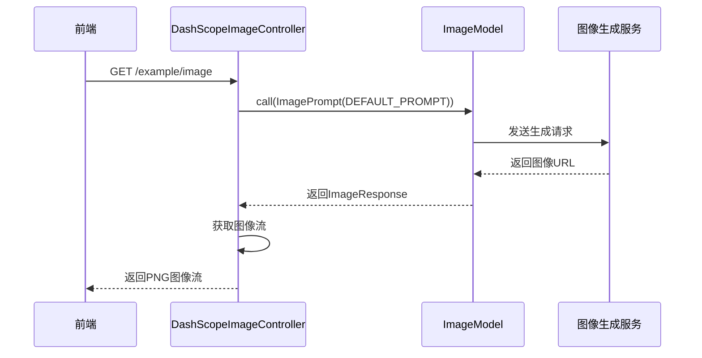
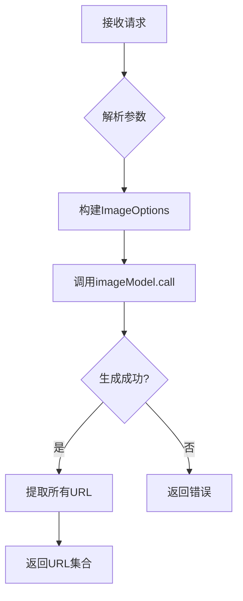

# 图像处理

<cite>
**本文档中引用的文件**
- [DashScopeImageController.java](file://spring-ai-alibaba-image-example/dashscope-image/src/main/java/com/alibaba/cloud/ai/example/image/dashscope/controller/DashScopeImageController.java)
- [application.yml](file://spring-ai-alibaba-image-example/dashscope-image/src/main/resources/application.yml)
</cite>

## 目录
1. [简介](#简介)
2. [项目结构](#项目结构)
3. [核心组件](#核心组件)
4. [图像生成功能详解](#图像生成功能详解)
5. [图像分析功能说明](#图像分析功能说明)
6. [配置与集成指南](#配置与集成指南)
7. [错误处理与最佳实践](#错误处理与最佳实践)

## 简介
本文档旨在为开发者提供关于文生图（Text-to-Image）和图像分析功能的详细技术文档。以 `DashScopeImageController` 为核心示例，全面阐述如何通过 API 调用实现图像生成与理解能力。文档涵盖提示词定义、图像参数配置、异步响应处理及前端展示方案，并提供完整的配置与集成指导，帮助开发者快速将 AI 图像处理能力集成至其应用中。

## 项目结构
本图像处理模块位于 `spring-ai-alibaba-image-example` 示例项目中，采用标准的 Spring Boot 项目结构。核心控制器 `DashScopeImageController` 位于 `controller` 包下，负责处理所有图像相关的 HTTP 请求。配置文件 `application.yml` 存放于 `resources` 目录，用于管理应用级别的设置。

**Section sources**
- [DashScopeImageController.java](file://spring-ai-alibaba-image-example/dashscope-image/src/main/java/com/alibaba/cloud/ai/example/image/dashscope/controller/DashScopeImageController.java)
- [application.yml](file://spring-ai-alibaba-image-example/dashscope-image/src/main/resources/application.yml)

## 核心组件
`DashScopeImageController` 是图像处理功能的核心组件，它通过依赖注入获取 `ImageModel` 实例，该实例封装了与通义千问图像生成模型的交互逻辑。控制器提供了多个 RESTful 端点，分别对应不同的图像生成场景，如单图生成、多图生成和条件化图像生成。

**Section sources**
- [DashScopeImageController.java](file://spring-ai-alibaba-image-example/dashscope-image/src/main/java/com/alibaba/cloud/ai/example/image/dashscope/controller/DashScopeImageController.java#L25-L35)

## 图像生成功能详解
### 单图生成
`/example/image` 端点实现了最基础的图像生成功能。它使用预设的提示词 `DEFAULT_PROMPT` 调用 `imageModel.call()` 方法。生成的图像以 PNG 流的形式直接写入 HTTP 响应体，前端可通过 `` 直接嵌入。



**Diagram sources**
- [DashScopeImageController.java](file://spring-ai-alibaba-image-example/dashscope-image/src/main/java/com/alibaba/cloud/ai/example/image/dashscope/controller/DashScopeImageController.java#L45-L60)

### 多图生成
`/example/image/multiPrompt` 端点支持从单个提示词生成多张图像。通过 `ImageOptionsBuilder` 构建包含数量（`N`）参数的选项对象，开发者可以指定一次生成的图像数量。该方法返回一个包含多个图像 URL 的集合，便于前端进行轮播或网格展示。



**Diagram sources**
- [DashScopeImageController.java](file://spring-ai-alibaba-image-example/dashscope-image/src/main/java/com/alibaba/cloud/ai/example/image/dashscope/controller/DashScopeImageController.java#L65-L78)

### 条件化图像生成
`/example/image/multipleConditions` 端点展示了如何通过组合多个条件来精确控制图像内容。它接收主题、环境、尺寸和风格等参数，动态构建详细的提示词（prompt）。此方法还演示了如何通过 `ImageOptions` 设置图像的精确尺寸。

**Section sources**
- [DashScopeImageController.java](file://spring-ai-alibaba-image-example/dashscope-image/src/main/java/com/alibaba/cloud/ai/example/image/dashscope/controller/DashScopeImageController.java#L83-L115)

## 图像分析功能说明
尽管当前示例代码主要聚焦于图像生成，但 `ImageModel` 接口的设计也支持图像分析功能。开发者可通过调用 `imageModel.call()` 并传入包含分析指令的提示词（例如 "描述这张图片的内容"）来实现图像理解。返回的 `ImageResponse` 对象中的文本输出将包含对图像内容的描述。

**Section sources**
- [DashScopeImageController.java](file://spring-ai-alibaba-image-example/dashscope-image/src/main/java/com/alibaba/cloud/ai/example/image/dashscope/controller/DashScopeImageController.java#L25)

## 配置与集成指南
### 环境配置
应用的核心配置位于 `application.yml` 文件中。必须设置 `spring.ai.dashscope.api-key` 属性，其值应通过环境变量 `AI_DASHSCOPE_API_KEY` 注入，以确保密钥安全。

```yaml
server:
  port: 10008

spring:
  application:
    name: spring-ai-alibaba-dashscope-image-example

  ai:
    dashscope:
      api-key: ${AI_DASHSCOPE_API_KEY}
```

**Section sources**
- [application.yml](file://spring-ai-alibaba-image-example/dashscope-image/src/main/resources/application.yml#L1-L11)

### 集成步骤
1.  **添加依赖**: 在 `pom.xml` 中引入 `spring-ai-dashscope-spring-boot-starter`。
2.  **配置API密钥**: 在运行环境中设置 `AI_DASHSCOPE_API_KEY` 环境变量。
3.  **创建控制器**: 定义一个 `@RestController`，注入 `ImageModel` bean。
4.  **调用模型**: 使用 `ImagePrompt` 和 `ImageOptions` 构造请求并调用 `imageModel.call()`。
5.  **处理响应**: 解析 `ImageResponse`，获取图像 URL 或分析结果。

## 错误处理与最佳实践
控制器中的 `multipleConditions` 方法展示了标准的错误处理模式。它使用 `try-catch` 块捕获所有异常，并返回包含错误信息、消息和时间戳的 JSON 响应，便于前端进行错误提示。最佳实践包括：使用默认值防止空参数、对用户输入进行验证、以及将敏感信息（如API密钥）与代码分离。

**Section sources**
- [DashScopeImageController.java](file://spring-ai-alibaba-image-example/dashscope-image/src/main/java/com/alibaba/cloud/ai/example/image/dashscope/controller/DashScopeImageController.java#L105-L115)