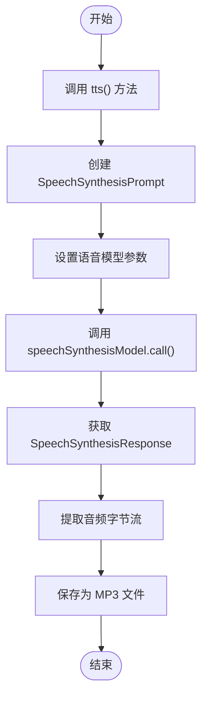
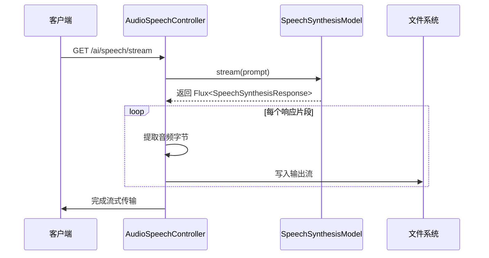
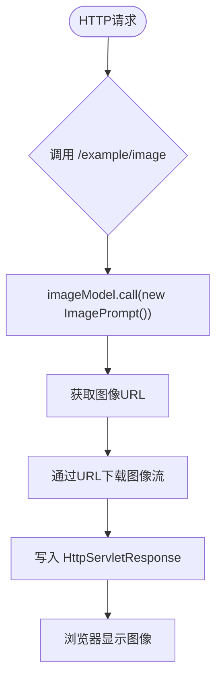
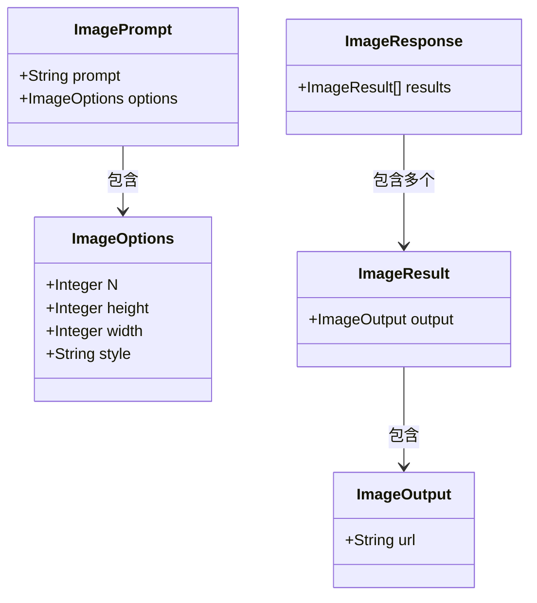
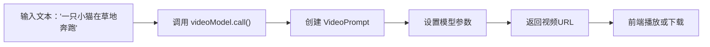
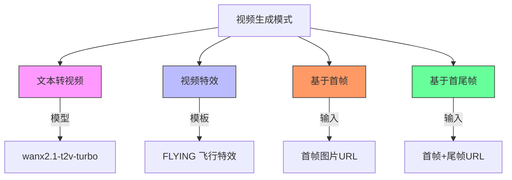

# 多模态示例

<cite>
**本文档中引用的文件**  
- [AudioSpeechController.java](file://spring-ai-alibaba-audio-example/dashscope-audio/src/main/java/com/alibaba/cloud/ai/example/audio/AudioSpeechController.java)
- [DashScopeImageController.java](file://spring-ai-alibaba-image-example/dashscope-image/src/main/java/com/alibaba/cloud/ai/example/image/dashscope/controller/DashScopeImageController.java)
- [VideoController.java](file://spring-ai-alibaba-video-example/dashscope-video/src/main/java/com/alibaba/cloud/ai/example/video/VideoController.java)
</cite>

## 目录
1. [简介](#简介)
2. [音频处理功能](#音频处理功能)
3. [图像处理功能](#图像处理功能)
4. [视频理解能力](#视频理解能力)
5. [多模态AI应用扩展](#多模态ai应用扩展)
6. [技术实现细节](#技术实现细节)
7. [总结](#总结)

## 简介
本示例文档旨在全面介绍多模态AI应用的核心功能，涵盖音频、图像和视频三大处理能力。通过具体代码实现，展示如何利用Spring AI与阿里云通义千问平台集成，构建支持语音合成（TTS）、图像生成与分析、视频内容理解的智能系统。文档为初学者提供概念性理解，同时为开发者提供技术细节参考。

## 音频处理功能

本模块重点介绍基于`AudioSpeechController`实现的语音合成（TTS）能力，支持同步与流式两种模式。

### 语音合成（TTS）
通过调用`SpeechSynthesisModel`接口，将文本转换为高质量语音输出。系统使用通义听悟提供的SAM-BERT语音模型，支持中文自然语音生成。

**图示来源**  
- [AudioSpeechController.java](file://spring-ai-alibaba-audio-example/dashscope-audio/src/main/java/com/alibaba/cloud/ai/example/audio/AudioSpeechController.java#L44-L78)

### 流式语音合成
支持流式响应处理，适用于大文本或实时语音播报场景。通过Reactor的`Flux`实现异步数据流处理，边生成边写入文件。

**图示来源**  
- [AudioSpeechController.java](file://spring-ai-alibaba-audio-example/dashscope-audio/src/main/java/com/alibaba/cloud/ai/example/audio/AudioSpeechController.java#L80-L110)

**本节来源**  
- [AudioSpeechController.java](file://spring-ai-alibaba-audio-example/dashscope-audio/src/main/java/com/alibaba/cloud/ai/example/audio/AudioSpeechController.java#L44-L134)

## 图像处理功能

本模块阐述基于`DashScopeImageController`实现的文生图与图像分析功能，支持多种生成条件组合。

### 文生图基础功能
通过`ImageModel`调用通义万相模型，将文本描述转换为图像。默认提示词为“为人工智能生成一张富有科技感的图片！”。

**图示来源**  
- [DashScopeImageController.java](file://spring-ai-alibaba-image-example/dashscope-image/src/main/java/com/alibaba/cloud/ai/example/image/dashscope/controller/DashScopeImageController.java#L58-L72)

### 多图生成与条件控制
支持单提示词生成多张图像，并可通过参数控制图像数量、尺寸、风格等属性。

**图示来源**  
- [DashScopeImageController.java](file://spring-ai-alibaba-image-example/dashscope-image/src/main/java/com/alibaba/cloud/ai/example/image/dashscope/controller/DashScopeImageController.java#L75-L124)

**本节来源**  
- [DashScopeImageController.java](file://spring-ai-alibaba-image-example/dashscope-image/src/main/java/com/alibaba/cloud/ai/example/image/dashscope/controller/DashScopeImageController.java#L44-L124)

## 视频理解能力

本模块介绍基于`VideoController`实现的视频生成能力，包括文本转视频、首帧生成、首尾帧控制等多种模式。

### 文本转视频
最基础的视频生成方式，输入文本描述即可生成动态视频内容。

**图示来源**  
- [VideoController.java](file://spring-ai-alibaba-video-example/dashscope-video/src/main/java/com/alibaba/cloud/ai/example/video/VideoController.java#L47-L54)

### 多种视频生成模式
支持四种不同的视频生成策略：

**图示来源**  
- [VideoController.java](file://spring-ai-alibaba-video-example/dashscope-video/src/main/java/com/alibaba/cloud/ai/example/video/VideoController.java#L47-L121)

**本节来源**  
- [VideoController.java](file://spring-ai-alibaba-video-example/dashscope-video/src/main/java/com/alibaba/cloud/ai/example/video/VideoController.java#L35-L121)

## 多模态AI应用扩展

传统文本聊天机器人仅能处理文字输入输出，而多模态系统显著扩展了其交互能力：

| 模态类型 | 传统能力 | 多模态扩展能力 |
|---------|--------|--------------|
| **文本** | 文字问答、对话 | 支持跨模态理解与生成 |
| **音频** | 不支持 | 语音合成、语音识别 |
| **图像** | 不支持 | 文生图、图像分析 |
| **视频** | 不支持 | 文本/图像转视频、视频理解 |

多模态系统能够：
- 将用户语音指令转换为文本并生成图像响应
- 分析上传的图像内容并生成描述性文字
- 根据文本描述生成动态视频内容
- 实现跨模态检索与推理

## 技术实现细节

### 媒体文件处理
- **上传**：通过HTTP请求参数传递图像URL或文本内容
- **下载**：直接流式写入`HttpServletResponse`输出流
- **存储**：本地临时目录用于保存TTS生成的音频文件

### 异步操作管理
- 使用`Flux`实现流式TTS，避免内存溢出
- `CountDownLatch`确保异步写入完成后再返回
- `@PreDestroy`注解清理临时生成文件

### 响应解析
- 统一使用`ResponseEntity`封装结构化响应
- 错误处理返回JSON格式错误信息
- 视频URL直接返回字符串，需及时下载（半小时内有效）

## 总结
本文档系统介绍了Spring AI集成阿里云通义千问平台的多模态能力，涵盖音频、图像、视频三大核心功能。通过具体控制器实现，展示了从文本到语音、图像、视频的生成流程，以及相应的技术细节与最佳实践。该架构为构建下一代智能应用提供了坚实基础，显著超越了传统文本聊天机器人的能力边界。