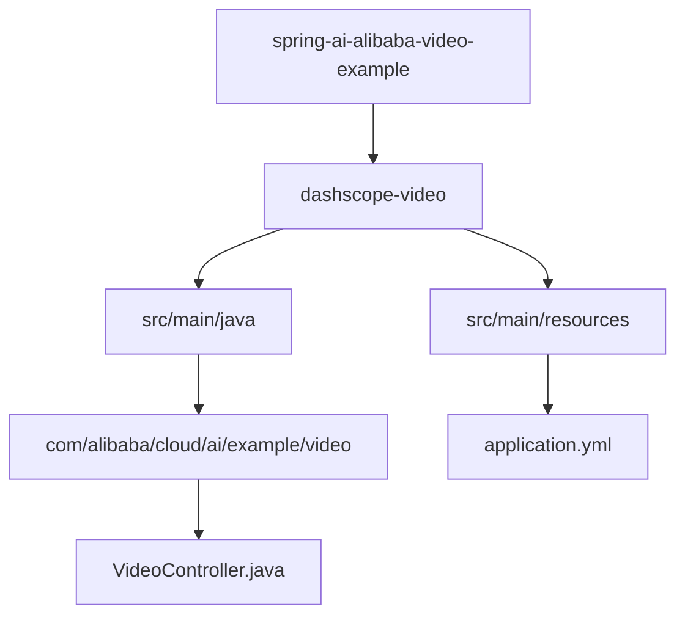
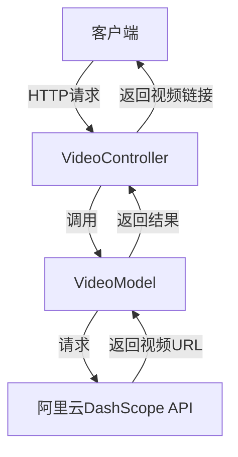
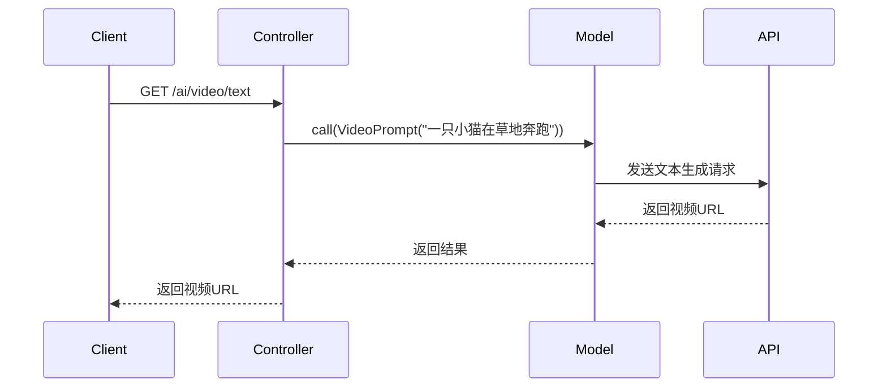
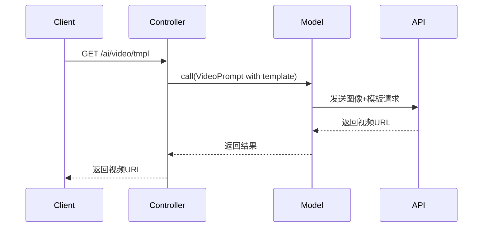
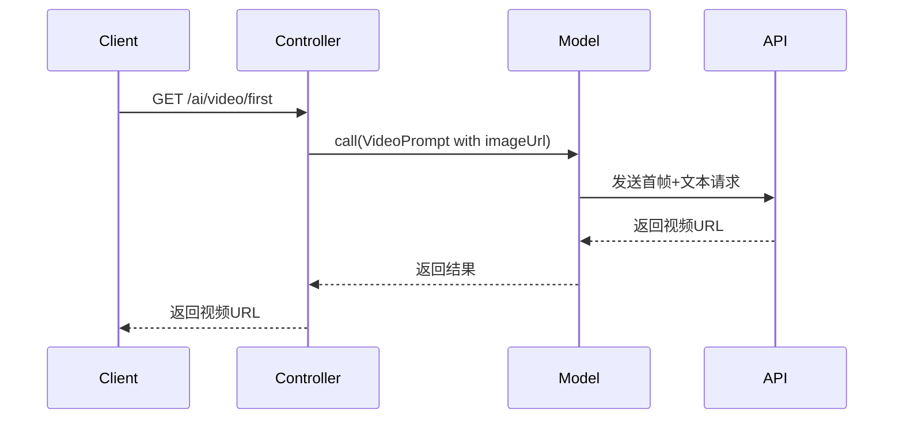
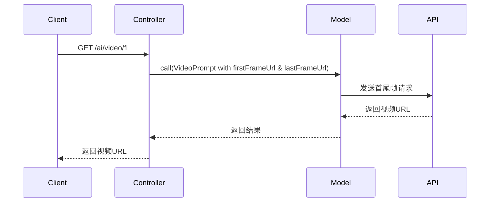
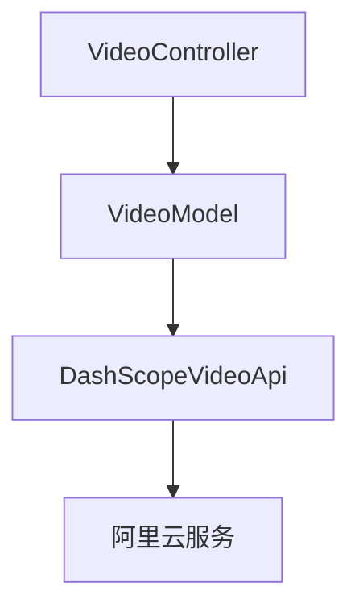

# 视频处理

<cite>
**本文档引用的文件**  
- [VideoController.java](file://spring-ai-alibaba-video-example/dashscope-video/src/main/java/com/alibaba/cloud/ai/example/video/VideoController.java)
- [application.yml](file://spring-ai-alibaba-video-example/dashscope-video/src/main/resources/application.yml)
</cite>

## 目录
1. [简介](#简介)
2. [项目结构](#项目结构)
3. [核心组件](#核心组件)
4. [架构概述](#架构概述)
5. [详细组件分析](#详细组件分析)
6. [依赖分析](#依赖分析)
7. [性能考虑](#性能考虑)
8. [故障排除指南](#故障排除指南)
9. [结论](#结论)

## 简介
本文档旨在为开发者提供关于视频理解（Video Understanding）能力的详细实现说明。基于 `VideoController` 类的代码，文档将解释如何提交视频文件或视频URL进行内容分析，如何处理长时间运行的视频分析任务（如轮询状态），以及如何解析返回的视频摘要、关键帧描述和时间戳信息。此外，文档涵盖API调用流程、支持的视频格式、超时配置和错误处理机制，并提供实际代码示例，帮助开发者构建能够“看懂”视频内容的AI应用。

## 项目结构
本项目位于 `spring-ai-alibaba-video-example/dashscope-video` 目录下，主要包含以下结构：
- `src/main/java/com/alibaba/cloud/ai/example/video/`：存放核心控制器类 `VideoController.java`
- `src/main/resources/`：包含配置文件 `application.yml`

该结构遵循标准的Spring Boot项目布局，便于模块化管理和扩展。

**Diagram sources**  
- [VideoController.java](file://spring-ai-alibaba-video-example/dashscope-video/src/main/java/com/alibaba/cloud/ai/example/video/VideoController.java)
- [application.yml](file://spring-ai-alibaba-video-example/dashscope-video/src/main/resources/application.yml)

**Section sources**  
- [VideoController.java](file://spring-ai-alibaba-video-example/dashscope-video/src/main/java/com/alibaba/cloud/ai/example/video/VideoController.java)
- [application.yml](file://spring-ai-alibaba-video-example/dashscope-video/src/main/resources/application.yml)

## 核心组件
`VideoController` 是本项目的核心组件，负责处理所有与视频生成相关的HTTP请求。它通过注入 `VideoModel` 实现对阿里云通义万相视频生成模型的调用。控制器提供了多个端点，支持文本到视频、图像到视频、基于首帧生成视频以及基于首尾帧生成视频等多种功能。

**Section sources**  
- [VideoController.java](file://spring-ai-alibaba-video-example/dashscope-video/src/main/java/com/alibaba/cloud/ai/example/video/VideoController.java)

## 架构概述
系统采用典型的Spring Boot Web架构，`VideoController` 作为RESTful API的入口，接收客户端请求并调用底层AI服务完成视频生成任务。整个流程无需中间存储，直接返回生成的视频URL供客户端下载使用。

**Diagram sources**  
- [VideoController.java](file://spring-ai-alibaba-video-example/dashscope-video/src/main/java/com/alibaba/cloud/ai/example/video/VideoController.java)

## 详细组件分析

### VideoController 分析
`VideoController` 提供了四个主要接口，分别对应不同的视频生成模式。

#### 文本到视频
通过 `/ai/video/text` 接口，用户可以输入一段描述性文本，系统将调用 `wanx2.1-t2v-turbo` 或 `wanx2.1-t2v-plus` 模型生成相应视频。

**Diagram sources**  
- [VideoController.java](file://spring-ai-alibaba-video-example/dashscope-video/src/main/java/com/alibaba/cloud/ai/example/video/VideoController.java#L38-L45)

#### 视频特效
通过 `/ai/video/tmpl` 接口，用户可上传图片并选择特效模板（如飞行效果），系统将生成带有特效的视频。

**Diagram sources**  
- [VideoController.java](file://spring-ai-alibaba-video-example/dashscope-video/src/main/java/com/alibaba/cloud/ai/example/video/VideoController.java#L54-L65)

#### 基于首帧生成视频
通过 `/ai/video/first` 接口，用户上传首帧图像并提供描述文本，系统将生成从该帧开始的动态视频。

**Diagram sources**  
- [VideoController.java](file://spring-ai-alibaba-video-example/dashscope-video/src/main/java/com/alibaba/cloud/ai/example/video/VideoController.java#L75-L88)

#### 基于首尾帧生成视频
通过 `/ai/video/fl` 接口，用户上传首帧和尾帧图像，系统将生成平滑过渡的视频。

**Diagram sources**  
- [VideoController.java](file://spring-ai-alibaba-video-example/dashscope-video/src/main/java/com/alibaba/cloud/ai/example/video/VideoController.java#L98-L113)

**Section sources**  
- [VideoController.java](file://spring-ai-alibaba-video-example/dashscope-video/src/main/java/com/alibaba/cloud/ai/example/video/VideoController.java)

## 依赖分析
项目依赖于阿里云DashScope视频API，通过 `VideoModel` 封装底层调用逻辑。配置文件 `application.yml` 定义了服务端口等基本信息。

**Diagram sources**  
- [VideoController.java](file://spring-ai-alibaba-video-example/dashscope-video/src/main/java/com/alibaba/cloud/ai/example/video/VideoController.java)
- [application.yml](file://spring-ai-alibaba-video-example/dashscope-video/src/main/resources/application.yml)

**Section sources**  
- [VideoController.java](file://spring-ai-alibaba-video-example/dashscope-video/src/main/java/com/alibaba/cloud/ai/example/video/VideoController.java)
- [application.yml](file://spring-ai-alibaba-video-example/dashscope-video/src/main/resources/application.yml)

## 性能考虑
- 生成的视频链接有效期为30分钟，建议客户端及时下载。
- `turbo` 模型速度快、性价比高；`plus` 模型细节更丰富但生成较慢，可根据需求选择。
- 所有图像需公网可访问，建议使用临时URL服务获取有效链接。

## 故障排除指南
- 若返回空URL，请检查输入图像链接是否可公网访问。
- 若调用失败，请确认API密钥及权限配置正确。
- 长时间无响应可能是网络问题，建议设置合理的超时时间。

**Section sources**  
- [VideoController.java](file://spring-ai-alibaba-video-example/dashscope-video/src/main/java/com/alibaba/cloud/ai/example/video/VideoController.java)

## 结论
本文档详细介绍了基于 `VideoController` 的视频理解功能实现方式。通过简单的REST接口，开发者即可集成强大的视频生成能力。未来可扩展支持视频上传分析、状态轮询、回调通知等功能，进一步提升用户体验。