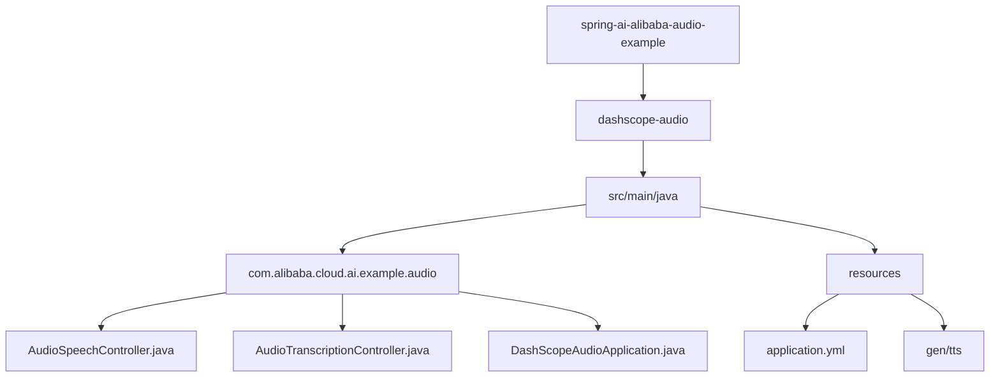
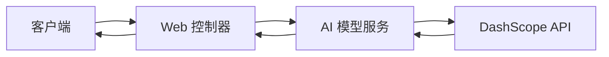
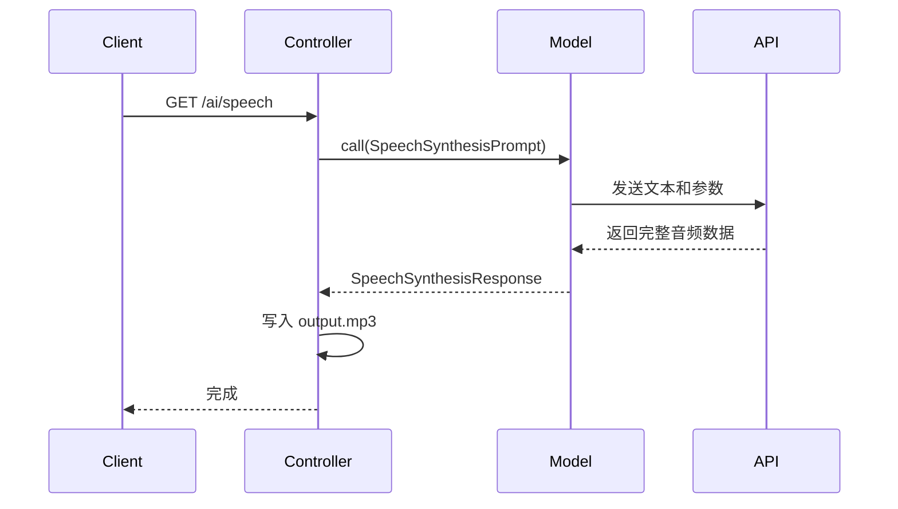
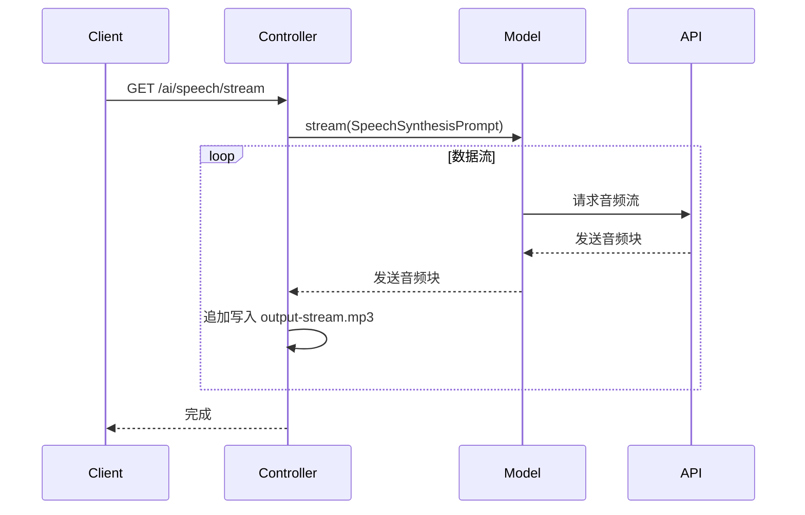
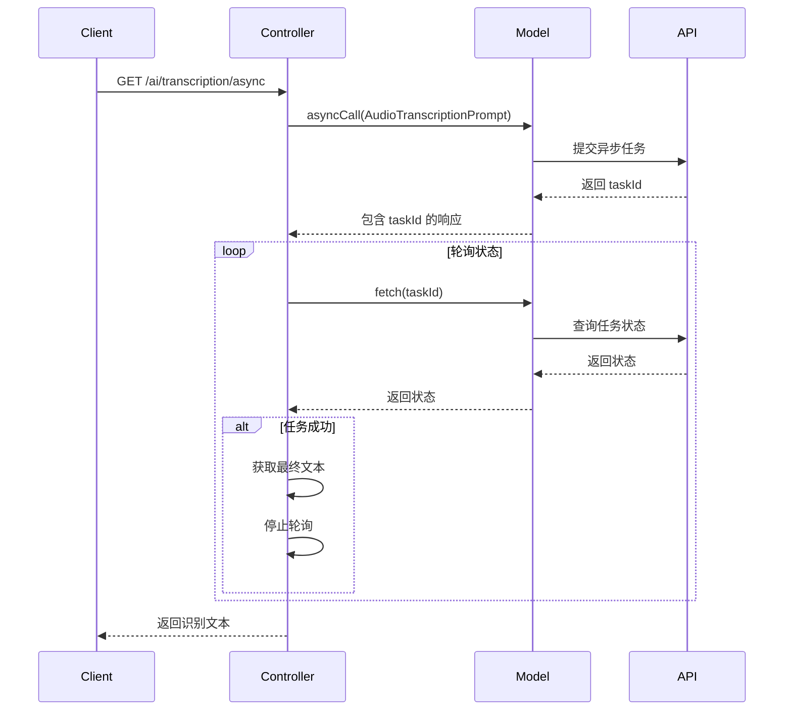
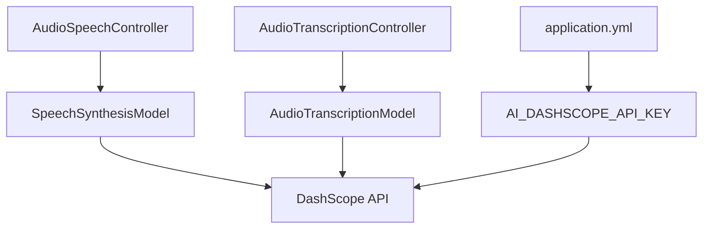

# 音频处理

<cite>
**本文档中引用的文件**  
- [AudioSpeechController.java](file://spring-ai-alibaba-audio-example/dashscope-audio/src/main/java/com/alibaba/cloud/ai/example/audio/AudioSpeechController.java)
- [AudioTranscriptionController.java](file://spring-ai-alibaba-audio-example/dashscope-audio/src/main/java/com/alibaba/cloud/ai/example/audio/AudioTranscriptionController.java)
- [application.yml](file://spring-ai-alibaba-audio-example/dashscope-audio/src/main/resources/application.yml)
- [DashScopeAudioApplication.java](file://spring-ai-alibaba-audio-example/dashscope-audio/src/main/java/com/alibaba/cloud/ai/example/audio/DashScopeAudioApplication.java)
</cite>

## 目录
1. [简介](#简介)
2. [项目结构](#项目结构)
3. [核心组件](#核心组件)
4. [架构概述](#架构概述)
5. [详细组件分析](#详细组件分析)
6. [依赖分析](#依赖分析)
7. [性能考虑](#性能考虑)
8. [故障排除指南](#故障排除指南)
9. [结论](#结论)

## 简介
本文档深入讲解基于 Spring Boot 的音频处理功能实现，重点围绕语音合成（Text-to-Speech, TTS）和语音识别（Speech-to-Text, STT）两大核心能力。通过分析 `AudioSpeechController` 和 `AudioTranscriptionController` 的代码实现，全面解析音频模型参数配置、音频文件上传与流式传输、异步音频任务管理以及音频响应解析等关键技术点。文档还涵盖相关配置选项、错误处理策略和性能优化建议，帮助开发者构建高效稳定的 AI 音频应用。

## 项目结构
本项目 `spring-ai-alibaba-audio-example` 是一个典型的 Spring Boot 应用，专注于演示阿里云百炼平台（DashScope）的音频处理能力。其结构清晰，主要包含控制器层、资源文件和配置文件。

**图示来源**  
- [AudioSpeechController.java](file://spring-ai-alibaba-audio-example/dashscope-audio/src/main/java/com/alibaba/cloud/ai/example/audio/AudioSpeechController.java)
- [AudioTranscriptionController.java](file://spring-ai-alibaba-audio-example/dashscope-audio/src/main/java/com/alibaba/cloud/ai/example/audio/AudioTranscriptionController.java)
- [application.yml](file://spring-ai-alibaba-audio-example/dashscope-audio/src/main/resources/application.yml)

**本节来源**
- [AudioSpeechController.java](file://spring-ai-alibaba-audio-example/dashscope-audio/src/main/java/com/alibaba/cloud/ai/example/audio/AudioSpeechController.java)
- [AudioTranscriptionController.java](file://spring-ai-alibaba-audio-example/dashscope-audio/src/main/java/com/alibaba/cloud/ai/example/audio/AudioTranscriptionController.java)
- [application.yml](file://spring-ai-alibaba-audio-example/dashscope-audio/src/main/resources/application.yml)

## 核心组件
本项目的核心功能由两个控制器类实现：`AudioSpeechController` 负责语音合成，将文本转换为语音；`AudioTranscriptionController` 负责语音识别，将语音转换为文本。这两个组件均依赖于 Spring AI Alibaba 提供的自动配置，通过注入 `SpeechSynthesisModel` 和 `AudioTranscriptionModel` 来与底层的 AI 模型进行交互。

**本节来源**
- [AudioSpeechController.java](file://spring-ai-alibaba-audio-example/dashscope-audio/src/main/java/com/alibaba/cloud/ai/example/audio/AudioSpeechController.java#L1-L20)
- [AudioTranscriptionController.java](file://spring-ai-alibaba-audio-example/dashscope-audio/src/main/java/com/alibaba/cloud/ai/example/audio/AudioTranscriptionController.java#L1-L20)

## 架构概述
该应用采用典型的分层架构，上层为 Web 控制器，中层为 AI 模型服务，底层为云平台 API。Spring Boot 应用启动后，通过 `application.yml` 中的配置初始化 AI 客户端。当 Web 请求到达时，控制器调用相应的模型服务，服务层将请求参数封装后发送至 DashScope API，并将返回的音频或文本结果返回给客户端。

**图示来源**
- [AudioSpeechController.java](file://spring-ai-alibaba-audio-example/dashscope-audio/src/main/java/com/alibaba/cloud/ai/example/audio/AudioSpeechController.java)
- [AudioTranscriptionController.java](file://spring-ai-alibaba-audio-example/dashscope-audio/src/main/java/com/alibaba/cloud/ai/example/audio/AudioTranscriptionController.java)
- [application.yml](file://spring-ai-alibaba-audio-example/dashscope-audio/src/main/resources/application.yml)

## 详细组件分析
本节将深入分析 `AudioSpeechController` 和 `AudioTranscriptionController` 的具体实现。

### 语音合成控制器分析
`AudioSpeechController` 提供了两种语音合成方式：同步和流式。

#### 同步语音合成
此方法通过 `tts()` 接口实现。它调用 `speechSynthesisModel.call()` 方法，传入包含待合成文本和模型选项的 `SpeechSynthesisPrompt`。该调用是阻塞的，直到整个音频生成完毕。返回的 `SpeechSynthesisResponse` 包含音频数据（`ByteBuffer`），代码将其写入指定的 MP3 文件。

**图示来源**
- [AudioSpeechController.java](file://spring-ai-alibaba-audio-example/dashscope-audio/src/main/java/com/alibaba/cloud/ai/example/audio/AudioSpeechController.java#L45-L65)

#### 流式语音合成
此方法通过 `/stream` 接口实现。它调用 `speechSynthesisModel.stream()` 方法，返回一个 `Flux<SpeechSynthesisResponse>`。这允许音频数据以流的形式分块接收。代码使用 `CountDownLatch` 等待流完成，并将每个接收到的数据块追加写入文件，实现边生成边保存。

**图示来源**
- [AudioSpeechController.java](file://spring-ai-alibaba-audio-example/dashscope-audio/src/main/java/com/alibaba/cloud/ai/example/audio/AudioSpeechController.java#L67-L98)

**本节来源**
- [AudioSpeechController.java](file://spring-ai-alibaba-audio-example/dashscope-audio/src/main/java/com/alibaba/cloud/ai/example/audio/AudioSpeechController.java#L1-L135)

### 语音识别控制器分析
`AudioTranscriptionController` 提供了三种语音识别方式：同步、流式和异步。

#### 同步语音识别
`stt()` 方法通过 `transcriptionModel.call()` 对本地音频文件进行识别。它创建一个 `FileSystemResource` 指向音频文件，并将其与模型选项一起封装进 `AudioTranscriptionPrompt`。调用完成后，直接返回识别出的文本。

**本节来源**
- [AudioTranscriptionController.java](file://spring-ai-alibaba-audio-example/dashscope-audio/src/main/java/com/alibaba/cloud/ai/example/audio/AudioTranscriptionController.java#L48-L59)

#### 流式语音识别
`streamSTT()` 方法使用 `transcriptionModel.stream()` 处理音频文件。与流式 TTS 类似，它通过 `Flux` 接收识别结果。由于音频文件是静态的，流式在此处主要用于演示 API 的使用方式，实际效果与同步类似。

**本节来源**
- [AudioTranscriptionController.java](file://spring-ai-alibaba-audio-example/dashscope-audio/src/main/java/com/alibaba/cloud/ai/example/audio/AudioTranscriptionController.java#L63-L85)

#### 异步语音识别
`asyncSTT()` 方法展示了真正的异步处理。它首先调用 `transcriptionModel.asyncCall()` 提交一个长时任务，立即返回一个包含 `taskId` 的响应。随后，代码启动一个调度器，定期调用 `transcriptionModel.fetch(taskId)` 查询任务状态。当任务状态为 `SUCCEEDED` 时，获取最终结果并停止轮询。

**图示来源**
- [AudioTranscriptionController.java](file://spring-ai-alibaba-audio-example/dashscope-audio/src/main/java/com/alibaba/cloud/ai/example/audio/AudioTranscriptionController.java#L87-L148)

**本节来源**
- [AudioTranscriptionController.java](file://spring-ai-alibaba-audio-example/dashscope-audio/src/main/java/com/alibaba/cloud/ai/example/audio/AudioTranscriptionController.java#L1-L184)

## 依赖分析
本应用的核心依赖是 `spring-ai-alibaba-starter-dashscope`，它提供了与 DashScope API 交互所需的自动配置和模型类。`AudioSpeechController` 和 `AudioTranscriptionController` 通过构造函数注入 `SpeechSynthesisModel` 和 `AudioTranscriptionModel`，实现了与底层服务的松耦合。

**图示来源**
- [AudioSpeechController.java](file://spring-ai-alibaba-audio-example/dashscope-audio/src/main/java/com/alibaba/cloud/ai/example/audio/AudioSpeechController.java)
- [AudioTranscriptionController.java](file://spring-ai-alibaba-audio-example/dashscope-audio/src/main/java/com/alibaba/cloud/ai/example/audio/AudioTranscriptionController.java)
- [application.yml](file://spring-ai-alibaba-audio-example/dashscope-audio/src/main/resources/application.yml)

**本节来源**
- [AudioSpeechController.java](file://spring-ai-alibaba-audio-example/dashscope-audio/src/main/java/com/alibaba/cloud/ai/example/audio/AudioSpeechController.java)
- [AudioTranscriptionController.java](file://spring-ai-alibaba-audio-example/dashscope-audio/src/main/java/com/alibaba/cloud/ai/example/audio/AudioTranscriptionController.java)
- [application.yml](file://spring-ai-alibaba-audio-example/dashscope-audio/src/main/resources/application.yml)

## 性能考虑
- **流式处理**：对于大文件或实时音频，推荐使用流式 API (`stream`) 以减少内存占用和延迟。
- **异步任务**：对于长时语音识别，使用 `asyncCall` 可以避免请求超时，提升用户体验。
- **线程管理**：`AudioTranscriptionController` 中使用了 `ScheduledExecutorService` 进行轮询，需注意在任务完成后正确 `shutdown` 以避免资源泄漏。
- **文件 I/O**：音频文件的读写是性能瓶颈，应确保有足够的磁盘空间和 I/O 带宽。

## 故障排除指南
- **API 密钥错误**：确保 `application.yml` 中的 `spring.ai.dashscope.api-key` 已正确设置，且环境变量 `AI_DASHSCOPE_API_KEY` 存在。
- **文件路径错误**：检查 `stt()` 和 `streamSTT()` 方法中音频文件的路径是否正确。
- **模型不可用**：确认所使用的模型名称（如 `SAM_BERT_ZHITING_V1`）在 DashScope 平台是可用的。
- **异步任务失败**：在 `checkTaskStatus` 方法中，如果任务状态为 `FAILED`，应检查日志以获取具体错误信息。

**本节来源**
- [AudioSpeechController.java](file://spring-ai-alibaba-audio-example/dashscope-audio/src/main/java/com/alibaba/cloud/ai/example/audio/AudioSpeechController.java#L120-L135)
- [AudioTranscriptionController.java](file://spring-ai-alibaba-audio-example/dashscope-audio/src/main/java/com/alibaba/cloud/ai/example/audio/AudioTranscriptionController.java#L150-L184)

## 结论
本文档详细解析了基于 Spring AI Alibaba 的音频处理实现。通过 `AudioSpeechController` 和 `AudioTranscriptionController` 两个示例，展示了如何在 Spring Boot 应用中集成 TTS 和 STT 功能。开发者可以根据实际需求，选择同步、流式或异步模式，并结合配置文件灵活调整模型参数，构建出功能强大的 AI 音频应用。