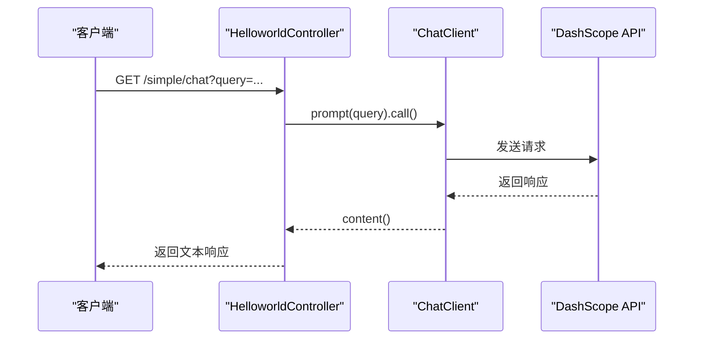

# 快速开始

<cite>
**本文档中引用的文件**  
- [HelloworldApplication.java](file://spring-ai-alibaba-helloworld/src/main/java/com/alibaba/cloud/ai/example/helloworld/HelloworldApplication.java)
- [HelloworldController.java](file://spring-ai-alibaba-helloworld/src/main/java/com/alibaba/cloud/ai/example/helloworld/HelloworldController.java)
- [application.yml](file://spring-ai-alibaba-helloworld/src/main/resources/application.yml)
- [pom.xml](file://spring-ai-alibaba-helloworld/pom.xml)
</cite>

## 目录
1. [简介](#简介)
2. [项目环境准备](#项目环境准备)
3. [克隆与构建项目](#克隆与构建项目)
4. [运行Hello World示例](#运行hello-world示例)
5. [核心代码解析](#核心代码解析)
6. [技术细节深入](#技术细节深入)
7. [预期输出与验证方法](#预期输出与验证方法)
8. [常见问题排查](#常见问题排查)
9. [总结](#总结)

## 简介
本指南旨在帮助开发者快速上手 `spring-ai-alibaba-helloworld` 示例项目，通过一个最基础的“Hello World”AI调用示例，展示如何使用Spring AI与阿里云通义千问（DashScope）API进行集成。文档将从环境配置到代码实现，逐步引导用户完成整个流程。

## 项目环境准备

在开始之前，请确保您的开发环境满足以下要求：

- **JDK版本**：建议使用JDK 17或更高版本，以兼容Spring Boot 3.x系列框架。
- **Maven**：确保已安装Apache Maven 3.6+，用于项目依赖管理和构建。
- **API密钥**：需要申请阿里云DashScope的API密钥，并设置为环境变量 `AI_DASHSCOPE_API_KEY`。

### 设置API密钥
```bash
export AI_DASHSCOPE_API_KEY="your_actual_api_key_here"
```
该密钥将在 `application.yml` 中通过 `${AI_DASHSCOPE_API_KEY}` 占位符自动注入。

**Section sources**
- [application.yml](file://spring-ai-alibaba-helloworld/src/main/resources/application.yml#L6)

## 克隆与构建项目

### 1. 克隆仓库
```bash
git clone https://github.com/alibaba/spring-ai-alibaba-examples.git
cd spring-ai-alibaba-examples
```

### 2. 构建项目
进入 `spring-ai-alibaba-helloworld` 模块并执行Maven构建命令：
```bash
cd spring-ai-alibaba-helloworld
mvn clean install
```
此命令将下载所有依赖项、编译源码并打包成可执行的JAR文件。

**Section sources**
- [pom.xml](file://spring-ai-alibaba-helloworld/pom.xml#L1-L72)

## 运行Hello World示例

### 启动应用
```bash
mvn spring-boot:run
```
或运行生成的JAR包：
```bash
java -jar target/spring-ai-alibaba-helloworld-${revision}.jar
```

应用默认在端口 `18080` 启动，可通过 `application.yml` 中的 `server.port` 配置修改。

### 访问接口
启动成功后，可通过以下HTTP请求测试AI功能：

#### 简单调用
```
GET http://127.0.0.1:18080/helloworld/simple/chat?query=你好，介绍一下自己
```

#### 流式响应调用
```
GET http://127.0.0.1:18080/helloworld/stream/chat?query=请讲个笑话
```

#### 带上下文记忆的调用（需启用Advisor）
```
GET http://127.0.0.1:18080/helloworld/advisor/chat/123?query=我叫张三
GET http://127.0.0.1:18080/helloworld/advisor/chat/123?query=我叫什么名字？
```

**Section sources**
- [HelloworldController.java](file://spring-ai-alibaba-helloworld/src/main/java/com/alibaba/cloud/ai/example/helloworld/HelloworldController.java#L35-L110)

## 核心代码解析

### HelloworldApplication.java
这是Spring Boot的主启动类，使用 `@SpringBootApplication` 注解启用自动配置和组件扫描。

```java
@SpringBootApplication
public class HelloworldApplication {
    public static void main(String[] args) {
        SpringApplication.run(HelloworldApplication.class, args);
    }
}
```

**Section sources**
- [HelloworldApplication.java](file://spring-ai-alibaba-helloworld/src/main/java/com/alibaba/cloud/ai/example/helloworld/HelloworldApplication.java#L27-L35)

### HelloworldController.java
控制器类定义了三个REST端点，分别对应不同的AI调用方式：

- `/simple/chat`：同步调用，返回完整响应字符串。
- `/stream/chat`：流式调用，返回 `Flux<String>` 实现逐字输出。
- `/advisor/chat/{id}`：支持上下文记忆的调用，通过路径参数传递会话ID。

`ChatClient` 通过Builder模式构建，预设了系统提示词、日志记录器Advisor和模型参数（如top_p=0.7）。

```mermaid
flowchart TD
A[HTTP请求] --> B{请求类型}
B --> |简单调用| C[dashScopeChatClient.prompt().call()]
B --> |流式调用| D[dashScopeChatClient.prompt().stream()]
B --> |带Advisor调用| E[注入Advisor并流式响应]
C --> F[返回完整字符串]
D --> G[返回Flux流]
E --> H[返回带上下文的流式响应]
```

**Diagram sources**
- [HelloworldController.java](file://spring-ai-alibaba-helloworld/src/main/java/com/alibaba/cloud/ai/example/helloworld/HelloworldController.java#L35-L110)

## 技术细节深入

### Spring Boot自动配置
项目依赖 `spring-ai-alibaba-starter-dashscope`，该Starter通过Spring Boot的自动配置机制，自动注册 `ChatModel` 和 `ChatClient` Bean，开发者无需手动配置客户端实例。

### HTTP端点映射机制
使用Spring MVC的 `@RestController` 和 `@RequestMapping` 注解实现RESTful API映射。每个 `@GetMapping` 方法绑定到特定URL路径，并通过 `@RequestParam` 和 `@PathVariable` 提取请求参数。

### 请求/响应处理流程
1. 客户端发起HTTP请求
2. Spring MVC DispatcherServlet 路由到对应Controller方法
3. `ChatClient` 构造Prompt并调用DashScope API
4. 接收AI模型响应（同步或流式）
5. 将结果序列化为HTTP响应返回客户端



**Diagram sources**
- [HelloworldController.java](file://spring-ai-alibaba-helloworld/src/main/java/com/alibaba/cloud/ai/example/helloworld/HelloworldController.java#L35-L110)

## 预期输出与验证方法

### 验证步骤
1. 启动应用后访问 `http://127.0.0.1:18080/helloworld/simple/chat`
2. 观察控制台日志是否输出AI响应内容
3. 使用curl或Postman测试流式接口，确认是否逐字返回

### 预期输出示例
```json
"你好，很高兴认识你！我是通义千问，阿里巴巴研发的超大规模语言模型。我可以回答问题、创作文字、表达观点等。有什么我可以帮你的吗？"
```

## 常见问题排查

### 1. 依赖下载失败
- **现象**：Maven构建时报错无法下载依赖
- **解决方案**：
  - 检查网络连接
  - 配置阿里云Maven镜像源
  - 清理本地仓库缓存：`rm -rf ~/.m2/repository/com/alibaba/cloud/ai`

### 2. 端口冲突
- **现象**：`Port 18080 already in use`
- **解决方案**：
  - 修改 `application.yml` 中的 `server.port`
  - 或终止占用进程：`lsof -i :18080 | grep LISTEN`

### 3. API密钥错误
- **现象**：返回401 Unauthorized或API密钥无效
- **解决方案**：
  - 确认 `AI_DASHSCOPE_API_KEY` 环境变量已正确设置
  - 检查API密钥是否过期或被禁用
  - 在阿里云控制台重新生成密钥

**Section sources**
- [application.yml](file://spring-ai-alibaba-helloworld/src/main/resources/application.yml#L6)

## 总结
通过本指南，您已成功运行并理解了 `spring-ai-alibaba-helloworld` 示例项目的基本结构和工作原理。该项目展示了如何利用Spring AI简化AI集成，实现高效的AI服务调用。建议进一步探索其他示例模块以了解更高级的功能。