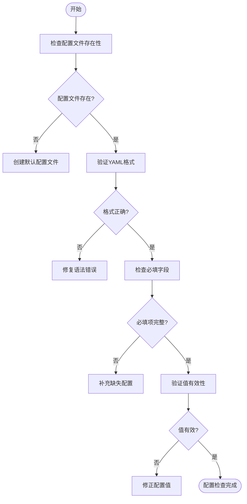
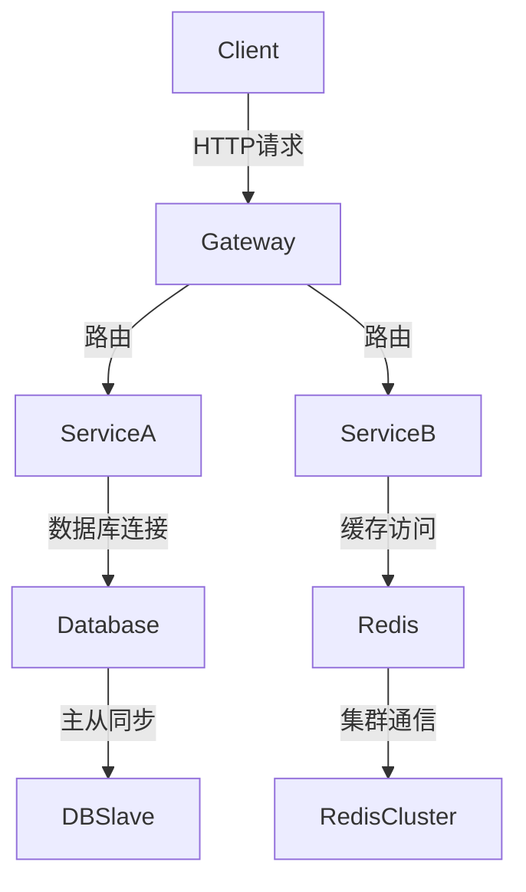
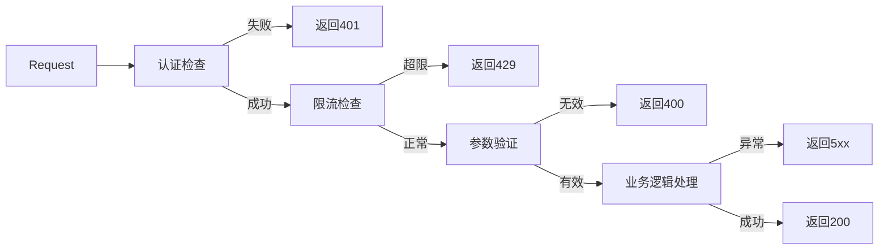
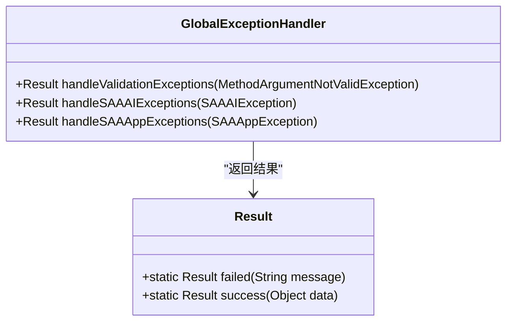
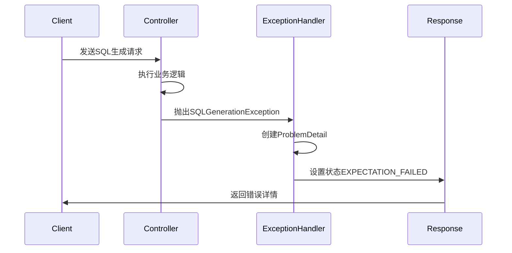

# 故障排除

<cite>
**本文档中引用的文件**  
- [GlobalExceptionHandler.java](file://spring-ai-alibaba-playground/src/main/java/com/alibaba/cloud/ai/application/config/handler/GlobalExceptionHandler.java)
- [SQLGenerationExceptionHandler.java](file://spring-ai-alibaba-usecase-example/spring-ai-alibaba-sql-example/src/main/java/com/alibaba/example/sql/SQLGenerationExceptionHandler.java)
- [application.yml](file://spring-ai-alibaba-playground/src/main/resources/application.yml)
- [docker-compose.yml](file://spring-ai-alibaba-agent-example/playground-flight-booking/docker-compose.yml)
</cite>

## 目录
1. [简介](#简介)
2. [常见问题分类](#常见问题分类)
3. [依赖冲突问题](#依赖冲突问题)
4. [配置错误排查](#配置错误排查)
5. [网络连接问题](#网络连接问题)
6. [API调用失败处理](#api调用失败处理)
7. [异常日志解读](#异常日志解读)
8. [调试步骤与技巧](#调试步骤与技巧)
9. [初学者调试指南](#初学者调试指南)
10. [高级诊断方法](#高级诊断方法)

## 简介
本故障排除指南旨在为开发者提供系统性的解决方案，帮助快速识别和修复在使用Spring AI Alibaba系列项目时可能遇到的各种问题。文档覆盖从基础配置到高级诊断的完整流程，特别关注异常处理机制和日志分析。

## 常见问题分类
项目运行过程中可能出现的问题主要分为以下几类：
- **依赖冲突**：不同版本库之间的兼容性问题
- **配置错误**：环境变量、YAML配置文件设置不当
- **网络连接问题**：服务间通信失败、端口占用等
- **API调用失败**：认证失败、参数错误、响应超时

**本节来源**
- [docker-compose.yml](file://spring-ai-alibaba-agent-example/playground-flight-booking/docker-compose.yml#L1-L21)

## 依赖冲突问题
当多个模块引入不同版本的相同依赖时，可能导致类加载冲突或方法签名不匹配。建议使用Maven的dependency:tree命令分析依赖树，确保关键组件版本一致性。

对于Spring Boot应用，可通过spring-boot-dependencies管理版本。若出现NoSuchMethodError或ClassNotFoundException，应检查相关jar包版本是否兼容。

**本节来源**
- [pom.xml](file://spring-ai-alibaba-helloworld/pom.xml)

## 配置错误排查
配置错误是导致应用启动失败的常见原因。重点关注application.yml中的配置项：

**图表来源**
- [application.yml](file://spring-ai-alibaba-playground/src/main/resources/application.yml#L1-L31)

**本节来源**
- [application.yml](file://spring-ai-alibaba-playground/src/main/resources/application.yml#L1-L31)

## 网络连接问题
网络问题通常表现为服务无法访问或响应超时。检查步骤包括：

1. 使用ping和telnet测试基础连通性
2. 检查防火墙设置和安全组规则
3. 验证docker-compose中端口映射是否正确
4. 查看目标服务是否正常运行

**图表来源**
- [docker-compose.yml](file://spring-ai-alibaba-agent-example/playground-flight-booking/docker-compose.yml#L1-L21)

**本节来源**
- [docker-compose.yml](file://spring-ai-alibaba-agent-example/playground-flight-booking/docker-compose.yml#L1-L21)

## API调用失败处理
API调用失败可能由多种因素引起，需按以下流程排查：

**本节来源**
- [GlobalExceptionHandler.java](file://spring-ai-alibaba-playground/src/main/java/com/alibaba/cloud/ai/application/config/handler/GlobalExceptionHandler.java#L1-L57)

## 异常日志解读
### GlobalExceptionHandler分析
该处理器统一处理应用层异常，主要捕获三类异常：
- MethodArgumentNotValidException：参数校验失败
- SAAAIException：AI相关异常
- SAAAppException：应用级异常

返回格式统一为Result.failed()包装的错误信息。

**图表来源**
- [GlobalExceptionHandler.java](file://spring-ai-alibaba-playground/src/main/java/com/alibaba/cloud/ai/application/config/handler/GlobalExceptionHandler.java#L1-L57)

**本节来源**
- [GlobalExceptionHandler.java](file://spring-ai-alibaba-playground/src/main/java/com/alibaba/cloud/ai/application/config/handler/GlobalExceptionHandler.java#L1-L57)

### SQLGenerationExceptionHandler分析
专门处理SQL生成异常，使用ProblemDetail标准化错误响应：

**图表来源**
- [SQLGenerationExceptionHandler.java](file://spring-ai-alibaba-usecase-example/spring-ai-alibaba-sql-example/src/main/java/com/alibaba/example/sql/SQLGenerationExceptionHandler.java#L1-L20)

**本节来源**
- [SQLGenerationExceptionHandler.java](file://spring-ai-alibaba-usecase-example/spring-ai-alibaba-sql-example/src/main/java/com/alibaba/example/sql/SQLGenerationExceptionHandler.java#L1-L20)

## 调试步骤与技巧
### API密钥验证
1. 检查环境变量是否设置：`echo $AI_DASHSCOPE_API_KEY`
2. 验证配置文件中的占位符替换
3. 测试API连通性：`curl -H "Authorization: Bearer $KEY" <API_ENDPOINT>`

### 网络连通性检查
使用以下命令组合进行诊断：
- `ping <service-host>`
- `telnet <host> <port>`
- `curl -v http://<service>:<port>/health`

### 请求/响应数据分析
使用抓包工具（如Wireshark）或应用内置日志记录：
1. 记录原始请求头和体
2. 捕获服务端处理日志
3. 分析响应状态码和内容

**本节来源**
- [application.yml](file://spring-ai-alibaba-playground/src/main/resources/application.yml#L1-L31)
- [GlobalExceptionHandler.java](file://spring-ai-alibaba-playground/src/main/java/com/alibaba/cloud/ai/application/config/handler/GlobalExceptionHandler.java#L1-L57)

## 初学者调试指南
### 基础检查清单
- [ ] 确认JDK版本满足要求
- [ ] 检查Maven/Gradle依赖下载完整
- [ ] 验证配置文件路径正确
- [ ] 确保必要服务已启动（数据库、缓存等）
- [ ] 检查端口是否被占用

### 日志查看技巧
1. 从启动日志开始逐行阅读
2. 关注ERROR和WARN级别日志
3. 使用grep过滤关键错误信息
4. 对比正常启动日志找出差异

**本节来源**
- [application.yml](file://spring-ai-alibaba-playground/src/main/resources/application.yml#L1-L31)

## 高级诊断方法
### 调试工具使用
- 启用远程调试：`-agentlib:jdwp=transport=dt_socket,server=y,suspend=n,address=*:5005`
- 使用JVM监控工具（JConsole、VisualVM）
- 集成APM系统进行性能分析

### 系统指标分析
监控关键指标：
- CPU和内存使用率
- GC频率和耗时
- 线程池状态
- 数据库连接数
- 缓存命中率

通过Prometheus+Grafana搭建监控面板，设置告警阈值。

**本节来源**
- [docker-compose.yml](file://spring-ai-alibaba-agent-example/playground-flight-booking/docker-compose.yml#L1-L21)