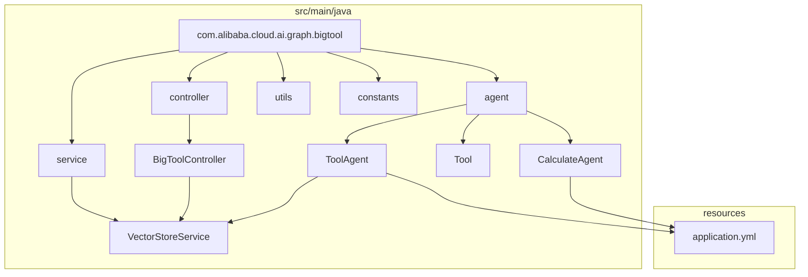
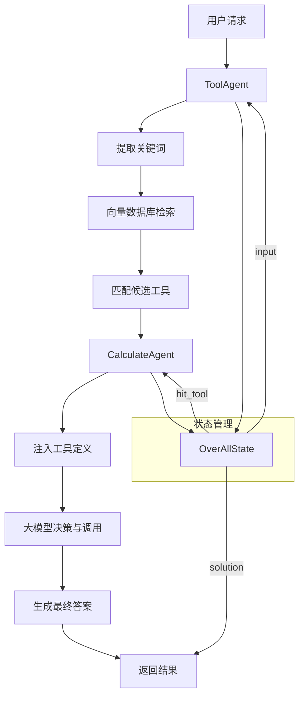
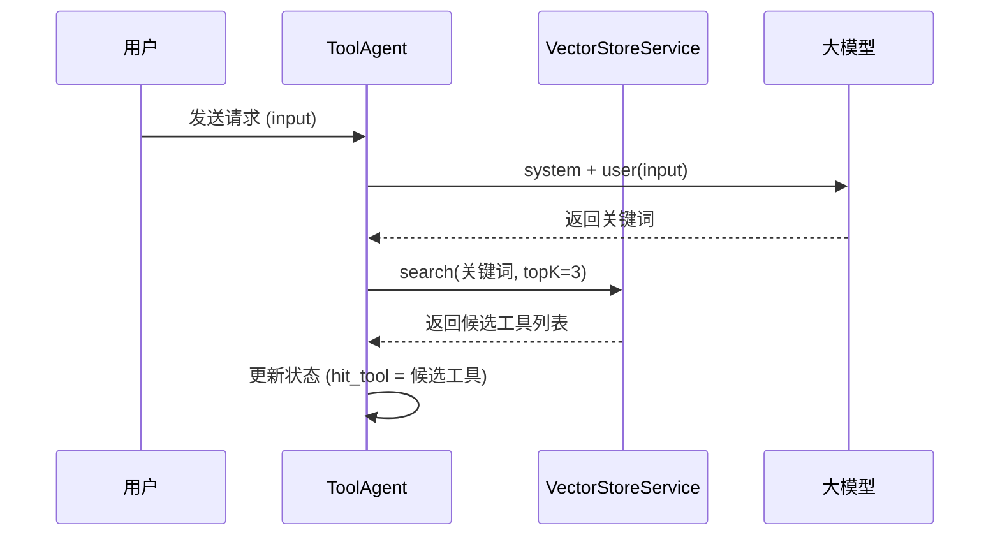
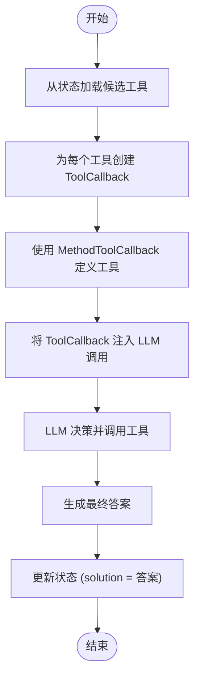
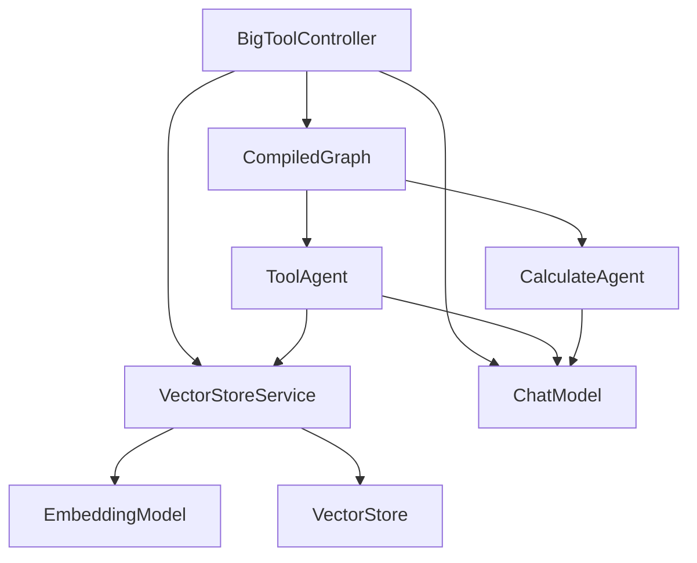

# Big Tool 智能体

<cite>
**本文档中引用的文件**  
- [BigToolApplication.java](file://spring-ai-alibaba-graph-example/big-tool/src/main/java/com/alibaba/cloud/ai/graph/bigtool/BigToolApplication.java)
- [ToolAgent.java](file://spring-ai-alibaba-graph-example/big-tool/src/main/java/com/alibaba/cloud/ai/graph/bigtool/agent/ToolAgent.java)
- [CalculateAgent.java](file://spring-ai-alibaba-graph-example/big-tool/src/main/java/com/alibaba/cloud/ai/graph/bigtool/agent/CalculateAgent.java)
- [Tool.java](file://spring-ai-alibaba-graph-example/big-tool/src/main/java/com/alibaba/cloud/ai/graph/bigtool/agent/Tool.java)
- [BigToolController.java](file://spring-ai-alibaba-graph-example/big-tool/src/main/java/com/alibaba/cloud/ai/graph/bigtool/controller/BigToolController.java)
- [VectorStoreService.java](file://spring-ai-alibaba-graph-example/big-tool/src/main/java/com/alibaba/cloud/ai/graph/bigtool/service/VectorStoreService.java)
- [Constant.java](file://spring-ai-alibaba-graph-example/big-tool/src/main/java/com/alibaba/cloud/ai/graph/bigtool/constants/Constant.java)
</cite>

## 目录
1. [简介](#简介)
2. [项目结构](#项目结构)
3. [核心组件](#核心组件)
4. [架构概述](#架构概述)
5. [详细组件分析](#详细组件分析)
6. [依赖分析](#依赖分析)
7. [性能考虑](#性能考虑)
8. [故障排除指南](#故障排除指南)
9. [结论](#结论)

## 简介
本文档详细介绍了 Big Tool 智能体的架构与实现机制。该智能体基于 Spring AI 框架，采用图结构（Graph）驱动的模式，将复杂的用户请求分解为多个子任务，并通过一系列工具（Tool）协同完成。重点分析了 `BigToolApplication` 的启动流程、`ToolAgent` 与 `CalculateAgent` 的协作机制、状态管理、决策逻辑以及自定义工具的注册方式，为开发者提供构建复杂任务处理智能体的最佳实践。

## 项目结构
Big Tool 智能体项目位于 `spring-ai-alibaba-graph-example/big-tool` 目录下，采用标准的 Spring Boot 项目结构。核心代码位于 `src/main/java/com/alibaba/cloud/ai/graph/bigtool` 包中，主要包含 `agent`（智能体实现）、`controller`（API 控制器）、`service`（服务层）、`utils`（工具类）和 `constants`（常量定义）等模块。资源文件 `application.yml` 负责配置应用参数。

**图示来源**
- [BigToolController.java](file://spring-ai-alibaba-graph-example/big-tool/src/main/java/com/alibaba/cloud/ai/graph/bigtool/controller/BigToolController.java#L1-L20)
- [VectorStoreService.java](file://spring-ai-alibaba-graph-example/big-tool/src/main/java/com/alibaba/cloud/ai/graph/bigtool/service/VectorStoreService.java#L1-L10)

**本节来源**
- [BigToolController.java](file://spring-ai-alibaba-graph-example/big-tool/src/main/java/com/alibaba/cloud/ai/graph/bigtool/controller/BigToolController.java#L1-L10)
- [VectorStoreService.java](file://spring-ai-alibaba-graph-example/big-tool/src/main/java/com/alibaba/cloud/ai/graph/bigtool/service/VectorStoreService.java#L1-L10)

## 核心组件
Big Tool 智能体的核心在于其将复杂任务分解并利用工具执行的能力。主要组件包括 `BigToolApplication`（应用入口）、`ToolAgent`（工具选择智能体）、`CalculateAgent`（工具执行智能体）、`VectorStoreService`（向量存储服务）以及 `Tool`（工具抽象）。这些组件通过状态图（StateGraph）进行编排，实现从用户输入到最终解决方案的自动化流程。

**本节来源**
- [BigToolApplication.java](file://spring-ai-alibaba-graph-example/big-tool/src/main/java/com/alibaba/cloud/ai/graph/bigtool/BigToolApplication.java#L1-L14)
- [ToolAgent.java](file://spring-ai-alibaba-graph-example/big-tool/src/main/java/com/alibaba/cloud/ai/graph/bigtool/agent/ToolAgent.java#L1-L94)
- [CalculateAgent.java](file://spring-ai-alibaba-graph-example/big-tool/src/main/java/com/alibaba/cloud/ai/graph/bigtool/agent/CalculateAgent.java#L1-L101)

## 架构概述
Big Tool 智能体采用“工具选择-工具执行”的两阶段架构。首先，`ToolAgent` 接收用户输入，通过大模型提取关键词，并在向量数据库中检索最相关的工具。然后，`CalculateAgent` 接收这些候选工具，利用 Spring AI 的 `toolCallbacks` 机制，将工具定义注入大模型，让模型自主决定调用哪个工具并生成最终答案。整个流程由 `StateGraph` 编排，确保了任务的有序执行。

**图示来源**
- [BigToolController.java](file://spring-ai-alibaba-graph-example/big-tool/src/main/java/com/alibaba/cloud/ai/graph/bigtool/controller/BigToolController.java#L52-L124)
- [ToolAgent.java](file://spring-ai-alibaba-graph-example/big-tool/src/main/java/com/alibaba/cloud/ai/graph/bigtool/agent/ToolAgent.java#L50-L90)
- [CalculateAgent.java](file://spring-ai-alibaba-graph-example/big-tool/src/main/java/com/alibaba/cloud/ai/graph/bigtool/agent/CalculateAgent.java#L50-L90)

## 详细组件分析

### ToolAgent 分析
`ToolAgent` 负责工具的选择。它接收用户输入，通过一个固定的系统提示词（`CLASSIFIER_PROMPT_TEMPLATE`）引导大模型提取输入中的关键词。随后，它使用 `VectorStoreService` 在向量空间中进行相似性搜索，找出与关键词最匹配的工具文档（`Document`），并将这些候选工具存入状态（`OverAllState`）中供下一阶段使用。

**图示来源**
- [ToolAgent.java](file://spring-ai-alibaba-graph-example/big-tool/src/main/java/com/alibaba/cloud/ai/graph/bigtool/agent/ToolAgent.java#L50-L90)
- [VectorStoreService.java](file://spring-ai-alibaba-graph-example/big-tool/src/main/java/com/alibaba/cloud/ai/graph/bigtool/service/VectorStoreService.java#L35-L45)

### CalculateAgent 分析
`CalculateAgent` 负责工具的执行。它从状态中获取 `ToolAgent` 筛选出的候选工具列表。对于每个工具，它利用反射（`ReflectionUtils`）找到 `Math` 类中对应的方法，并通过 `MethodToolCallback` 将其包装成 Spring AI 可识别的 `ToolCallback`。然后，它将这些 `ToolCallback` 注入大模型的调用中，让大模型根据上下文自主选择并调用合适的工具，最终生成解决方案。

**图示来源**
- [CalculateAgent.java](file://spring-ai-alibaba-graph-example/big-tool/src/main/java/com/alibaba/cloud/ai/graph/bigtool/agent/CalculateAgent.java#L50-L90)
- [Tool.java](file://spring-ai-alibaba-graph-example/big-tool/src/main/java/com/alibaba/cloud/ai/graph/bigtool/agent/Tool.java#L1-L64)

### 自定义工具定义与注册
虽然本示例主要使用 `Math` 类的静态方法作为工具，但其设计模式支持自定义工具。开发者可以通过 `MethodUtils` 工具类或直接实现 `Tool` 类来定义自己的工具。工具的元数据（如名称、描述、参数类型）会被存储在 `Document` 的 `metadata` 中，并通过 `initializeVectorStore()` 方法批量添加到向量数据库，从而实现工具的注册和检索。

**本节来源**
- [Tool.java](file://spring-ai-alibaba-graph-example/big-tool/src/main/java/com/alibaba/cloud/ai/graph/bigtool/agent/Tool.java#L1-L64)
- [MethodUtils.java](file://spring-ai-alibaba-graph-example/big-tool/src/main/java/com/alibaba/cloud/ai/graph/bigtool/utils/MethodUtils.java)
- [BigToolController.java](file://spring-ai-alibaba-graph-example/big-tool/src/main/java/com/alibaba/cloud/ai/graph/bigtool/controller/BigToolController.java#L100-L120)

## 依赖分析
Big Tool 智能体依赖于 Spring AI 的核心模块，包括 `ChatClient` 用于与大模型交互，`EmbeddingModel` 和 `VectorStore` 用于实现语义搜索。其内部组件间依赖清晰：`BigToolController` 依赖 `VectorStoreService` 和 `ChatModel` 来构建 `CompiledGraph`；`ToolAgent` 和 `CalculateAgent` 都依赖 `ChatClient` 进行模型调用；`ToolAgent` 还直接依赖 `VectorStoreService` 进行工具检索。

**图示来源**
- [BigToolController.java](file://spring-ai-alibaba-graph-example/big-tool/src/main/java/com/alibaba/cloud/ai/graph/bigtool/controller/BigToolController.java#L52-L70)
- [ToolAgent.java](file://spring-ai-alibaba-graph-example/big-tool/src/main/java/com/alibaba/cloud/ai/graph/bigtool/agent/ToolAgent.java#L30-L40)
- [CalculateAgent.java](file://spring-ai-alibaba-graph-example/big-tool/src/main/java/com/alibaba/cloud/ai/graph/bigtool/agent/CalculateAgent.java#L30-L40)

**本节来源**
- [BigToolController.java](file://spring-ai-alibaba-graph-example/big-tool/src/main/java/com/alibaba/cloud/ai/graph/bigtool/controller/BigToolController.java#L52-L124)
- [VectorStoreService.java](file://spring-ai-alibaba-graph-example/big-tool/src/main/java/com/alibaba/cloud/ai/graph/bigtool/service/VectorStoreService.java#L28-L48)

## 性能考虑
该智能体的性能瓶颈主要在于大模型的调用延迟和向量数据库的检索速度。通过将 `NodeAction` 包装为 `AsyncNodeAction`，实现了非阻塞的异步执行，提高了整体吞吐量。向量数据库的 `topK` 参数控制了候选工具的数量，较小的 `topK` 值可以加快检索速度，但也可能遗漏最佳工具。建议根据实际工具库的规模和精度要求进行调优。

## 故障排除指南
常见问题包括工具检索失败和模型无法正确调用工具。若检索不到工具，请检查 `initializeVectorStore()` 方法是否成功执行，以及 `Math` 类的方法是否被正确转换为 `Document` 并存入向量库。若模型无法调用工具，请检查 `ToolCallback` 的创建过程，确保方法名、参数类型等元数据正确无误，并确认大模型支持函数调用（function calling）功能。

**本节来源**
- [BigToolController.java](file://spring-ai-alibaba-graph-example/big-tool/src/main/java/com/alibaba/cloud/ai/graph/bigtool/controller/BigToolController.java#L100-L120)
- [CalculateAgent.java](file://spring-ai-alibaba-graph-example/big-tool/src/main/java/com/alibaba/cloud/ai/graph/bigtool/agent/CalculateAgent.java#L60-L80)

## 结论
Big Tool 模式提供了一种强大的范式，用于构建能够处理复杂任务的智能体。通过将任务分解为“选择”和“执行”两个阶段，并利用向量数据库和大模型的决策能力，实现了高度的自动化和智能化。本文档详细解析了其核心实现，为开发者基于此模式构建更复杂的智能应用提供了坚实的基础和清晰的指导。