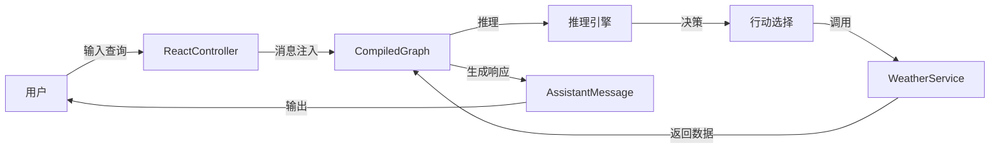
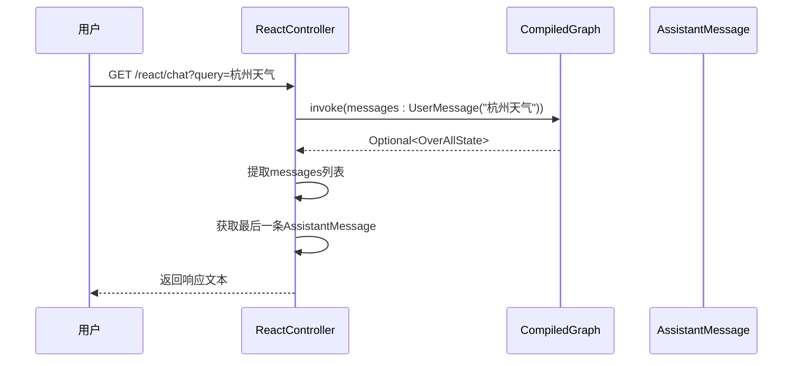
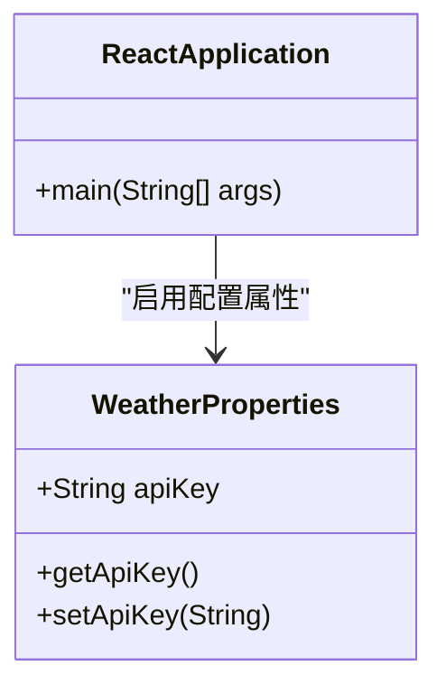
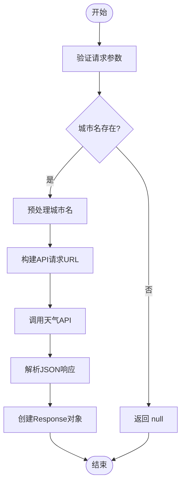
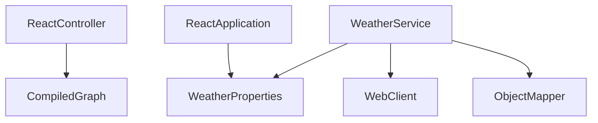

# ReAct 智能体

<cite>
**本文档中引用的文件**  
- [ReactController.java](file://spring-ai-alibaba-graph-example/react/src/main/java/com/alibaba/cloud/ai/graph/react/ReactController.java)
- [ReactApplication.java](file://spring-ai-alibaba-graph-example/react/src/main/java/com/alibaba/cloud/ai/graph/react/ReactApplication.java)
- [WeatherService.java](file://spring-ai-alibaba-graph-example/react/src/main/java/com/alibaba/cloud/ai/graph/react/function/WeatherService.java)
- [WeatherProperties.java](file://spring-ai-alibaba-graph-example/react/src/main/java/com/alibaba/cloud/ai/graph/react/function/WeatherProperties.java)
- [application.yml](file://spring-ai-alibaba-graph-example/react/src/main/resources/application.yml)
</cite>

## 目录
1. [简介](#简介)
2. [项目结构](#项目结构)
3. [核心组件](#核心组件)
4. [架构概述](#架构概述)
5. [详细组件分析](#详细组件分析)
6. [依赖分析](#依赖分析)
7. [性能考虑](#性能考虑)
8. [故障排除指南](#故障排除指南)
9. [结论](#结论)

## 简介
本文档详细阐述了 ReAct 智能体的设计与实现，重点分析其“推理与行动”（Reasoning and Acting）的循环模式。该模式使智能体能够在执行任务时，先进行内部推理生成计划，然后采取行动调用外部工具或API，并根据结果进行反思和调整。以 `ReactController` 为例，分析其处理流程，展示智能体如何与外部服务（如天气服务）进行交互。同时，详细说明 `ReactApplication` 的配置方式以及 `WeatherService` 的集成机制。通过实际交互示例，帮助开发者理解 ReAct 智能体的动态决策过程，并指导他们构建类似的智能体系统。

## 项目结构
ReAct 智能体项目位于 `spring-ai-alibaba-graph-example/react` 目录下，采用标准的 Spring Boot 项目结构。核心代码位于 `src/main/java/com/alibaba/cloud/ai/graph/react` 包中，包含控制器、应用主类及功能实现类。外部服务配置通过 `application.yml` 文件管理，支持灵活的环境变量注入。

```mermaid
graph TD
subgraph "src/main/java"
A[com.alibaba.cloud.ai.graph.react]
A --> B[ReactController]
A --> C[ReactApplication]
A --> D[function]
D --> E[WeatherService]
D --> F[WeatherProperties]
D --> G[WeatherAutoConfiguration]
D --> H[WeatherUtils]
end
subgraph "src/main/resources"
I[application.yml]
end
B --> I : "读取配置"
C --> I : "加载属性"
E --> I : "获取API密钥"
```

**图示来源**  
- [ReactController.java](file://spring-ai-alibaba-graph-example/react/src/main/java/com/alibaba/cloud/ai/graph/react/ReactController.java)
- [ReactApplication.java](file://spring-ai-alibaba-graph-example/react/src/main/java/com/alibaba/cloud/ai/graph/react/ReactApplication.java)
- [WeatherService.java](file://spring-ai-alibaba-graph-example/react/src/main/java/com/alibaba/cloud/ai/graph/react/function/WeatherService.java)
- [application.yml](file://spring-ai-alibaba-graph-example/react/src/main/resources/application.yml)

**本节来源**  
- [ReactController.java](file://spring-ai-alibaba-graph-example/react/src/main/java/com/alibaba/cloud/ai/graph/react/ReactController.java)
- [ReactApplication.java](file://spring-ai-alibaba-graph-example/react/src/main/java/com/alibaba/cloud/ai/graph/react/ReactApplication.java)
- [application.yml](file://spring-ai-alibaba-graph-example/react/src/main/resources/application.yml)

## 核心组件
ReAct 智能体的核心由三个主要组件构成：`ReactController` 负责接收用户请求并返回响应；`ReactApplication` 作为 Spring Boot 启动类，负责初始化上下文和配置属性；`WeatherService` 实现了具体的工具调用逻辑，用于查询天气信息。这些组件协同工作，实现了完整的 ReAct 循环。

**本节来源**  
- [ReactController.java](file://spring-ai-alibaba-graph-example/react/src/main/java/com/alibaba/cloud/ai/graph/react/ReactController.java)
- [ReactApplication.java](file://spring-ai-alibaba-graph-example/react/src/main/java/com/alibaba/cloud/ai/graph/react/ReactApplication.java)
- [WeatherService.java](file://spring-ai-alibaba-graph-example/react/src/main/java/com/alibaba/cloud/ai/graph/react/function/WeatherService.java)

## 架构概述
ReAct 智能体采用基于 Spring AI 的图模型（Graph Model）架构，通过 `CompiledGraph` 实现状态机驱动的推理与行动循环。用户请求由 `ReactController` 接收后，封装为消息并提交给编译后的图执行器。图中节点根据当前状态决定是进行推理生成下一步动作，还是直接调用工具（如天气服务）执行具体操作。执行结果被反馈回图中，用于更新状态并决定后续步骤。



**图示来源**  
- [ReactController.java](file://spring-ai-alibaba-graph-example/react/src/main/java/com/alibaba/cloud/ai/graph/react/ReactController.java#L25-L50)
- [WeatherService.java](file://spring-ai-alibaba-graph-example/react/src/main/java/com/alibaba/cloud/ai/graph/react/function/WeatherService.java#L50-L100)

## 详细组件分析

### ReactController 分析
`ReactController` 是 ReAct 智能体的入口点，通过 REST 接口暴露 `/react/chat` 端点。它接收用户查询字符串，将其包装为 `UserMessage`，并提交给预编译的图执行器。执行完成后，从返回的消息列表中提取最新的 `AssistantMessage` 并返回其文本内容。



**图示来源**  
- [ReactController.java](file://spring-ai-alibaba-graph-example/react/src/main/java/com/alibaba/cloud/ai/graph/react/ReactController.java#L30-L50)

**本节来源**  
- [ReactController.java](file://spring-ai-alibaba-graph-example/react/src/main/java/com/alibaba/cloud/ai/graph/react/ReactController.java#L1-L55)

### ReactApplication 配置分析
`ReactApplication` 是 Spring Boot 应用的主类，使用 `@SpringBootApplication` 注解启动。通过 `@EnableConfigurationProperties(WeatherProperties.class)` 启用对天气服务配置的支持，使得 `WeatherProperties` 中定义的属性可以从 `application.yml` 文件中自动绑定。



**图示来源**  
- [ReactApplication.java](file://spring-ai-alibaba-graph-example/react/src/main/java/com/alibaba/cloud/ai/graph/react/ReactApplication.java#L1-L18)
- [WeatherProperties.java](file://spring-ai-alibaba-graph-example/react/src/main/java/com/alibaba/cloud/ai/graph/react/function/WeatherProperties.java)

**本节来源**  
- [ReactApplication.java](file://spring-ai-alibaba-graph-example/react/src/main/java/com/alibaba/cloud/ai/graph/react/ReactApplication.java#L1-L18)
- [WeatherProperties.java](file://spring-ai-alibaba-graph-example/react/src/main/java/com/alibaba/cloud/ai/graph/react/function/WeatherProperties.java)

### WeatherService 集成分析
`WeatherService` 实现了 `Function<Request, Response>` 接口，作为可被智能体调用的工具。它通过 `WebClient` 调用外部天气 API，并使用 `ObjectMapper` 解析 JSON 响应。构造函数接收 `WeatherProperties` 以获取 API 密钥，确保安全性和可配置性。在当前实现中，为了演示目的，`doGetWeatherMock` 方法提供了对特定城市的模拟响应。



**图示来源**  
- [WeatherService.java](file://spring-ai-alibaba-graph-example/react/src/main/java/com/alibaba/cloud/ai/graph/react/function/WeatherService.java#L50-L100)

**本节来源**  
- [WeatherService.java](file://spring-ai-alibaba-graph-example/react/src/main/java/com/alibaba/cloud/ai/graph/react/function/WeatherService.java#L1-L143)

## 依赖分析
ReAct 智能体依赖于 Spring AI 框架提供的 `CompiledGraph` 和消息模型，以及 Spring Boot 的自动配置机制。`WeatherService` 依赖 `WebClient` 进行 HTTP 调用，`ObjectMapper` 用于 JSON 处理。通过 `@Qualifier("reactAgentGraph")` 注入特定的图实例，确保组件间的松耦合。



**图示来源**  
- [ReactController.java](file://spring-ai-alibaba-graph-example/react/src/main/java/com/alibaba/cloud/ai/graph/react/ReactController.java#L20-L25)
- [WeatherService.java](file://spring-ai-alibaba-graph-example/react/src/main/java/com/alibaba/cloud/ai/graph/react/function/WeatherService.java#L40-L50)

**本节来源**  
- [ReactController.java](file://spring-ai-alibaba-graph-example/react/src/main/java/com/alibaba/cloud/ai/graph/react/ReactController.java#L1-L55)
- [WeatherService.java](file://spring-ai-alibaba-graph-example/react/src/main/java/com/alibaba/cloud/ai/graph/react/function/WeatherService.java#L1-L143)

## 性能考虑
由于 `WeatherService` 使用了阻塞式调用 `block()`，在高并发场景下可能影响性能。建议在生产环境中改用响应式编程模型，避免线程阻塞。此外，`doGetWeatherMock` 方法中的硬编码城市数据应替换为真实的 API 调用，并考虑引入缓存机制以减少重复请求。

## 故障排除指南
- **API 密钥缺失**：确保环境变量 `WEATHER_API_KEY` 已正确设置。
- **端口冲突**：检查 `server.port` 配置，避免与其他服务冲突。
- **图执行失败**：确认 `reactAgentGraph` Bean 已正确注册并注入。
- **JSON 解析错误**：验证外部 API 返回的 JSON 格式是否符合预期结构。

**本节来源**  
- [WeatherService.java](file://spring-ai-alibaba-graph-example/react/src/main/java/com/alibaba/cloud/ai/graph/react/function/WeatherService.java#L100-L120)
- [application.yml](file://spring-ai-alibaba-graph-example/react/src/main/resources/application.yml#L1-L10)

## 结论
ReAct 智能体通过“推理与行动”循环实现了动态的任务执行能力。`ReactController` 提供了简洁的接口，`ReactApplication` 确保了配置的灵活性，而 `WeatherService` 则展示了如何集成外部工具。开发者可基于此模式扩展更多功能，构建更复杂的智能体系统。