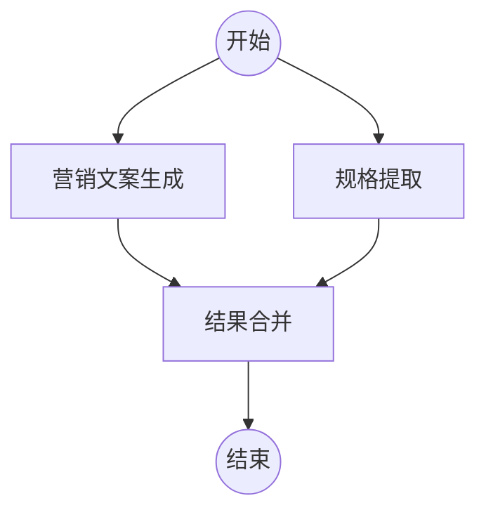
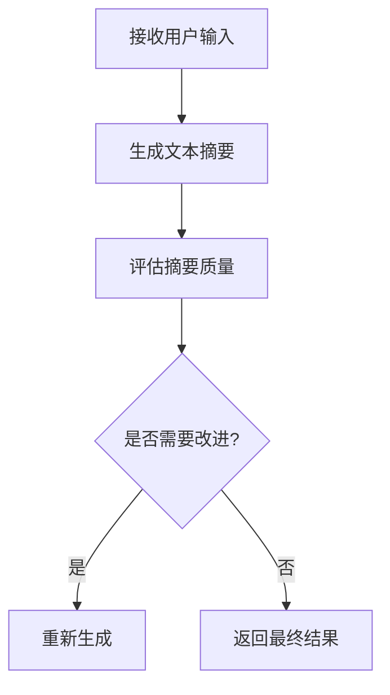
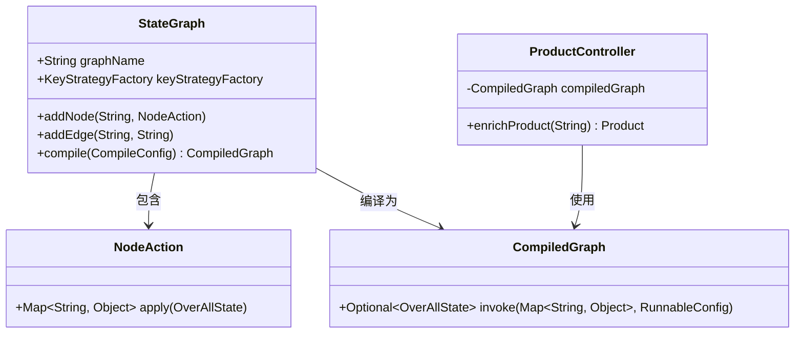
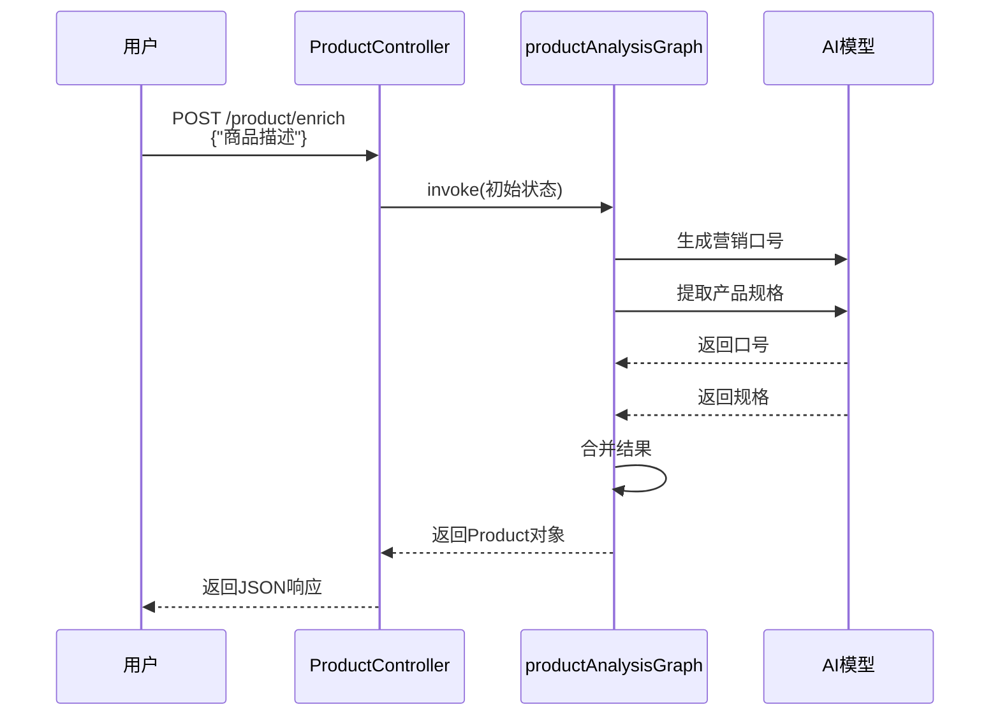

# 智能体应用场景

<cite>
**本文档引用的文件**  
- [ProductAnalysisApplication.java](file://spring-ai-alibaba-graph-example/product-analysis-graph/src/main/java/com/alibaba/example/graph/product/ProductAnalysisApplication.java)
- [ProductGraphConfiguration.java](file://spring-ai-alibaba-graph-example/product-analysis-graph/src/main/java/com/alibaba/example/graph/product/conf/ProductGraphConfiguration.java)
- [ProductController.java](file://spring-ai-alibaba-graph-example/product-analysis-graph/src/main/java/com/alibaba/example/graph/product/controller/ProductController.java)
- [Product.java](file://spring-ai-alibaba-graph-example/product-analysis-graph/src/main/java/com/alibaba/example/graph/product/model/Product.java)
- [Application.java](file://spring-ai-alibaba-graph-example/workflow-writing-assistant/src/main/java/com/alibaba/example/Application.java)
- [WritingAssistantController.java](file://spring-ai-alibaba-graph-example/workflow-writing-assistant/src/main/java/com/alibaba/example/controller/WritingAssistantController.java)
- [WritingAssistantAutoconfiguration.java](file://spring-ai-alibaba-graph-example/workflow-writing-assistant/src/main/java/com/alibaba/example/graph/conf/WritingAssistantAutoconfiguration.java)
</cite>

## 目录
1. [引言](#引言)
2. [产品分析图应用](#产品分析图应用)
3. [写作助手应用场景](#写作助手应用场景)
4. [智能体架构设计](#智能体架构设计)
5. [端到端使用流程](#端到端使用流程)
6. [开发者应用指导](#开发者应用指导)
7. [结论](#结论)

## 引言
智能体技术正在重塑企业解决复杂业务问题的方式。通过将AI模型与流程编排相结合，智能体能够自主决策、并行处理任务并生成高质量的业务输出。本文档以产品分析图和写作助手两个典型应用场景为例，深入剖析智能体在实际业务中的应用模式，为开发者提供可复用的设计思路和实现方案。

## 产品分析图应用

智能体在产品信息分析场景中展现出强大的自动化能力。以`ProductAnalysisApplication`为例，系统通过一个精心设计的状态图（StateGraph）来处理商品信息的丰富化任务。

当用户通过`/product/enrich`接口提交商品描述时，`ProductController`接收请求并将其作为初始状态输入到`productAnalysisGraph`中。该图由`ProductGraphConfiguration`定义，包含三个核心节点：营销文案生成、规格提取和结果合并。系统采用并行执行策略，同时启动营销口号生成和产品规格提取两个AI任务，显著提升了处理效率。

**图示来源**  
- [ProductGraphConfiguration.java](file://spring-ai-alibaba-graph-example/product-analysis-graph/src/main/java/com/alibaba/example/graph/product/conf/ProductGraphConfiguration.java#L64-L97)

**本节来源**  
- [ProductController.java](file://spring-ai-alibaba-graph-example/product-analysis-graph/src/main/java/com/alibaba/example/graph/product/controller/ProductController.java#L38-L50)
- [ProductGraphConfiguration.java](file://spring-ai-alibaba-graph-example/product-analysis-graph/src/main/java/com/alibaba/example/graph/product/conf/ProductGraphConfiguration.java#L35-L62)

## 写作助手应用场景

写作助手是智能体在内容创作领域的典型应用。`WritingAssistantController`提供了一个简洁的REST接口`/write`，用户可以通过GET请求提交原始文本。该请求被路由到写作助手流程图`writingAssistantGraph`进行处理。

该流程图实现了复杂的文本处理逻辑，包括摘要生成、反馈分类和内容重写等步骤。`WritingAssistantAutoconfiguration`中定义的`SummarizerNode`负责生成文本摘要，而`SummaryFeedbackClassifierNode`则对摘要质量进行评估和分类。整个流程展示了智能体如何通过多步推理和决策来完成复杂的创作任务。

**图示来源**  
- [WritingAssistantAutoconfiguration.java](file://spring-ai-alibaba-graph-example/workflow-writing-assistant/src/main/java/com/alibaba/example/graph/conf/WritingAssistantAutoconfiguration.java#L82-L124)

**本节来源**  
- [WritingAssistantController.java](file://spring-ai-alibaba-graph-example/workflow-writing-assistant/src/main/java/com/alibaba/example/controller/WritingAssistantController.java#L41-L57)

## 智能体架构设计

`ProductAnalysisApplication`和`Application`作为Spring Boot应用的入口点，通过`@SpringBootApplication`注解启用自动配置。核心架构基于状态图（StateGraph）模式，将复杂的业务流程分解为可管理的节点。

每个节点（NodeAction）封装了特定的业务逻辑，如调用AI模型生成营销口号或提取产品规格。状态图通过`KeyStrategyFactory`定义状态管理策略，确保在并行执行过程中数据的一致性。`MemorySaver`用于在执行过程中保存和恢复状态，支持流程的中断和恢复。

**图示来源**  
- [ProductAnalysisApplication.java](file://spring-ai-alibaba-graph-example/product-analysis-graph/src/main/java/com/alibaba/example/graph/product/ProductAnalysisApplication.java#L21-L27)
- [ProductGraphConfiguration.java](file://spring-ai-alibaba-graph-example/product-analysis-graph/src/main/java/com/alibaba/example/graph/product/conf/ProductGraphConfiguration.java#L35-L62)

**本节来源**  
- [ProductAnalysisApplication.java](file://spring-ai-alibaba-graph-example/product-analysis-graph/src/main/java/com/alibaba/example/graph/product/ProductAnalysisApplication.java#L0-L27)
- [Application.java](file://spring-ai-alibaba-graph-example/workflow-writing-assistant/src/main/java/com/alibaba/example/Application.java#L0-L36)

## 端到端使用流程

智能体的使用流程从用户输入开始，经过智能体的决策和处理，最终输出结果。以产品分析为例，用户首先通过HTTP POST请求向`/product/enrich`端点提交商品描述。`ProductController`接收到请求后，创建包含`productDesc`的初始状态，并调用编译后的状态图执行。

状态图引擎并行执行`marketingCopyNode`和`specificationExtractionNode`，分别调用AI模型生成营销口号和提取产品规格。两个任务完成后，结果被传递给`mergeNode`进行整合，最终生成包含完整信息的`Product`对象并返回给用户。整个流程体现了智能体在处理复杂、多步骤任务时的高效性和可靠性。

**图示来源**  
- [ProductController.java](file://spring-ai-alibaba-graph-example/product-analysis-graph/src/main/java/com/alibaba/example/graph/product/controller/ProductController.java#L38-L50)
- [ProductGraphConfiguration.java](file://spring-ai-alibaba-graph-example/product-analysis-graph/src/main/java/com/alibaba/example/graph/product/conf/ProductGraphConfiguration.java#L64-L97)

## 开发者应用指导

开发者可以借鉴本文档中的模式，将智能体技术应用于自己的业务场景。首先，明确业务流程的关键步骤，并将其分解为独立的节点。然后，使用`StateGraph`构建流程图，定义节点间的执行顺序和数据流。

对于需要调用AI模型的节点，可以使用`ChatClient`与大语言模型交互。通过`KeyStrategy`精确控制状态的更新策略，避免数据冲突。最后，通过REST控制器暴露接口，实现与前端应用的集成。这种架构不仅提高了代码的可维护性，还为未来的功能扩展提供了坚实的基础。

## 结论

智能体技术为解决复杂的业务问题提供了强大的工具。通过产品分析图和写作助手的应用示例，我们展示了智能体如何通过并行处理、多步推理和状态管理来完成高质量的任务。开发者可以基于这些模式，构建出更加智能、高效的应用系统，推动业务的数字化转型。