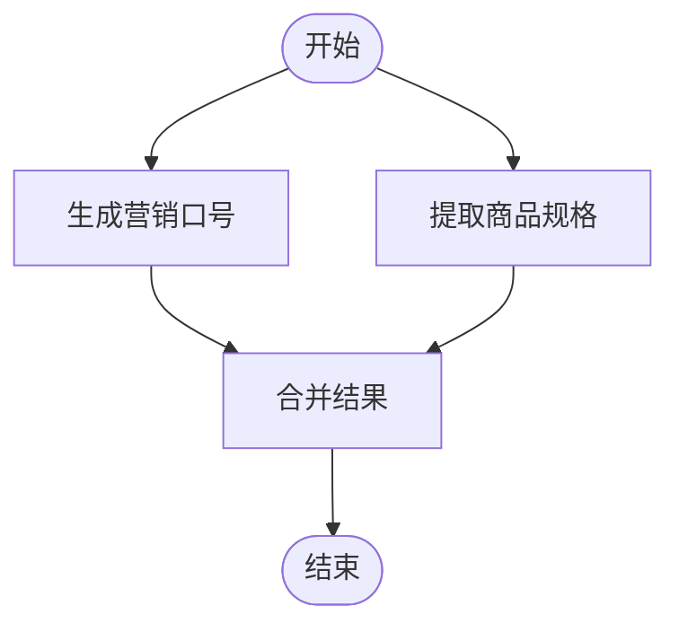

# 智能体示例

<cite>
**本文档引用的文件**
- [BigToolApplication.java](file://spring-ai-alibaba-graph-example/big-tool/src/main/java/com/alibaba/cloud/ai/graph/bigtool/BigToolApplication.java)
- [BigToolController.java](file://spring-ai-alibaba-graph-example/big-tool/src/main/java/com/alibaba/cloud/ai/graph/bigtool/controller/BigToolController.java)
- [Tool.java](file://spring-ai-alibaba-graph-example/big-tool/src/main/java/com/alibaba/cloud/ai/graph/bigtool/agent/Tool.java)
- [ReactController.java](file://spring-ai-alibaba-graph-example/react/src/main/java/com/alibaba/cloud/ai/graph/react/ReactController.java)
- [ReactApplication.java](file://spring-ai-alibaba-graph-example/react/src/main/java/com/alibaba/cloud/ai/graph/react/ReactApplication.java)
- [ProductAnalysisApplication.java](file://spring-ai-alibaba-graph-example/product-analysis-graph/src/main/java/com/alibaba/example/graph/product/ProductAnalysisApplication.java)
- [agent.md](file://spring-ai-alibaba-playground/src/main/resources/rag/markdown/agent.md)
</cite>

## 目录
1. [简介](#简介)
2. [项目结构](#项目结构)
3. [核心组件](#核心组件)
4. [架构概述](#架构概述)
5. [详细组件分析](#详细组件分析)
6. [依赖分析](#依赖分析)
7. [性能考虑](#性能考虑)
8. [故障排除指南](#故障排除指南)
9. [结论](#结论)

## 简介
本文档旨在创建一个全面的智能体（Agent）示例文档，重点介绍基于Spring AI Graph的智能体系统。文档将详细说明Big Tool模式，展示如何将复杂任务分解为多个工具调用，并以BigToolApplication的实现作为参考。同时，阐述ReAct（推理与行动）模式，解释智能体如何在推理和行动之间循环，并使用ReactController作为示例。此外，文档将介绍产品分析等具体应用场景，展示智能体在解决实际业务问题中的能力。为初学者提供智能体的基本概念和工作流程，同时为经验丰富的开发者提供技术细节，包括状态管理、决策逻辑和错误处理机制。参考agent.md中的概念说明，解释这些示例如何体现智能体的核心思想。

## 项目结构
本项目结构围绕多个基于Spring AI Alibaba的示例展开，主要分为以下几个部分：
- **docker-compose**: 包含各种服务的Docker配置文件，如Elasticsearch、Higress、Mem0、Milvus、MySQL、OceanBase、Ollama、PgVector、Redis和Zipkin。
- **spring-ai-alibaba-agent-example**: 包含飞行预订的Playground示例。
- **spring-ai-alibaba-audio-example**: 包含音频处理示例。
- **spring-ai-alibaba-bailian-example**: 包含Bailian相关的示例。
- **spring-ai-alibaba-chat-example**: 包含多种聊天模型的示例。
- **spring-ai-alibaba-chat-memory-example**: 包含聊天记忆功能的示例。
- **spring-ai-alibaba-graph-example**: 包含基于图的智能体示例，如Big Tool、ChatFlow、Graph Observability Langfuse、Human Node、MCP Node、Multiagent OpenManus、Parallel Node、Parallel Stream Node、Product Analysis Graph、React、Reflection、Stream Node、Usecase Field Classifier、Workflow Review Classifier、Workflow Writing Assistant等。
- **spring-ai-alibaba-helloworld**: 最基础的Hello World示例。
- **spring-ai-alibaba-image-example**: 包含图像处理示例。
- **spring-ai-alibaba-mcp-example**: 包含MCP相关的示例。
- **spring-ai-alibaba-mem0-example**: 包含Mem0相关的示例。
- **spring-ai-alibaba-more-platform-and-model-example**: 包含更多平台和模型的示例。
- **spring-ai-alibaba-multi-model-example**: 包含多模型示例。
- **spring-ai-alibaba-nacos-prompt-example**: 包含Nacos提示示例。
- **spring-ai-alibaba-nl2sql-example**: 包含自然语言到SQL转换的示例。
- **spring-ai-alibaba-observability-example**: 包含可观测性示例。
- **spring-ai-alibaba-playground**: 包含完整的前端UI和后端的智能体Playground示例。
- **spring-ai-alibaba-prompt-example**: 包含提示示例。
- **spring-ai-alibaba-rag-example**: 包含RAG（检索增强生成）示例。
- **spring-ai-alibaba-structured-example**: 包含结构化数据处理示例。
- **spring-ai-alibaba-studio-example**: 包含Studio示例。
- **spring-ai-alibaba-tool-calling-example**: 包含工具调用示例。
- **spring-ai-alibaba-usecase-example**: 包含多种用例示例。
- **spring-ai-alibaba-video-example**: 包含视频处理示例。
- **tools**: 包含各种工具脚本和配置文件。

**文档来源**
- [project_structure](file://project_structure)

## 核心组件
本项目的核心组件包括：
- **Big Tool模式**: 通过BigToolApplication和BigToolController实现，能够访问大量工具并高效调用所需的工具。
- **ReAct模式**: 通过ReactController和ReactApplication实现，智能体在推理和行动之间循环。
- **产品分析**: 通过ProductAnalysisApplication实现，展示智能体在解决实际业务问题中的能力。

**组件来源**
- [BigToolApplication.java](file://spring-ai-alibaba-graph-example/big-tool/src/main/java/com/alibaba/cloud/ai/graph/bigtool/BigToolApplication.java)
- [BigToolController.java](file://spring-ai-alibaba-graph-example/big-tool/src/main/java/com/alibaba/cloud/ai/graph/bigtool/controller/BigToolController.java)
- [ReactController.java](file://spring-ai-alibaba-graph-example/react/src/main/java/com/alibaba/cloud/ai/graph/react/ReactController.java)
- [ReactApplication.java](file://spring-ai-alibaba-graph-example/react/src/main/java/com/alibaba/cloud/ai/graph/react/ReactApplication.java)
- [ProductAnalysisApplication.java](file://spring-ai-alibaba-graph-example/product-analysis-graph/src/main/java/com/alibaba/example/graph/product/ProductAnalysisApplication.java)

## 架构概述
本项目的架构基于Spring AI Graph，通过图结构来组织和管理智能体的行为。每个智能体可以看作是一个节点，节点之间的边表示智能体之间的交互和数据流动。这种架构使得智能体能够灵活地进行任务分解和协作，从而解决复杂的业务问题。

**架构来源**
- [BigToolController.java](file://spring-ai-alibaba-graph-example/big-tool/src/main/java/com/alibaba/cloud/ai/graph/bigtool/controller/BigToolController.java)
- [ReactController.java](file://spring-ai-alibaba-graph-example/react/src/main/java/com/alibaba/cloud/ai/graph/react/ReactController.java)

## 详细组件分析
### Big Tool模式分析
Big Tool模式通过BigToolApplication和BigToolController实现，能够访问大量工具并高效调用所需的工具。具体实现如下：
- **Tool类**: 定义了工具的基本属性和方法，包括名称、描述、函数和参数类型。
- **ToolAgent类**: 负责选择最优的工具。
- **CalculateAgent类**: 负责根据ToolAgent筛选出的工具执行任务。
- **VectorStoreService类**: 用于存储和检索工具信息。

#### 类图

**类图来源**
- [Tool.java](file://spring-ai-alibaba-graph-example/big-tool/src/main/java/com/alibaba/cloud/ai/graph/bigtool/agent/Tool.java)
- [BigToolController.java](file://spring-ai-alibaba-graph-example/big-tool/src/main/java/com/alibaba/cloud/ai/graph/bigtool/controller/BigToolController.java)

### ReAct模式分析
ReAct模式通过ReactController和ReactApplication实现，智能体在推理和行动之间循环。具体实现如下：
- **ReactController类**: 提供RESTful API，接收用户请求并调用编译后的图。
- **ReactApplication类**: 启动应用程序，配置必要的属性和调度。

#### 序列图

**序列图来源**
- [ReactController.java](file://spring-ai-alibaba-graph-example/react/src/main/java/com/alibaba/cloud/ai/graph/react/ReactController.java)
- [ReactApplication.java](file://spring-ai-alibaba-graph-example/react/src/main/java/com/alibaba/cloud/ai/graph/react/ReactApplication.java)

### 产品分析应用场景
产品分析应用场景通过ProductAnalysisApplication实现，展示智能体在解决实际业务问题中的能力。具体实现如下：
- **ProductGraphConfiguration类**: 定义了商品分析图的结构，包含三个主要节点：`marketingCopyNode`、`specificationExtractionNode`和`mergeNode`。
- **Product类**: 定义了最终输出的商品信息数据模型。
- **ProductController类**: 提供RESTful API，接收商品描述作为输入，并调用`productAnalysisGraph`来处理请求，返回丰富后的商品信息。

#### 流程图

**流程图来源**
- [ProductAnalysisApplication.java](file://spring-ai-alibaba-graph-example/product-analysis-graph/src/main/java/com/alibaba/example/graph/product/ProductAnalysisApplication.java)
- [ProductController.java](file://spring-ai-alibaba-graph-example/product-analysis-graph/src/main/java/com/alibaba/example/graph/product/controller/ProductController.java)

## 依赖分析
本项目依赖于Spring Boot Web Starter、Spring AI Alibaba DashScope Starter和Spring AI Alibaba Graph Core，以提供Web服务能力、AI模型集成和图编排能力。

**依赖来源**
- [pom.xml](file://spring-ai-alibaba-graph-example/big-tool/pom.xml)
- [pom.xml](file://spring-ai-alibaba-graph-example/react/pom.xml)
- [pom.xml](file://spring-ai-alibaba-graph-example/product-analysis-graph/pom.xml)

## 性能考虑
在设计和实现智能体时，需要考虑以下性能因素：
- **工具调用效率**: 通过Big Tool模式，智能体能够在海量工具库中精准匹配并高效调用所需的工具，减少工具检索的次数，提高处理性能。
- **状态管理**: 使用OverAllState来管理智能体的状态，确保状态的一致性和可追溯性。
- **并发处理**: 通过AsyncNodeAction实现异步节点操作，提高系统的并发处理能力。

## 故障排除指南
在使用智能体时，可能会遇到以下常见问题：
- **工具调用失败**: 检查工具的定义是否正确，确保工具的函数和参数类型匹配。
- **状态管理错误**: 检查OverAllState的注册和更新逻辑，确保状态的一致性。
- **网络问题**: 确保AI服务的API密钥有效，并且网络连接正常。

**故障排除来源**
- [BigToolController.java](file://spring-ai-alibaba-graph-example/big-tool/src/main/java/com/alibaba/cloud/ai/graph/bigtool/controller/BigToolController.java)
- [ReactController.java](file://spring-ai-alibaba-graph-example/react/src/main/java/com/alibaba/cloud/ai/graph/react/ReactController.java)

## 结论
本文档详细介绍了基于Spring AI Graph的智能体系统，重点说明了Big Tool模式和ReAct模式的实现。通过具体的应用场景，展示了智能体在解决实际业务问题中的能力。为初学者提供了智能体的基本概念和工作流程，同时为经验丰富的开发者提供了技术细节，包括状态管理、决策逻辑和错误处理机制。希望本文档能帮助开发者更好地理解和使用Spring AI Graph，构建高效的智能体应用。