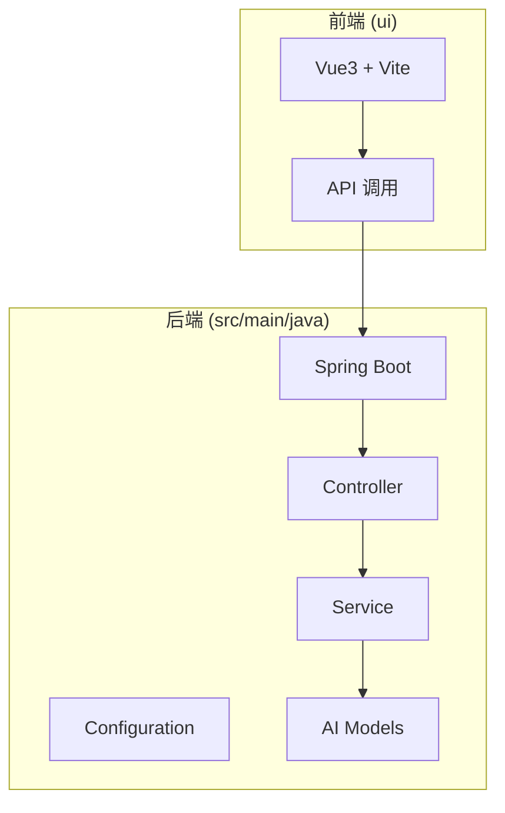
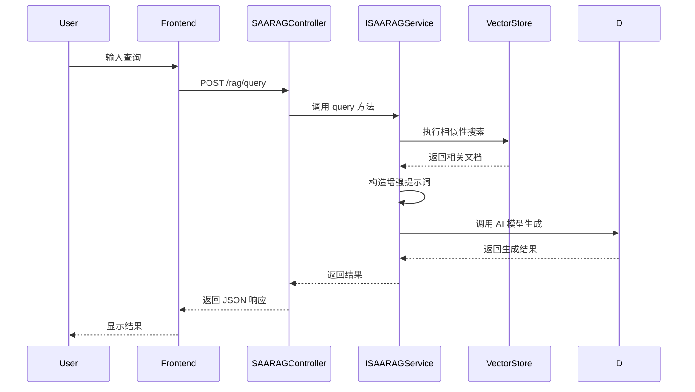
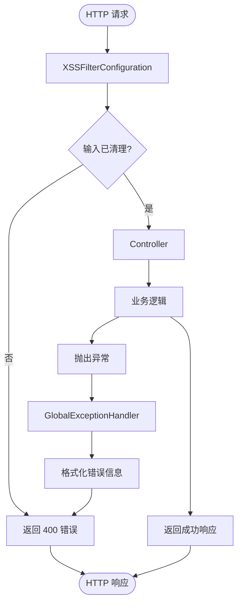
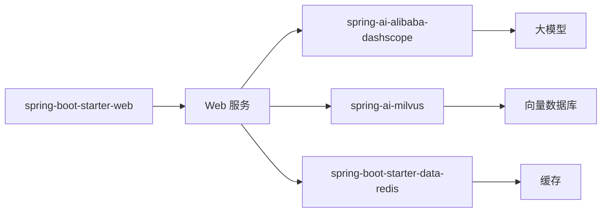

# 最佳实践

<cite>
**本文档中引用的文件**  
- [SAAPlayGroundApplication.java](file://spring-ai-alibaba-playground/src/main/java/com/alibaba/cloud/ai/application/SAAPlayGroundApplication.java)
- [application.yml](file://spring-ai-alibaba-playground/src/main/resources/application.yml)
- [ChatAiDemoApplication.java](file://spring-ai-alibaba-usecase-example/spring-ai-alibaba-comprehensive-example/src/main/java/com/touhouqing/chatAiDemo/ChatAiDemoApplication.java)
- [application.yaml](file://spring-ai-alibaba-usecase-example/spring-ai-alibaba-comprehensive-example/src/main/resources/application.yaml)
- [Dockerfile](file://spring-ai-alibaba-playground/Dockerfile)
- [README.md](file://spring-ai-alibaba-playground/README.md)
- [ReasoningContentAdvisor.java](file://spring-ai-alibaba-playground/src/main/java/com/alibaba/cloud/ai/application/advisor/ReasoningContentAdvisor.java)
- [XSSFilterConfiguration.java](file://spring-ai-alibaba-playground/src/main/java/com/alibaba/cloud/ai/application/config/XSSFilterConfiguration.java)
- [GlobalExceptionHandler.java](file://spring-ai-alibaba-playground/src/main/java/com/alibaba/cloud/ai/application/config/handler/GlobalExceptionHandler.java)
- [SAARAGController.java](file://spring-ai-alibaba-playground/src/main/java/com/alibaba/cloud/ai/application/controller/SAARAGController.java)
- [SAAChatController.java](file://spring-ai-alibaba-playground/src/main/java/com/alibaba/cloud/ai/application/controller/SAAChatController.java)
- [SAAMcpController.java](file://spring-ai-alibaba-playground/src/main/java/com/alibaba/cloud/ai/application/controller/SAAMcpController.java)
- [DeepThinkPromptTemplateConfig.java](file://spring-ai-alibaba-playground/src/main/java/com/alibaba/cloud/ai/application/config/prompt/DeepThinkPromptTemplateConfig.java)
- [WeSearchConfiguration.java](file://spring-ai-alibaba-playground/src/main/java/com/alibaba/cloud/ai/application/config/WeSearchConfiguration.java)
</cite>

## 目录
1. [简介](#简介)
2. [项目结构](#项目结构)
3. [核心组件](#核心组件)
4. [架构概述](#架构概述)
5. [详细组件分析](#详细组件分析)
6. [依赖分析](#依赖分析)
7. [性能考虑](#性能考虑)
8. [故障排除指南](#故障排除指南)
9. [结论](#结论)

## 简介
本文档旨在为使用 Spring AI Alibaba 的开发者提供一套全面的最佳实践指南。基于 `spring-ai-alibaba-playground` 和 `spring-ai-alibaba-comprehensive-example` 等综合性示例，本文提炼出可复用的设计模式、架构决策和优化策略。内容涵盖性能优化、错误处理、安全实践以及针对不同经验水平开发者的指导建议。

## 项目结构
`spring-ai-alibaba-playground` 是一个功能齐全的综合示例，集成了聊天、RAG（检索增强生成）、工具调用、MCP（Model Context Protocol）、音视频处理等多种 AI 能力。其结构清晰，分为后端（Spring Boot）和前端（Vue3 + Vite）两部分。



**图示来源**
- [SAAPlayGroundApplication.java](file://spring-ai-alibaba-playground/src/main/java/com/alibaba/cloud/ai/application/SAAPlayGroundApplication.java)
- [ui/src/main.ts](file://spring-ai-alibaba-playground/ui/src/main.ts)

**本节来源**
- [spring-ai-alibaba-playground](file://spring-ai-alibaba-playground)

## 核心组件
该项目的核心组件包括：
- **SAAPlayGroundApplication**: Spring Boot 主启动类。
- **控制器层**: 如 `SAAChatController`、`SAARAGController`、`SAAMcpController`，负责处理 HTTP 请求。
- **服务层**: 实现核心业务逻辑，如 `SAAChatService`、`SAARAGService`。
- **配置类**: 如 `WeSearchConfiguration`、`XSSFilterConfiguration`，用于集成外部服务和安全过滤。
- **工具类**: 集成百度地图、翻译等外部工具。

**本节来源**
- [SAAPlayGroundApplication.java](file://spring-ai-alibaba-playground/src/main/java/com/alibaba/cloud/ai/application/SAAPlayGroundApplication.java)
- [SAAChatController.java](file://spring-ai-alibaba-playground/src/main/java/com/alibaba/cloud/ai/application/controller/SAAChatController.java)
- [SAARAGController.java](file://spring-ai-alibaba-playground/src/main/java/com/alibaba/cloud/ai/application/controller/SAARAGController.java)
- [SAAMcpController.java](file://spring-ai-alibaba-playground/src/main/java/com/alibaba/cloud/ai/application/controller/SAAMcpController.java)

## 架构概述
系统采用典型的前后端分离架构。前端通过 RESTful API 与后端交互。后端基于 Spring Boot，利用 Spring AI Alibaba 的能力与大模型（如通义千问）进行交互。关键架构决策包括：
- **模块化设计**: 将不同功能（聊天、RAG、工具调用）分离到不同的 Controller 和 Service 中。
- **配置驱动**: 使用 `application.yml` 集中管理模型 API Key、向量数据库连接等配置。
- **安全集成**: 内置 XSS 过滤和全局异常处理。

```mermaid
graph TD
A[用户] --> B[前端 UI]
B --> C[后端 API]
C --> D[Spring AI Alibaba]
D --> E[大模型 (如 Qwen)]
D --> F[向量数据库 (如 Milvus)]
D --> G[外部工具 (如 MCP)]
C --> H[全局异常处理器]
C --> I[XSS 过滤器]
```

**图示来源**
- [SAAPlayGroundApplication.java](file://spring-ai-alibaba-playground/src/main/java/com/alibaba/cloud/ai/application/SAAPlayGroundApplication.java)
- [GlobalExceptionHandler.java](file://spring-ai-alibaba-playground/src/main/java/com/alibaba/cloud/ai/application/config/handler/GlobalExceptionHandler.java)
- [XSSFilterConfiguration.java](file://spring-ai-alibaba-playground/src/main/java/com/alibaba/cloud/ai/application/config/XSSFilterConfiguration.java)

## 详细组件分析

### RAG 组件分析
RAG 功能通过 `SAARAGController` 和 `ISAARAGService` 实现。它支持从本地知识库（如 Markdown 文件）或向量数据库中检索信息，并将其注入提示词以增强生成效果。



**图示来源**
- [SAARAGController.java](file://spring-ai-alibaba-playground/src/main/java/com/alibaba/cloud/ai/application/controller/SAARAGController.java)
- [ISAARAGService.java](file://spring-ai-alibaba-playground/src/main/java/com/alibaba/cloud/ai/application/service/ISAARAGService.java)

**本节来源**
- [SAARAGController.java](file://spring-ai-alibaba-playground/src/main/java/com/alibaba/cloud/ai/application/controller/SAARAGController.java)
- [modulerag](file://spring-ai-alibaba-playground/src/main/java/com/alibaba/cloud/ai/application/modulerag)

### 安全组件分析
安全是系统的重要组成部分。`XSSFilterConfiguration` 配置了一个过滤器，防止跨站脚本攻击。`GlobalExceptionHandler` 则统一处理所有未捕获的异常，确保返回格式化的错误信息。



**图示来源**
- [XSSFilterConfiguration.java](file://spring-ai-alibaba-playground/src/main/java/com/alibaba/cloud/ai/application/config/XSSFilterConfiguration.java)
- [GlobalExceptionHandler.java](file://spring-ai-alibaba-playground/src/main/java/com/alibaba/cloud/ai/application/config/handler/GlobalExceptionHandler.java)

**本节来源**
- [XSSFilterConfiguration.java](file://spring-ai-alibaba-playground/src/main/java/com/alibaba/cloud/ai/application/config/XSSFilterConfiguration.java)
- [GlobalExceptionHandler.java](file://spring-ai-alibaba-playground/src/main/java/com/alibaba/cloud/ai/application/config/handler/GlobalExceptionHandler.java)

## 依赖分析
项目通过 `pom.xml` 管理依赖。关键依赖包括：
- `spring-boot-starter-web`: 提供 Web 功能。
- `spring-ai-alibaba-dashscope-spring-boot-starter`: 集成通义千问模型。
- `spring-ai-milvus-spring-boot-starter`: 集成 Milvus 向量数据库。
- `spring-boot-starter-data-redis`: 提供 Redis 支持，可用于缓存。



**图示来源**
- [pom.xml](file://spring-ai-alibaba-playground/pom.xml)

**本节来源**
- [pom.xml](file://spring-ai-alibaba-playground/pom.xml)

## 性能考虑
为了优化性能，可以采取以下策略：
- **缓存机制**: 使用 Redis 缓存频繁查询的 RAG 结果或模型响应。
- **异步处理**: 对于耗时的 MCP 调用或文件处理，使用 `@Async` 注解进行异步执行。
- **批处理**: 在需要处理大量数据时（如文档索引），实现批处理逻辑以减少 I/O 开销。

## 故障排除指南
常见问题及解决方案：
- **API Key 错误**: 确保在 `application.yml` 中正确配置了 `AI_DASHSCOPE_API_KEY` 环境变量。
- **向量数据库连接失败**: 检查 `application.yaml` 中的 Milvus 连接配置（主机、端口、数据库名）。
- **MCP 工具未加载**: 确认 MCP 服务的 JAR 包已放置在 `mcp-libs` 目录下，并且服务已启动。

**本节来源**
- [application.yml](file://spring-ai-alibaba-playground/src/main/resources/application.yml)
- [application.yaml](file://spring-ai-alibaba-usecase-example/spring-ai-alibaba-comprehensive-example/src/main/resources/application.yaml)
- [mcp-libs](file://spring-ai-alibaba-playground/mcp-libs)

## 结论
通过分析 `spring-ai-alibaba-playground` 和 `comprehensive-example`，我们总结了一套在实际项目中使用 Spring AI Alibaba 的最佳实践。这些实践涵盖了从项目结构、核心组件设计到性能优化和安全防护的各个方面。遵循这些指南，可以帮助开发者构建出高效、稳定且安全的 AI 应用。