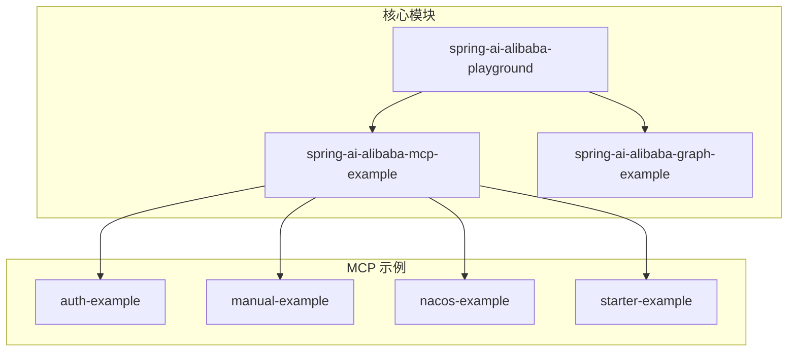
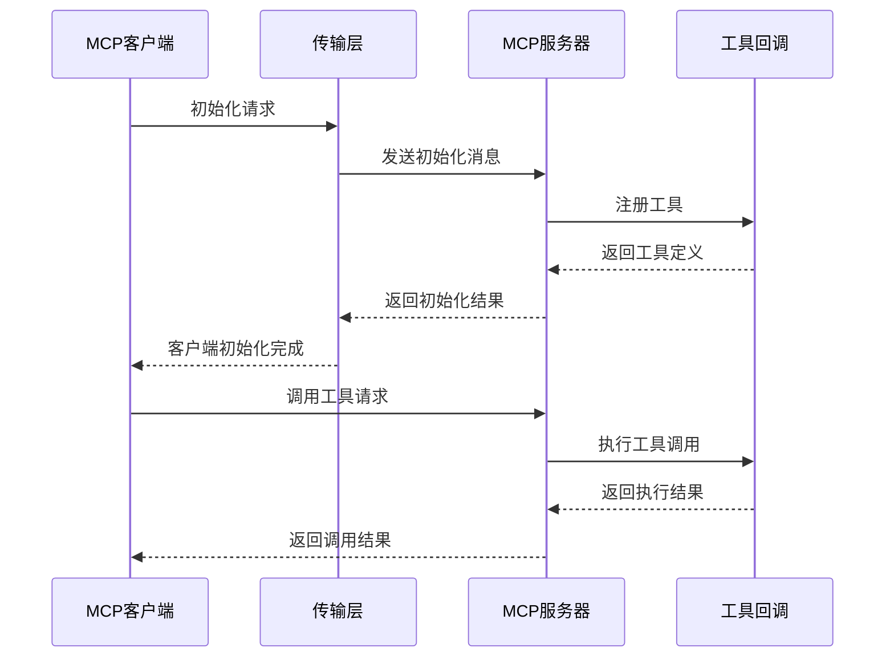
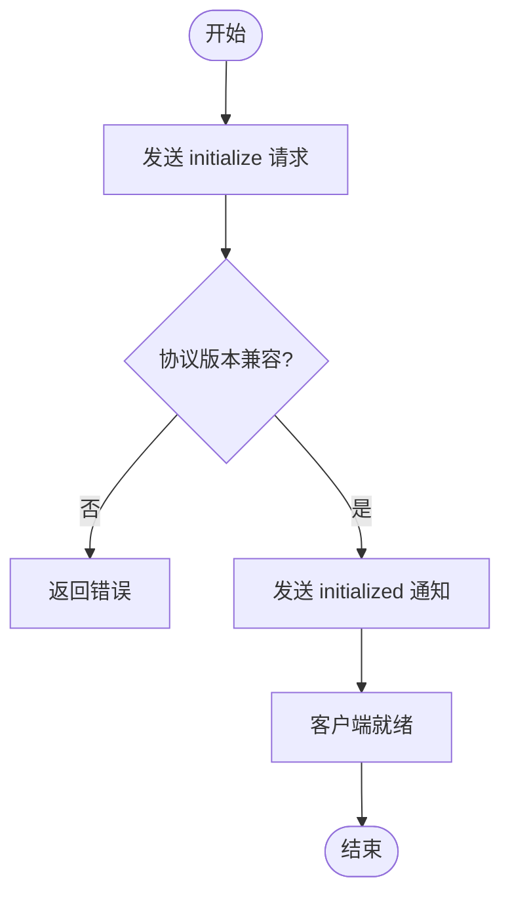
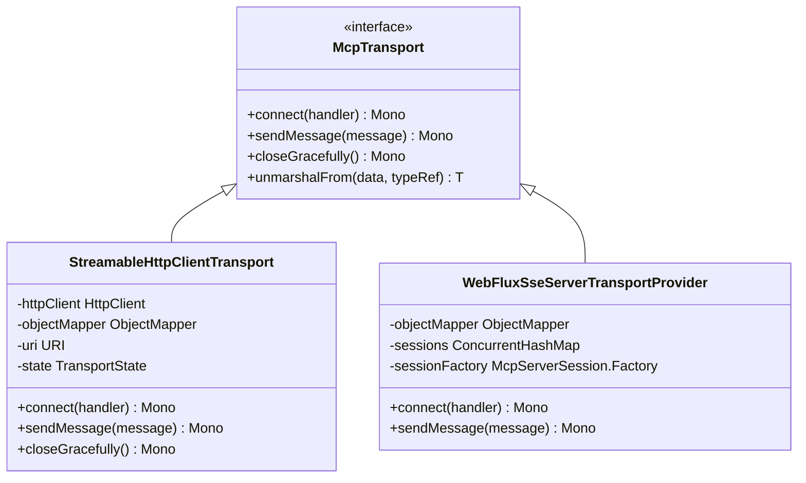
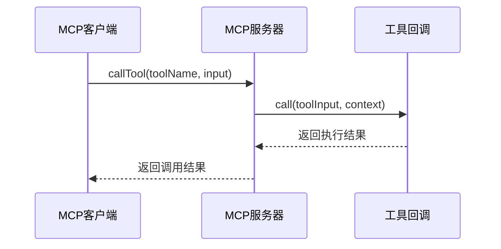
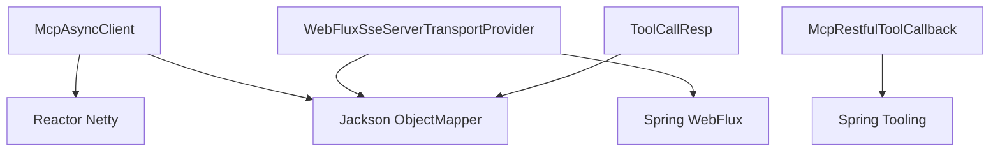

# MCP协议

<cite>
**本文档引用的文件**
- [SAAPlayGroundApplication.java](file://spring-ai-alibaba-playground/src/main/java/com/alibaba/cloud/ai/application/SAAPlayGroundApplication.java)
- [McpServerContainer.java](file://spring-ai-alibaba-playground/src/main/java/com/alibaba/cloud/ai/application/mcp/McpServerContainer.java)
- [AuthServerApplication.java](file://spring-ai-alibaba-mcp-example/spring-ai-alibaba-mcp-auth-example/server/mcp-auth-server/src/main/java/com/alibaba/cloud/ai/mcp/server/AuthServerApplication.java)
- [AuthClientApplication.java](file://spring-ai-alibaba-mcp-example/spring-ai-alibaba-mcp-auth-example/client/mcp-auth-client/src/main/java/com/alibaba/cloud/ai/mcp/client/AuthClientApplication.java)
- [Application.java](file://spring-ai-alibaba-mcp-example/spring-ai-alibaba-mcp-manual-example/ai-mcp-fileserver/src/main/java/com/alibaba/cloud/ai/mcp/samples/filesystem/Application.java)
- [McpAsyncClient.java](file://spring-ai-alibaba-mcp-example/spring-ai-alibaba-mcp-starter-example/client/mcp-streamable-client-example/src/main/java/io/modelcontextprotocol/client/McpAsyncClient.java)
- [WebFluxSseServerTransportProvider.java](file://spring-ai-alibaba-mcp-example/spring-ai-alibaba-mcp-auth-example/server/mcp-auth-server/src/main/java/io/modelcontextprotocol/server/transport/WebFluxSseServerTransportProvider.java)
- [StreamableHttpClientTransport.java](file://spring-ai-alibaba-mcp-example/spring-ai-alibaba-mcp-starter-example/client/mcp-streamable-client-example/src/main/java/io/modelcontextprotocol/client/transport/StreamableHttpClientTransport.java)
- [McpRestfulToolCallback.java](file://spring-ai-alibaba-mcp-example/spring-ai-alibaba-mcp-auth-example/server/mcp-auth-server/src/main/java/org/springframework/ai/mcp/McpRestfulToolCallback.java)
- [ToolCallResp.java](file://spring-ai-alibaba-playground/src/main/java/com/alibaba/cloud/ai/application/entity/tools/ToolCallResp.java)
- [SAAMcpService.java](file://spring-ai-alibaba-playground/src/main/java/com/alibaba/cloud/ai/application/service/SAAMcpService.java)
</cite>

## 目录
1. [引言](#引言)
2. [项目结构](#项目结构)
3. [核心组件](#核心组件)
4. [架构概述](#架构概述)
5. [详细组件分析](#详细组件分析)
6. [依赖分析](#依赖分析)
7. [性能考虑](#性能考虑)
8. [故障排除指南](#故障排除指南)
9. [结论](#结论)

## 引言
MCP（Model Context Protocol）协议是一种用于AI模型与外部工具、服务之间进行标准化通信的协议。本文档旨在全面解析MCP协议的设计原理、核心概念及其在Spring AI Alibaba项目中的实现方式。通过以SAAPlayGroundApplication为入口，深入探讨MCP客户端和服务器的启动、注册与发现机制，并结合McpServerContainer类说明如何管理多个MCP服务器实例及其生命周期。此外，还将阐述MCP的消息格式、传输机制（如SSE、STDIO）以及工具调用流程，展示McpAsyncClient如何与MCP服务器进行异步通信，包括请求的序列化、发送和响应处理。

## 项目结构
本项目的结构围绕Spring Boot微服务架构展开，主要分为playground、mcp-example、graph-example等多个模块。其中，`spring-ai-alibaba-playground`作为主应用入口，集成了MCP客户端与服务器功能；`spring-ai-alibaba-mcp-example`则提供了多种MCP实现示例，涵盖认证、手动配置、Nacos注册等场景。



**图示来源**
- [SAAPlayGroundApplication.java](file://spring-ai-alibaba-playground/src/main/java/com/alibaba/cloud/ai/application/SAAPlayGroundApplication.java)
- [项目结构](file://.)

**本节来源**
- [SAAPlayGroundApplication.java](file://spring-ai-alibaba-playground/src/main/java/com/alibaba/cloud/ai/application/SAAPlayGroundApplication.java)
- [项目结构](file://.)

## 核心组件
MCP协议的核心组件包括MCP客户端、MCP服务器、工具回调（ToolCallback）、传输层（Transport）和会话管理（Session）。这些组件共同构成了一个可扩展、模块化的AI系统通信框架。

**本节来源**
- [McpAsyncClient.java](file://spring-ai-alibaba-mcp-example/spring-ai-alibaba-mcp-starter-example/client/mcp-streamable-client-example/src/main/java/io/modelcontextprotocol/client/McpAsyncClient.java)
- [WebFluxSseServerTransportProvider.java](file://spring-ai-alibaba-mcp-example/spring-ai-alibaba-mcp-auth-example/server/mcp-auth-server/src/main/java/io/modelcontextprotocol/server/transport/WebFluxSseServerTransportProvider.java)

## 架构概述
MCP协议采用客户端-服务器模型，支持多种传输方式（如SSE、STDIO、HTTP流式），并通过JSON-RPC进行消息交换。客户端通过`McpAsyncClient`发起连接，服务器端使用`WebFluxSseServerTransportProvider`接收请求并处理。



**图示来源**
- [McpAsyncClient.java](file://spring-ai-alibaba-mcp-example/spring-ai-alibaba-mcp-starter-example/client/mcp-streamable-client-example/src/main/java/io/modelcontextprotocol/client/McpAsyncClient.java)
- [WebFluxSseServerTransportProvider.java](file://spring-ai-alibaba-mcp-example/spring-ai-alibaba-mcp-auth-example/server/mcp-auth-server/src/main/java/io/modelcontextprotocol/server/transport/WebFluxSseServerTransportProvider.java)

## 详细组件分析

### MCP客户端与服务器启动机制
MCP客户端通过`McpAsyncClient`类实现异步通信，支持SSE和流式HTTP两种传输方式。客户端在初始化时发送`initialize`请求，包含协议版本、客户端能力及实现信息。服务器响应后，客户端发送`initialized`通知，进入正常操作阶段。

#### 客户端初始化流程


**图示来源**
- [McpAsyncClient.java](file://spring-ai-alibaba-mcp-example/spring-ai-alibaba-mcp-starter-example/client/mcp-streamable-client-example/src/main/java/io/modelcontextprotocol/client/McpAsyncClient.java)

**本节来源**
- [McpAsyncClient.java](file://spring-ai-alibaba-mcp-example/spring-ai-alibaba-mcp-starter-example/client/mcp-streamable-client-example/src/main/java/io/modelcontextprotocol/client/McpAsyncClient.java)
- [AuthClientApplication.java](file://spring-ai-alibaba-mcp-example/spring-ai-alibaba-mcp-auth-example/client/mcp-auth-client/src/main/java/com/alibaba/cloud/ai/mcp/client/AuthClientApplication.java)

### McpServerContainer 类分析
`McpServerContainer`是一个静态容器类，用于管理所有MCP服务器实例。它提供添加、移除、查询服务器的功能，确保在整个应用生命周期内对MCP服务器的统一管理。

```java
public class McpServerContainer {
    private static final List<McpServer> mcpServerContainer = new ArrayList<>();

    public static void addServer(McpServer server) {
        mcpServerContainer.add(server);
    }

    public static boolean removeServerById(String id) {
        return mcpServerContainer.removeIf(server -> server.getId().equals(id));
    }

    public static Optional<McpServer> getServerById(String id) {
        return mcpServerContainer.stream()
                .filter(server -> server.getId().equals(id))
                .findFirst();
    }
}
```

**本节来源**
- [McpServerContainer.java](file://spring-ai-alibaba-playground/src/main/java/com/alibaba/cloud/ai/application/mcp/McpServerContainer.java)

### MCP消息格式与传输机制
MCP协议基于JSON-RPC 2.0规范，定义了标准的消息结构，包括请求、响应和通知。传输层支持SSE（Server-Sent Events）和STDIO两种模式。

#### 传输层实现


**图示来源**
- [StreamableHttpClientTransport.java](file://spring-ai-alibaba-mcp-example/spring-ai-alibaba-mcp-starter-example/client/mcp-streamable-client-example/src/main/java/io/modelcontextprotocol/client/transport/StreamableHttpClientTransport.java)
- [WebFluxSseServerTransportProvider.java](file://spring-ai-alibaba-mcp-example/spring-ai-alibaba-mcp-auth-example/server/mcp-auth-server/src/main/java/io/modelcontextprotocol/server/transport/WebFluxSseServerTransportProvider.java)

**本节来源**
- [StreamableHttpClientTransport.java](file://spring-ai-alibaba-mcp-example/spring-ai-alibaba-mcp-starter-example/client/mcp-streamable-client-example/src/main/java/io/modelcontextprotocol/client/transport/StreamableHttpClientTransport.java)
- [WebFluxSseServerTransportProvider.java](file://spring-ai-alibaba-mcp-example/spring-ai-alibaba-mcp-auth-example/server/mcp-auth-server/src/main/java/io/modelcontextprotocol/server/transport/WebFluxSseServerTransportProvider.java)

### 工具调用流程
MCP服务器通过`McpRestfulToolCallback`实现RESTful风格的工具调用。当客户端请求调用某个工具时，服务器解析参数并执行对应逻辑。



**图示来源**
- [McpRestfulToolCallback.java](file://spring-ai-alibaba-mcp-example/spring-ai-alibaba-mcp-auth-example/server/mcp-auth-server/src/main/java/org/springframework/ai/mcp/McpRestfulToolCallback.java)

**本节来源**
- [McpRestfulToolCallback.java](file://spring-ai-alibaba-mcp-example/spring-ai-alibaba-mcp-auth-example/server/mcp-auth-server/src/main/java/org/springframework/ai/mcp/McpRestfulToolCallback.java)
- [SAAMcpService.java](file://spring-ai-alibaba-playground/src/main/java/com/alibaba/cloud/ai/application/service/SAAMcpService.java)

## 依赖分析
MCP协议的实现依赖于Spring Boot、Reactor、Jackson等核心库。客户端与服务器之间通过JSON序列化进行数据交换，使用`ObjectMapper`完成对象与JSON的转换。



**图示来源**
- [McpAsyncClient.java](file://spring-ai-alibaba-mcp-example/spring-ai-alibaba-mcp-starter-example/client/mcp-streamable-client-example/src/main/java/io/modelcontextprotocol/client/McpAsyncClient.java)
- [WebFluxSseServerTransportProvider.java](file://spring-ai-alibaba-mcp-example/spring-ai-alibaba-mcp-auth-example/server/mcp-auth-server/src/main/java/io/modelcontextprotocol/server/transport/WebFluxSseServerTransportProvider.java)

**本节来源**
- [McpAsyncClient.java](file://spring-ai-alibaba-mcp-example/spring-ai-alibaba-mcp-starter-example/client/mcp-streamable-client-example/src/main/java/io/modelcontextprotocol/client/McpAsyncClient.java)
- [WebFluxSseServerTransportProvider.java](file://spring-ai-alibaba-mcp-example/spring-ai-alibaba-mcp-auth-example/server/mcp-auth-server/src/main/java/io/modelcontextprotocol/server/transport/WebFluxSseServerTransportProvider.java)

## 性能考虑
MCP协议在设计上注重性能与可靠性：
- 使用异步非阻塞IO（Reactor模式）提升并发处理能力
- 支持连接复用与长连接，减少握手开销
- 提供超时控制与重试机制，增强容错性
- 支持流式传输，适用于大消息场景

## 故障排除指南
常见问题及解决方案：
- **连接失败**：检查服务器是否启动，端口是否开放
- **协议版本不匹配**：确认客户端与服务器支持的协议版本一致
- **工具调用失败**：检查工具参数是否符合JSON Schema定义
- **SSE回退**：当流式HTTP不可用时，自动降级为SSE模式

**本节来源**
- [McpAsyncClient.java](file://spring-ai-alibaba-mcp-example/spring-ai-alibaba-mcp-starter-example/client/mcp-streamable-client-example/src/main/java/io/modelcontextprotocol/client/McpAsyncClient.java)
- [StreamableHttpClientTransport.java](file://spring-ai-alibaba-mcp-example/spring-ai-alibaba-mcp-starter-example/client/mcp-streamable-client-example/src/main/java/io/modelcontextprotocol/client/transport/StreamableHttpClientTransport.java)

## 结论
MCP协议为AI系统提供了一种标准化、可扩展的通信机制，支持多种传输方式和工具集成。通过Spring AI Alibaba的实现，开发者可以轻松构建模块化、可插拔的AI应用。未来可进一步优化连接管理、增加安全认证机制，并支持更多传输协议。