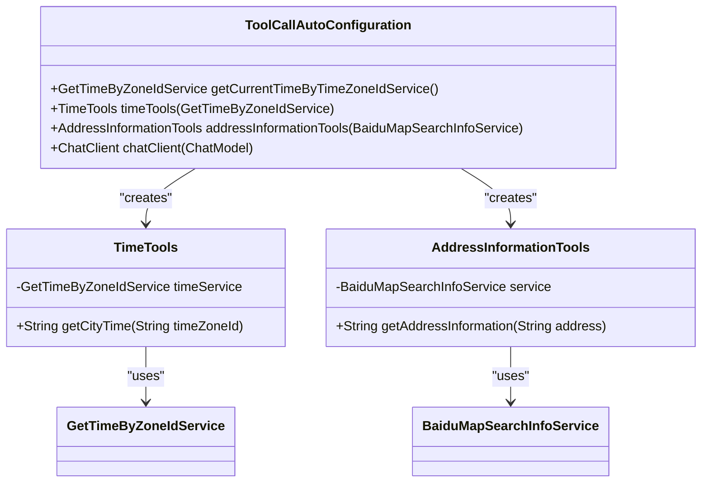
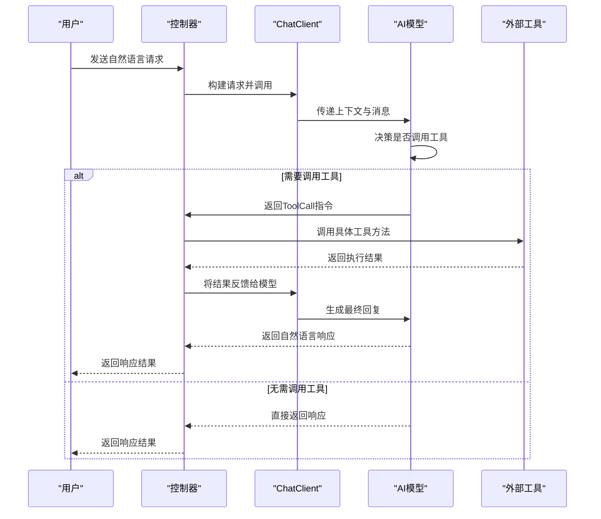

# 工具调用

<cite>
**本文档中引用的文件**  
- [TimeTools.java](file://spring-ai-alibaba-tool-calling-example/src/main/java/com/alibaba/cloud/ai/toolcall/component/TimeTools.java)
- [AddressInformationTools.java](file://spring-ai-alibaba-tool-calling-example/src/main/java/com/alibaba/cloud/ai/toolcall/component/AddressInformationTools.java)
- [ToolCallAutoConfiguration.java](file://spring-ai-alibaba-tool-calling-example/src/main/java/com/alibaba/cloud/ai/toolcall/config/ToolCallAutoConfiguration.java)
- [application.yml](file://spring-ai-alibaba-tool-calling-example/src/main/resources/application.yml)
- [ToolCallingApplication.java](file://spring-ai-alibaba-tool-calling-example/src/main/java/com/alibaba/cloud/ai/toolcall/ToolCallingApplication.java)
- [TimeController.java](file://spring-ai-alibaba-tool-calling-example/src/main/java/com/alibaba/cloud/ai/toolcall/controller/TimeController.java)
- [AddressController.java](file://spring-ai-alibaba-tool-calling-example/src/main/java/com/alibaba/cloud/ai/toolcall/controller/AddressController.java)
</cite>

## 目录
1. [引言](#引言)
2. [工具定义与注解机制](#工具定义与注解机制)
3. [工具注册与自动配置](#工具注册与自动配置)
4. [控制器层处理流程](#控制器层处理流程)
5. [数据流分析：从用户输入到工具调用](#数据流分析从用户输入到工具调用)
6. [工具实现示例分析](#工具实现示例分析)
7. [配置与依赖注入](#配置与依赖注入)
8. [最佳实践建议](#最佳实践建议)
9. [结论](#结论)

## 引言
本文档详细阐述了在Spring AI Alibaba框架中如何实现外部工具的定义、注册和调用机制。通过`TimeTools`和`AddressInformationTools`两个核心示例，深入解析了基于注解的工具方法创建方式，以及这些工具如何被AI模型发现并触发执行。同时，文档还分析了`ToolCallAutoConfiguration`中的自动配置逻辑，涵盖工具扫描、注册和依赖注入全过程，并展示了从用户请求到AI决策再到工具执行的完整数据流。

## 工具定义与注解机制
在Spring AI Alibaba中，外部工具通过`@Tool`和`@ToolParam`注解进行声明，使得AI模型能够理解其功能和参数结构。

### 工具方法定义
使用`@Tool`注解标记公共方法，使其可被AI代理识别为可调用工具。该注解的`description`属性用于描述工具用途，供AI模型在决策时参考。

### 参数描述机制
通过`@ToolParam`注解对方法参数进行说明，帮助AI模型理解每个参数的语义和预期值格式，例如时区ID或地址名称。

**Section sources**
- [TimeTools.java](file://spring-ai-alibaba-tool-calling-example/src/main/java/com/alibaba/cloud/ai/toolcall/component/TimeTools.java#L21-L36)
- [AddressInformationTools.java](file://spring-ai-alibaba-tool-calling-example/src/main/java/com/alibaba/cloud/ai/toolcall/component/AddressInformationTools.java#L19-L32)

## 工具注册与自动配置
Spring AI Alibaba通过`ToolCallAutoConfiguration`类实现工具的自动装配与注册，确保所有标记为工具的组件能被正确初始化并注入到AI上下文中。

### 自动配置条件
`@ConditionalOnClass(GetTimeByZoneIdService.class)`确保仅当特定服务类存在时才启用该配置，提升系统的模块化和可扩展性。

### 工具Bean注册
通过`@Bean`注解将`TimeTools`和`AddressInformationTools`注册为Spring容器管理的Bean，实现依赖注入和生命周期管理。



**Diagram sources**
- [ToolCallAutoConfiguration.java](file://spring-ai-alibaba-tool-calling-example/src/main/java/com/alibaba/cloud/ai/toolcall/config/ToolCallAutoConfiguration.java#L28-L54)

**Section sources**
- [ToolCallAutoConfiguration.java](file://spring-ai-alibaba-tool-calling-example/src/main/java/com/alibaba/cloud/ai/toolcall/config/ToolCallAutoConfiguration.java#L1-L55)

## 控制器层处理流程
控制器层负责接收用户请求，调用AI模型，并处理包含工具调用的对话响应。

### 请求入口
控制器如`TimeController`和`AddressController`暴露REST API端点，接收用户输入的自然语言查询。

### AI模型交互
通过`ChatClient`与AI模型进行交互，传递对话历史和上下文，触发模型对是否需要调用工具做出判断。

**Section sources**
- [TimeController.java](file://spring-ai-alibaba-tool-calling-example/src/main/java/com/alibaba/cloud/ai/toolcall/controller/TimeController.java)
- [AddressController.java](file://spring-ai-alibaba-tool-calling-example/src/main/java/com/alibaba/cloud/ai/toolcall/controller/AddressController.java)

## 数据流分析从用户输入到工具调用
完整的工具调用流程涉及多个组件协同工作，形成闭环的数据流动。



**Diagram sources**
- [TimeController.java](file://spring-ai-alibaba-tool-calling-example/src/main/java/com/alibaba/cloud/ai/toolcall/controller/TimeController.java)
- [TimeTools.java](file://spring-ai-alibaba-tool-calling-example/src/main/java/com/alibaba/cloud/ai/toolcall/component/TimeTools.java)

## 工具实现示例分析
以`TimeTools`和`AddressInformationTools`为例，分析其内部实现机制。

### TimeTools实现
`getCityTime`方法接受时区ID作为参数，调用`GetTimeByZoneIdService`获取指定城市的时间信息，并返回格式化描述。

### AddressInformationTools实现
`getAddressInformation`方法接收地址字符串，利用百度地图服务查询详细信息，并返回结果消息。

**Section sources**
- [TimeTools.java](file://spring-ai-alibaba-tool-calling-example/src/main/java/com/alibaba/cloud/ai/toolcall/component/TimeTools.java#L21-L36)
- [AddressInformationTools.java](file://spring-ai-alibaba-tool-calling-example/src/main/java/com/alibaba/cloud/ai/toolcall/component/AddressInformationTools.java#L19-L32)

## 配置与依赖注入
系统通过YAML配置文件和Spring依赖注入机制实现灵活的外部服务集成。

### application.yml配置
配置文件中启用了百度翻译、地图、时间、天气等服务，并通过环境变量注入密钥信息，保障安全性。

```yaml
spring:
  ai:
    alibaba:
      toolcalling:
        baidu:
          translate:
            enabled: true
            app-id: ${BAIDU_TRANSLATE_APP_ID}
            secret-key: ${BAIDU_TRANSLATE_SECRET_KEY}
          map:
            enabled: true
            apiKey: ${BAIDU_MAP_API_KEY}
        time:
          enabled: true
        weather:
          enabled: true
          api-key: ${WEATHER_API_KEY}
    dashscope:
      api-key: ${AI_DASHSCOPE_API_KEY}
```

**Section sources**
- [application.yml](file://spring-ai-alibaba-tool-calling-example/src/main/resources/application.yml#L1-L22)

## 最佳实践建议
为确保工具调用的稳定性与高效性，建议遵循以下最佳实践：

### 幂等性设计
确保工具方法在重复调用时不会产生副作用，便于重试机制实施。

### 超时控制
为外部服务调用设置合理的超时时间，防止因网络延迟导致整体响应阻塞。

### 结果缓存
对于频繁查询且变化不大的数据（如城市时间），可引入缓存机制减少重复请求。

### 错误处理
统一异常处理策略，返回结构化错误信息供AI模型理解和处理。

### 安全性考虑
敏感信息（如API密钥）应通过环境变量注入，避免硬编码。

## 结论
Spring AI Alibaba提供了完整的工具调用解决方案，通过注解驱动的方式简化了外部服务的集成。开发者只需关注业务逻辑实现，框架会自动完成工具发现、注册和调用过程。结合合理的配置与最佳实践，可构建出智能、可靠且高效的AI代理应用。