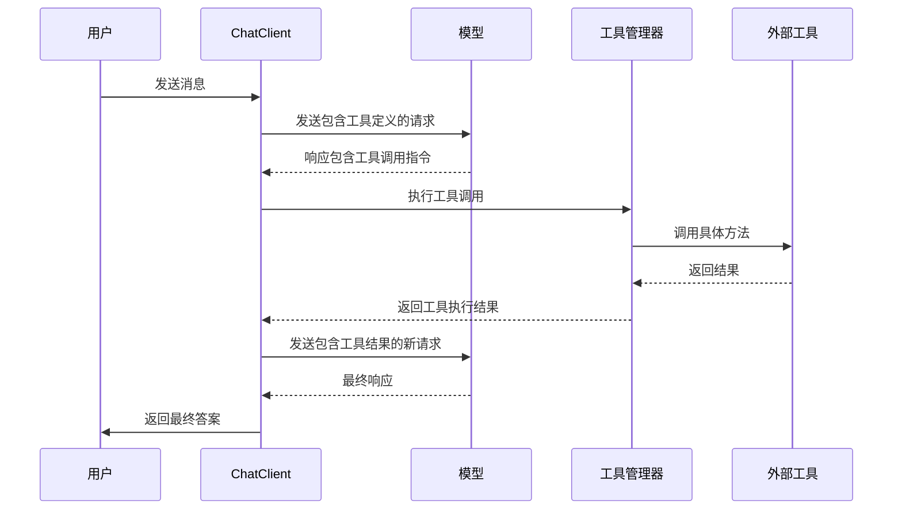

# 核心概念

<cite>
**本文档中引用的文件**   
- [DashScopeChatModelApplication.java](file://spring-ai-alibaba-chat-example/dashscope-chat/src/main/java/com/alibaba/cloud/ai/example/chat/dashscope/DashScopeChatModelApplication.java)
- [ToolCallingApplication.java](file://spring-ai-alibaba-tool-calling-example/src/main/java/com/alibaba/cloud/ai/toolcall/ToolCallingApplication.java)
- [SAAPlayGroundApplication.java](file://spring-ai-alibaba-playground/src/main/java/com/alibaba/cloud/ai/application/SAAPlayGroundApplication.java)
- [chat-client.md](file://spring-ai-alibaba-playground/src/main/resources/rag/markdown/chat-client.md)
- [structured-output.md](file://spring-ai-alibaba-playground/src/main/resources/rag/markdown/structured-output.md)
- [model-context-protocol.md](file://spring-ai-alibaba-playground/src/main/resources/rag/markdown/model-context-protocol.md)
- [MCP.md](file://spring-ai-alibaba-playground/src/main/resources/rag/markdown/MCP.md)
- [FunctionToolCallback.java](file://spring-ai-alibaba-graph-example/multiagent-openmanus/src/main/java/org/springframework/ai/tool/function/FunctionToolCallback.java)
- [McpAsyncClient.java](file://spring-ai-alibaba-mcp-example/spring-ai-alibaba-mcp-starter-example/client/mcp-streamable-client-example/src/main/java/io/modelcontextprotocol/client/McpAsyncClient.java)
- [ToolCallResp.java](file://spring-ai-alibaba-playground/src/main/java/com/alibaba/cloud/ai/application/entity/tools/ToolCallResp.java)
- [SAAMcpService.java](file://spring-ai-alibaba-playground/src/main/java/com/alibaba/cloud/ai/application/service/SAAMcpService.java)
</cite>

## 目录
1. [引言](#引言)
2. [ChatClient 与 ChatModel 抽象](#chatclient-与-chatmodel-抽象)
3. [工具调用机制](#工具调用机制)
4. [MCP 协议与集成框架](#mcp-协议与集成框架)
5. [组件交互与数据流](#组件交互与数据流)
6. [扩展点与最佳实践](#扩展点与最佳实践)
7. [结论](#结论)

## 引言
Spring AI Alibaba 提供了一套强大的抽象和设计模式，用于构建现代化的 AI 应用程序。本文档深入探讨其核心概念，包括 ChatClient 和 ChatModel 的设计、工具调用（Tool Calling）机制以及模型上下文协议（MCP）的应用。通过具体示例如 DashScopeChatModelApplication、ToolCallingApplication 和 SAAPlayGroundApplication，我们将揭示这些组件如何协同工作，形成一个灵活且可扩展的 AI 开发框架。

## ChatClient 与 ChatModel 抽象

Spring AI Alibaba 通过 `ChatClient` 和 `ChatModel` 两个核心抽象实现了与大语言模型的交互。`ChatModel` 代表底层的 AI 模型实现，负责实际的推理和响应生成；而 `ChatClient` 则提供了一个更高层次的、面向开发者的 API，简化了与模型的交互流程。

`ChatClient` 可以通过自动配置的 `ChatClient.Builder` 创建，也可以以编程方式构建。它支持链式调用语法，允许开发者以声明式的方式构造提示（prompt）、设置用户输入，并获取模型响应。例如，通过 `prompt().user(input).call().content()` 可以完成一次完整的对话请求。此外，`ChatClient` 还支持将模型响应转换为结构化对象，如通过 `.entity(ActorsFilms.class)` 将输出解析为特定的 Java 类型。

```mermaid
classDiagram
class ChatClient {
+prompt() PromptSpec
+call() Response
+stream() Stream
}
class ChatClient$Builder {
+build() ChatClient
+defaultToolCallbacks(ToolCallback[]) Builder
}
class ChatModel {
+call(Prompt) ChatResponse
+stream(Prompt) Stream~ChatResponse~
}
class Prompt {
+Message[] messages
+ChatOptions options
}
ChatClient --> ChatClient$Builder : "使用"
ChatClient --> ChatModel : "依赖"
ChatClient --> Prompt : "构造"
ChatModel --> Prompt : "接收"
```

**图示来源**
- [chat-client.md](file://spring-ai-alibaba-playground/src/main/resources/rag/markdown/chat-client.md#L23-L65)
- [structured-output.md](file://spring-ai-alibaba-playground/src/main/resources/rag/markdown/structured-output.md#L42-L81)

**本节来源**
- [DashScopeChatModelApplication.java](file://spring-ai-alibaba-chat-example/dashscope-chat/src/main/java/com/alibaba/cloud/ai/example/chat/dashscope/DashScopeChatModelApplication.java)
- [chat-client.md](file://spring-ai-alibaba-playground/src/main/resources/rag/markdown/chat-client.md#L23-L65)

## 工具调用机制

工具调用是 Spring AI Alibaba 中实现智能体（Agent）功能的关键机制。它允许 AI 模型在对话过程中动态调用外部 API 或执行本地函数，从而扩展其能力边界。

工具的定义基于 `FunctionToolCallback` 类，它封装了工具的元数据（如名称、描述、输入模式）和实际的执行逻辑（`BiFunction`）。开发者可以通过 `FunctionToolCallback.builder()` 静态方法便捷地创建工具回调，支持 `Supplier`、`Function`、`Consumer` 等多种函数式接口。

在运行时，`ChatClient` 会将注册的工具信息传递给模型。当模型决定调用某个工具时，框架会解析工具调用请求，反序列化输入参数，并执行对应的 `toolFunction`。执行结果再通过 `ToolCallResultConverter` 转换后返回给模型，作为后续推理的上下文。`ToolCallResp` 类用于跟踪工具调用的完整生命周期，包括开始时间、结束时间、执行耗时和结果状态。



**图示来源**
- [FunctionToolCallback.java](file://spring-ai-alibaba-graph-example/multiagent-openmanus/src/main/java/org/springframework/ai/tool/function/FunctionToolCallback.java#L62-L144)
- [ToolCallResp.java](file://spring-ai-alibaba-playground/src/main/java/com/alibaba/cloud/ai/application/entity/tools/ToolCallResp.java#L152-L223)
- [SAAMcpService.java](file://spring-ai-alibaba-playground/src/main/java/com/alibaba/cloud/ai/application/service/SAAMcpService.java#L113-L139)

**本节来源**
- [ToolCallingApplication.java](file://spring-ai-alibaba-tool-calling-example/src/main/java/com/alibaba/cloud/ai/toolcall/ToolCallingApplication.java)
- [FunctionToolCallback.java](file://spring-ai-alibaba-graph-example/multiagent-openmanus/src/main/java/org/springframework/ai/tool/function/FunctionToolCallback.java#L62-L227)

## MCP 协议与集成框架

模型上下文协议（Model Context Protocol, MCP）是一个开放标准，旨在规范应用程序如何向大型语言模型提供上下文、数据和工具。Spring AI Alibaba 通过集成 MCP，提供了一个强大的框架来构建复杂的智能体应用。

MCP 定义了客户端与服务器之间的标准化通信协议，支持多种传输机制（如 Stdio、SSE）。`McpAsyncClient` 是 MCP Java SDK 的核心组件，负责处理协议的初始化、能力协商、工具调用和资源订阅等生命周期管理。在初始化阶段，客户端和服务器交换各自支持的功能（capabilities），确保双方兼容。

`SAAPlayGroundApplication` 展示了 MCP 作为集成框架的作用。通过 `SyncMcpToolCallbackProvider`，可以将 MCP 服务器提供的远程工具无缝集成到 `ChatClient` 中。这使得本地 AI 应用能够访问和调用部署在远程服务器上的丰富工具集，极大地扩展了应用的功能。

```mermaid
graph TB
subgraph "AI 应用"
ChatClient[ChatClient]
McpClient[McpAsyncClient]
end
subgraph "MCP 生态"
McpServer[MCP Server]
Tool1[文件系统工具]
Tool2[GitHub 工具]
Tool3[数据库工具]
end
ChatClient --> McpClient : "注册工具回调"
McpClient --> McpServer : "初始化/调用工具"
McpServer --> Tool1
McpServer --> Tool2
McpServer --> Tool3
```

**图示来源**
- [MCP.md](file://spring-ai-alibaba-playground/src/main/resources/rag/markdown/MCP.md#L0-L62)
- [McpAsyncClient.java](file://spring-ai-alibaba-mcp-example/spring-ai-alibaba-mcp-starter-example/client/mcp-streamable-client-example/src/main/java/io/modelcontextprotocol/client/McpAsyncClient.java#L80-L126)
- [McpAsyncClient.java](file://spring-ai-alibaba-mcp-example/spring-ai-alibaba-mcp-starter-example/client/mcp-streamable-client-example/src/main/java/io/modelcontextprotocol/client/McpAsyncClient.java#L480-L527)

**本节来源**
- [SAAPlayGroundApplication.java](file://spring-ai-alibaba-playground/src/main/java/com/alibaba/cloud/ai/application/SAAPlayGroundApplication.java)
- [model-context-protocol.md](file://spring-ai-alibaba-playground/src/main/resources/rag/markdown/model-context-protocol.md#L0-L8)
- [McpAsyncClient.java](file://spring-ai-alibaba-mcp-example/spring-ai-alibaba-mcp-starter-example/client/mcp-streamable-client-example/src/main/java/io/modelcontextprotocol/client/McpAsyncClient.java#L290-L321)

## 组件交互与数据流

在 Spring AI Alibaba 框架中，各个核心组件通过清晰的职责划分和数据流进行交互。当一个用户请求到达时，`ChatClient` 首先构造一个包含上下文和用户输入的 `Prompt` 对象。该 `Prompt` 连同注册的工具定义一起被传递给底层的 `ChatModel`。

`ChatModel` 将 `Prompt` 转换为适合底层 AI 服务（如通义千问、百炼等）的格式并发送请求。AI 服务在推理过程中，如果需要调用外部工具，会返回一个包含工具调用指令的响应。`ChatClient` 接收到此响应后，会触发工具调用流程，通过 `ToolCallingManager` 查找并执行对应的 `FunctionToolCallback`。

工具执行的结果被格式化后，会作为新的上下文消息重新发送给 `ChatModel`，进行下一轮推理。这个过程可能迭代多次，直到模型生成最终的、无需工具调用的响应。整个数据流体现了“感知-思考-行动-观察”的智能体循环。

**本节来源**
- [ChatClient 与 ChatModel 抽象](#chatclient-与-chatmodel-抽象)
- [工具调用机制](#工具调用机制)
- [MCP 协议与集成框架](#mcp-协议与集成框架)

## 扩展点与最佳实践

Spring AI Alibaba 框架提供了多个扩展点，允许开发者根据需求进行定制：
- **自定义工具**：通过实现 `FunctionToolCallback` 可以轻松添加新的业务逻辑工具。
- **结果转换器**：可以通过 `ToolCallResultConverter` 自定义工具执行结果的序列化方式。
- **MCP 集成**：通过实现 MCP Server，可以将自己的服务暴露为可被 AI 模型调用的工具。
- **客户端配置**：`ChatClient.Builder` 允许禁用自动配置，以便为不同的模型创建独立的客户端实例。

最佳实践包括：为工具提供清晰的描述和输入模式以提高模型调用的准确性；合理管理工具调用的错误和超时；利用 MCP 协议构建模块化的、可复用的工具生态。

**本节来源**
- [FunctionToolCallback.java](file://spring-ai-alibaba-graph-example/multiagent-openmanus/src/main/java/org/springframework/ai/tool/function/FunctionToolCallback.java#L202-L227)
- [chat-client.md](file://spring-ai-alibaba-playground/src/main/resources/rag/markdown/chat-client.md#L40-L65)

## 结论
Spring AI Alibaba 通过精心设计的 `ChatClient`/`ChatModel` 抽象、灵活的工具调用机制和对 MCP 协议的深度集成，为开发者提供了一个强大且易于使用的 AI 应用开发框架。这些核心概念不仅降低了开发复杂 AI 应用的门槛，还通过标准化的协议促进了工具和数据的互联互通，为构建下一代智能应用奠定了坚实的基础。