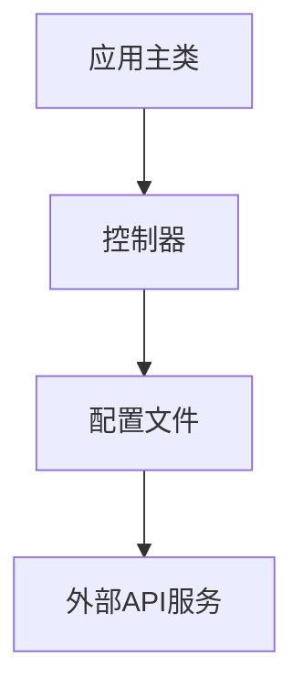
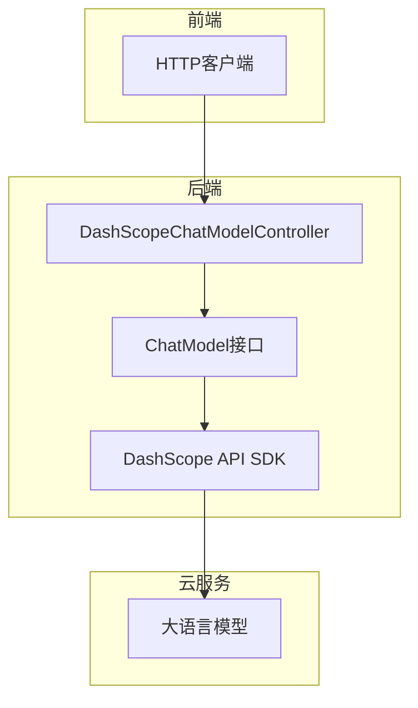
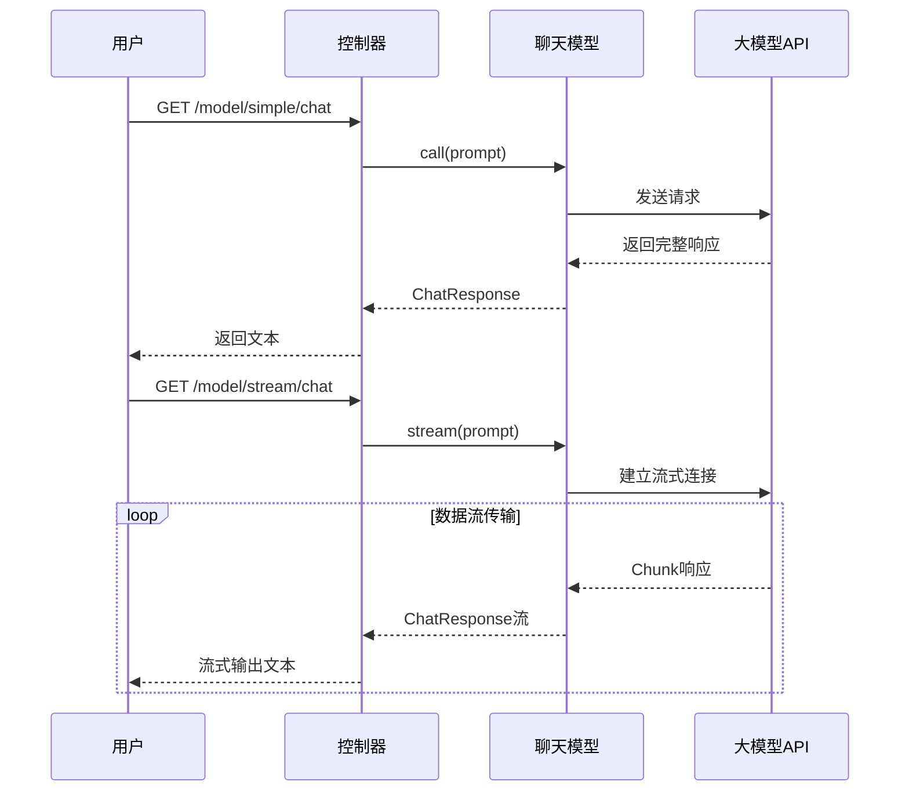
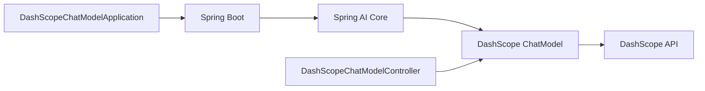

# 聊天模型

<cite>
**本文档中引用的文件**  
- [DashScopeChatModelApplication.java](file://spring-ai-alibaba-chat-example/dashscope-chat/src/main/java/com/alibaba/cloud/ai/example/chat/dashscope/DashScopeChatModelApplication.java)
- [DashScopeChatModelController.java](file://spring-ai-alibaba-chat-example/dashscope-chat/src/main/java/com/alibaba/cloud/ai/example/chat/dashscope/controller/DashScopeChatModelController.java)
- [application.yml](file://spring-ai-alibaba-chat-example/dashscope-chat/src/main/resources/application.yml)
</cite>

## 目录
1. [简介](#简介)
2. [项目结构](#项目结构)
3. [核心组件](#核心组件)
4. [架构概述](#架构概述)
5. [详细组件分析](#详细组件分析)
6. [依赖分析](#依赖分析)
7. [性能考虑](#性能考虑)
8. [故障排除指南](#故障排除指南)
9. [结论](#结论)

## 简介
本文档深入探讨了Spring AI Alibaba中聊天模型的设计与实现，重点分析`ChatClient`和`ChatModel`接口的核心机制。以`DashScopeChatModelApplication`为例，详细说明如何配置和初始化通义千问等大语言模型，涵盖API密钥设置、模型参数调优及基础环境搭建。文档还解析了控制器层（如`DashScopeChatModelController`）如何接收HTTP请求并调用聊天模型生成响应，比较不同模型（如通义千问、OpenAI、DeepSeek等）的集成方式与配置差异。通过实际代码示例展示同步/异步调用、流式响应处理和错误处理策略，并提供连接池优化与请求批处理等性能调优建议，为开发者提供从入门到进阶的完整指导。

## 项目结构
`dashscope-chat`示例项目遵循标准Spring Boot结构，包含应用主类、控制器和配置文件三大核心部分。主类负责启动Spring应用上下文，控制器暴露REST API接口，配置文件定义模型参数和系统属性。

**图示来源**  
- [DashScopeChatModelApplication.java](file://spring-ai-alibaba-chat-example/dashscope-chat/src/main/java/com/alibaba/cloud/ai/example/chat/dashscope/DashScopeChatModelApplication.java)
- [DashScopeChatModelController.java](file://spring-ai-alibaba-chat-example/dashscope-chat/src/main/java/com/alibaba/cloud/ai/example/chat/dashscope/controller/DashScopeChatModelController.java)
- [application.yml](file://spring-ai-alibaba-chat-example/dashscope-chat/src/main/resources/application.yml)

**本节来源**  
- [DashScopeChatModelApplication.java](file://spring-ai-alibaba-chat-example/dashscope-chat/src/main/java/com/alibaba/cloud/ai/example/chat/dashscope/DashScopeChatModelApplication.java)
- [DashScopeChatModelController.java](file://spring-ai-alibaba-chat-example/dashscope-chat/src/main/java/com/alibaba/cloud/ai/example/chat/dashscope/controller/DashScopeChatModelController.java)
- [application.yml](file://spring-ai-alibaba-chat-example/dashscope-chat/src/main/resources/application.yml)

## 核心组件
本项目核心组件包括：`DashScopeChatModelApplication`作为Spring Boot入口点，自动装配聊天模型；`DashScopeChatModelController`提供多种HTTP端点，支持简单调用、流式响应、自定义参数、联网搜索和请求头控制等功能；`application.yml`配置文件集中管理API密钥和服务端口等关键参数。

**本节来源**  
- [DashScopeChatModelApplication.java](file://spring-ai-alibaba-chat-example/dashscope-chat/src/main/java/com/alibaba/cloud/ai/example/chat/dashscope/DashScopeChatModelApplication.java)
- [DashScopeChatModelController.java](file://spring-ai-alibaba-chat-example/dashscope-chat/src/main/java/com/alibaba/cloud/ai/example/chat/dashscope/controller/DashScopeChatModelController.java)
- [application.yml](file://spring-ai-alibaba-chat-example/dashscope-chat/src/main/resources/application.yml)

## 架构概述
系统采用典型的Spring MVC三层架构：前端通过HTTP请求访问控制器，控制器调用由Spring AI框架封装的`ChatModel`接口，该接口底层集成阿里云百炼平台的DashScope API实现与大模型的通信。整个流程依赖Spring Boot自动配置机制完成组件注入。

**图示来源**  
- [DashScopeChatModelController.java](file://spring-ai-alibaba-chat-example/dashscope-chat/src/main/java/com/alibaba/cloud/ai/example/chat/dashscope/controller/DashScopeChatModelController.java)
- [DashScopeChatModelApplication.java](file://spring-ai-alibaba-chat-example/dashscope-chat/src/main/java/com/alibaba/cloud/ai/example/chat/dashscope/DashScopeChatModelApplication.java)

## 详细组件分析
### DashScopeChatModelController 分析
该控制器展示了多种与大模型交互的模式，包括同步调用、流式输出、Token统计、参数定制、联网搜索和安全过滤。

#### 同步与流式调用

**图示来源**  
- [DashScopeChatModelController.java](file://spring-ai-alibaba-chat-example/dashscope-chat/src/main/java/com/alibaba/cloud/ai/example/chat/dashscope/controller/DashScopeChatModelController.java#L30-L65)

#### 自定义参数与高级功能
控制器支持通过`DashScopeChatOptions`构建器模式设置`topP`、`topK`、`temperature`等生成参数，并可启用联网搜索（`enableSearch`）和自定义请求头（如内容安全检查`X-DashScope-DataInspection`），实现精细化控制。

**本节来源**  
- [DashScopeChatModelController.java](file://spring-ai-alibaba-chat-example/dashscope-chat/src/main/java/com/alibaba/cloud/ai/example/chat/dashscope/controller/DashScopeChatModelController.java#L1-L207)

## 依赖分析
项目依赖Spring AI核心模块与阿里云DashScope专用适配器，通过`spring-ai-dashscope-spring-boot-starter`实现自动配置。`ChatModel`接口由框架自动实例化并注入控制器。

**图示来源**  
- [DashScopeChatModelApplication.java](file://spring-ai-alibaba-chat-example/dashscope-chat/src/main/java/com/alibaba/cloud/ai/example/chat/dashscope/DashScopeChatModelApplication.java)
- [DashScopeChatModelController.java](file://spring-ai-alibaba-chat-example/dashscope-chat/src/main/java/com/alibaba/cloud/ai/example/chat/dashscope/controller/DashScopeChatModelController.java)

**本节来源**  
- [DashScopeChatModelApplication.java](file://spring-ai-alibaba-chat-example/dashscope-chat/src/main/java/com/alibaba/cloud/ai/example/chat/dashscope/DashScopeChatModelApplication.java)
- [DashScopeChatModelController.java](file://spring-ai-alibaba-chat-example/dashscope-chat/src/main/java/com/alibaba/cloud/ai/example/chat/dashscope/controller/DashScopeChatModelController.java)

## 性能考虑
为提升性能，建议启用连接池复用HTTP连接，使用流式接口减少用户等待时间，并合理设置`temperature`、`maxTokens`等参数控制响应长度。对于高频调用场景，可结合缓存机制避免重复请求。

## 故障排除指南
常见问题包括API密钥无效、网络不通、模型名称错误等。应确保`AI_DASHSCOPE_API_KEY`环境变量正确设置，检查日志级别为`debug`以获取详细请求信息，并验证模型ID是否支持当前功能（如`DEEPSEEK_V3`支持联网搜索）。

**本节来源**  
- [application.yml](file://spring-ai-alibaba-chat-example/dashscope-chat/src/main/resources/application.yml#L7-L18)
- [DashScopeChatModelController.java](file://spring-ai-alibaba-chat-example/dashscope-chat/src/main/java/com/alibaba/cloud/ai/example/chat/dashscope/controller/DashScopeChatModelController.java)

## 结论
本文档全面解析了Spring AI Alibaba中聊天模型的集成方案，展示了从基础配置到高级功能的完整使用路径。开发者可基于此示例快速构建支持多模型、高性能、可扩展的AI应用，充分发挥大语言模型在实际业务中的价值。