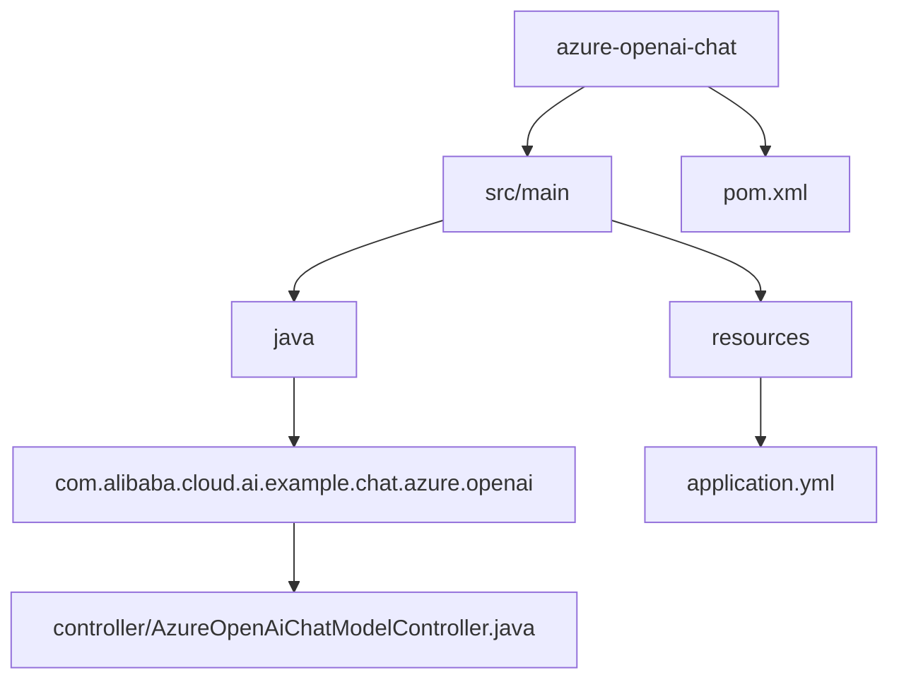
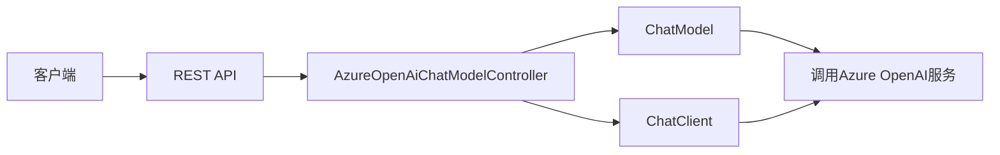
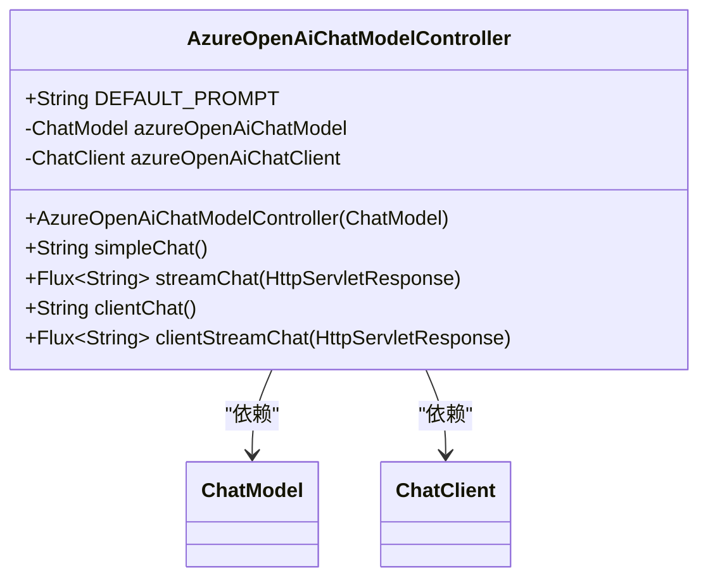
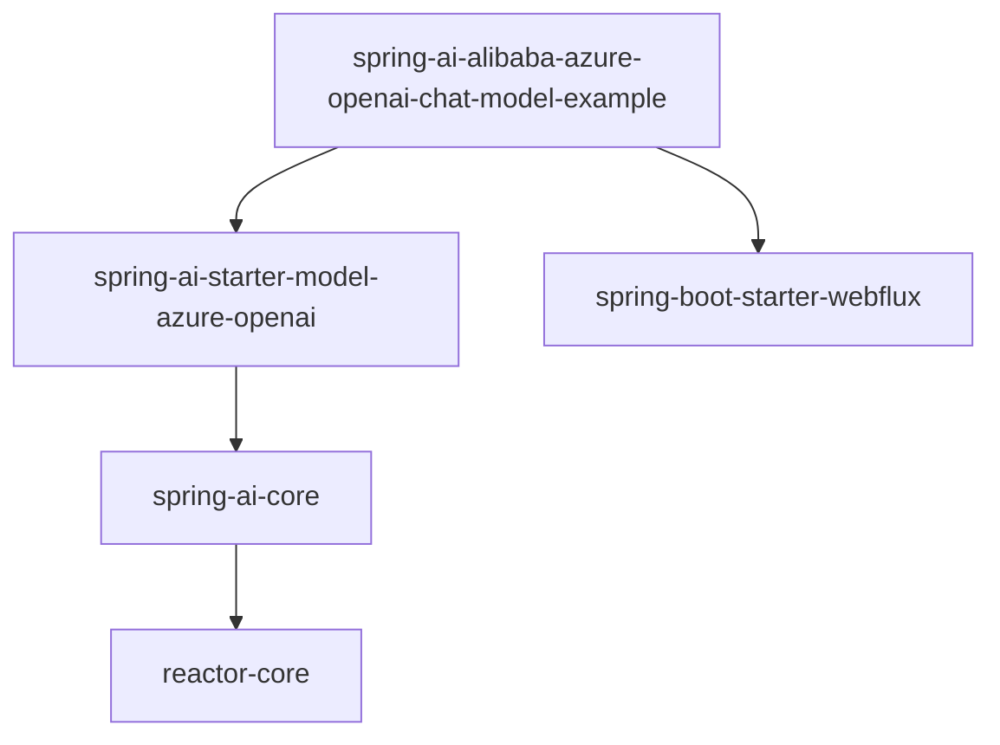

# Azure OpenAI聊天集成

<cite>
**本文档中引用的文件**  
- [AzureOpenAiChatModelController.java](file://spring-ai-alibaba-chat-example/azure-openai-chat/src/main/java/com/alibaba/cloud/ai/example/chat/azure/openai/controller/AzureOpenAiChatModelController.java)
- [application.yml](file://spring-ai-alibaba-chat-example/azure-openai-chat/src/main/resources/application.yml)
</cite>

## 目录
1. [简介](#简介)
2. [项目结构](#项目结构)
3. [核心组件](#核心组件)
4. [架构概述](#架构概述)
5. [详细组件分析](#详细组件分析)
6. [依赖分析](#依赖分析)
7. [性能考虑](#性能考虑)
8. [故障排除指南](#故障排除指南)
9. [结论](#结论)

## 简介
本文档详细介绍了如何在Spring AI Alibaba框架中集成Azure OpenAI服务。重点分析了`AzureOpenAiChatModelController`的实现机制，涵盖认证配置、端点设置、API调用模式以及响应处理。同时提供了Azure环境下`application.yml`的配置说明，并对比了Azure OpenAI与其他提供商的差异，为迁移现有应用提供指导。

## 项目结构
Azure OpenAI聊天示例项目位于`spring-ai-alibaba-chat-example/azure-openai-chat`目录下，其结构清晰，遵循标准的Spring Boot项目布局。

**Diagram sources**
- [AzureOpenAiChatModelController.java](file://spring-ai-alibaba-chat-example/azure-openai-chat/src/main/java/com/alibaba/cloud/ai/example/chat/azure/openai/controller/AzureOpenAiChatModelController.java)
- [application.yml](file://spring-ai-alibaba-chat-example/azure-openai-chat/src/main/resources/application.yml)

**Section sources**
- [AzureOpenAiChatModelController.java](file://spring-ai-alibaba-chat-example/azure-openai-chat/src/main/java/com/alibaba/cloud/ai/example/chat/azure/openai/controller/AzureOpenAiChatModelController.java)
- [application.yml](file://spring-ai-alibaba-chat-example/azure-openai-chat/src/main/resources/application.yml)

## 核心组件
本项目的核心组件包括`AzureOpenAiChatModelController`控制器类和基于`ChatModel`与`ChatClient`的集成机制。控制器提供了多种调用方式，包括简单同步调用和流式响应调用，支持灵活的交互模式。

**Section sources**
- [AzureOpenAiChatModelController.java](file://spring-ai-alibaba-chat-example/azure-openai-chat/src/main/java/com/alibaba/cloud/ai/example/chat/azure/openai/controller/AzureOpenAiChatModelController.java)

## 架构概述
系统采用典型的Spring Boot Web架构，通过RESTful API暴露Azure OpenAI功能。`ChatModel`接口由Spring AI Alibaba自动配置，封装了与Azure OpenAI服务的通信细节。

**Diagram sources**
- [AzureOpenAiChatModelController.java](file://spring-ai-alibaba-chat-example/azure-openai-chat/src/main/java/com/alibaba/cloud/ai/example/chat/azure/openai/controller/AzureOpenAiChatModelController.java)

## 详细组件分析

### AzureOpenAiChatModelController分析
该控制器实现了多种调用Azure OpenAI的方式，包括基于`ChatModel`和`ChatClient`的调用。

#### 调用方式对比
| 调用方式 | 端点 | 方法 | 特点 |
|--------|------|------|------|
| ChatModel简单调用 | `/azure/openai/chat-model/simple/chat` | `simpleChat()` | 同步调用，返回完整响应 |
| ChatModel流式调用 | `/azure/openai/chat-model/stream/chat` | `streamChat()` | 流式输出，实现打字机效果 |
| ChatClient调用 | `/azure/openai/chat-client/chat` | `clientChat()` | 使用ChatClient高级API |
| ChatClient流式调用 | `/azure/openai/client/stream/chat` | `clientStreamChat()` | 流式响应，支持实时传输 |

**Diagram sources**
- [AzureOpenAiChatModelController.java](file://spring-ai-alibaba-chat-example/azure-openai-chat/src/main/java/com/alibaba/cloud/ai/example/chat/azure/openai/controller/AzureOpenAiChatModelController.java)

**Section sources**
- [AzureOpenAiChatModelController.java](file://spring-ai-alibaba-chat-example/azure-openai-chat/src/main/java/com/alibaba/cloud/ai/example/chat/azure/openai/controller/AzureOpenAiChatModelController.java)

## 依赖分析
项目通过Spring Boot自动配置机制集成Azure OpenAI服务，主要依赖Spring AI Alibaba的核心模块。

**Diagram sources**
- [pom.xml](file://spring-ai-alibaba-chat-example/azure-openai-chat/pom.xml)

**Section sources**
- [pom.xml](file://spring-ai-alibaba-chat-example/azure-openai-chat/pom.xml)

## 性能考虑
- 流式调用使用`Flux<String>`实现，支持响应式流处理，避免内存积压
- 响应设置`UTF-8`编码，防止中文乱码
- `ChatClient`构建时添加了`SimpleLoggerAdvisor`，便于调试和监控
- 所有API调用均基于非阻塞IO，适合高并发场景

## 故障排除指南
常见问题及解决方案：

1. **认证失败**：检查环境变量`AI_AZURE_OPENAI_API_KEY`是否正确设置
2. **端点不可达**：验证`AI_AZURE_OPENAI_ENDPOINT`配置的正确性
3. **响应乱码**：确保HTTP响应头正确设置`Content-Type: text/plain;charset=UTF-8`
4. **流式中断**：检查网络连接稳定性，适当调整超时设置

**Section sources**
- [AzureOpenAiChatModelController.java](file://spring-ai-alibaba-chat-example/azure-openai-chat/src/main/java/com/alibaba/cloud/ai/example/chat/azure/openai/controller/AzureOpenAiChatModelController.java)
- [application.yml](file://spring-ai-alibaba-chat-example/azure-openai-chat/src/main/resources/application.yml)

## 结论
本文档全面介绍了Spring AI Alibaba框架中Azure OpenAI的集成方案。通过`AzureOpenAiChatModelController`示例，展示了同步和流式调用的实现方式。项目配置简洁，通过环境变量管理敏感信息，符合安全最佳实践。该集成方案为迁移现有Azure OpenAI应用提供了清晰的路径和参考实现。