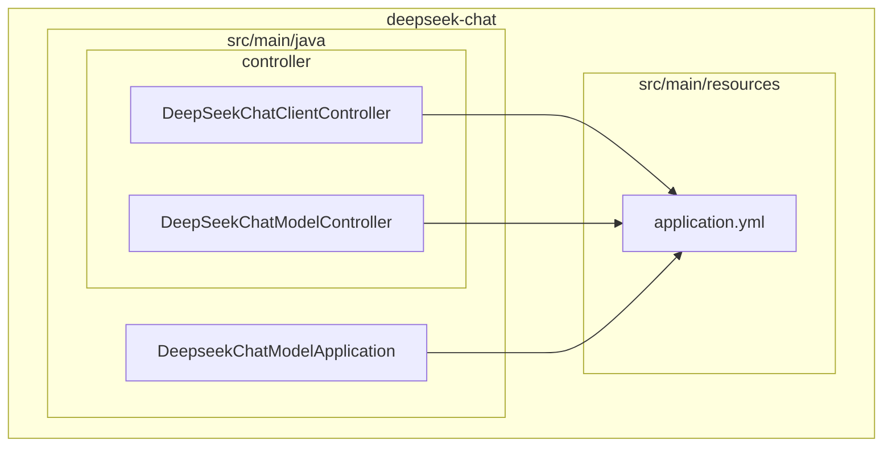
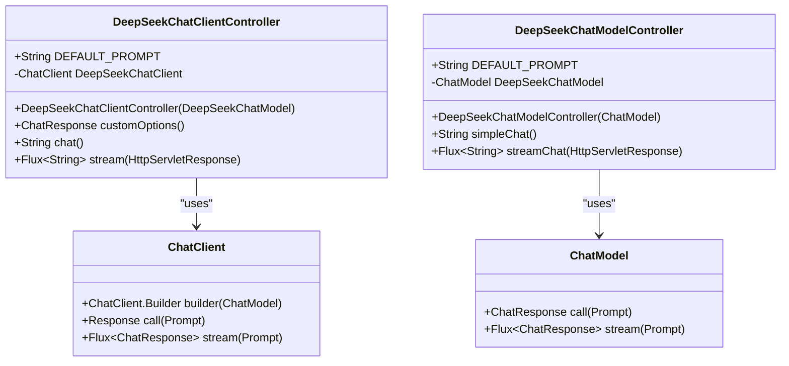
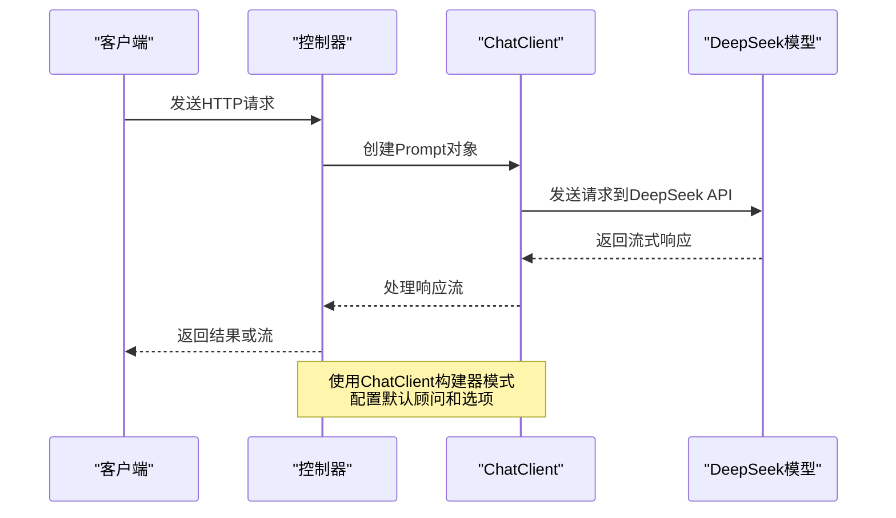
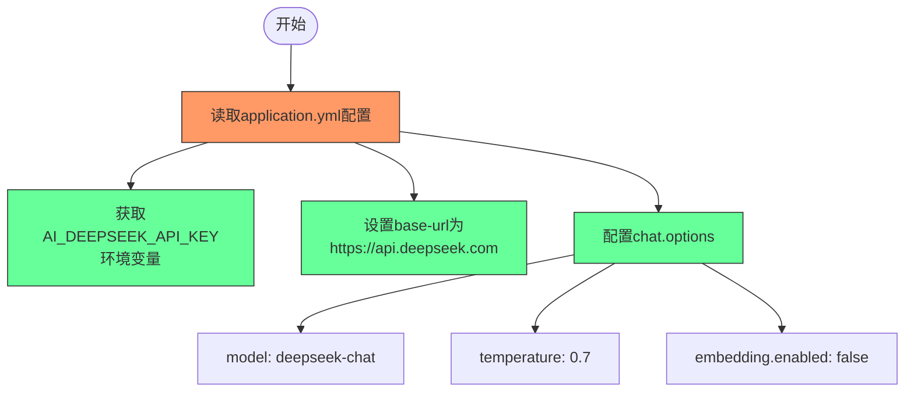
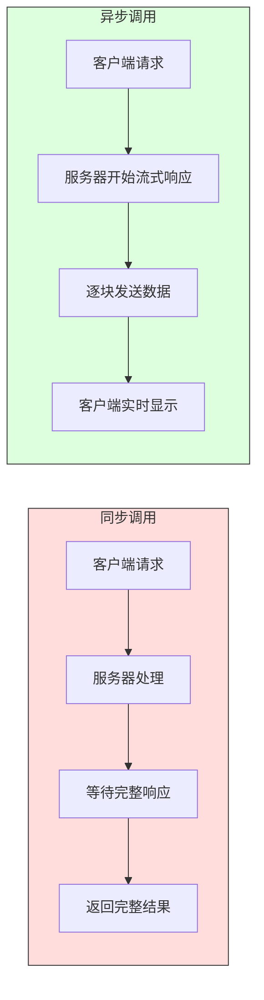
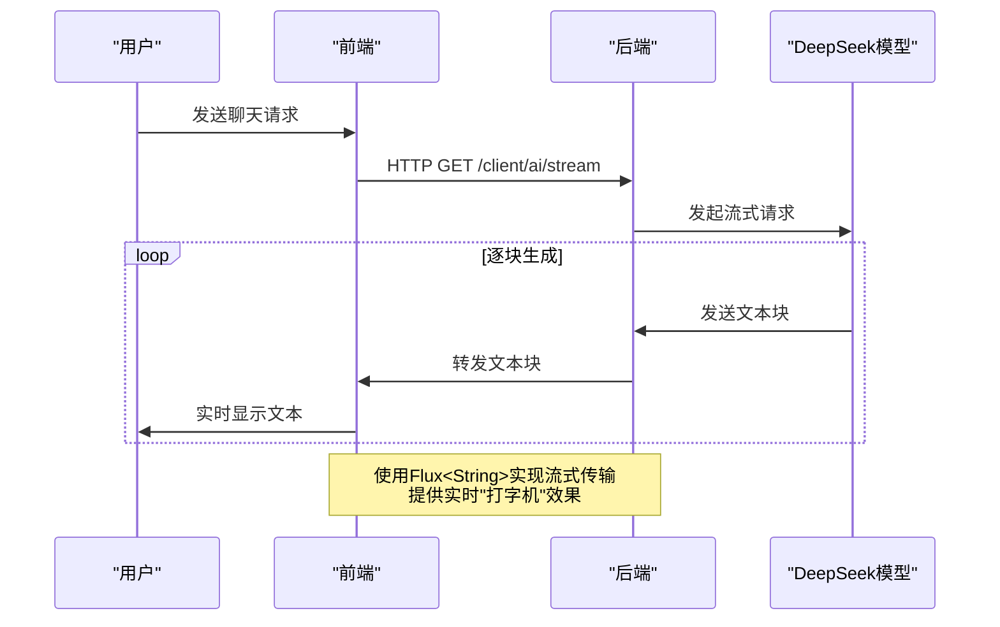

# DeepSeek聊天集成

<cite>
**Referenced Files in This Document**   
- [DeepSeekChatClientController.java](file://spring-ai-alibaba-chat-example/deepseek-chat/src/main/java/com/alibaba/cloud/ai/example/chat/deepseek/controller/DeepSeekChatClientController.java)
- [DeepSeekChatModelController.java](file://spring-ai-alibaba-chat-example/deepseek-chat/src/main/java/com/alibaba/cloud/ai/example/chat/deepseek/controller/DeepSeekChatModelController.java)
- [application.yml](file://spring-ai-alibaba-chat-example/deepseek-chat/src/main/resources/application.yml)
</cite>

## 目录
1. [简介](#简介)
2. [项目结构](#项目结构)
3. [核心组件](#核心组件)
4. [API端点设计](#api端点设计)
5. [请求构建与响应处理](#请求构建与响应处理)
6. [DeepSeek特有配置](#deepseek特有配置)
7. [同步与异步调用](#同步与异步调用)
8. [流式响应处理](#流式响应处理)
9. [性能调优建议](#性能调优建议)
10. [常见问题解决方案](#常见问题解决方案)

## 简介

本文档详细介绍了如何在Spring AI Alibaba项目中集成和使用DeepSeek大模型。通过分析`DeepSeekChatClientController`和`DeepSeekChatModelController`两个核心控制器，全面解析了DeepSeek模型的API端点设计、请求构建和响应处理逻辑。文档还涵盖了DeepSeek特有的配置要求，包括模型选择、温度参数和最大生成长度等关键配置项。为开发者提供了完整的同步和异步聊天调用示例，以及流式响应的处理方法。通过本指南，开发者可以快速掌握DeepSeek模型的集成方法，并根据具体需求进行性能调优和问题排查。

## 项目结构

DeepSeek聊天集成示例项目遵循标准的Spring Boot项目结构，主要包含控制器、配置文件和应用主类。项目通过`application.yml`文件进行DeepSeek模型的配置，并通过两个控制器类分别演示了`ChatClient`和`ChatModel`两种不同的调用方式。



**Diagram sources**
- [DeepSeekChatClientController.java](file://spring-ai-alibaba-chat-example/deepseek-chat/src/main/java/com/alibaba/cloud/ai/example/chat/deepseek/controller/DeepSeekChatClientController.java)
- [DeepSeekChatModelController.java](file://spring-ai-alibaba-chat-example/deepseek-chat/src/main/java/com/alibaba/cloud/ai/example/chat/deepseek/controller/DeepSeekChatModelController.java)
- [application.yml](file://spring-ai-alibaba-chat-example/deepseek-chat/src/main/resources/application.yml)

**Section sources**
- [DeepSeekChatClientController.java](file://spring-ai-alibaba-chat-example/deepseek-chat/src/main/java/com/alibaba/cloud/ai/example/chat/deepseek/controller/DeepSeekChatClientController.java)
- [DeepSeekChatModelController.java](file://spring-ai-alibaba-chat-example/deepseek-chat/src/main/java/com/alibaba/cloud/ai/example/chat/deepseek/controller/DeepSeekChatModelController.java)
- [application.yml](file://spring-ai-alibaba-chat-example/deepseek-chat/src/main/resources/application.yml)

## 核心组件

DeepSeek聊天集成的核心组件主要包括`DeepSeekChatClientController`和`DeepSeekChatModelController`两个控制器类，以及`application.yml`配置文件。`DeepSeekChatClientController`使用Spring AI的`ChatClient`构建器模式，提供了更高级的抽象和功能，如默认顾问（Advisor）和默认选项配置。而`DeepSeekChatModelController`则直接使用`ChatModel`接口，展示了最基本的调用方式。

`DeepSeekChatClientController`在构造函数中初始化了`ChatClient`实例，通过链式调用配置了消息记忆顾问、日志顾问和默认的聊天选项。这种设计模式使得配置更加清晰和可维护。`DeepSeekChatModelController`则采用了更简洁的方式，直接注入`ChatModel`实例，适用于不需要复杂配置的场景。



**Diagram sources**
- [DeepSeekChatClientController.java](file://spring-ai-alibaba-chat-example/deepseek-chat/src/main/java/com/alibaba/cloud/ai/example/chat/deepseek/controller/DeepSeekChatClientController.java)
- [DeepSeekChatModelController.java](file://spring-ai-alibaba-chat-example/deepseek-chat/src/main/java/com/alibaba/cloud/ai/example/chat/deepseek/controller/DeepSeekChatModelController.java)

**Section sources**
- [DeepSeekChatClientController.java](file://spring-ai-alibaba-chat-example/deepseek-chat/src/main/java/com/alibaba/cloud/ai/example/chat/deepseek/controller/DeepSeekChatClientController.java#L1-L92)
- [DeepSeekChatModelController.java](file://spring-ai-alibaba-chat-example/deepseek-chat/src/main/java/com/alibaba/cloud/ai/example/chat/deepseek/controller/DeepSeekChatModelController.java#L1-L66)

## API端点设计

DeepSeek聊天集成提供了多个API端点，涵盖了同步调用、自定义参数调用和流式响应等不同场景。`DeepSeekChatClientController`类定义了三个主要端点：`/client/ai/customOptions`用于使用自定义参数调用DeepSeek模型，`/client/ai/generate`执行默认提示语的AI生成请求，以及`/client/ai/stream`提供流式生成接口。

`DeepSeekChatModelController`类则提供了两个更基础的端点：`/model/simple/chat`用于最简单的同步调用，和`/model/stream/chat`用于流式调用。这种分层设计使得开发者可以根据具体需求选择合适的调用方式。基础端点适合快速集成和简单场景，而高级端点则提供了更多的配置选项和功能。

```mermaid
graph TD
A[客户端请求] --> B{请求类型}
B --> |同步请求| C[/client/ai/generate]
B --> |自定义参数| D[/client/ai/customOptions]
B --> |流式请求| E[/client/ai/stream]
B --> |简单同步| F[/model/simple/chat]
B --> |简单流式| G[/model/stream/chat]
C --> H[返回完整响应]
D --> I[返回ChatResponse对象]
E --> J[返回Flux<String>流]
F --> K[返回字符串]
G --> L[返回Flux<String>流]
style C fill:#f9f,stroke:#333
style D fill:#f9f,stroke:#333
style E fill:#f9f,stroke:#333
style F fill:#bbf,stroke:#333
style G fill:#bbf,stroke:#333
```

**Diagram sources**
- [DeepSeekChatClientController.java](file://spring-ai-alibaba-chat-example/deepseek-chat/src/main/java/com/alibaba/cloud/ai/example/chat/deepseek/controller/DeepSeekChatClientController.java#L36-L91)
- [DeepSeekChatModelController.java](file://spring-ai-alibaba-chat-example/deepseek-chat/src/main/java/com/alibaba/cloud/ai/example/chat/deepseek/controller/DeepSeekChatModelController.java#L47-L65)

**Section sources**
- [DeepSeekChatClientController.java](file://spring-ai-alibaba-chat-example/deepseek-chat/src/main/java/com/alibaba/cloud/ai/example/chat/deepseek/controller/DeepSeekChatClientController.java#L36-L91)
- [DeepSeekChatModelController.java](file://spring-ai-alibaba-chat-example/deepseek-chat/src/main/java/com/alibaba/cloud/ai/example/chat/deepseek/controller/DeepSeekChatModelController.java#L47-L65)

## 请求构建与响应处理

在DeepSeek聊天集成中，请求构建和响应处理是通过`ChatClient`和`ChatModel`两个核心接口实现的。`ChatClient`提供了更高级的抽象，使用构建器模式来配置和执行请求。在`DeepSeekChatClientController`中，通过`ChatClient.builder(chatModel)`创建构建器实例，并链式调用`defaultAdvisors`和`defaultOptions`方法来配置默认顾问和选项。

请求的构建通过`prompt()`方法完成，该方法接受一个`Prompt`对象作为参数。`Prompt`对象封装了用户输入的提示语和相关的聊天选项。响应处理则根据调用方式的不同而有所区别：同步调用使用`call()`方法直接返回结果，而流式调用使用`stream()`方法返回一个`Flux`流，允许客户端实时接收生成的文本块。



**Diagram sources**
- [DeepSeekChatClientController.java](file://spring-ai-alibaba-chat-example/deepseek-chat/src/main/java/com/alibaba/cloud/ai/example/chat/deepseek/controller/DeepSeekChatClientController.java#L58-L91)

**Section sources**
- [DeepSeekChatClientController.java](file://spring-ai-alibaba-chat-example/deepseek-chat/src/main/java/com/alibaba/cloud/ai/example/chat/deepseek/controller/DeepSeekChatClientController.java#L58-L91)

## DeepSeek特有配置

DeepSeek模型的特有配置主要在`application.yml`文件中定义，包括API密钥、基础URL和聊天选项等关键参数。配置通过Spring的属性占位符`${AI_DEEPSEEK_API_KEY}`从环境变量中读取API密钥，确保了敏感信息的安全性。基础URL设置为`https://api.deepseek.com`，指向DeepSeek的API服务端点。

在代码层面，通过`DeepSeekChatOptions`类来配置模型的特定参数。温度参数（temperature）被设置为0.7，以平衡生成结果的创造性和稳定性。在`customOptions`方法中，温度参数被调整为0.75，展示了如何在运行时动态修改这些参数。模型名称硬编码为`deepseek-chat`，这是DeepSeek提供的主要聊天模型。



**Diagram sources**
- [application.yml](file://spring-ai-alibaba-chat-example/deepseek-chat/src/main/resources/application.yml#L1-L15)

**Section sources**
- [application.yml](file://spring-ai-alibaba-chat-example/deepseek-chat/src/main/resources/application.yml#L1-L15)
- [DeepSeekChatClientController.java](file://spring-ai-alibaba-chat-example/deepseek-chat/src/main/java/com/alibaba/cloud/ai/example/chat/deepseek/controller/DeepSeekChatClientController.java#L28-L34)

## 同步与异步调用

DeepSeek聊天集成支持同步和异步两种调用模式，满足不同场景的需求。同步调用通过`call()`方法实现，适用于需要立即获取完整响应的场景。在`DeepSeekChatClientController`的`chat()`方法中，通过`this.DeepSeekChatClient.prompt(DEFAULT_PROMPT).call().content()`链式调用，直接返回生成的文本内容。

异步调用则通过`stream()`方法实现，返回一个`Flux<String>`流，适用于需要实时显示生成过程的场景，如聊天应用中的"打字机"效果。在`stream()`方法中，通过设置响应的字符编码为UTF-8，并返回`Flux`流，客户端可以逐块接收和显示生成的文本。这种模式不仅提升了用户体验，还能在生成过程中进行实时处理和分析。



**Diagram sources**
- [DeepSeekChatClientController.java](file://spring-ai-alibaba-chat-example/deepseek-chat/src/main/java/com/alibaba/cloud/ai/example/chat/deepseek/controller/DeepSeekChatClientController.java#L73-L91)

**Section sources**
- [DeepSeekChatClientController.java](file://spring-ai-alibaba-chat-example/deepseek-chat/src/main/java/com/alibaba/cloud/ai/example/chat/deepseek/controller/DeepSeekChatClientController.java#L73-L91)
- [DeepSeekChatModelController.java](file://spring-ai-alibaba-chat-example/deepseek-chat/src/main/java/com/alibaba/cloud/ai/example/chat/deepseek/controller/DeepSeekChatModelController.java#L57-L65)

## 流式响应处理

流式响应处理是DeepSeek聊天集成的重要特性，通过Reactor框架的`Flux`类型实现。在`DeepSeekChatClientController`的`stream()`方法中，通过`this.DeepSeekChatClient.prompt(DEFAULT_PROMPT).stream().content()`返回一个字符串流，允许客户端实时接收模型生成的文本块。这种方法特别适用于长文本生成或实时聊天场景，能够提供更好的用户体验。

流式响应的实现依赖于服务器发送事件（Server-Sent Events）或类似的流式传输协议。在方法中通过`response.setCharacterEncoding("UTF-8")`设置响应的字符编码，确保中文等多字节字符能够正确传输。客户端可以通过标准的HTTP流处理机制逐块接收数据，实现类似"打字机"的效果，即时显示模型生成的内容。



**Diagram sources**
- [DeepSeekChatClientController.java](file://spring-ai-alibaba-chat-example/deepseek-chat/src/main/java/com/alibaba/cloud/ai/example/chat/deepseek/controller/DeepSeekChatClientController.java#L82-L91)

**Section sources**
- [DeepSeekChatClientController.java](file://spring-ai-alibaba-chat-example/deepseek-chat/src/main/java/com/alibaba/cloud/ai/example/chat/deepseek/controller/DeepSeekChatClientController.java#L82-L91)

## 性能调优建议

为了优化DeepSeek聊天集成的性能，建议从以下几个方面进行调优：首先，合理配置温度参数（temperature），较低的值（如0.3-0.5）适合需要准确性和一致性的场景，而较高的值（如0.7-0.9）适合需要创造性和多样性的场景。其次，考虑使用消息记忆功能，通过`MessageWindowChatMemory`保持对话上下文，避免重复传输历史消息。

对于高并发场景，建议实现适当的缓存策略，对常见查询的响应进行缓存。同时，监控API调用的延迟和错误率，设置合理的超时和重试机制。在流式调用中，注意管理背压（backpressure），避免客户端处理速度跟不上服务器生成速度导致的内存问题。最后，定期评估模型版本和API端点的更新，及时升级以获得性能改进和新功能。

## 常见问题解决方案

在使用DeepSeek聊天集成时，可能会遇到一些常见问题。API密钥无效是最常见的问题之一，确保`AI_DEEPSEEK_API_KEY`环境变量正确设置，并且密钥具有足够的权限。如果遇到连接超时，检查网络连接和防火墙设置，确保能够访问`https://api.deepseek.com`。

对于中文乱码问题，在流式响应中确保设置了正确的字符编码`response.setCharacterEncoding("UTF-8")`。如果模型响应不符合预期，尝试调整温度参数或优化提示语（prompt）。在开发过程中，启用`SimpleLoggerAdvisor`可以帮助调试，查看请求和响应的详细信息。如果遇到依赖冲突，确保Spring AI Alibaba版本与项目其他依赖兼容。