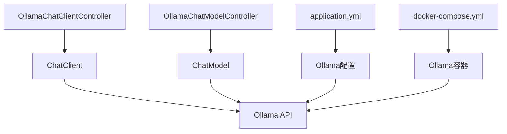
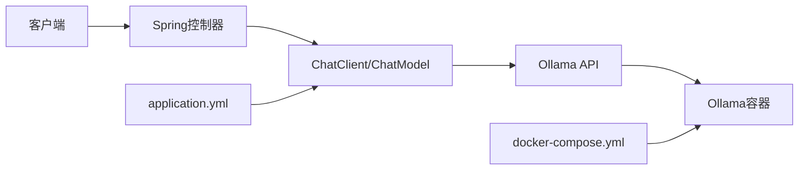
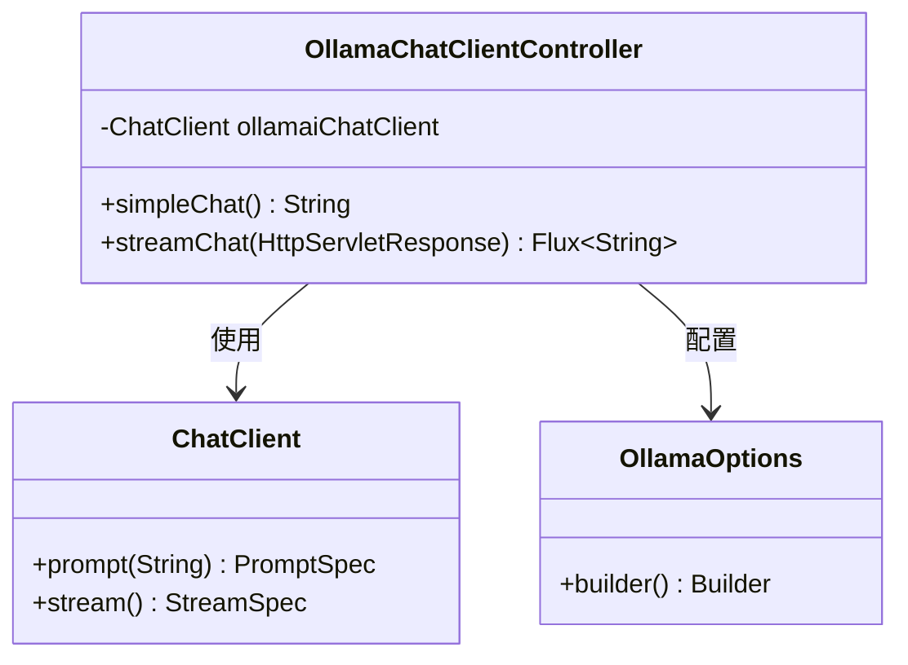
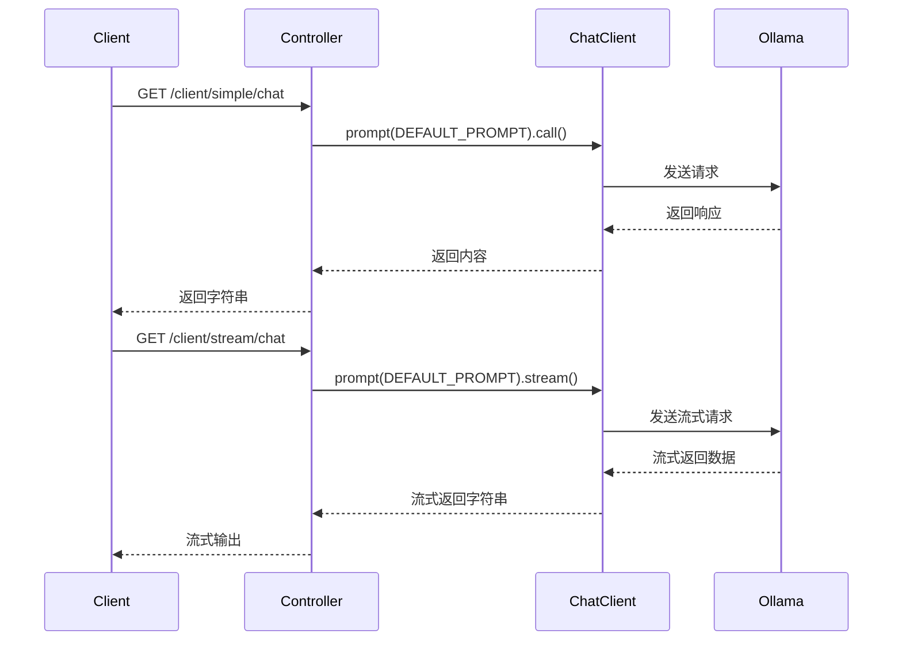
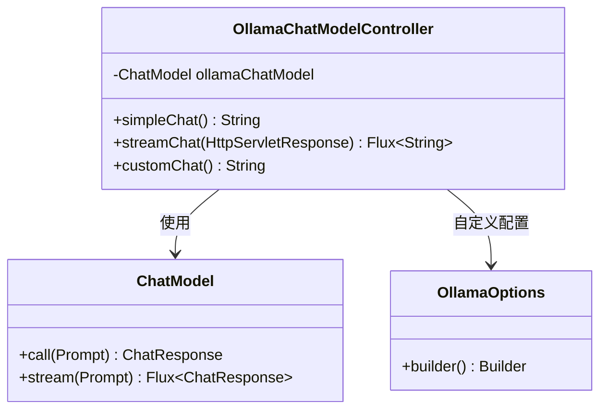
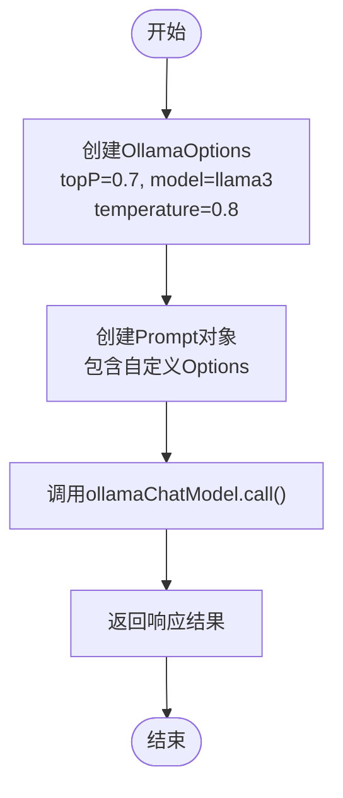
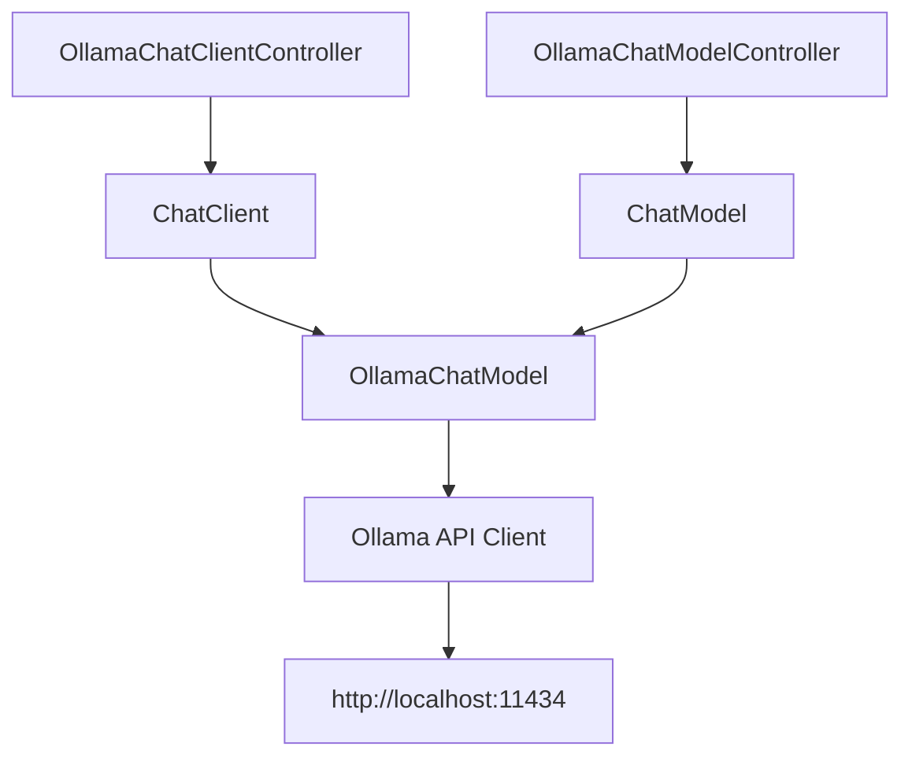

# Ollama聊天集成

<cite>
**本文档中引用的文件**  
- [OllamaChatClientController.java](file://spring-ai-alibaba-chat-example/ollama-chat/src/main/java/com/alibaba/cloud/ai/example/chat/ollama/controller/OllamaChatClientController.java)
- [OllamaChatModelController.java](file://spring-ai-alibaba-chat-example/ollama-chat/src/main/java/com/alibaba/cloud/ai/example/chat/ollama/controller/OllamaChatModelController.java)
- [application.yml](file://spring-ai-alibaba-chat-example/ollama-chat/src/main/resources/application.yml)
- [docker-compose.yml](file://docker-compose/ollama/docker-compose.yml)
- [README.md](file://spring-ai-alibaba-chat-example/ollama-chat/README.md)
</cite>

## 目录
1. [简介](#简介)
2. [项目结构](#项目结构)
3. [核心组件](#核心组件)
4. [架构概述](#架构概述)
5. [详细组件分析](#详细组件分析)
6. [依赖分析](#依赖分析)
7. [性能考虑](#性能考虑)
8. [故障排除指南](#故障排除指南)
9. [结论](#结论)

## 简介
本文档详细介绍了如何在Spring AI Alibaba项目中集成Ollama本地大模型服务。重点解析了`OllamaChatClientController`和`OllamaChatModelController`的实现机制，涵盖与本地Ollama实例通信、模型加载、推理执行等核心功能。文档还说明了Ollama特有的配置选项，如主机地址、端口和模型名称，并提供代码示例展示聊天请求的发送、响应流处理以及模型生命周期管理。此外，还探讨了Ollama在本地AI开发中的优势，并为开发者提供部署建议和性能调优技巧。

## 项目结构
Ollama聊天集成示例位于`spring-ai-alibaba-chat-example/ollama-chat`目录下，采用标准的Spring Boot项目结构。主要包含控制器、应用主类和配置文件，通过Spring AI的抽象层与本地Ollama服务进行交互。

**图示来源**  
- [OllamaChatClientController.java](file://spring-ai-alibaba-chat-example/ollama-chat/src/main/java/com/alibaba/cloud/ai/example/chat/ollama/controller/OllamaChatClientController.java)
- [OllamaChatModelController.java](file://spring-ai-alibaba-chat-example/ollama-chat/src/main/java/com/alibaba/cloud/ai/example/chat/ollama/controller/OllamaChatModelController.java)
- [application.yml](file://spring-ai-alibaba-chat-example/ollama-chat/src/main/resources/application.yml)
- [docker-compose.yml](file://docker-compose/ollama/docker-compose.yml)

**本节来源**  
- [README.md](file://spring-ai-alibaba-chat-example/ollama-chat/README.md)

## 核心组件
本集成的核心组件包括`OllamaChatClientController`和`OllamaChatModelController`，分别使用Spring AI的`ChatClient`和`ChatModel`接口与Ollama服务进行交互。`ChatClient`提供了更高级别的抽象，支持顾问模式（Advisor）和默认选项配置，而`ChatModel`则提供了更直接的模型调用方式。

**本节来源**  
- [OllamaChatClientController.java](file://spring-ai-alibaba-chat-example/ollama-chat/src/main/java/com/alibaba/cloud/ai/example/chat/ollama/controller/OllamaChatClientController.java#L1-L82)
- [OllamaChatModelController.java](file://spring-ai-alibaba-chat-example/ollama-chat/src/main/java/com/alibaba/cloud/ai/example/chat/ollama/controller/OllamaChatModelController.java#L1-L90)

## 架构概述
系统架构采用分层设计，前端通过HTTP请求调用Spring Boot控制器，控制器利用Spring AI框架与本地Ollama服务通信。Ollama服务通过Docker容器运行，暴露11434端口供外部调用。配置文件定义了Ollama的基础URL和默认模型，实现了配置与代码的分离。

**图示来源**  
- [application.yml](file://spring-ai-alibaba-chat-example/ollama-chat/src/main/resources/application.yml#L1-L12)
- [docker-compose.yml](file://docker-compose/ollama/docker-compose.yml#L1-L13)

## 详细组件分析

### OllamaChatClientController分析
`OllamaChatClientController`使用`ChatClient`构建器模式创建客户端实例，支持默认顾问和默认选项的配置。通过`SimpleLoggerAdvisor`实现日志记录功能，并在构建时设置`OllamaOptions`，包括topP、模型名称等参数。

#### 类图

**图示来源**  
- [OllamaChatClientController.java](file://spring-ai-alibaba-chat-example/ollama-chat/src/main/java/com/alibaba/cloud/ai/example/chat/ollama/controller/OllamaChatClientController.java#L1-L82)

#### 请求流程

**图示来源**  
- [OllamaChatClientController.java](file://spring-ai-alibaba-chat-example/ollama-chat/src/main/java/com/alibaba/cloud/ai/example/chat/ollama/controller/OllamaChatClientController.java#L50-L82)

**本节来源**  
- [OllamaChatClientController.java](file://spring-ai-alibaba-chat-example/ollama-chat/src/main/java/com/alibaba/cloud/ai/example/chat/ollama/controller/OllamaChatClientController.java#L1-L82)

### OllamaChatModelController分析
`OllamaChatModelController`直接使用`ChatModel`接口，提供了更灵活的调用方式。支持简单的同步调用、流式调用以及自定义`OllamaOptions`的高级调用。自定义选项的优先级高于配置文件中的设置。

#### 类图

**图示来源**  
- [OllamaChatModelController.java](file://spring-ai-alibaba-chat-example/ollama-chat/src/main/java/com/alibaba/cloud/ai/example/chat/ollama/controller/OllamaChatModelController.java#L1-L90)

#### 自定义选项流程

**图示来源**  
- [OllamaChatModelController.java](file://spring-ai-alibaba-chat-example/ollama-chat/src/main/java/com/alibaba/cloud/ai/example/chat/ollama/controller/OllamaChatModelController.java#L74-L90)

**本节来源**  
- [OllamaChatModelController.java](file://spring-ai-alibaba-chat-example/ollama-chat/src/main/java/com/alibaba/cloud/ai/example/chat/ollama/controller/OllamaChatModelController.java#L1-L90)

## 依赖分析
项目依赖Spring AI框架提供的Ollama集成能力，通过`spring-ai-ollama-spring-boot-starter`自动配置`ChatModel`和`ChatClient`。Ollama服务通过Docker容器独立运行，与应用解耦，便于管理和扩展。

**图示来源**  
- [pom.xml](file://spring-ai-alibaba-chat-example/ollama-chat/pom.xml)
- [application.yml](file://spring-ai-alibaba-chat-example/ollama-chat/src/main/resources/application.yml)

**本节来源**  
- [application.yml](file://spring-ai-alibaba-chat-example/ollama-chat/src/main/resources/application.yml#L1-L12)
- [docker-compose.yml](file://docker-compose/ollama/docker-compose.yml#L1-L13)

## 性能考虑
为了优化性能，建议使用流式API处理大响应，避免内存溢出。合理配置Ollama参数如`topP`和`temperature`可以平衡生成质量和响应速度。确保Ollama服务有足够的计算资源，特别是GPU支持，以提高推理速度。

## 故障排除指南
常见问题包括Ollama服务未启动、端口冲突、模型未下载等。首先检查`docker-compose up`是否成功运行Ollama容器，确认11434端口是否被占用。如果遇到模型相关错误，尝试通过`ollama pull llama3`命令手动下载模型。确保`application.yml`中的`base-url`正确指向Ollama服务。

**本节来源**  
- [README.md](file://spring-ai-alibaba-chat-example/ollama-chat/README.md#L1-L7)
- [docker-compose.yml](file://docker-compose/ollama/docker-compose.yml#L1-L13)

## 结论
Ollama与Spring AI Alibaba的集成提供了一种简单高效的方式在本地运行大语言模型。通过`ChatClient`和`ChatModel`两种方式，开发者可以根据需求选择合适的抽象级别。配置灵活，支持流式响应和自定义参数，适合各种本地AI应用场景。结合Docker部署，实现了环境的可移植性和一致性。