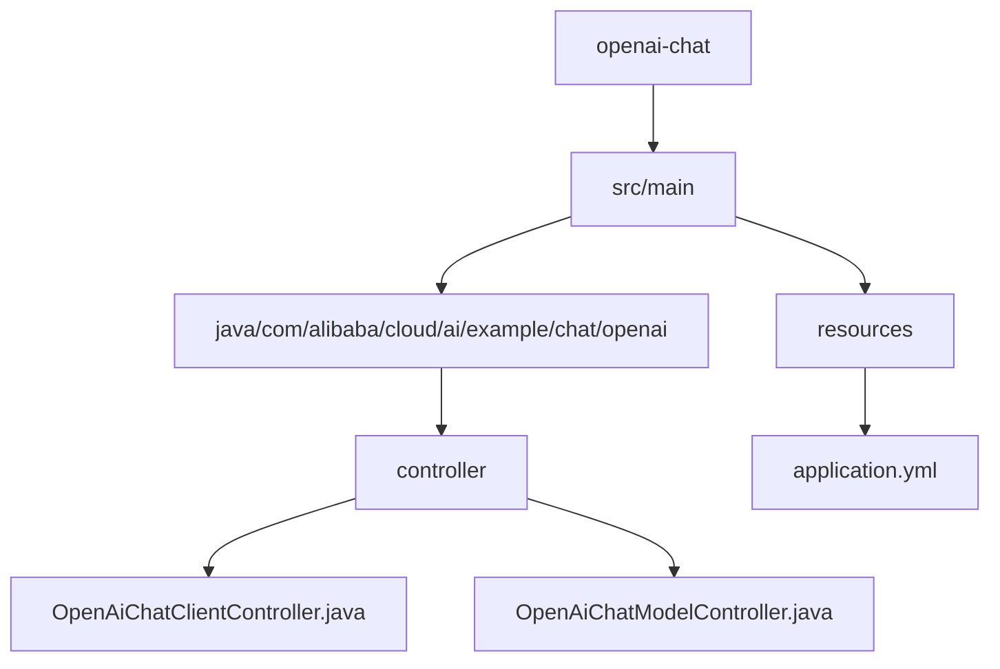
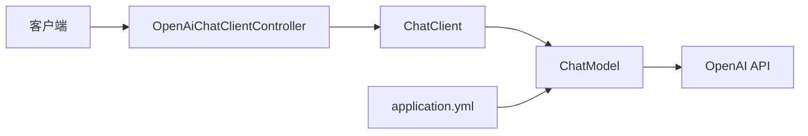
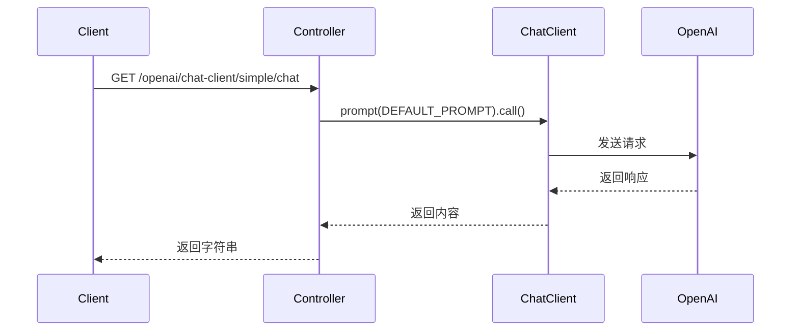
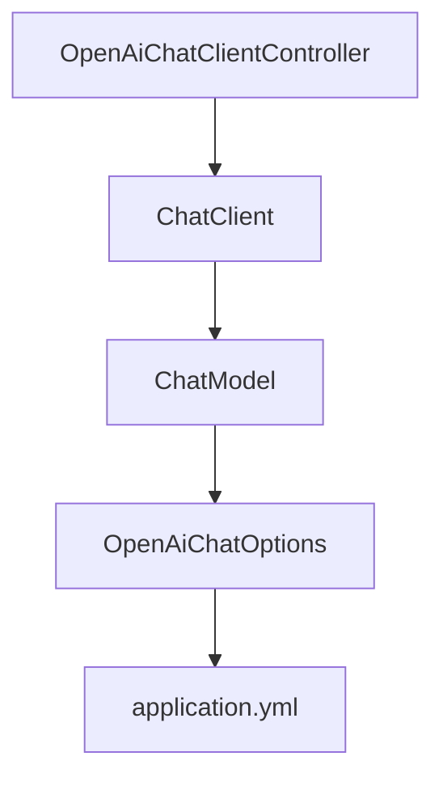

# OpenAI聊天集成

<cite>
**本文档中引用的文件**  
- [OpenAiChatClientController.java](file://spring-ai-alibaba-chat-example/openai-chat/src/main/java/com/alibaba/cloud/ai/example/chat/openai/controller/OpenAiChatClientController.java)
- [OpenAiChatModelController.java](file://spring-ai-alibaba-chat-example/openai-chat/src/main/java/com/alibaba/cloud/ai/example/chat/openai/controller/OpenAiChatModelController.java)
- [application.yml](file://spring-ai-alibaba-chat-example/openai-chat/src/main/resources/application.yml)
</cite>

## 目录
1. [简介](#简介)
2. [项目结构](#项目结构)
3. [核心组件](#核心组件)
4. [架构概览](#架构概览)
5. [详细组件分析](#详细组件分析)
6. [依赖分析](#依赖分析)
7. [性能考虑](#性能考虑)
8. [故障排除指南](#故障排除指南)
9. [结论](#结论)

## 简介
本文档详细介绍了如何在Spring AI Alibaba框架中集成OpenAI的ChatGPT模型。重点分析了`OpenAiChatClientController`的实现，涵盖标准API调用模式、认证机制和错误处理。文档还详细说明了OpenAI特定的配置参数，如api-key、组织ID、模型名称和API基础URL，并提供了多轮对话、系统消息设置和函数调用处理的代码示例。此外，还解释了OpenAI模型的定价模式和使用限制，为成本优化提供指导，并包含安全最佳实践和合规性考虑。

## 项目结构
本项目是Spring AI Alibaba框架中的一个示例模块，专门用于演示OpenAI聊天模型的集成。其结构清晰，分为控制器、服务和资源文件。

**Diagram sources**  
- [OpenAiChatClientController.java](file://spring-ai-alibaba-chat-example/openai-chat/src/main/java/com/alibaba/cloud/ai/example/chat/openai/controller/OpenAiChatClientController.java)
- [application.yml](file://spring-ai-alibaba-chat-example/openai-chat/src/main/resources/application.yml)

**Section sources**  
- [OpenAiChatClientController.java](file://spring-ai-alibaba-chat-example/openai-chat/src/main/java/com/alibaba/cloud/ai/example/chat/openai/controller/OpenAiChatClientController.java)
- [application.yml](file://spring-ai-alibaba-chat-example/openai-chat/src/main/resources/application.yml)

## 核心组件
核心组件包括`OpenAiChatClientController`和`OpenAiChatModelController`，分别使用`ChatClient`和`ChatModel`接口与OpenAI模型进行交互。`ChatClient`提供了更高级别的抽象，支持顾问（Advisor）机制，如聊天记忆和日志记录，而`ChatModel`则提供了更直接的模型调用方式。

**Section sources**  
- [OpenAiChatClientController.java](file://spring-ai-alibaba-chat-example/openai-chat/src/main/java/com/alibaba/cloud/ai/example/chat/openai/controller/OpenAiChatClientController.java)
- [OpenAiChatModelController.java](file://spring-ai-alibaba-chat-example/openai-chat/src/main/java/com/alibaba/cloud/ai/example/chat/openai/controller/OpenAiChatModelController.java)

## 架构概览
系统架构基于Spring Boot，通过Spring AI Alibaba模块与OpenAI API进行通信。配置通过`application.yml`文件注入，包括API密钥和基础URL。`ChatClient`在初始化时配置了默认选项和顾问，用于处理聊天记忆和日志。

**Diagram sources**  
- [OpenAiChatClientController.java](file://spring-ai-alibaba-chat-example/openai-chat/src/main/java/com/alibaba/cloud/ai/example/chat/openai/controller/OpenAiChatClientController.java)
- [application.yml](file://spring-ai-alibaba-chat-example/openai-chat/src/main/resources/application.yml)

## 详细组件分析

### OpenAiChatClientController 分析
该控制器展示了如何使用`ChatClient`进行简单和流式聊天调用。它在构造函数中初始化`ChatClient`，并配置了`MessageChatMemoryAdvisor`以支持上下文记忆，以及`SimpleLoggerAdvisor`用于日志记录。默认的`OpenAiChatOptions`设置了topP参数。

#### API 调用模式
控制器提供了三个端点：
- `/simple/chat`：进行简单的同步聊天调用。
- `/stream/chat`：返回`Flux<String>`，实现流式响应。
- `/stream/response`：使用Server-Sent Events (SSE) 返回流式数据。

**Diagram sources**  
- [OpenAiChatClientController.java](file://spring-ai-alibaba-chat-example/openai-chat/src/main/java/com/alibaba/cloud/ai/example/chat/openai/controller/OpenAiChatClientController.java)

#### 认证机制
认证通过`application.yml`中的`api-key`配置实现，使用环境变量`OPENAI_API_KEY`注入，确保密钥安全。

#### 错误处理
虽然示例中未显式展示错误处理，但`ChatClient`和`ChatModel`会抛出异常，应在生产环境中通过全局异常处理器（如`@ControllerAdvice`）进行捕获和处理。

**Section sources**  
- [OpenAiChatClientController.java](file://spring-ai-alibaba-chat-example/openai-chat/src/main/java/com/alibaba/cloud/ai/example/chat/openai/controller/OpenAiChatClientController.java)

## 依赖分析
项目依赖于Spring AI Alibaba的OpenAI模块，通过`ChatModel` Bean注入。`ChatClient`由`ChatClient.builder(chatModel)`创建，形成依赖链。

**Diagram sources**  
- [OpenAiChatClientController.java](file://spring-ai-alibaba-chat-example/openai-chat/src/main/java/com/alibaba/cloud/ai/example/chat/openai/controller/OpenAiChatClientController.java)
- [application.yml](file://spring-ai-alibaba-chat-example/openai-chat/src/main/resources/application.yml)

**Section sources**  
- [OpenAiChatClientController.java](file://spring-ai-alibaba-chat-example/openai-chat/src/main/java/com/alibaba/cloud/ai/example/chat/openai/controller/OpenAiChatClientController.java)
- [application.yml](file://spring-ai-alibaba-chat-example/openai-chat/src/main/resources/application.yml)

## 性能考虑
- **流式传输**：使用`Flux`进行流式响应，可以减少用户等待时间，提供更好的用户体验。
- **聊天记忆**：`MessageWindowChatMemory`可以管理上下文，但需注意内存使用，特别是在高并发场景下。
- **连接池**：确保HTTP客户端配置了适当的连接池以提高性能。

## 故障排除指南
- **API密钥无效**：检查`OPENAI_API_KEY`环境变量是否正确设置。
- **连接超时**：检查`base-url`配置和网络连接。
- **流式响应乱码**：确保在流式调用中设置了`response.setCharacterEncoding("UTF-8")`。

**Section sources**  
- [OpenAiChatClientController.java](file://spring-ai-alibaba-chat-example/openai-chat/src/main/java/com/alibaba/cloud/ai/example/chat/openai/controller/OpenAiChatClientController.java)
- [OpenAiChatModelController.java](file://spring-ai-alibaba-chat-example/openai-chat/src/main/java/com/alibaba/cloud/ai/example/chat/openai/controller/OpenAiChatModelController.java)

## 结论
本文档全面介绍了在Spring AI Alibaba框架中集成OpenAI聊天模型的方法。通过`OpenAiChatClientController`的分析，展示了如何配置和使用`ChatClient`进行高效、可扩展的聊天应用开发。遵循本文档的指导，开发者可以快速构建功能丰富的AI聊天应用。