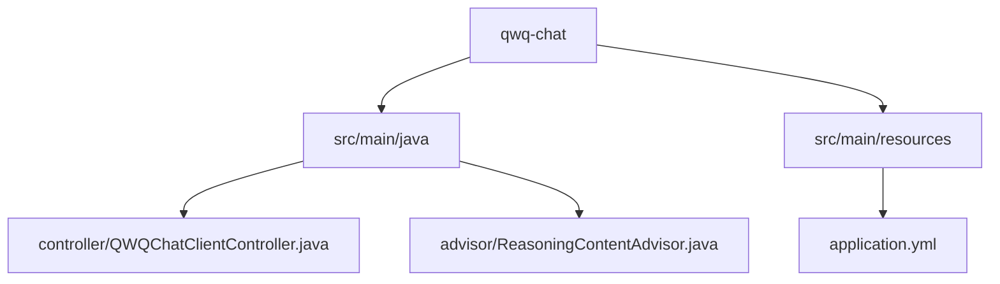
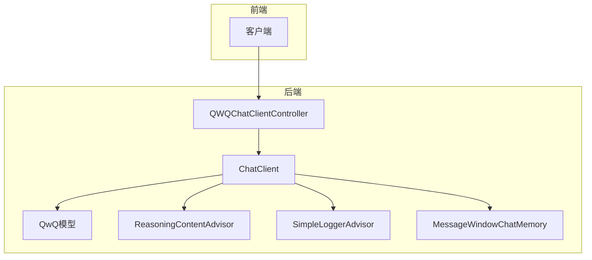
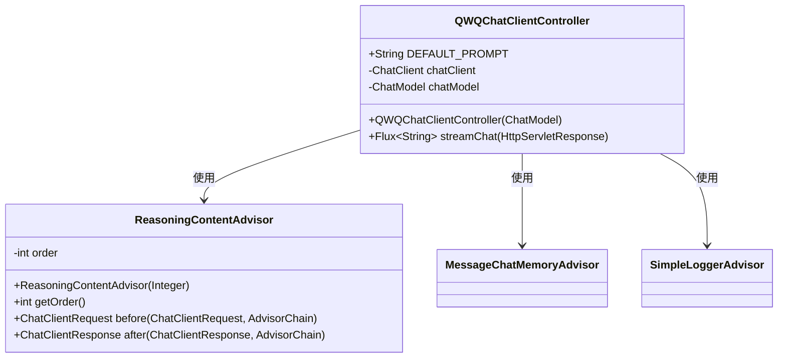
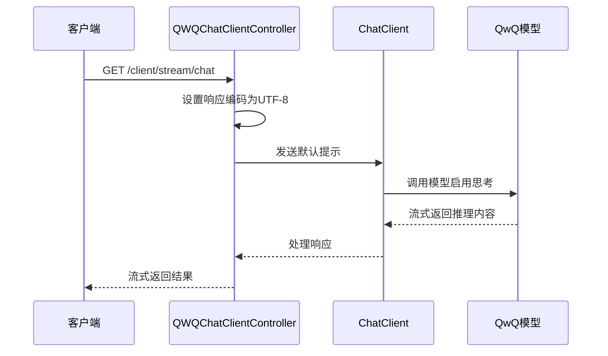
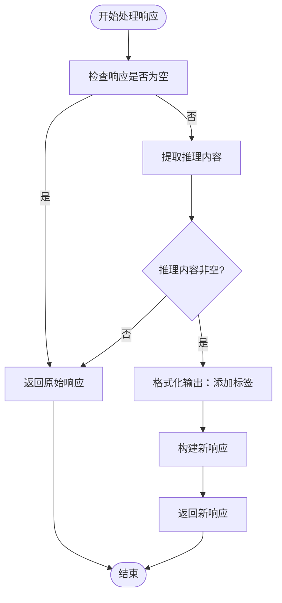
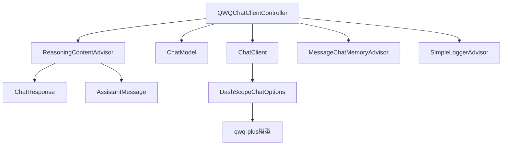

# QwQ聊天集成

<cite>
**本文档中引用的文件**  
- [QWQChatClientController.java](file://spring-ai-alibaba-chat-example/qwq-chat/src/main/java/com/alibaba/cloud/ai/example/chat/qwq/controller/QWQChatClientController.java)
- [ReasoningContentAdvisor.java](file://spring-ai-alibaba-chat-example/qwq-chat/src/main/java/com/alibaba/cloud/ai/example/chat/qwq/advisor/ReasoningContentAdvisor.java)
- [application.yml](file://spring-ai-alibaba-chat-example/qwq-chat/src/main/resources/application.yml)
</cite>

## 目录
1. [简介](#简介)
2. [项目结构](#项目结构)
3. [核心组件](#核心组件)
4. [架构概述](#架构概述)
5. [详细组件分析](#详细组件分析)
6. [依赖分析](#依赖分析)
7. [性能考虑](#性能考虑)
8. [故障排除指南](#故障排除指南)
9. [结论](#结论)

## 简介
本文档详细介绍了如何在Spring AI Alibaba项目中集成QwQ模型，重点用于数学和推理任务。文档深入解析了`QWQChatClientController`的实现机制，涵盖其针对数学计算优化的API调用方式和响应处理逻辑。同时说明了QwQ特有的配置要求，如精度设置、计算超时和结果格式化选项，并提供代码示例展示如何提交数学问题、处理逐步推理过程和获取最终答案。此外，还解释了QwQ模型在数学领域的优势和适用场景，为教育和科研应用提供指导，并包含性能监控和错误处理策略。

## 项目结构
QwQ聊天集成示例位于`spring-ai-alibaba-chat-example/qwq-chat`目录下，主要包含控制器、顾问（Advisor）类和配置文件。项目结构清晰，分为Java源码和资源文件两大部分，便于维护和扩展。

**图示来源**  
- [QWQChatClientController.java](file://spring-ai-alibaba-chat-example/qwq-chat/src/main/java/com/alibaba/cloud/ai/example/chat/qwq/controller/QWQChatClientController.java)
- [ReasoningContentAdvisor.java](file://spring-ai-alibaba-chat-example/qwq-chat/src/main/java/com/alibaba/cloud/ai/example/chat/qwq/advisor/ReasoningContentAdvisor.java)
- [application.yml](file://spring-ai-alibaba-chat-example/qwq-chat/src/main/resources/application.yml)

**本节来源**  
- [QWQChatClientController.java](file://spring-ai-alibaba-chat-example/qwq-chat/src/main/java/com/alibaba/cloud/ai/example/chat/qwq/controller/QWQChatClientController.java)
- [application.yml](file://spring-ai-alibaba-chat-example/qwq-chat/src/main/resources/application.yml)

## 核心组件
本集成的核心组件包括`QWQChatClientController`和`ReasoningContentAdvisor`。前者负责处理HTTP请求并调用QwQ模型进行流式响应，后者则用于在输出中整合模型的推理过程内容。

**本节来源**  
- [QWQChatClientController.java](file://spring-ai-alibaba-chat-example/qwq-chat/src/main/java/com/alibaba/cloud/ai/example/chat/qwq/controller/QWQChatClientController.java)
- [ReasoningContentAdvisor.java](file://spring-ai-alibaba-chat-example/qwq-chat/src/main/java/com/alibaba/cloud/ai/example/chat/qwq/advisor/ReasoningContentAdvisor.java)

## 架构概述
QwQ聊天集成采用Spring AI的ChatClient架构，通过Advisor机制扩展功能。系统通过流式API与QwQ模型交互，支持实时推理过程展示。整体架构包括请求处理、上下文管理、日志记录和推理内容整合等模块。

**图示来源**  
- [QWQChatClientController.java](file://spring-ai-alibaba-chat-example/qwq-chat/src/main/java/com/alibaba/cloud/ai/example/chat/qwq/controller/QWQChatClientController.java)
- [ReasoningContentAdvisor.java](file://spring-ai-alibaba-chat-example/qwq-chat/src/main/java/com/alibaba/cloud/ai/example/chat/qwq/advisor/ReasoningContentAdvisor.java)

## 详细组件分析

### QWQChatClientController 分析
`QWQChatClientController`是主要的REST控制器，负责处理客户端的聊天请求。它使用Spring AI的ChatClient构建器配置QwQ模型的调用参数，并启用思考过程。

#### 构造函数分析
控制器在构造时初始化ChatClient，设置默认的Advisor链，包括消息记忆、推理内容整合和日志记录功能。

**图示来源**  
- [QWQChatClientController.java](file://spring-ai-alibaba-chat-example/qwq-chat/src/main/java/com/alibaba/cloud/ai/example/chat/qwq/controller/QWQChatClientController.java#L40-L117)
- [ReasoningContentAdvisor.java](file://spring-ai-alibaba-chat-example/qwq-chat/src/main/java/com/alibaba/cloud/ai/example/chat/qwq/advisor/ReasoningContentAdvisor.java#L24-L76)

#### 流式聊天方法分析
`streamChat`方法处理流式聊天请求，返回`text/event-stream`类型的响应。QwQ模型仅支持流式调用，非流式调用会返回400错误。

**图示来源**  
- [QWQChatClientController.java](file://spring-ai-alibaba-chat-example/qwq-chat/src/main/java/com/alibaba/cloud/ai/example/chat/qwq/controller/QWQChatClientController.java#L100-L117)

**本节来源**  
- [QWQChatClientController.java](file://spring-ai-alibaba-chat-example/qwq-chat/src/main/java/com/alibaba/cloud/ai/example/chat/qwq/controller/QWQChatClientController.java#L40-L117)

### ReasoningContentAdvisor 分析
`ReasoningContentAdvisor`是一个自定义的Advisor，用于在模型响应中整合推理过程内容。

#### 推理内容整合流程
该Advisor在响应后处理阶段提取模型的推理内容，并将其格式化后添加到最终输出中。

**图示来源**  
- [ReasoningContentAdvisor.java](file://spring-ai-alibaba-chat-example/qwq-chat/src/main/java/com/alibaba/cloud/ai/example/chat/qwq/advisor/ReasoningContentAdvisor.java#L50-L75)

**本节来源**  
- [ReasoningContentAdvisor.java](file://spring-ai-alibaba-chat-example/qwq-chat/src/main/java/com/alibaba/cloud/ai/example/chat/qwq/advisor/ReasoningContentAdvisor.java#L24-L76)

## 依赖分析
QwQ聊天集成依赖于Spring AI框架的核心组件，包括ChatClient、ChatModel和各种Advisor。同时依赖于阿里云的DashScope服务进行模型调用。

**图示来源**  
- [QWQChatClientController.java](file://spring-ai-alibaba-chat-example/qwq-chat/src/main/java/com/alibaba/cloud/ai/example/chat/qwq/controller/QWQChatClientController.java)
- [ReasoningContentAdvisor.java](file://spring-ai-alibaba-chat-example/qwq-chat/src/main/java/com/alibaba/cloud/ai/example/chat/qwq/advisor/ReasoningContentAdvisor.java)

**本节来源**  
- [QWQChatClientController.java](file://spring-ai-alibaba-chat-example/qwq-chat/src/main/java/com/alibaba/cloud/ai/example/chat/qwq/controller/QWQChatClientController.java)
- [ReasoningContentAdvisor.java](file://spring-ai-alibaba-chat-example/qwq-chat/src/main/java/com/alibaba/cloud/ai/example/chat/qwq/advisor/ReasoningContentAdvisor.java)

## 性能考虑
QwQ模型仅支持流式调用，这有助于实时显示推理过程，但需要客户端支持SSE（Server-Sent Events）。模型不支持多种参数调节，简化了配置但限制了灵活性。建议在高并发场景下合理管理对话上下文，避免内存泄漏。

## 故障排除指南
常见问题包括API密钥无效、模型调用非流式导致400错误、推理内容无法显示等。确保正确配置`AI_DASHSCOPE_API_KEY`环境变量，使用流式接口调用，并检查Advisor是否正确处理了响应元数据。

**本节来源**  
- [QWQChatClientController.java](file://spring-ai-alibaba-chat-example/qwq-chat/src/main/java/com/alibaba/cloud/ai/example/chat/qwq/controller/QWQChatClientController.java#L80-L100)
- [application.yml](file://spring-ai-alibaba-chat-example/qwq-chat/src/main/resources/application.yml#L1-L15)

## 结论
QwQ聊天集成提供了一种有效的方式在Spring AI应用中使用QwQ模型进行数学和推理任务。通过合理的架构设计和Advisor机制，系统能够展示详细的推理过程，适用于教育和科研场景。尽管存在一些限制，如仅支持流式调用和有限的参数配置，但其专注于推理任务的特点使其在特定领域具有优势。