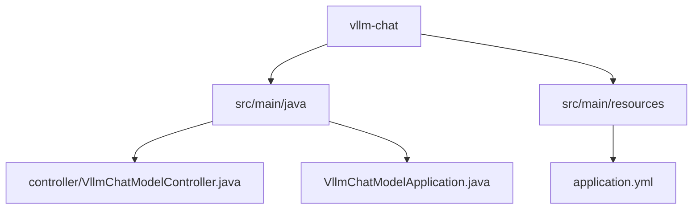
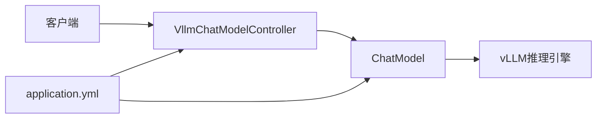
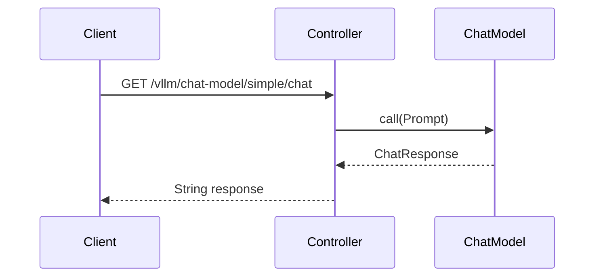
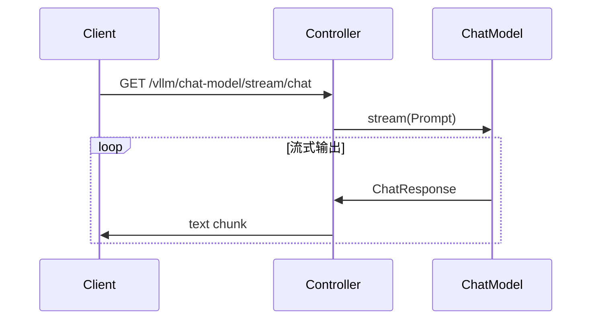
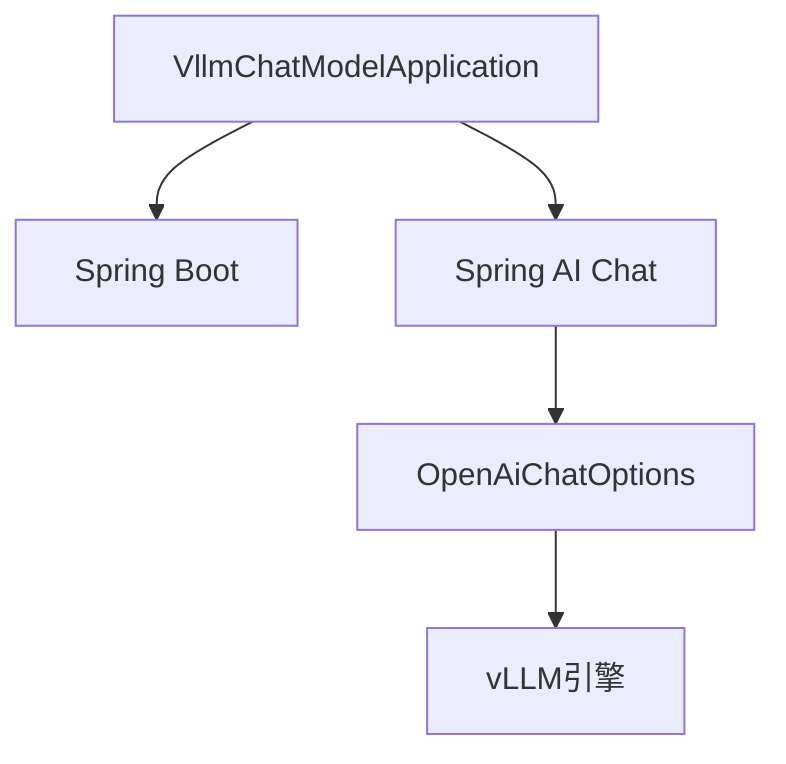

# vLLM聊天集成

<cite>
**本文档中引用的文件**  
- [VllmChatModelController.java](file://spring-ai-alibaba-chat-example/vllm-chat/src/main/java/com/alibaba/cloud/ai/example/chat/vllm/controller/VllmChatModelController.java)
- [VllmChatModelApplication.java](file://spring-ai-alibaba-chat-example/vllm-chat/src/main/java/com/alibaba/cloud/ai/example/chat/vllm/VllmChatModelApplication.java)
- [application.yml](file://spring-ai-alibaba-chat-example/vllm-chat/src/main/resources/application.yml)
</cite>

## 目录
1. [简介](#简介)
2. [项目结构](#项目结构)
3. [核心组件](#核心组件)
4. [架构概述](#架构概述)
5. [详细组件分析](#详细组件分析)
6. [依赖分析](#依赖分析)
7. [性能考量](#性能考量)
8. [故障排除指南](#故障排除指南)
9. [结论](#结论)

## 简介
本文档旨在提供在Spring AI Alibaba框架中集成高性能vLLM推理引擎的详细指南。重点介绍VllmChatModelController的实现机制，包括其高吞吐量、低延迟的API调用模式和批处理策略。文档涵盖vLLM特有的配置参数，如张量并行设置、批处理大小和内存优化选项，并提供代码示例展示如何配置高性能推理服务、监控系统资源使用和优化推理延迟。同时解释vLLM的技术架构和优势，为大规模部署提供指导，包含集群配置和负载均衡策略。

## 项目结构
vLLM聊天集成示例位于`spring-ai-alibaba-chat-example/vllm-chat`目录下，采用标准的Spring Boot项目结构。主要包含控制器、应用主类和配置文件。



**图示来源**  
- [VllmChatModelApplication.java](file://spring-ai-alibaba-chat-example/vllm-chat/src/main/java/com/alibaba/cloud/ai/example/chat/vllm/VllmChatModelApplication.java)
- [VllmChatModelController.java](file://spring-ai-alibaba-chat-example/vllm-chat/src/main/java/com/alibaba/cloud/ai/example/chat/vllm/controller/VllmChatModelController.java)
- [application.yml](file://spring-ai-alibaba-chat-example/vllm-chat/src/main/resources/application.yml)

**本节来源**  
- [VllmChatModelApplication.java](file://spring-ai-alibaba-chat-example/vllm-chat/src/main/java/com/alibaba/cloud/ai/example/chat/vllm/VllmChatModelApplication.java)
- [application.yml](file://spring-ai-alibaba-chat-example/vllm-chat/src/main/resources/application.yml)

## 核心组件
本集成的核心组件包括VllmChatModelController，提供简单调用、流式调用和自定义参数调用三种模式。通过ChatModel接口与vLLM引擎交互，实现高性能的推理服务。

**本节来源**  
- [VllmChatModelController.java](file://spring-ai-alibaba-chat-example/vllm-chat/src/main/java/com/alibaba/cloud/ai/example/chat/vllm/controller/VllmChatModelController.java)

## 架构概述
系统采用Spring Boot作为基础框架，通过ChatModel组件与vLLM推理引擎通信。配置通过application.yml文件管理，支持API密钥和基础URL的外部化配置。



**图示来源**  
- [VllmChatModelController.java](file://spring-ai-alibaba-chat-example/vllm-chat/src/main/java/com/alibaba/cloud/ai/example/chat/vllm/controller/VllmChatModelController.java)
- [application.yml](file://spring-ai-alibaba-chat-example/vllm-chat/src/main/resources/application.yml)

## 详细组件分析

### VllmChatModelController分析
VllmChatModelController提供了三种主要的API调用方式：

#### 简单调用
实现最基本的同步调用模式，直接返回字符串结果。



**图示来源**  
- [VllmChatModelController.java](file://spring-ai-alibaba-chat-example/vllm-chat/src/main/java/com/alibaba/cloud/ai/example/chat/vllm/controller/VllmChatModelController.java#L33-L43)

#### 流式调用
实现流式响应，支持"打字机"效果，适用于长文本生成场景。



**图示来源**  
- [VllmChatModelController.java](file://spring-ai-alibaba-chat-example/vllm-chat/src/main/java/com/alibaba/cloud/ai/example/chat/vllm/controller/VllmChatModelController.java#L45-L60)

#### 自定义参数调用
允许通过编程方式设置LLM参数，优先级高于配置文件中的设置。

```mermaid
flowchart TD
Start([开始]) --> CreateOptions[创建OpenAiChatOptions]
CreateOptions --> SetParams[设置topP, model, maxTokens, temperature]
SetParams --> BuildOptions[构建Options对象]
BuildOptions --> CallModel[调用ChatModel.call()]
CallModel --> ReturnResult[返回结果]
```

**图示来源**  
- [VllmChatModelController.java](file://spring-ai-alibaba-chat-example/vllm-chat/src/main/java/com/alibaba/cloud/ai/example/chat/vllm/controller/VllmChatModelController.java#L72-L89)

**本节来源**  
- [VllmChatModelController.java](file://spring-ai-alibaba-chat-example/vllm-chat/src/main/java/com/alibaba/cloud/ai/example/chat/vllm/controller/VllmChatModelController.java)

## 依赖分析
项目依赖Spring AI Alibaba框架的核心组件，通过OpenAI兼容接口与vLLM引擎通信。



**图示来源**  
- [VllmChatModelApplication.java](file://spring-ai-alibaba-chat-example/vllm-chat/src/main/java/com/alibaba/cloud/ai/example/chat/vllm/VllmChatModelApplication.java)
- [VllmChatModelController.java](file://spring-ai-alibaba-chat-example/vllm-chat/src/main/java/com/alibaba/cloud/ai/example/chat/vllm/controller/VllmChatModelController.java)

**本节来源**  
- [VllmChatModelApplication.java](file://spring-ai-alibaba-chat-example/vllm-chat/src/main/java/com/alibaba/cloud/ai/example/chat/vllm/VllmChatModelApplication.java)

## 性能考量
vLLM引擎通过PagedAttention技术实现高效的内存管理，支持高吞吐量和低延迟的推理服务。在Spring AI Alibaba框架中集成时，应注意以下性能优化点：
- 使用流式API处理长文本生成，避免内存积压
- 合理配置maxTokens参数，控制响应长度
- 利用自定义参数调优topP和temperature，平衡生成质量和多样性
- 监控系统资源使用，确保GPU内存充足

## 故障排除指南
常见问题及解决方案：
- **连接超时**：检查base-url配置和网络连接
- **认证失败**：验证API密钥是否正确设置
- **响应乱码**：确保response.setCharacterEncoding("UTF-8")已设置
- **性能瓶颈**：检查GPU资源使用情况，调整批处理大小

**本节来源**  
- [VllmChatModelController.java](file://spring-ai-alibaba-chat-example/vllm-chat/src/main/java/com/alibaba/cloud/ai/example/chat/vllm/controller/VllmChatModelController.java#L54)

## 结论
本文档详细介绍了在Spring AI Alibaba框架中集成vLLM推理引擎的方法。通过VllmChatModelController提供的多种调用模式，开发者可以灵活地构建高性能的聊天应用。vLLM的高效内存管理和批处理能力使其成为大规模部署的理想选择。建议在生产环境中结合监控工具，持续优化推理性能。