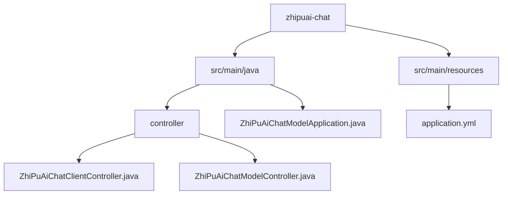
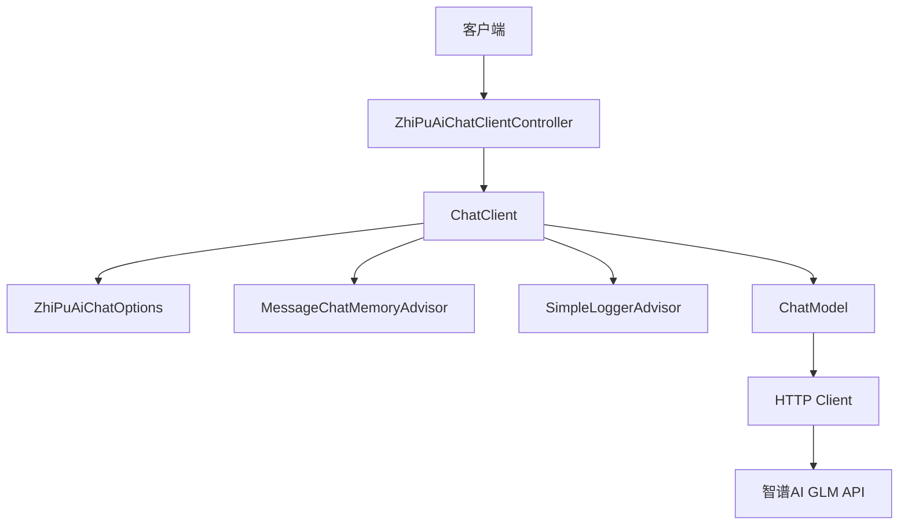
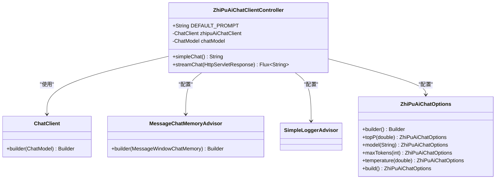
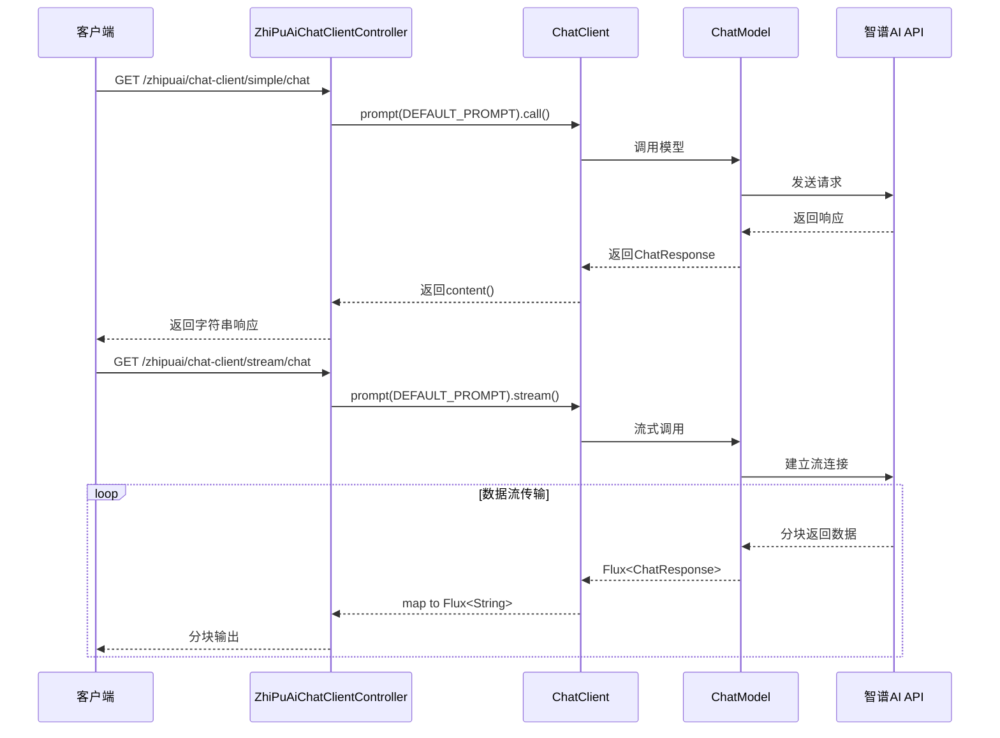
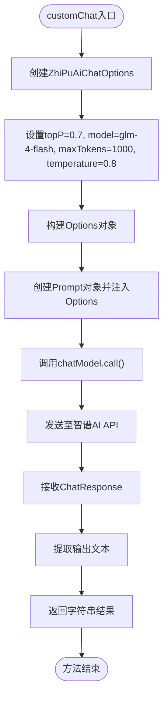
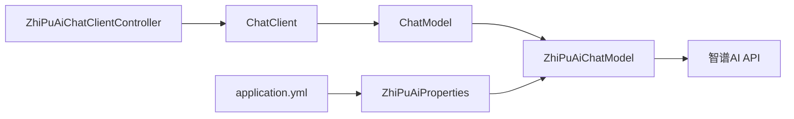

# 智谱AI聊天集成

<cite>
**本文档引用文件**  
- [ZhiPuAiChatClientController.java](file://spring-ai-alibaba-chat-example/zhipuai-chat/src/main/java/com/alibaba/cloud/ai/example/chat/zhipuai/controller/ZhiPuAiChatClientController.java)
- [ZhiPuAiChatModelController.java](file://spring-ai-alibaba-chat-example/zhipuai-chat/src/main/java/com/alibaba/cloud/ai/example/chat/zhipuai/controller/ZhiPuAiChatModelController.java)
- [application.yml](file://spring-ai-alibaba-chat-example/zhipuai-chat/src/main/resources/application.yml)
- [ZhiPuAiChatModelApplication.java](file://spring-ai-alibaba-chat-example/zhipuai-chat/src/main/java/com/alibaba/cloud/ai/example/chat/zhipuai/ZhiPuAiChatModelApplication.java)
</cite>

## 目录
1. [简介](#简介)
2. [项目结构](#项目结构)
3. [核心组件](#核心组件)
4. [架构概述](#架构概述)
5. [详细组件分析](#详细组件分析)
6. [依赖分析](#依赖分析)
7. [性能考虑](#性能考虑)
8. [故障排除指南](#故障排除指南)
9. [结论](#结论)

## 简介
本文档详细介绍了如何在Spring AI Alibaba项目中集成智谱AI的GLM系列大语言模型。重点解析了`ZhiPuAiChatClientController`和`ZhiPuAiChatModelController`的实现机制，涵盖API调用方式、认证配置、流式响应处理及多轮对话支持。同时说明了智谱AI特有的模型参数配置、中文语义理解优势以及最佳实践建议，为开发者提供完整的集成指导。

## 项目结构
智谱AI聊天示例位于`spring-ai-alibaba-chat-example/zhipuai-chat`目录下，采用标准Spring Boot项目结构，包含控制器、配置文件和启动类。

**图示来源**  
- [ZhiPuAiChatClientController.java](file://spring-ai-alibaba-chat-example/zhipuai-chat/src/main/java/com/alibaba/cloud/ai/example/chat/zhipuai/controller/ZhiPuAiChatClientController.java)
- [ZhiPuAiChatModelController.java](file://spring-ai-alibaba-chat-example/zhipuai-chat/src/main/java/com/alibaba/cloud/ai/example/chat/zhipuai/controller/ZhiPuAiChatModelController.java)
- [application.yml](file://spring-ai-alibaba-chat-example/zhipuai-chat/src/main/resources/application.yml)

**本节来源**  
- [ZhiPuAiChatClientController.java](file://spring-ai-alibaba-chat-example/zhipuai-chat/src/main/java/com/alibaba/cloud/ai/example/chat/zhipuai/controller/ZhiPuAiChatClientController.java)
- [ZhiPuAiChatModelController.java](file://spring-ai-alibaba-chat-example/zhipuai-chat/src/main/java/com/alibaba/cloud/ai/example/chat/zhipuai/controller/ZhiPuAiChatModelController.java)
- [application.yml](file://spring-ai-alibaba-chat-example/zhipuai-chat/src/main/resources/application.yml)

## 核心组件
本项目的核心组件包括基于`ChatClient`的高级API封装和直接使用`ChatModel`的底层调用方式，分别由`ZhiPuAiChatClientController`和`ZhiPuAiChatModelController`实现。通过`ZhiPuAiChatOptions`支持灵活的模型参数配置，并结合`MessageChatMemoryAdvisor`实现上下文记忆功能。

**本节来源**  
- [ZhiPuAiChatClientController.java](file://spring-ai-alibaba-chat-example/zhipuai-chat/src/main/java/com/alibaba/cloud/ai/example/chat/zhipuai/controller/ZhiPuAiChatClientController.java#L22-L82)
- [ZhiPuAiChatModelController.java](file://spring-ai-alibaba-chat-example/zhipuai-chat/src/main/java/com/alibaba/cloud/ai/example/chat/zhipuai/controller/ZhiPuAiChatModelController.java#L37-L92)

## 架构概述
系统通过Spring AI Alibaba框架与智谱AI的GLM模型进行集成，采用分层设计模式，上层为REST控制器，中层为ChatClient/ChatModel抽象，底层为HTTP客户端与API通信。

**图示来源**  
- [ZhiPuAiChatClientController.java](file://spring-ai-alibaba-chat-example/zhipuai-chat/src/main/java/com/alibaba/cloud/ai/example/chat/zhipuai/controller/ZhiPuAiChatClientController.java)
- [ZhiPuAiChatModelController.java](file://spring-ai-alibaba-chat-example/zhipuai-chat/src/main/java/com/alibaba/cloud/ai/example/chat/zhipuai/controller/ZhiPuAiChatModelController.java)

## 详细组件分析

### ZhiPuAiChatClientController 分析
该控制器展示了如何使用`ChatClient`构建器模式创建具备上下文记忆和日志记录功能的聊天客户端。

#### 对象关系图

**图示来源**  
- [ZhiPuAiChatClientController.java](file://spring-ai-alibaba-chat-example/zhipuai-chat/src/main/java/com/alibaba/cloud/ai/example/chat/zhipuai/controller/ZhiPuAiChatClientController.java#L22-L82)

#### API调用流程

**图示来源**  
- [ZhiPuAiChatClientController.java](file://spring-ai-alibaba-chat-example/zhipuai-chat/src/main/java/com/alibaba/cloud/ai/example/chat/zhipuai/controller/ZhiPuAiChatClientController.java#L65-L82)

**本节来源**  
- [ZhiPuAiChatClientController.java](file://spring-ai-alibaba-chat-example/zhipuai-chat/src/main/java/com/alibaba/cloud/ai/example/chat/zhipuai/controller/ZhiPuAiChatClientController.java#L0-L83)

### ZhiPuAiChatModelController 分析
该控制器展示了直接使用`ChatModel`接口进行调用的方式，支持自定义参数和流式响应。

#### 高级调用流程

**图示来源**  
- [ZhiPuAiChatModelController.java](file://spring-ai-alibaba-chat-example/zhipuai-chat/src/main/java/com/alibaba/cloud/ai/example/chat/zhipuai/controller/ZhiPuAiChatModelController.java#L75-L92)

**本节来源**  
- [ZhiPuAiChatModelController.java](file://spring-ai-alibaba-chat-example/zhipuai-chat/src/main/java/com/alibaba/cloud/ai/example/chat/zhipuai/controller/ZhiPuAiChatModelController.java#L0-L93)

## 依赖分析
项目依赖Spring AI Alibaba框架提供的智谱AI集成模块，通过自动配置加载API密钥和基础URL。

**图示来源**  
- [application.yml](file://spring-ai-alibaba-chat-example/zhipuai-chat/src/main/resources/application.yml#L0-L16)
- [ZhiPuAiChatClientController.java](file://spring-ai-alibaba-chat-example/zhipuai-chat/src/main/java/com/alibaba/cloud/ai/example/chat/zhipuai/controller/ZhiPuAiChatClientController.java)
- [ZhiPuAiChatModelController.java](file://spring-ai-alibaba-chat-example/zhipuai-chat/src/main/java/com/alibaba/cloud/ai/example/chat/zhipuai/controller/ZhiPuAiChatModelController.java)

**本节来源**  
- [application.yml](file://spring-ai-alibaba-chat-example/zhipuai-chat/src/main/resources/application.yml#L0-L16)

## 性能考虑
- 推荐使用流式API（stream）实现"打字机"效果，提升用户体验
- 合理设置`maxTokens`避免过长响应影响性能
- 启用`MessageChatMemoryAdvisor`时注意内存消耗
- 生产环境应配置连接池和超时参数
- 建议使用`glm-4-flash`模型以获得更快的响应速度

## 故障排除指南
常见问题及解决方案：

| 问题现象 | 可能原因 | 解决方案 |
|--------|--------|--------|
| 认证失败 | API密钥未正确配置 | 确保环境变量`ZHIPUAI_API_KEY`已设置 |
| 响应乱码 | 字符编码未设置 | 在流式响应中设置`response.setCharacterEncoding("UTF-8")` |
| 模型调用超时 | 网络延迟或模型负载高 | 调整超时配置或切换至`glm-4-flash`模型 |
| 上下文丢失 | 未正确配置Chat Memory | 确保使用`MessageChatMemoryAdvisor`并指定对话ID |

**本节来源**  
- [ZhiPuAiChatClientController.java](file://spring-ai-alibaba-chat-example/zhipuai-chat/src/main/java/com/alibaba/cloud/ai/example/chat/zhipuai/controller/ZhiPuAiChatClientController.java#L78)
- [ZhiPuAiChatModelController.java](file://spring-ai-alibaba-chat-example/zhipuai-chat/src/main/java/com/alibaba/cloud/ai/example/chat/zhipuai/controller/ZhiPuAiChatModelController.java#L55)

## 结论
本文档全面解析了Spring AI Alibaba项目中集成智谱AI GLM模型的实现方式。通过`ChatClient`和`ChatModel`两种模式，开发者可以灵活选择适合应用场景的集成方案。建议在需要上下文记忆和复杂对话管理时使用`ChatClient`，在需要精细控制参数时使用`ChatModel`直接调用。结合`glm-4-flash`等高性能模型，可为中文应用场景提供优质的AI服务支持。