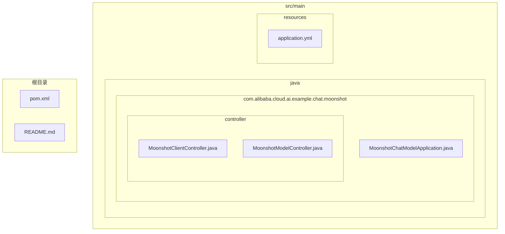
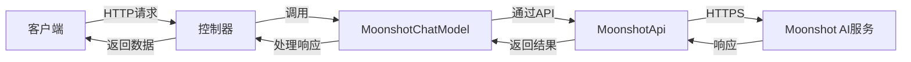
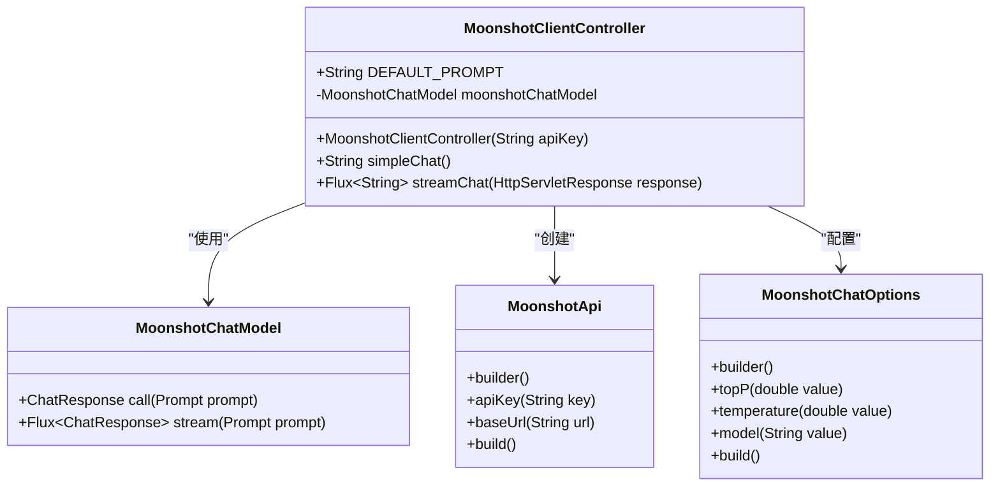
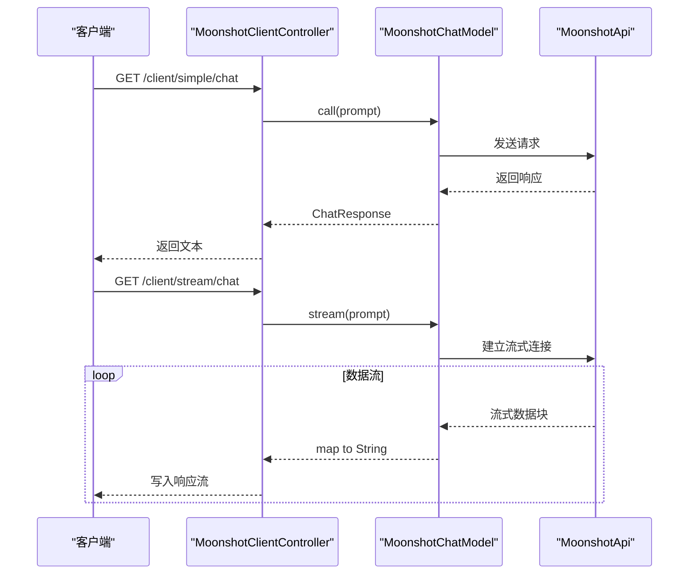
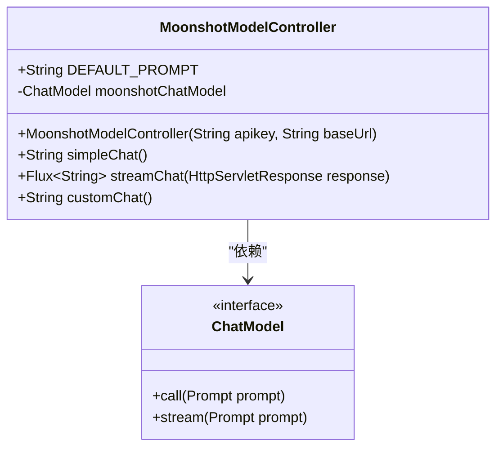
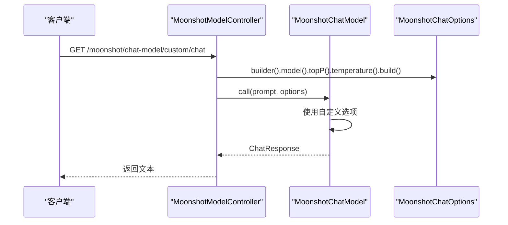
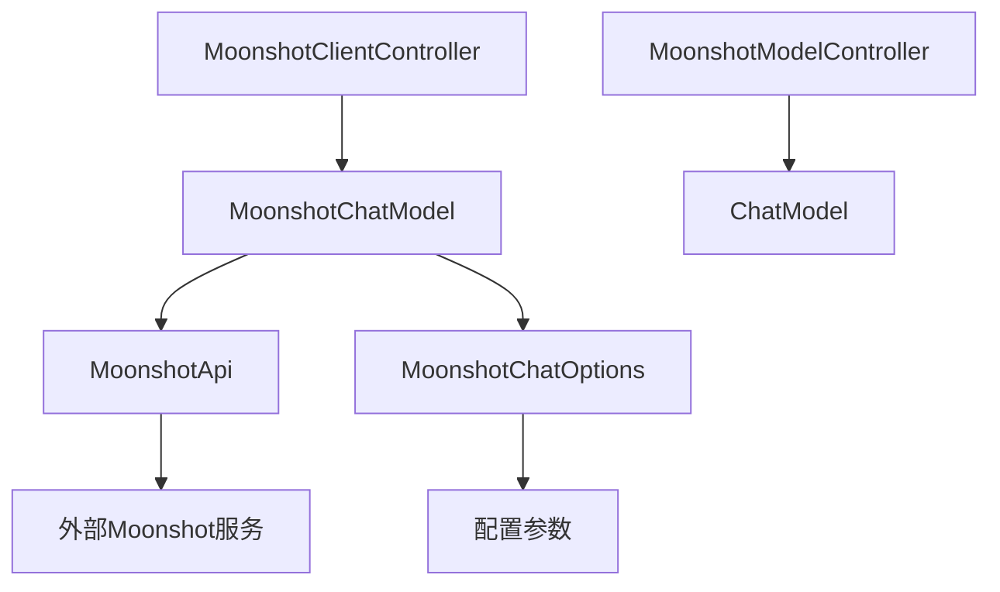

# 月之暗面聊天集成

<cite>
**本文档中引用的文件**  
- [MoonshotClientController.java](file://spring-ai-alibaba-chat-example/moonshot-chat/src/main/java/com/alibaba/cloud/ai/example/chat/moonshot/controller/MoonshotClientController.java)
- [MoonshotModelController.java](file://spring-ai-alibaba-chat-example/moonshot-chat/src/main/java/com/alibaba/cloud/ai/example/chat/moonshot/controller/MoonshotModelController.java)
- [application.yml](file://spring-ai-alibaba-chat-example/moonshot-chat/src/main/resources/application.yml)
</cite>

## 目录
1. [简介](#简介)
2. [项目结构](#项目结构)
3. [核心组件](#核心组件)
4. [架构概述](#架构概述)
5. [详细组件分析](#详细组件分析)
6. [依赖分析](#依赖分析)
7. [性能考虑](#性能考虑)
8. [故障排除指南](#故障排除指南)
9. [结论](#结论)

## 简介
本文档旨在为开发者提供在Spring AI Alibaba框架中集成月之暗面（Moonshot）AI模型的全面指南。重点介绍MoonshotClientController的实现机制，涵盖其API调用方式、认证流程和响应处理策略。文档详细说明了Moonshot特有的配置参数，如API密钥、模型版本和请求超时设置，并提供构建复杂聊天请求、处理多样化响应内容及实现流式传输功能的代码示例。此外，还将解析Moonshot模型的技术特性与优势，为开发者提供最佳实践建议，同时包含错误处理策略和性能监控方法。

## 项目结构
月之暗面聊天集成示例项目位于`spring-ai-alibaba-chat-example/moonshot-chat`目录下，采用标准的Spring Boot项目结构。主要包含控制器层、资源文件和配置文件，用于演示如何通过Spring AI Alibaba框架与Moonshot AI服务进行交互。

**图示来源**  
- [MoonshotClientController.java](file://spring-ai-alibaba-chat-example/moonshot-chat/src/main/java/com/alibaba/cloud/ai/example/chat/moonshot/controller/MoonshotClientController.java)
- [MoonshotModelController.java](file://spring-ai-alibaba-chat-example/moonshot-chat/src/main/java/com/alibaba/cloud/ai/example/chat/moonshot/controller/MoonshotModelController.java)
- [application.yml](file://spring-ai-alibaba-chat-example/moonshot-chat/src/main/resources/application.yml)

**本节来源**  
- [MoonshotClientController.java](file://spring-ai-alibaba-chat-example/moonshot-chat/src/main/java/com/alibaba/cloud/ai/example/chat/moonshot/controller/MoonshotClientController.java)
- [MoonshotModelController.java](file://spring-ai-alibaba-chat-example/moonshot-chat/src/main/java/com/alibaba/cloud/ai/example/chat/moonshot/controller/MoonshotModelController.java)
- [application.yml](file://spring-ai-alibaba-chat-example/moonshot-chat/src/main/resources/application.yml)

## 核心组件
本项目的核心组件包括两个控制器类：`MoonshotClientController`和`MoonshotModelController`，它们分别展示了通过不同方式调用Moonshot AI模型的能力。`MoonshotClientController`专注于直接使用`MoonshotChatModel`实例进行简单和流式聊天调用，而`MoonshotModelController`则通过`ChatModel`接口提供了更灵活的调用方式，并支持自定义聊天选项。

**本节来源**  
- [MoonshotClientController.java](file://spring-ai-alibaba-chat-example/moonshot-chat/src/main/java/com/alibaba/cloud/ai/example/chat/moonshot/controller/MoonshotClientController.java#L1-L83)
- [MoonshotModelController.java](file://spring-ai-alibaba-chat-example/moonshot-chat/src/main/java/com/alibaba/cloud/ai/example/chat/moonshot/controller/MoonshotModelController.java#L1-L108)

## 架构概述
整个集成架构基于Spring AI Alibaba框架，利用其提供的`MoonshotChatModel`和`MoonshotApi`类与Moonshot服务进行通信。应用通过读取配置文件中的API密钥和基础URL来初始化API客户端，并设置默认的聊天选项（如topP、temperature和模型版本）。控制器层暴露REST端点，处理来自客户端的请求，并将结果返回。

**图示来源**  
- [MoonshotClientController.java](file://spring-ai-alibaba-chat-example/moonshot-chat/src/main/java/com/alibaba/cloud/ai/example/chat/moonshot/controller/MoonshotClientController.java#L1-L83)
- [MoonshotModelController.java](file://spring-ai-alibaba-chat-example/moonshot-chat/src/main/java/com/alibaba/cloud/ai/example/chat/moonshot/controller/MoonshotModelController.java#L1-L108)

## 详细组件分析

### MoonshotClientController 分析
`MoonshotClientController`类实现了对Moonshot AI模型的直接调用，提供了简单聊天和流式聊天两种模式。该控制器通过构造函数注入API密钥，并初始化`MoonshotChatModel`实例，设置默认的聊天参数。

#### 对象导向组件

**图示来源**  
- [MoonshotClientController.java](file://spring-ai-alibaba-chat-example/moonshot-chat/src/main/java/com/alibaba/cloud/ai/example/chat/moonshot/controller/MoonshotClientController.java#L1-L83)

#### API/服务组件

**图示来源**  
- [MoonshotClientController.java](file://spring-ai-alibaba-chat-example/moonshot-chat/src/main/java/com/alibaba/cloud/ai/example/chat/moonshot/controller/MoonshotClientController.java#L1-L83)

**本节来源**  
- [MoonshotClientController.java](file://spring-ai-alibaba-chat-example/moonshot-chat/src/main/java/com/alibaba/cloud/ai/example/chat/moonshot/controller/MoonshotClientController.java#L1-L83)

### MoonshotModelController 分析
`MoonshotModelController`类展示了如何通过`ChatModel`接口与Moonshot模型交互，支持更高级的配置选项。除了基本的简单和流式调用外，还提供了自定义聊天选项的功能，允许在运行时覆盖配置文件中的默认设置。

#### 对象导向组件

**图示来源**  
- [MoonshotModelController.java](file://spring-ai-alibaba-chat-example/moonshot-chat/src/main/java/com/alibaba/cloud/ai/example/chat/moonshot/controller/MoonshotModelController.java#L1-L108)

#### API/服务组件

**图示来源**  
- [MoonshotModelController.java](file://spring-ai-alibaba-chat-example/moonshot-chat/src/main/java/com/alibaba/cloud/ai/example/chat/moonshot/controller/MoonshotModelController.java#L1-L108)

**本节来源**  
- [MoonshotModelController.java](file://spring-ai-alibaba-chat-example/moonshot-chat/src/main/java/com/alibaba/cloud/ai/example/chat/moonshot/controller/MoonshotModelController.java#L1-L108)

## 依赖分析
项目依赖关系清晰，主要依赖Spring AI Alibaba框架提供的核心类库来实现与Moonshot AI服务的集成。通过Maven或Gradle管理外部依赖，确保版本兼容性和可维护性。

**图示来源**  
- [MoonshotClientController.java](file://spring-ai-alibaba-chat-example/moonshot-chat/src/main/java/com/alibaba/cloud/ai/example/chat/moonshot/controller/MoonshotClientController.java#L1-L83)
- [MoonshotModelController.java](file://spring-ai-alibaba-chat-example/moonshot-chat/src/main/java/com/alibaba/cloud/ai/example/chat/moonshot/controller/MoonshotModelController.java#L1-L108)

**本节来源**  
- [MoonshotClientController.java](file://spring-ai-alibaba-chat-example/moonshot-chat/src/main/java/com/alibaba/cloud/ai/example/chat/moonshot/controller/MoonshotClientController.java#L1-L83)
- [MoonshotModelController.java](file://spring-ai-alibaba-chat-example/moonshot-chat/src/main/java/com/alibaba/cloud/ai/example/chat/moonshot/controller/MoonshotModelController.java#L1-L108)

## 性能考虑
在实际应用中，应关注API调用的延迟和吞吐量。建议合理设置请求超时时间，利用流式传输减少用户等待感知。同时，可通过缓存机制优化频繁请求的响应速度，并监控API调用频率以避免超出服务限制。

## 故障排除指南
当遇到集成问题时，首先检查API密钥是否正确配置，基础URL是否可达。确认网络连接正常，并查看日志输出以获取详细的错误信息。对于流式传输问题，确保客户端正确处理了分块传输编码（chunked transfer encoding）。

**本节来源**  
- [MoonshotClientController.java](file://spring-ai-alibaba-chat-example/moonshot-chat/src/main/java/com/alibaba/cloud/ai/example/chat/moonshot/controller/MoonshotClientController.java#L1-L83)
- [MoonshotModelController.java](file://spring-ai-alibaba-chat-example/moonshot-chat/src/main/java/com/alibaba/cloud/ai/example/chat/moonshot/controller/MoonshotModelController.java#L1-L108)
- [application.yml](file://spring-ai-alibaba-chat-example/moonshot-chat/src/main/resources/application.yml#L1-L17)

## 结论
本文档全面介绍了如何在Spring AI Alibaba框架中集成Moonshot AI模型，涵盖了从基础配置到高级功能的各个方面。通过`MoonshotClientController`和`MoonshotModelController`的示例，开发者可以快速掌握两种不同的调用方式，并根据实际需求选择合适的方案。建议在生产环境中结合错误处理、性能监控和安全策略，以确保系统的稳定性和可靠性。