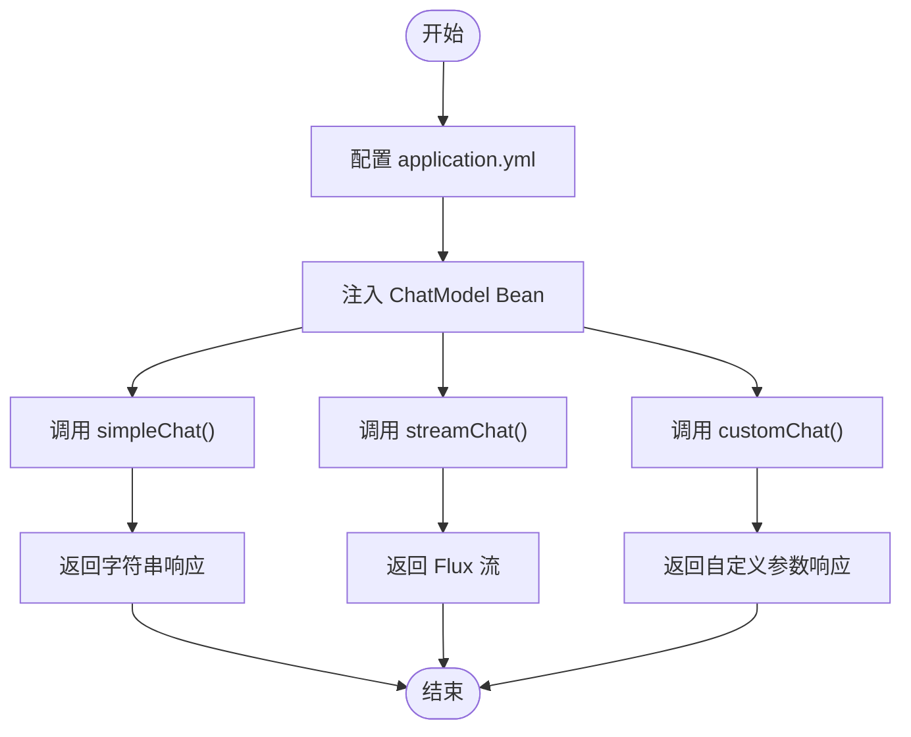
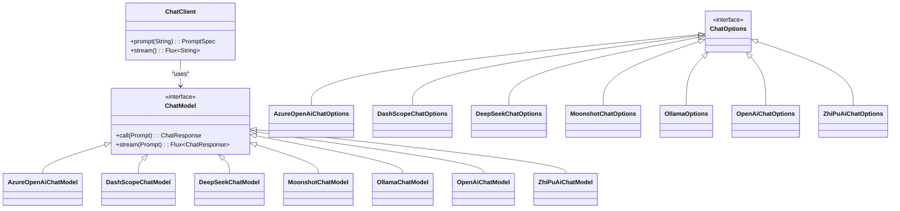

# 聊天示例

<cite>
**本文档中引用的文件**  
- [AzureOpenAiChatModelController.java](file://spring-ai-alibaba-chat-example/azure-openai-chat/src/main/java/com/alibaba/cloud/ai/example/chat/azure/openai/controller/AzureOpenAiChatModelController.java)
- [DashScopeChatModelController.java](file://spring-ai-alibaba-chat-example/dashscope-chat/src/main/java/com/alibaba/cloud/ai/example/chat/dashscope/controller/DashScopeChatModelController.java)
- [DeepSeekChatModelController.java](file://spring-ai-alibaba-chat-example/deepseek-chat/src/main/java/com/alibaba/cloud/ai/example/chat/deepseek/controller/DeepSeekChatModelController.java)
- [MoonshotModelController.java](file://spring-ai-alibaba-chat-example/moonshot-chat/src/main/java/com/alibaba/cloud/ai/example/chat/moonshot/controller/MoonshotModelController.java)
- [OllamaChatModelController.java](file://spring-ai-alibaba-chat-example/ollama-chat/src/main/java/com/alibaba/cloud/ai/example/chat/ollama/controller/OllamaChatModelController.java)
- [OpenAiChatModelController.java](file://spring-ai-alibaba-chat-example/openai-chat/src/main/java/com/alibaba/cloud/ai/example/chat/openai/controller/OpenAiChatModelController.java)
- [ZhiPuAiChatModelController.java](file://spring-ai-alibaba-chat-example/zhipuai-chat/src/main/java/com/alibaba/cloud/ai/example/chat/zhipuai/controller/ZhiPuAiChatModelController.java)
- [VllmChatModelController.java](file://spring-ai-alibaba-chat-example/vllm-chat/src/main/java/com/alibaba/cloud/ai/example/chat/vllm/controller/VllmChatModelController.java)
- [QWQChatClientController.java](file://spring-ai-alibaba-chat-example/qwq-chat/src/main/java/com/alibaba/cloud/ai/example/chat/qwq/controller/QWQChatClientController.java)
- [application.yml](file://spring-ai-alibaba-chat-example/azure-openai-chat/src/main/resources/application.yml)
- [application.yml](file://spring-ai-alibaba-chat-example/dashscope-chat/src/main/resources/application.yml)
- [application.yml](file://spring-ai-alibaba-chat-example/deepseek-chat/src/main/resources/application.yml)
- [application.yml](file://spring-ai-alibaba-chat-example/moonshot-chat/src/main/resources/application.yml)
- [application.yml](file://spring-ai-alibaba-chat-example/ollama-chat/src/main/resources/application.yml)
- [application.yml](file://spring-ai-alibaba-chat-example/openai-chat/src/main/resources/application.yml)
- [application.yml](file://spring-ai-alibaba-chat-example/zhipuai-chat/src/main/resources/application.yml)
- [application.yml](file://spring-ai-alibaba-chat-example/vllm-chat/src/main/resources/application.yml)
- [application.yml](file://spring-ai-alibaba-chat-example/qwq-chat/src/main/resources/application.yml)
</cite>

## 目录
1. [简介](#简介)
2. [统一使用模式概述](#统一使用模式概述)
3. [各AI提供商集成详解](#各ai提供商集成详解)
   - [通义千问（DashScope）](#通义千问dashscope)
   - [Azure OpenAI](#azure-openai)
   - [DeepSeek](#deepseek)
   - [月之暗面（Moonshot）](#月之暗面moonshot)
   - [Ollama](#ollama)
   - [OpenAI](#openai)
   - [QwQ](#qwq)
   - [vLLM](#vllm)
   - [智谱AI（ZhiPuAI）](#智谱ai-zhipuai)
4. [会话状态管理](#会话状态管理)
5. [响应格式处理](#响应格式处理)
6. [Spring AI 抽象能力解析](#spring-ai-抽象能力解析)
7. [最佳实践与建议](#最佳实践与建议)

## 简介
本文档旨在为开发者提供一个全面的聊天示例指南，涵盖多个主流AI模型提供商的集成方式。通过分析 `spring-ai-alibaba-chat-example` 模块中的具体实现，详细说明如何配置和使用通义千问、Azure OpenAI、DeepSeek、月之暗面、Ollama、OpenAI、QwQ、vLLM 和智谱AI等模型。文档不仅面向初学者提供统一的使用模式，也为经验丰富的开发者展示各提供商之间的差异和最佳实践。

**文档来源**
- [README.md](file://spring-ai-alibaba-chat-example/README.md)

## 统一使用模式概述
所有AI提供商的聊天功能均通过Spring AI框架提供的 `ChatModel` 接口进行抽象，开发者可以通过一致的API调用不同后端模型，实现无缝切换。核心使用模式包括：

- **简单调用**：通过 `call()` 方法发送提示并获取文本响应。
- **流式调用**：通过 `stream()` 方法实现流式输出，模拟打字机效果。
- **自定义参数**：通过编程方式设置 `ChatOptions` 来覆盖配置文件中的默认参数。
- **会话管理**：结合 `ChatClient` 实现更复杂的对话逻辑。

该设计使得开发者无需关心底层实现细节，只需关注业务逻辑即可快速集成多种AI模型。



**图示来源**
- [AzureOpenAiChatModelController.java](file://spring-ai-alibaba-chat-example/azure-openai-chat/src/main/java/com/alibaba/cloud/ai/example/chat/azure/openai/controller/AzureOpenAiChatModelController.java#L30-L88)

## 各AI提供商集成详解

### 通义千问（DashScope）
通义千问通过 `DashScopeChatModel` 提供支持，支持联网搜索、自定义请求头等高级功能。

#### 配置要求
在 `application.yml` 中配置以下参数：
```yaml
spring:
  ai:
    dashscope:
      api-key: YOUR_API_KEY
      base-url: https://dashscope.aliyuncs.com/api/v1
```

#### API端点与使用模式
- `/model/simple/chat`：基础聊天调用
- `/model/stream/chat`：流式响应
- `/dashscope/web-search`：启用联网搜索
- `/custom/http-headers`：自定义请求头（如内容安全检测）

#### 特性说明
支持通过 `DashScopeChatOptions` 编程设置 `topP`、`temperature` 等参数，并可启用 `SearchOptions` 实现网络搜索功能。

**章节来源**
- [DashScopeChatModelController.java](file://spring-ai-alibaba-chat-example/dashscope-chat/src/main/java/com/alibaba/cloud/ai/example/chat/dashscope/controller/DashScopeChatModelController.java#L1-L207)

### Azure OpenAI
Azure OpenAI 使用 `AzureOpenAiChatModel`，适用于企业级部署场景。

#### 配置要求
```yaml
spring:
  ai:
    azure:
      openai:
        api-key: YOUR_API_KEY
        endpoint: https://your-resource.openai.azure.com/
        deployment-name: gpt-35-turbo
```

#### API端点与使用模式
- `/azure/openai/chat-model/simple/chat`：标准调用
- `/azure/openai/chat-model/stream/chat`：流式输出
- 支持通过 `ChatClient` 构建复杂对话链

#### 特性说明
支持通过 `ChatClient.builder()` 添加 `Advisor`（如日志记录器）以增强调试能力。

**章节来源**
- [AzureOpenAiChatModelController.java](file://spring-ai-alibaba-chat-example/azure-openai-chat/src/main/java/com/alibaba/cloud/ai/example/chat/azure/openai/controller/AzureOpenAiChatModelController.java#L1-L88)

### DeepSeek
DeepSeek 通过 `DeepSeekChatModel` 提供高性能推理服务。

#### 配置要求
```yaml
spring:
  ai:
    deepseek:
      api-key: YOUR_API_KEY
      base-url: https://api.deepseek.com/v1
```

#### API端点与使用模式
- `/model/simple/chat`：基础调用
- `/model/stream/chat`：流式响应

#### 特性说明
接口简洁，专注于高效文本生成，适合对延迟敏感的应用。

**章节来源**
- [DeepSeekChatModelController.java](file://spring-ai-alibaba-chat-example/deepseek-chat/src/main/java/com/alibaba/cloud/ai/example/chat/deepseek/controller/DeepSeekChatModelController.java#L1-L66)

### 月之暗面（Moonshot）
Moonshot 使用 `MoonshotChatModel`，支持高并发和长上下文。

#### 配置要求
```yaml
spring:
  ai:
    moonshot:
      api-key: YOUR_API_KEY
      base-url: https://api.moonshot.cn/v1
```

#### API端点与使用模式
- `/moonshot/chat-model/simple/chat`：同步调用
- `/moonshot/chat-model/stream/chat`：流式输出
- `/moonshot/chat-model/custom/chat`：自定义参数调用

#### 特性说明
支持通过 `MoonshotChatOptions.builder()` 动态设置模型参数，优先级高于YAML配置。

**章节来源**
- [MoonshotModelController.java](file://spring-ai-alibaba-chat-example/moonshot-chat/src/main/java/com/alibaba/cloud/ai/example/chat/moonshot/controller/MoonshotModelController.java#L1-L108)

### Ollama
Ollama 支持本地运行开源大模型，适合私有化部署。

#### 配置要求
```yaml
spring:
  ai:
    ollama:
      base-url: http://localhost:11434
```

#### API端点与使用模式
- `/model/simple/chat`：基础调用
- `/model/stream/chat`：流式输出
- `/model/custom/chat`：指定模型（如 `llama3`）和参数

#### 特性说明
可通过 `OllamaOptions` 指定本地模型名称，便于在不同本地模型间切换。

**章节来源**
- [OllamaChatModelController.java](file://spring-ai-alibaba-chat-example/ollama-chat/src/main/java/com/alibaba/cloud/ai/example/chat/ollama/controller/OllamaChatModelController.java#L1-L90)

### OpenAI
OpenAI 使用标准 `OpenAiChatModel`，兼容官方API。

#### 配置要求
```yaml
spring:
  ai:
    openai:
      api-key: YOUR_API_KEY
      base-url: https://api.openai.com/v1
```

#### API端点与使用模式
- `/openai/chat-model/simple/chat`：普通调用
- `/openai/chat-model/stream/chat`：流式输出
- `/openai/chat-model/custom/chat/json-mode`：JSON模式输出

#### 特性说明
支持 `response_format=JSON_SCHEMA`，可用于结构化数据提取。

**章节来源**
- [OpenAiChatModelController.java](file://spring-ai-alibaba-chat-example/openai-chat/src/main/java/com/alibaba/cloud/ai/example/chat/openai/controller/OpenAiChatModelController.java#L1-L135)

### QwQ
QwQ 是专注于推理任务的模型，通过 `QWQChatClient` 调用。

#### 配置要求
```yaml
spring:
  ai:
    qwq:
      api-key: YOUR_API_KEY
```

#### API端点与使用模式
- `/qwq/client/chat`：使用 `ChatClient` 进行调用
- 支持 `ReasoningContentAdvisor` 增强推理能力

#### 特性说明
采用 `Advisor` 模式增强对话逻辑，适合复杂推理场景。

**章节来源**
- [QWQChatClientController.java](file://spring-ai-alibaba-chat-example/qwq-chat/src/main/java/com/alibaba/cloud/ai/example/chat/qwq/controller/QWQChatClientController.java)

### vLLM
vLLM 是高性能推理引擎，兼容OpenAI API。

#### 配置要求
```yaml
spring:
  ai:
    openai:
      api-key: EMPTY
      base-url: http://localhost:8000/v1
```

#### API端点与使用模式
- `/vllm/chat-model/simple/chat`：基础调用
- `/vllm/chat-model/stream/chat`：流式输出

#### 特性说明
利用 `OpenAiChatOptions` 实现与OpenAI兼容的接口调用。

**章节来源**
- [VllmChatModelController.java](file://spring-ai-alibaba-chat-example/vllm-chat/src/main/java/com/alibaba/cloud/ai/example/chat/vllm/controller/VllmChatModelController.java#L1-L90)

### 智谱AI（ZhiPuAI）
智谱AI 使用 `ZhiPuAiChatModel`，支持GLM系列模型。

#### 配置要求
```yaml
spring:
  ai:
    zhipuai:
      api-key: YOUR_API_KEY
```

#### API端点与使用模式
- `/zhipuai/chat-model/simple/chat`：基础调用
- `/zhipuai/chat-model/stream/chat`：流式输出
- `/zhipuai/chat-model/custom/chat`：自定义参数

#### 特性说明
支持 `glm-4-flash` 等多种模型，可通过 `ZhiPuAiChatOptions` 精细控制生成参数。

**章节来源**
- [ZhiPuAiChatModelController.java](file://spring-ai-alibaba-chat-example/zhipuai-chat/src/main/java/com/alibaba/cloud/ai/example/chat/zhipuai/controller/ZhiPuAiChatModelController.java#L1-L93)

## 会话状态管理
虽然本示例未直接展示会话记忆功能，但可通过集成 `spring-ai-alibaba-chat-memory-example` 模块实现。该模块支持：
- 内存存储（`InMemoryController`）
- Redis 存储（`RedisMemoryController`）
- MySQL 存储（`MysqlMemoryController`）

通过 `ChatMemory` 接口统一管理对话历史，确保上下文连贯性。

**章节来源**
- [InMemoryController.java](file://spring-ai-alibaba-chat-memory-example/src/main/java/com/alibaba/example/chatmemory/controller/InMemoryController.java)

## 响应格式处理
不同模型的响应格式可通过 `ChatResponse` 统一访问：
```java
ChatResponse response = chatModel.call(prompt);
String content = response.getResult().getOutput().getText();
int inputTokens = response.getMetadata().getUsage().getPromptTokens();
int outputTokens = response.getMetadata().getUsage().getCompletionTokens();
```

对于结构化输出（如JSON模式），可结合 `ResponseFormat` 参数确保格式一致性。

**章节来源**
- [OpenAiChatModelController.java](file://spring-ai-alibaba-chat-example/openai-chat/src/main/java/com/alibaba/cloud/ai/example/chat/openai/controller/OpenAiChatModelController.java#L90-L135)

## Spring AI 抽象能力解析
Spring AI 通过 `ChatModel` 接口屏蔽了不同AI提供商的实现差异，开发者只需面向接口编程。关键抽象包括：

- `ChatModel`：统一的模型调用接口
- `ChatOptions`：可扩展的参数配置体系
- `ChatClient`：高级对话构建工具
- `Advisor`：可插拔的对话增强机制

这种设计实现了“一次编码，多平台运行”的目标，极大提升了开发效率和系统可维护性。



**图示来源**
- [AzureOpenAiChatModelController.java](file://spring-ai-alibaba-chat-example/azure-openai-chat/src/main/java/com/alibaba/cloud/ai/example/chat/azure/openai/controller/AzureOpenAiChatModelController.java)
- [DashScopeChatModelController.java](file://spring-ai-alibaba-chat-example/dashscope-chat/src/main/java/com/alibaba/cloud/ai/example/chat/dashscope/controller/DashScopeChatModelController.java)
- [DeepSeekChatModelController.java](file://spring-ai-alibaba-chat-example/deepseek-chat/src/main/java/com/alibaba/cloud/ai/example/chat/deepseek/controller/DeepSeekChatModelController.java)

## 最佳实践与建议
1. **优先使用流式接口**：提升用户体验，避免长时间等待。
2. **合理设置超时**：防止因网络问题导致请求挂起。
3. **启用日志记录**：通过 `SimpleLoggerAdvisor` 调试对话流程。
4. **动态参数优先**：编程设置的 `ChatOptions` 优先级高于配置文件。
5. **错误处理机制**：捕获 `RuntimeException` 并提供降级策略。
6. **敏感内容过滤**：利用自定义HTTP头实现内容安全检测。
7. **性能监控**：记录token使用情况，优化成本。

通过遵循上述实践，可构建稳定、高效且可维护的AI集成系统。

**章节来源**
- [AzureOpenAiChatModelController.java](file://spring-ai-alibaba-chat-example/azure-openai-chat/src/main/java/com/alibaba/cloud/ai/example/chat/azure/openai/controller/AzureOpenAiChatModelController.java)
- [DashScopeChatModelController.java](file://spring-ai-alibaba-chat-example/dashscope-chat/src/main/java/com/alibaba/cloud/ai/example/chat/dashscope/controller/DashScopeChatModelController.java)
- [OpenAiChatModelController.java](file://spring-ai-alibaba-chat-example/openai-chat/src/main/java/com/alibaba/cloud/ai/example/chat/openai/controller/OpenAiChatModelController.java)