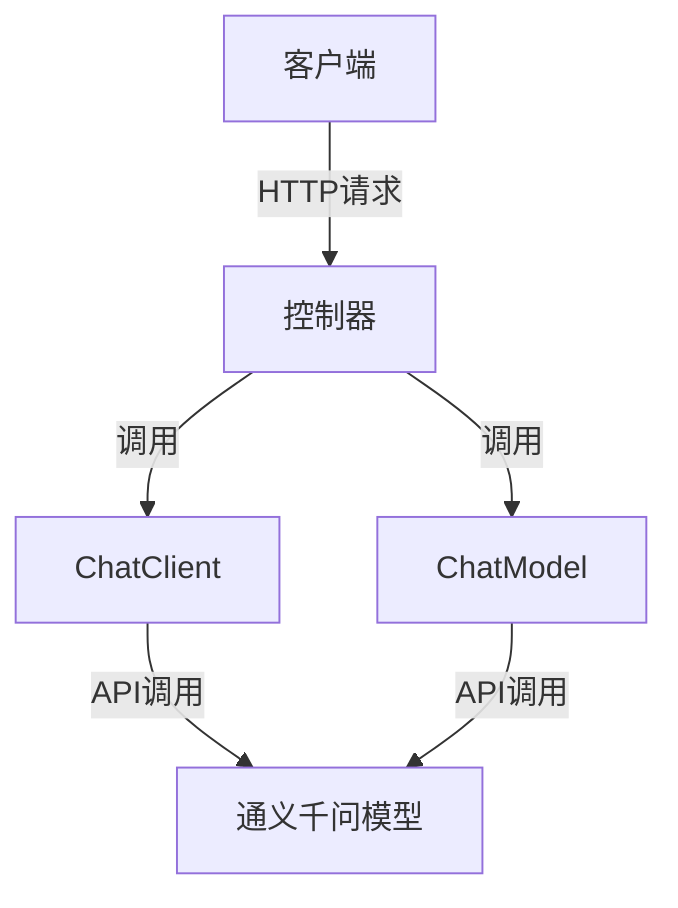
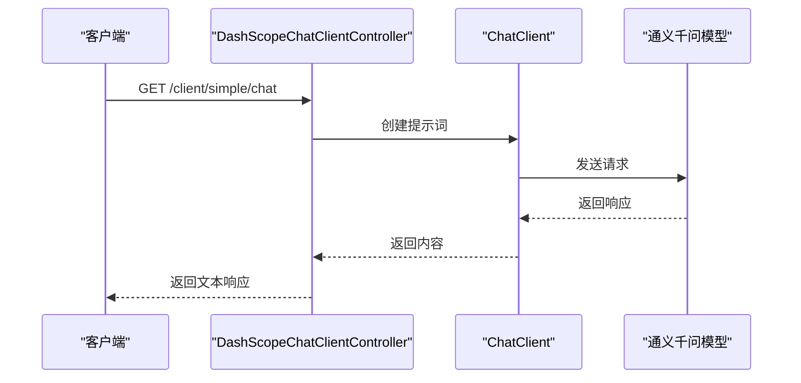
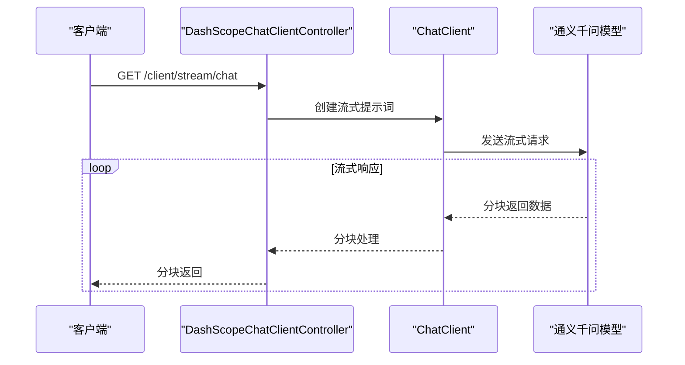
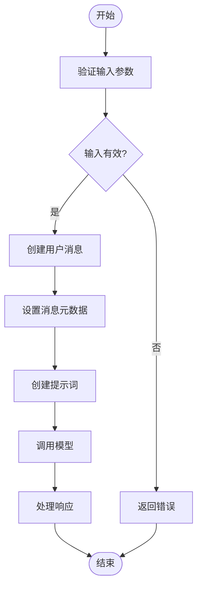
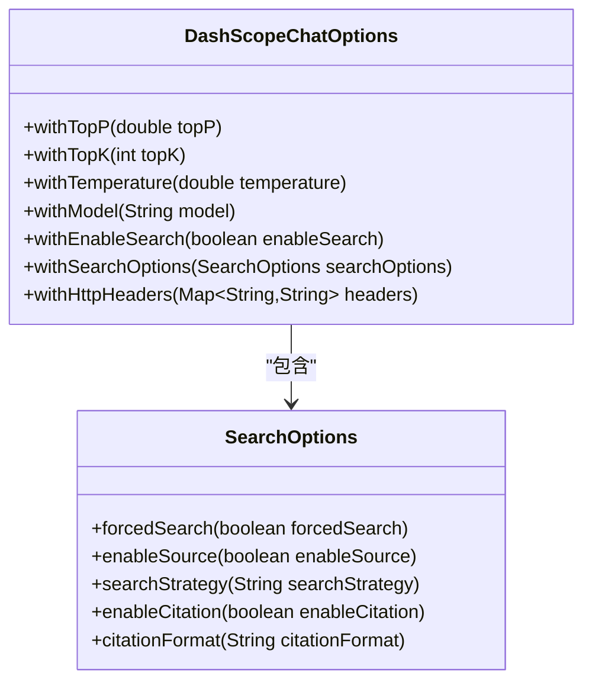
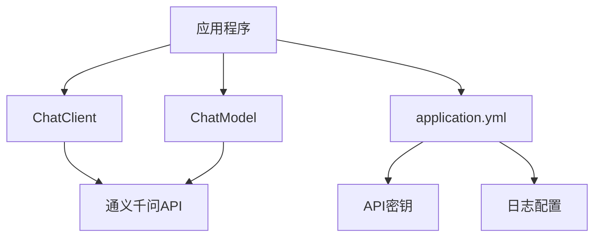

# 通义千问聊天集成

<cite>
**Referenced Files in This Document**   
- [DashScopeChatClientController.java](file://spring-ai-alibaba-chat-example/dashscope-chat/src/main/java/com/alibaba/cloud/ai/example/chat/dashscope/controller/DashScopeChatClientController.java)
- [DashScopeChatModelController.java](file://spring-ai-alibaba-chat-example/dashscope-chat/src/main/java/com/alibaba/cloud/ai/example/chat/dashscope/controller/DashScopeChatModelController.java)
- [application.yml](file://spring-ai-alibaba-chat-example/dashscope-chat/src/main/resources/application.yml)
</cite>

## 目录
1. [简介](#简介)
2. [项目结构](#项目结构)
3. [核心组件](#核心组件)
4. [架构概述](#架构概述)
5. [详细组件分析](#详细组件分析)
6. [依赖分析](#依赖分析)
7. [性能考虑](#性能考虑)
8. [故障排除指南](#故障排除指南)
9. [结论](#结论)

## 简介
本文档详细介绍了如何使用Spring AI Alibaba与通义千问模型进行交互。重点分析了`DashScopeChatClientController`中的实现细节，包括HTTP端点定义、请求参数处理和响应格式。文档还说明了`application.yml`中的特定配置项，如api-key、模型名称和基础URL。通过代码示例展示了如何发送文本消息、处理流式响应以及管理聊天会话。此外，文档解释了通义千问特有的功能支持，如多轮对话和上下文保持，并为开发者提供了最佳实践建议，包括错误处理、性能优化和安全考虑。

## 项目结构
本项目遵循标准的Spring Boot项目结构，主要包含控制器、服务和配置文件。核心功能位于`spring-ai-alibaba-chat-example/dashscope-chat`目录下，其中包含了与通义千问模型交互的控制器和配置。

**Section sources**
- [DashScopeChatClientController.java](file://spring-ai-alibaba-chat-example/dashscope-chat/src/main/java/com/alibaba/cloud/ai/example/chat/dashscope/controller/DashScopeChatClientController.java#L1-L167)
- [DashScopeChatModelController.java](file://spring-ai-alibaba-chat-example/dashscope-chat/src/main/java/com/alibaba/cloud/ai/example/chat/dashscope/controller/DashScopeChatModelController.java#L1-L206)
- [application.yml](file://spring-ai-alibaba-chat-example/dashscope-chat/src/main/resources/application.yml#L1-L18)

## 核心组件
项目的核心组件包括`DashScopeChatClientController`和`DashScopeChatModelController`，它们分别使用`ChatClient`和`ChatModel`与通义千问模型进行交互。`application.yml`文件包含了必要的配置信息。

**Section sources**
- [DashScopeChatClientController.java](file://spring-ai-alibaba-chat-example/dashscope-chat/src/main/java/com/alibaba/cloud/ai/example/chat/dashscope/controller/DashScopeChatClientController.java#L1-L167)
- [DashScopeChatModelController.java](file://spring-ai-alibaba-chat-example/dashscope-chat/src/main/java/com/alibaba/cloud/ai/example/chat/dashscope/controller/DashScopeChatModelController.java#L1-L206)
- [application.yml](file://spring-ai-alibaba-chat-example/dashscope-chat/src/main/resources/application.yml#L1-L18)

## 架构概述
系统架构基于Spring AI Alibaba框架，通过RESTful API与通义千问模型进行交互。`ChatClient`和`ChatModel`是主要的交互接口，`application.yml`文件提供了必要的配置。

**Diagram sources**
- [DashScopeChatClientController.java](file://spring-ai-alibaba-chat-example/dashscope-chat/src/main/java/com/alibaba/cloud/ai/example/chat/dashscope/controller/DashScopeChatClientController.java#L1-L167)
- [DashScopeChatModelController.java](file://spring-ai-alibaba-chat-example/dashscope-chat/src/main/java/com/alibaba/cloud/ai/example/chat/dashscope/controller/DashScopeChatModelController.java#L1-L206)

## 详细组件分析

### DashScopeChatClientController分析
`DashScopeChatClientController`提供了与通义千问模型交互的HTTP端点，支持简单聊天、流式聊天和图片分析功能。

#### 简单聊天功能

**Diagram sources**
- [DashScopeChatClientController.java](file://spring-ai-alibaba-chat-example/dashscope-chat/src/main/java/com/alibaba/cloud/ai/example/chat/dashscope/controller/DashScopeChatClientController.java#L45-L52)

#### 流式聊天功能

**Diagram sources**
- [DashScopeChatClientController.java](file://spring-ai-alibaba-chat-example/dashscope-chat/src/main/java/com/alibaba/cloud/ai/example/chat/dashscope/controller/DashScopeChatClientController.java#L57-L66)

#### 图片分析功能

**Diagram sources**
- [DashScopeChatClientController.java](file://spring-ai-alibaba-chat-example/dashscope-chat/src/main/java/com/alibaba/cloud/ai/example/chat/dashscope/controller/DashScopeChatClientController.java#L71-L167)

**Section sources**
- [DashScopeChatClientController.java](file://spring-ai-alibaba-chat-example/dashscope-chat/src/main/java/com/alibaba/cloud/ai/example/chat/dashscope/controller/DashScopeChatClientController.java#L1-L167)

### DashScopeChatModelController分析
`DashScopeChatModelController`提供了通过`ChatModel`接口与通义千问模型交互的功能，支持简单聊天、流式聊天、token信息获取和自定义参数。

#### 自定义参数功能

**Diagram sources**
- [DashScopeChatModelController.java](file://spring-ai-alibaba-chat-example/dashscope-chat/src/main/java/com/alibaba/cloud/ai/example/chat/dashscope/controller/DashScopeChatModelController.java#L1-L206)

**Section sources**
- [DashScopeChatModelController.java](file://spring-ai-alibaba-chat-example/dashscope-chat/src/main/java/com/alibaba/cloud/ai/example/chat/dashscope/controller/DashScopeChatModelController.java#L1-L206)

## 依赖分析
项目依赖于Spring AI Alibaba框架，通过`ChatClient`和`ChatModel`接口与通义千问模型进行交互。配置文件`application.yml`提供了必要的API密钥和日志级别设置。

**Diagram sources**
- [DashScopeChatClientController.java](file://spring-ai-alibaba-chat-example/dashscope-chat/src/main/java/com/alibaba/cloud/ai/example/chat/dashscope/controller/DashScopeChatClientController.java#L1-L167)
- [DashScopeChatModelController.java](file://spring-ai-alibaba-chat-example/dashscope-chat/src/main/java/com/alibaba/cloud/ai/example/chat/dashscope/controller/DashScopeChatModelController.java#L1-L206)
- [application.yml](file://spring-ai-alibaba-chat-example/dashscope-chat/src/main/resources/application.yml#L1-L18)

**Section sources**
- [DashScopeChatClientController.java](file://spring-ai-alibaba-chat-example/dashscope-chat/src/main/java/com/alibaba/cloud/ai/example/chat/dashscope/controller/DashScopeChatClientController.java#L1-L167)
- [DashScopeChatModelController.java](file://spring-ai-alibaba-chat-example/dashscope-chat/src/main/java/com/alibaba/cloud/ai/example/chat/dashscope/controller/DashScopeChatModelController.java#L1-L206)
- [application.yml](file://spring-ai-alibaba-chat-example/dashscope-chat/src/main/resources/application.yml#L1-L18)

## 性能考虑
在使用通义千问模型时，需要注意以下性能考虑：
- 流式响应可以提供更好的用户体验，但需要处理分块数据
- 合理设置`topP`、`topK`和`temperature`参数以平衡生成质量和性能
- 使用适当的日志级别来监控API调用和性能

## 故障排除指南
常见问题及解决方案：
- **API密钥错误**：确保`AI_DASHSCOPE_API_KEY`环境变量已正确设置
- **网络问题**：检查网络连接和防火墙设置
- **参数错误**：验证请求参数是否符合API要求
- **模型不可用**：确认指定的模型名称是否正确且可用

**Section sources**
- [DashScopeChatClientController.java](file://spring-ai-alibaba-chat-example/dashscope-chat/src/main/java/com/alibaba/cloud/ai/example/chat/dashscope/controller/DashScopeChatClientController.java#L1-L167)
- [DashScopeChatModelController.java](file://spring-ai-alibaba-chat-example/dashscope-chat/src/main/java/com/alibaba/cloud/ai/example/chat/dashscope/controller/DashScopeChatModelController.java#L1-L206)

## 结论
本文档详细介绍了如何使用Spring AI Alibaba与通义千问模型进行集成。通过`DashScopeChatClientController`和`DashScopeChatModelController`，开发者可以轻松实现文本聊天、流式响应和图片分析等功能。合理的配置和最佳实践可以帮助开发者构建高效、可靠的AI应用。