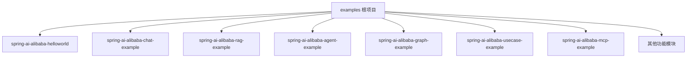
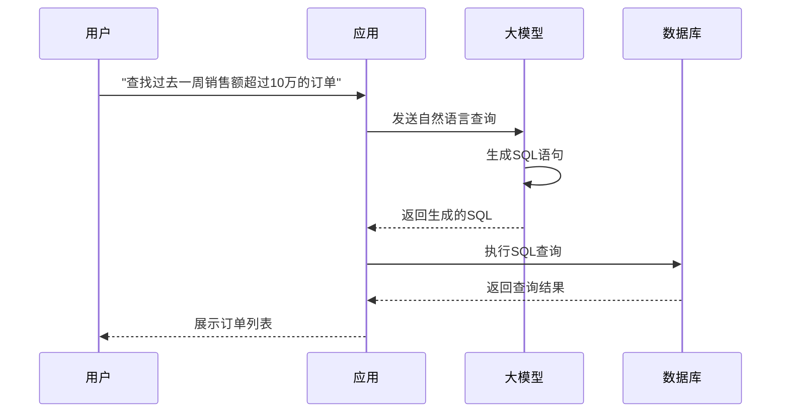

# 项目概述

<cite>
**本文档引用的文件**  
- [README.md](file://README.md)
- [pom.xml](file://pom.xml)
- [spring-ai-alibaba-playground/src/main/resources/rag/markdown/overview.md](file://spring-ai-alibaba-playground/src/main/resources/rag/markdown/overview.md)
- [spring-ai-alibaba-playground/src/main/resources/rag/markdown/faq.md](file://spring-ai-alibaba-playground/src/main/resources/rag/markdown/faq.md)
- [CONTRIBUTION.md](file://CONTRIBUTION.md)
- [spring-ai-alibaba-usecase-example/README.md](file://spring-ai-alibaba-usecase-example/README.md)
- [spring-ai-alibaba-mcp-example/spring-ai-alibaba-mcp-manual-example/README.md](file://spring-ai-alibaba-mcp-example/spring-ai-alibaba-mcp-manual-example/README.md)
</cite>

## 目录
1. [介绍](#介绍)
2. [项目结构与架构设计](#项目结构与架构设计)
3. [核心功能特性](#核心功能特性)
4. [技术栈与模块化设计](#技术栈与模块化设计)
5. [典型使用场景示例](#典型使用场景示例)
6. [AI应用开发定位与适用场景](#ai应用开发定位与适用场景)

## 介绍

`examples` 仓库是 Spring AI Alibaba 技术栈的集成示例集合，旨在为开发者提供从基础到高级的完整 AI 应用开发实践指导。该项目不仅展示了 Spring AI Alibaba 框架的核心能力，还体现了其作为企业级智能体开发解决方案的完整生态集成优势。

Spring AI Alibaba（SAA）是一款基于 Spring AI 构建的 AI 智能体开发框架，深度集成阿里云百炼平台，支持聊天机器人（ChatBot）、工作流（Workflow）和多智能体（Multi-agent）应用的开发模式。该项目通过一系列模块化的示例，帮助开发者快速理解并掌握如何使用 Spring AI Alibaba 构建现代化的 AI 应用。

**本仓库引用的文件**
- [README.md](file://README.md#L0-L24)
- [CONTRIBUTION.md](file://CONTRIBUTION.md#L0-L15)

## 项目结构与架构设计

该仓库采用多模块 Maven 项目结构，每个模块代表一个独立的功能示例，便于开发者按需查找和使用。顶级 `pom.xml` 文件定义了项目的整体依赖管理和模块列表，确保所有子模块共享统一的技术栈版本。

项目主要模块包括：
- `spring-ai-alibaba-helloworld`：基础入门示例
- `spring-ai-alibaba-chat-example`：多种 AI 模型提供商的聊天集成示例
- `spring-ai-alibaba-rag-example`：检索增强生成（RAG）相关示例
- `spring-ai-alibaba-agent-example`：智能体应用示例
- `spring-ai-alibaba-graph-example`：基于图算法的智能体编程框架示例
- `spring-ai-alibaba-usecase-example`：用户场景化应用示例
- `spring-ai-alibaba-mcp-example`：模型上下文协议（MCP）集成示例

这种模块化设计使得每个功能点都能被独立开发、测试和部署，同时也方便新示例的添加和旧示例的维护。

**图示来源**
- [pom.xml](file://pom.xml#L0-L223)

**本节来源**
- [pom.xml](file://pom.xml#L0-L223)
- [CONTRIBUTION.md](file://CONTRIBUTION.md#L0-L15)

## 核心功能特性

### 基础AI集成
项目提供了与多种主流 AI 模型提供商的集成示例，包括通义千问（Qwen）、OpenAI、DeepSeek、Moonshot 等。通过 `spring-ai-alibaba-chat-example` 模块，开发者可以学习如何配置和使用不同模型的服务。

### 多模态处理
支持音频、图像、视频等多模态数据的处理能力，相关示例分布在 `spring-ai-alibaba-audio-example`、`spring-ai-alibaba-image-example` 和 `spring-ai-alibaba-video-example` 模块中。

### 检索增强生成（RAG）
通过 `spring-ai-alibaba-rag-example` 模块展示了如何结合向量数据库（如 Milvus、PgVector、Elasticsearch）实现 RAG 功能，提升 AI 应用的知识检索准确性和响应质量。

### 智能体（Agent）开发
`spring-ai-alibaba-agent-example` 和 `spring-ai-alibaba-graph-example` 模块展示了如何构建复杂的智能体应用，包括 ReAct 模式、Supervisor 模式等，并支持工作流编排和多智能体协作。

### MCP协议支持
`spring-ai-alibaba-mcp-example` 模块演示了如何使用模型上下文协议（MCP）接入第三方 MCP Server，实现模型与外部服务的安全通信和功能扩展。

**本节来源**
- [spring-ai-alibaba-playground/src/main/resources/rag/markdown/overview.md](file://spring-ai-alibaba-playground/src/main/resources/rag/markdown/overview.md#L0-L241)
- [spring-ai-alibaba-mcp-example/spring-ai-alibaba-mcp-manual-example/README.md](file://spring-ai-alibaba-mcp-example/spring-ai-alibaba-mcp-manual-example/README.md#L0-L3)

## 技术栈与模块化设计

### 技术栈选择
项目基于 Spring Boot 3.4.0 和 Java 17 构建，使用 Spring AI 1.0.0 作为底层 AI 框架，Spring AI Alibaba 1.0.0.3 作为核心智能体开发框架。这种技术组合确保了与 Spring 生态的无缝集成和企业级应用的稳定性。

### 模块化设计优势
每个示例模块都是一个独立的 Maven 子模块，具有自己的 `pom.xml` 文件和源代码结构。这种设计带来了以下优势：
- **可维护性**：每个模块可以独立更新和测试
- **可扩展性**：新功能可以作为新模块轻松添加
- **学习友好**：开发者可以专注于特定功能的学习
- **复用性**：模块可以被复制并适配到实际项目中

### 扩展性考虑
项目通过 BOM（Bill of Materials）机制管理依赖版本，确保所有模块使用一致的依赖版本。同时，通过与 Nacos、Higress 等开源生态集成，提供了 MCP 注册中心、智能路由、Prompt 管理等企业级扩展能力。

**本节来源**
- [pom.xml](file://pom.xml#L0-L223)
- [spring-ai-alibaba-playground/src/main/resources/rag/markdown/overview.md](file://spring-ai-alibaba-playground/src/main/resources/rag/markdown/overview.md#L0-L241)

## 典型使用场景示例

### 与通义千问集成
通过 `dashscope-chat` 模块，展示了如何配置和使用通义千问大模型进行聊天交互，包括模型参数配置、提示词设计和响应处理。

### 与OpenAI集成
`openai-chat` 模块提供了与 OpenAI 服务集成的完整示例，包括 API 密钥配置、模型选择和流式响应处理。

### 综合实战示例
`spring-ai-alibaba-comprehensive-example` 模块结合了 MySQL、Milvus、Neo4j 三种数据库，展示了多模态对话、对话记忆、文件对话、场景对话、RAG 对话等复杂功能的综合应用。

### 自然语言到SQL生成
`spring-ai-alibaba-nl2sql-example` 模块演示了如何使用大模型技术实现自然语言到 SQL 语句的自动生成，支持复杂查询和多表关联。

**图示来源**
- [spring-ai-alibaba-nl2sql-example](file://spring-ai-alibaba-nl2sql-example)

**本节来源**
- [spring-ai-alibaba-usecase-example/README.md](file://spring-ai-alibaba-usecase-example/README.md#L0-L10)
- [spring-ai-alibaba-playground/src/main/resources/rag/markdown/overview.md](file://spring-ai-alibaba-playground/src/main/resources/rag/markdown/overview.md#L0-L241)

## AI应用开发定位与适用场景

Spring AI Alibaba 定位于帮助企业快速构建生产级的 AI 智能体应用。与 Spring AI 作为底层框架不同，Spring AI Alibaba 提供了更高层次的抽象和企业级集成能力，特别适合以下场景：

### 企业级智能体开发
通过与百炼平台、Nacos、Higress 等深度集成，解决了企业在智能体落地过程中遇到的模型管理、服务发现、流量控制等痛点问题。

### 复杂业务流程自动化
基于 Graph 框架的工作流和多智能体模式，适合需要复杂决策和流程编排的业务场景，如客户服务、订单处理、数据分析等。

### 数据驱动的AI应用
通过 RAG 和 NL2SQL 等能力，可以构建基于企业私有数据的智能应用，如智能客服、数据分析助手、文档处理系统等。

### 快速原型开发
丰富的示例模块和完整的开发工具链，使得开发者可以快速搭建 AI 应用原型，并逐步迭代到生产环境。

该项目不仅为初学者提供了概念性概述，也为经验丰富的开发者提供了深入的技术细节，是学习和实践 Spring AI Alibaba 技术栈的理想起点。

**本节来源**
- [spring-ai-alibaba-playground/src/main/resources/rag/markdown/overview.md](file://spring-ai-alibaba-playground/src/main/resources/rag/markdown/overview.md#L0-L241)
- [spring-ai-alibaba-playground/src/main/resources/rag/markdown/faq.md](file://spring-ai-alibaba-playground/src/main/resources/rag/markdown/faq.md#L0-L65)
- [README.md](file://README.md#L0-L24)