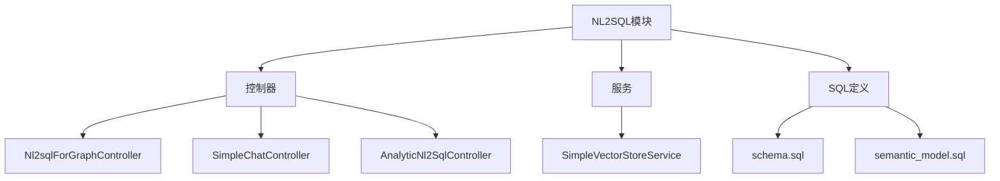
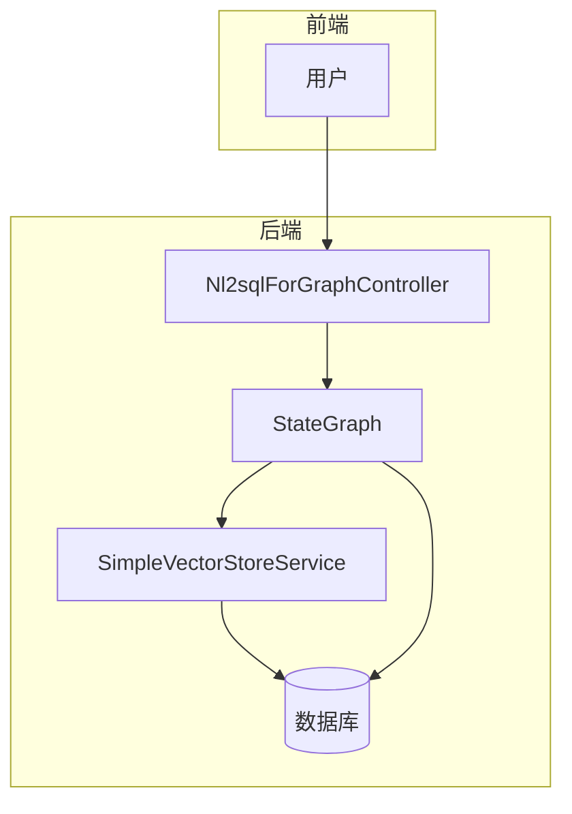
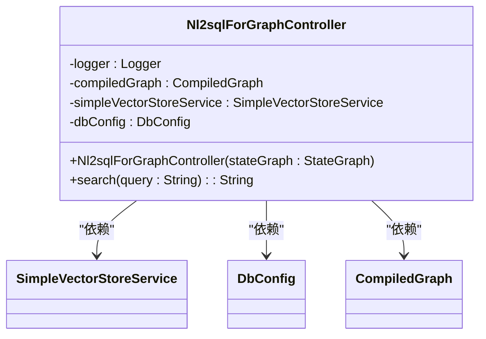
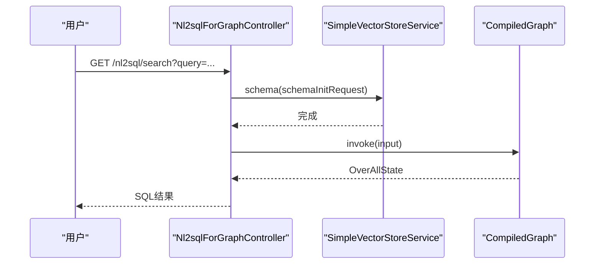
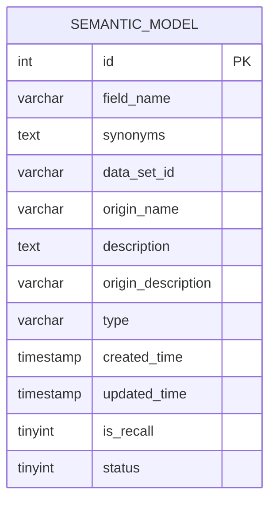
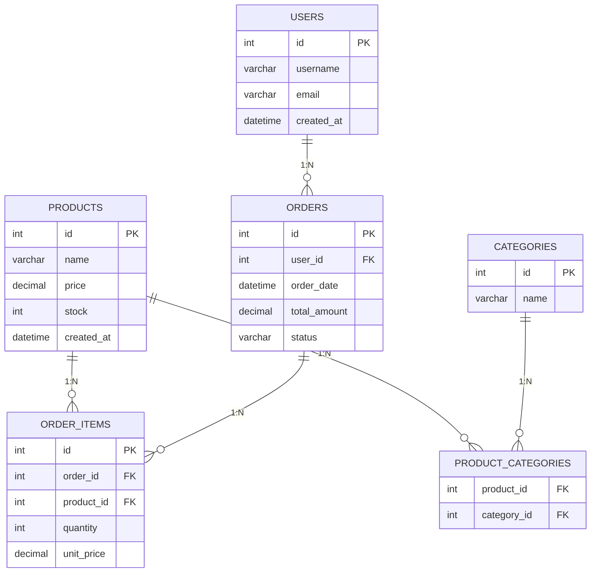
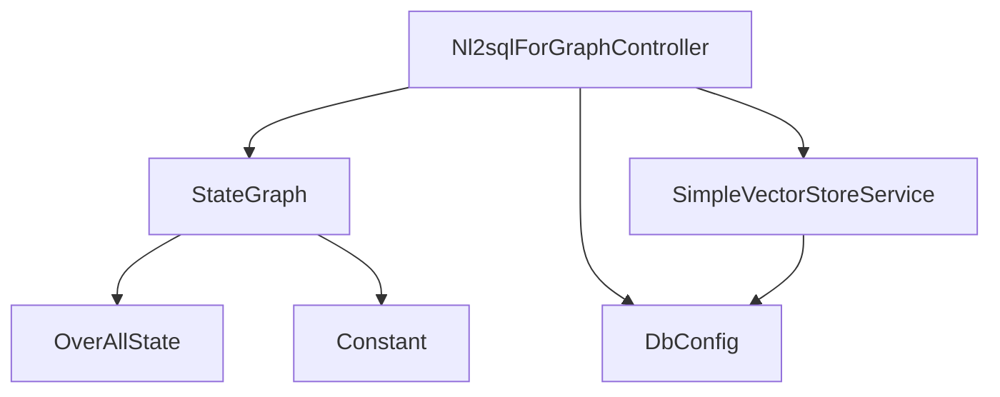

# NL2SQL

<cite>
**本文档中引用的文件**  
- [Nl2sqlForGraphController.java](file://spring-ai-alibaba-nl2sql-example/chat/src/main/java/com.alibaba.cloud.ai.example/controller/Nl2sqlForGraphController.java)
- [schema.sql](file://spring-ai-alibaba-nl2sql-example/chat/sql/schema.sql)
- [semantic_model.sql](file://spring-ai-alibaba-nl2sql-example/chat/sql/semantic_model.sql)
- [SimpleChatController.java](file://spring-ai-alibaba-nl2sql-example/chat/src/main/java/com.alibaba.cloud.ai.example/controller/SimpleChatController.java)
- [AnalyticNl2SqlController.java](file://spring-ai-alibaba-nl2sql-example/chat/src/main/java/com.alibaba.cloud.ai.example/controller/AnalyticNl2SqlController.java)
</cite>

## 目录
1. [简介](#简介)
2. [项目结构](#项目结构)
3. [核心组件](#核心组件)
4. [架构概述](#架构概述)
5. [详细组件分析](#详细组件分析)
6. [依赖分析](#依赖分析)
7. [性能考虑](#性能考虑)
8. [故障排除指南](#故障排除指南)
9. [结论](#结论)

## 简介
本文档详细介绍了NL2SQL功能的实现机制，重点阐述如何将自然语言查询转换为可执行的SQL语句。以`Nl2sqlForGraphController`为例，说明从用户输入到SQL生成再到数据库查询的完整流程。文档涵盖语义模型构建、提示词工程、上下文管理、SQL注入防护等关键技术，并提供配置指南和使用示例。

## 项目结构
NL2SQL功能主要位于`spring-ai-alibaba-nl2sql-example/chat`模块中，包含控制器、服务、SQL定义等核心组件。数据库结构由`schema.sql`定义，语义映射规则存储在`semantic_model.sql`中，控制器负责处理HTTP请求并协调各组件完成NL2SQL转换。

**图示来源**  
- [Nl2sqlForGraphController.java](file://spring-ai-alibaba-nl2sql-example/chat/src/main/java/com.alibaba.cloud.ai.example/controller/Nl2sqlForGraphController.java)
- [schema.sql](file://spring-ai-alibaba-nl2sql-example/chat/sql/schema.sql)
- [semantic_model.sql](file://spring-ai-alibaba-nl2sql-example/chat/sql/semantic_model.sql)

**本节来源**  
- [Nl2sqlForGraphController.java](file://spring-ai-alibaba-nl2sql-example/chat/src/main/java/com.alibaba.cloud.ai.example/controller/Nl2sqlForGraphController.java)
- [schema.sql](file://spring-ai-alibaba-nl2sql-example/chat/sql/schema.sql)

## 核心组件
NL2SQL系统的核心组件包括自然语言解析器、语义模型管理器、向量存储服务和SQL生成引擎。`Nl2sqlForGraphController`作为入口点，协调这些组件完成从自然语言到SQL的转换。`SimpleVectorStoreService`负责初始化数据库结构信息，`StateGraph`实现复杂的处理流程编排。

**本节来源**  
- [Nl2sqlForGraphController.java](file://spring-ai-alibaba-nl2sql-example/chat/src/main/java/com.alibaba.cloud.ai.example/controller/Nl2sqlForGraphController.java)
- [SimpleChatController.java](file://spring-ai-alibaba-nl2sql-example/chat/src/main/java/com.alibaba.cloud.ai.example/controller/SimpleChatController.java)

## 架构概述
NL2SQL系统采用分层架构，前端接收自然语言查询，通过控制器传递给处理引擎。处理引擎利用语义模型和数据库结构信息，结合大语言模型生成SQL语句。系统支持多种实现方式，包括基于图的处理流程和简单的直接转换。

**图示来源**  
- [Nl2sqlForGraphController.java](file://spring-ai-alibaba-nl2sql-example/chat/src/main/java/com.alibaba.cloud.ai.example/controller/Nl2sqlForGraphController.java)
- [SimpleVectorStoreService.java](file://spring-ai-alibaba-nl2sql-example/chat/src/main/java/com.alibaba.cloud.ai.service.simple/SimpleVectorStoreService.java)

## 详细组件分析

### Nl2sqlForGraphController分析
`Nl2sqlForGraphController`是NL2SQL功能的主要入口，通过`/nl2sql/search`端点接收自然语言查询。控制器初始化向量存储服务，加载数据库结构，然后通过编译后的状态图执行完整的处理流程。

#### 控制器类图

**图示来源**  
- [Nl2sqlForGraphController.java](file://spring-ai-alibaba-nl2sql-example/chat/src/main/java/com.alibaba.cloud.ai.example/controller/Nl2sqlForGraphController.java)

#### 请求处理流程

**图示来源**  
- [Nl2sqlForGraphController.java](file://spring-ai-alibaba-nl2sql-example/chat/src/main/java/com.alibaba.cloud.ai.example/controller/Nl2sqlForGraphController.java)

**本节来源**  
- [Nl2sqlForGraphController.java](file://spring-ai-alibaba-nl2sql-example/chat/src/main/java/com.alibaba.cloud.ai.example/controller/Nl2sqlForGraphController.java)

### 语义模型分析
语义模型是NL2SQL系统的关键组成部分，存储在`semantic_model.sql`表中，包含字段名称、同义词、描述等信息，用于增强自然语言理解能力。

#### 语义模型结构

**图示来源**  
- [semantic_model.sql](file://spring-ai-alibaba-nl2sql-example/chat/sql/semantic_model.sql)

**本节来源**  
- [semantic_model.sql](file://spring-ai-alibaba-nl2sql-example/chat/sql/semantic_model.sql)

### 数据库结构分析
数据库结构由`schema.sql`定义，包含用户、商品、订单等多个业务表，形成完整的电商数据模型。

#### 数据库实体关系

**图示来源**  
- [schema.sql](file://spring-ai-alibaba-nl2sql-example/chat/sql/schema.sql)

**本节来源**  
- [schema.sql](file://spring-ai-alibaba-nl2sql-example/chat/sql/schema.sql)

## 依赖分析
NL2SQL系统依赖于多个核心组件，包括Spring AI框架、数据库连接配置、向量存储服务和状态图引擎。这些组件通过依赖注入机制协同工作，形成完整的自然语言到SQL的转换流水线。

**图示来源**  
- [Nl2sqlForGraphController.java](file://spring-ai-alibaba-nl2sql-example/chat/src/main/java/com.alibaba.cloud.ai.example/controller/Nl2sqlForGraphController.java)

**本节来源**  
- [Nl2sqlForGraphController.java](file://spring-ai-alibaba-nl2sql-example/chat/src/main/java/com.alibaba.cloud.ai.example/controller/Nl2sqlForGraphController.java)

## 性能考虑
NL2SQL系统的性能主要受自然语言处理复杂度、数据库结构大小和网络延迟影响。建议对常用查询进行缓存，优化语义模型索引，并合理设置状态图的最大迭代次数以防止无限循环。

## 故障排除指南
常见问题包括SQL生成错误、数据库连接失败和语义模型加载异常。检查日志中的错误信息，验证数据库配置和表结构，确保语义模型数据完整且状态为启用。

**本节来源**  
- [Nl2sqlForGraphController.java](file://spring-ai-alibaba-nl2sql-example/chat/src/main/java/com.alibaba.cloud.ai.example/controller/Nl2sqlForGraphController.java)
- [SimpleChatController.java](file://spring-ai-alibaba-nl2sql-example/chat/src/main/java/com.alibaba.cloud.ai.example/controller/SimpleChatController.java)

## 结论
NL2SQL功能通过结合自然语言处理技术和数据库知识，实现了从自然语言到SQL语句的智能转换。系统设计灵活，支持多种实现方式，可扩展性强，为非技术人员提供了便捷的数据查询方式。