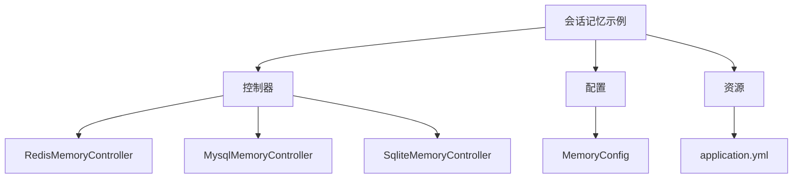
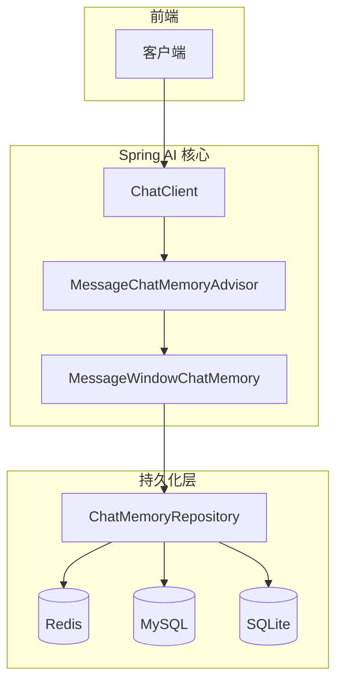
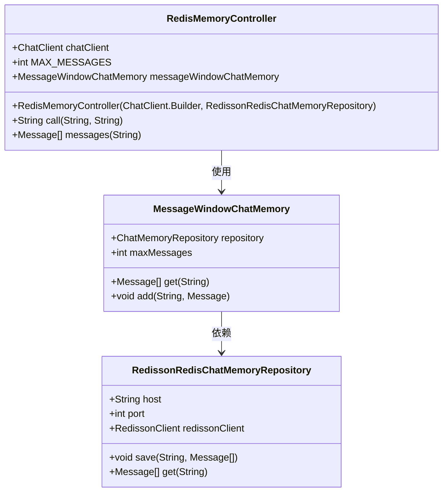
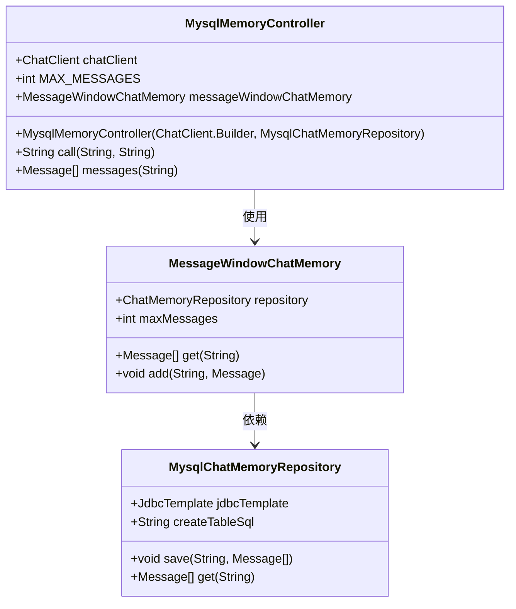
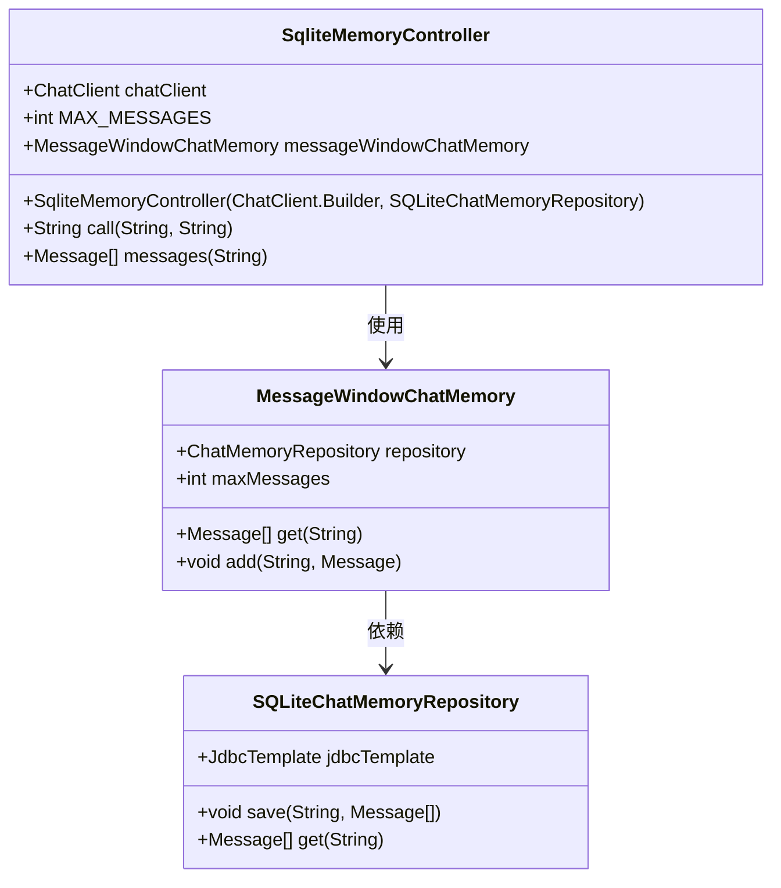
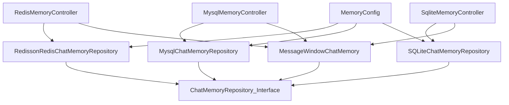

# 会话记忆

<cite>
**本文档中引用的文件**  
- [MemoryConfig.java](file://spring-ai-alibaba-chat-memory-example/src/main/java/com/alibaba/example/chatmemory/config/MemoryConfig.java)
- [RedisMemoryController.java](file://spring-ai-alibaba-chat-memory-example/src/main/java/com/alibaba/example/chatmemory/controller/RedisMemoryController.java)
- [MysqlMemoryController.java](file://spring-ai-alibaba-chat-memory-example/src/main/java/com/alibaba/example/chatmemory/controller/MysqlMemoryController.java)
- [SqliteMemoryController.java](file://spring-ai-alibaba-chat-memory-example/src/main/java/com/alibaba/example/chatmemory/controller/SqliteMemoryController.java)
- [application.yml](file://spring-ai-alibaba-chat-memory-example/src/main/resources/application.yml)
</cite>

## 目录
1. [简介](#简介)
2. [项目结构](#项目结构)
3. [核心组件](#核心组件)
4. [架构概述](#架构概述)
5. [详细组件分析](#详细组件分析)
6. [依赖分析](#依赖分析)
7. [性能考虑](#性能考虑)
8. [故障排除指南](#故障排除指南)
9. [结论](#结论)

## 简介
本文档详细介绍了在Spring AI Alibaba框架中实现会话记忆功能的机制，重点阐述了如何通过Redis、MySQL和SQLite实现对话历史的持久化存储。文档涵盖了`RedisMemoryController`和`MysqlMemoryController`的具体实现方式，解释了`MemoryConfig`如何配置不同的存储后端，并深入分析了消息存储接口（MessageStore）的设计、会话ID管理以及数据序列化策略。同时，提供了针对客服系统、个性化推荐等实际应用场景的使用建议，并包含缓存优化与连接池配置等性能调优方案，旨在为初学者提供清晰的概念引导，也为高级开发者提供可扩展的技术细节。

## 项目结构
本项目位于`spring-ai-alibaba-chat-memory-example`模块下，主要包含控制器层（controller）、配置类（config）和资源文件。控制器分别实现了基于Redis、MySQL和SQLite的会话记忆管理；配置类`MemoryConfig`负责初始化不同数据库的连接；`application.yml`定义了各存储后端的连接参数。

**图示来源**  
- [RedisMemoryController.java](file://spring-ai-alibaba-chat-memory-example/src/main/java/com/alibaba/example/chatmemory/controller/RedisMemoryController.java)
- [MysqlMemoryController.java](file://spring-ai-alibaba-chat-memory-example/src/main/java/com/alibaba/example/chatmemory/controller/MysqlMemoryController.java)
- [SqliteMemoryController.java](file://spring-ai-alibaba-chat-memory-example/src/main/java/com/alibaba/example/chatmemory/controller/SqliteMemoryController.java)
- [MemoryConfig.java](file://spring-ai-alibaba-chat-memory-example/src/main/java/com/alibaba/example/chatmemory/config/MemoryConfig.java)
- [application.yml](file://spring-ai-alibaba-chat-memory-example/src/main/resources/application.yml)

**本节来源**  
- [MemoryConfig.java](file://spring-ai-alibaba-chat-memory-example/src/main/java/com/alibaba/example/chatmemory/config/MemoryConfig.java)
- [RedisMemoryController.java](file://spring-ai-alibaba-chat-memory-example/src/main/java/com/alibaba/example/chatmemory/controller/RedisMemoryController.java)
- [application.yml](file://spring-ai-alibaba-chat-memory-example/src/main/resources/application.yml)

## 核心组件
本节分析会话记忆功能的核心实现类，包括`MemoryConfig`中对不同存储后端的Bean定义，以及各`*MemoryController`如何利用这些Bean进行会话状态管理。重点在于理解`MessageWindowChatMemory`与`ChatMemoryRepository`之间的协作关系，以及会话ID在请求中的传递机制。

**本节来源**  
- [MemoryConfig.java](file://spring-ai-alibaba-chat-memory-example/src/main/java/com/alibaba/example/chatmemory/config/MemoryConfig.java#L1-L73)
- [RedisMemoryController.java](file://spring-ai-alibaba-chat-memory-example/src/main/java/com/alibaba/example/chatmemory/controller/RedisMemoryController.java#L1-L59)
- [MysqlMemoryController.java](file://spring-ai-alibaba-chat-memory-example/src/main/java/com/alibaba/example/chatmemory/controller/MysqlMemoryController.java#L1-L58)

## 架构概述
Spring AI Alibaba的会话记忆架构采用分层设计，上层为`ChatClient`提供对话接口，中间层通过`MessageChatMemoryAdvisor`拦截请求并注入记忆逻辑，底层由具体的`ChatMemoryRepository`实现数据持久化。该架构支持多种存储后端，通过配置即可切换，具有良好的可扩展性。

**图示来源**  
- [RedisMemoryController.java](file://spring-ai-alibaba-chat-memory-example/src/main/java/com/alibaba/example/chatmemory/controller/RedisMemoryController.java#L1-L59)
- [MysqlMemoryController.java](file://spring-ai-alibaba-chat-memory-example/src/main/java/com/alibaba/example/chatmemory/controller/MysqlMemoryController.java#L1-L58)
- [MemoryConfig.java](file://spring-ai-alibaba-chat-memory-example/src/main/java/com/alibaba/example/chatmemory/config/MemoryConfig.java#L1-L73)

## 详细组件分析
本节深入剖析各个关键组件的实现机制，展示其内部结构与交互流程。

### RedisMemoryController 分析
`RedisMemoryController`通过注入`RedissonRedisChatMemoryRepository`实现会话记忆的持久化，利用Redis的高性能特性支持高并发场景下的快速读写。

#### 类图

**图示来源**  
- [RedisMemoryController.java](file://spring-ai-alibaba-chat-memory-example/src/main/java/com/alibaba/example/chatmemory/controller/RedisMemoryController.java#L1-L59)
- [MemoryConfig.java](file://spring-ai-alibaba-chat-memory-example/src/main/java/com/alibaba/example/chatmemory/config/MemoryConfig.java#L1-L73)

### MysqlMemoryController 分析
`MysqlMemoryController`使用`MysqlChatMemoryRepository`将对话历史存储到MySQL数据库中，适用于需要强一致性与事务支持的业务场景。

#### 类图

**图示来源**  
- [MysqlMemoryController.java](file://spring-ai-alibaba-chat-memory-example/src/main/java/com/alibaba/example/chatmemory/controller/MysqlMemoryController.java#L1-L58)
- [MemoryConfig.java](file://spring-ai-alibaba-chat-memory-example/src/main/java/com/alibaba/example/chatmemory/config/MemoryConfig.java#L1-L73)

### SqliteMemoryController 分析
`SqliteMemoryController`结合`SQLiteChatMemoryRepository`提供轻量级本地存储方案，适合开发测试或资源受限环境。

#### 类图

**图示来源**  
- [SqliteMemoryController.java](file://spring-ai-alibaba-chat-memory-example/src/main/java/com/alibaba/example/chatmemory/controller/SqliteMemoryController.java#L1-L58)
- [MemoryConfig.java](file://spring-ai-alibaba-chat-memory-example/src/main/java/com/alibaba/example/chatmemory/config/MemoryConfig.java#L1-L73)

**本节来源**  
- [RedisMemoryController.java](file://spring-ai-alibaba-chat-memory-example/src/main/java/com/alibaba/example/chatmemory/controller/RedisMemoryController.java#L1-L59)
- [MysqlMemoryController.java](file://spring-ai-alibaba-chat-memory-example/src/main/java/com/alibaba/example/chatmemory/controller/MysqlMemoryController.java#L1-L58)
- [SqliteMemoryController.java](file://spring-ai-alibaba-chat-memory-example/src/main/java/com/alibaba/example/chatmemory/controller/SqliteMemoryController.java#L1-L58)
- [MemoryConfig.java](file://spring-ai-alibaba-chat-memory-example/src/main/java/com/alibaba/example/chatmemory/config/MemoryConfig.java#L1-L73)

## 依赖分析
系统通过Spring的依赖注入机制管理各组件之间的耦合关系。`*MemoryController`依赖于`ChatClient.Builder`和对应的`ChatMemoryRepository`实现类，而这些Bean由`MemoryConfig`统一配置并注册到Spring容器中。`MessageWindowChatMemory`作为中间层，屏蔽了底层存储差异，提升了系统的可维护性。

**图示来源**  
- [MemoryConfig.java](file://spring-ai-alibaba-chat-memory-example/src/main/java/com/alibaba/example/chatmemory/config/MemoryConfig.java#L1-L73)
- [RedisMemoryController.java](file://spring-ai-alibaba-chat-memory-example/src/main/java/com/alibaba/example/chatmemory/controller/RedisMemoryController.java#L1-L59)
- [MysqlMemoryController.java](file://spring-ai-alibaba-chat-memory-example/src/main/java/com/alibaba/example/chatmemory/controller/MysqlMemoryController.java#L1-L58)

**本节来源**  
- [MemoryConfig.java](file://spring-ai-alibaba-chat-memory-example/src/main/java/com/alibaba/example/chatmemory/config/MemoryConfig.java#L1-L73)
- [RedisMemoryController.java](file://spring-ai-alibaba-chat-memory-example/src/main/java/com/alibaba/example/chatmemory/controller/RedisMemoryController.java#L1-L59)
- [MysqlMemoryController.java](file://spring-ai-alibaba-chat-memory-example/src/main/java/com/alibaba/example/chatmemory/controller/MysqlMemoryController.java#L1-L58)

## 性能考虑
对于高并发场景，建议使用Redis作为默认存储后端，因其具备毫秒级响应能力。MySQL适用于需要复杂查询和事务保障的场景，但需合理配置连接池（如HikariCP）以避免资源耗尽。SQLite适合单机部署，但在高并发写入时可能存在锁竞争问题。所有存储方案均应启用连接池并设置合理的超时时间。

**本节来源**  
- [MemoryConfig.java](file://spring-ai-alibaba-chat-memory-example/src/main/java/com/alibaba/example/chatmemory/config/MemoryConfig.java#L1-L73)
- [application.yml](file://spring-ai-alibaba-chat-memory-example/src/main/resources/application.yml#L1-L24)

## 故障排除指南
常见问题包括数据库连接失败、会话ID未正确传递、序列化异常等。排查时应首先检查`application.yml`中的连接参数是否正确，确认Redis或MySQL服务已启动。若出现空会话历史，需验证`conversation_id`是否在请求中正确传递。对于JDBC相关错误，检查驱动版本兼容性及SQL语法。

**本节来源**  
- [RedisMemoryController.java](file://spring-ai-alibaba-chat-memory-example/src/main/java/com/alibaba/example/chatmemory/controller/RedisMemoryController.java#L1-L59)
- [MysqlMemoryController.java](file://spring-ai-alibaba-chat-memory-example/src/main/java/com/alibaba/example/chatmemory/controller/MysqlMemoryController.java#L1-L58)
- [application.yml](file://spring-ai-alibaba-chat-memory-example/src/main/resources/application.yml#L1-L24)

## 结论
Spring AI Alibaba通过灵活的会话记忆架构，支持Redis、MySQL和SQLite等多种持久化方案，满足不同场景下的需求。通过`MemoryConfig`统一配置，开发者可以轻松切换存储后端。该设计不仅提升了系统的可扩展性，也为实际应用中的性能优化和故障排查提供了坚实基础。