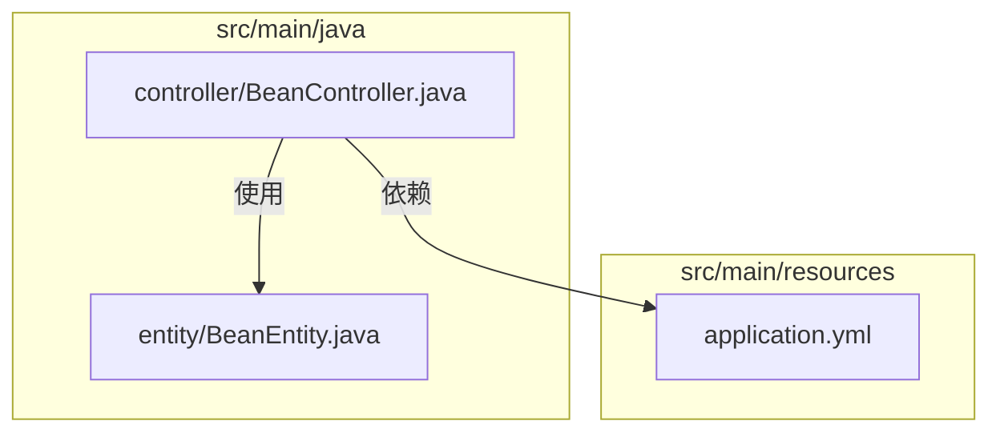
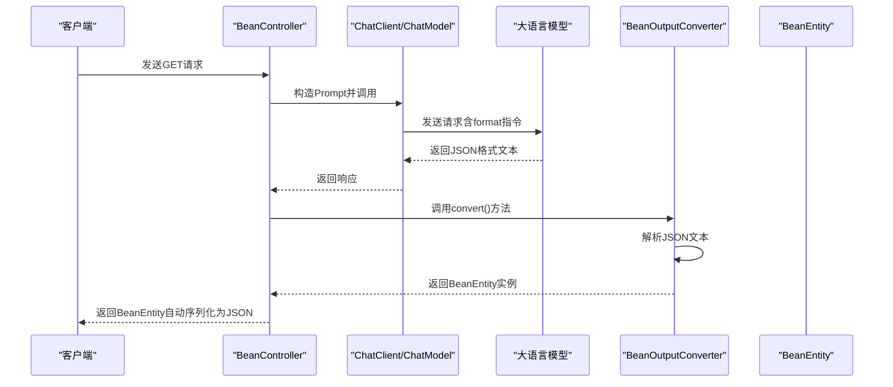
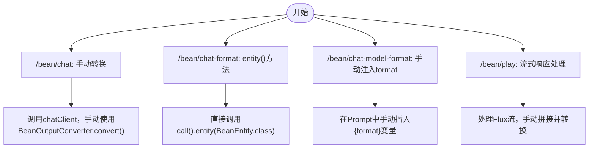
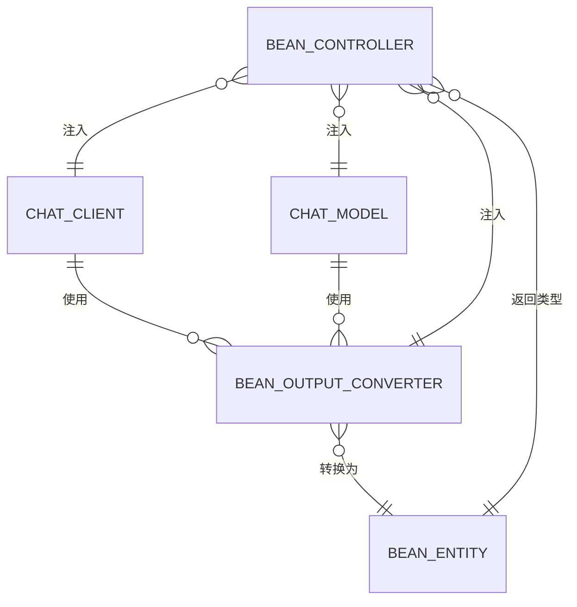

# 结构化输出

<cite>
**本文档中引用的文件**  
- [BeanController.java](file://spring-ai-alibaba-structured-example/src/main/java/com/alibaba/cloud/ai/example/outparser/controller/BeanController.java)
- [BeanEntity.java](file://spring-ai-alibaba-structured-example/src/main/java/com/alibaba/cloud/ai/example/outparser/entity/BeanEntity.java)
- [application.yml](file://spring-ai-alibaba-structured-example/src/main/resources/application.yml)
</cite>

## 目录
1. [简介](#简介)
2. [项目结构](#项目结构)
3. [核心组件](#核心组件)
4. [架构概述](#架构概述)
5. [详细组件分析](#详细组件分析)
6. [依赖分析](#依赖分析)
7. [性能考虑](#性能考虑)
8. [故障排除指南](#故障排除指南)
9. [结论](#结论)

## 简介
结构化输出是现代AI应用开发中的关键功能，它允许开发者将大语言模型（LLM）的原始文本输出转换为可编程的结构化数据格式，如JSON、Java Bean、Map/List等。本技术文档以`BeanController`和`BeanEntity`为例，深入解析如何在Spring AI框架中实现结构化输出。文档涵盖输出Schema定义、解析器配置、结果处理、不同格式的使用场景，并为初学者提供基础配置指南，同时为高级开发者提供自定义序列化器、错误处理和性能优化的深度技术说明。

## 项目结构
`spring-ai-alibaba-structured-example`模块是专门用于演示结构化输出功能的示例项目。其结构清晰，主要包含控制器（Controller）、实体（Entity）和配置文件。



**图示来源**  
- [BeanController.java](file://spring-ai-alibaba-structured-example/src/main/java/com/alibaba/cloud/ai/example/outparser/controller/BeanController.java)
- [BeanEntity.java](file://spring-ai-alibaba-structured-example/src/main/java/com/alibaba/cloud/ai/example/outparser/entity/BeanEntity.java)
- [application.yml](file://spring-ai-alibaba-structured-example/src/main/resources/application.yml)

## 核心组件

`BeanController` 是处理结构化输出请求的核心控制器，它利用 `ChatClient` 和 `ChatModel` 与AI模型交互，并通过 `BeanOutputConverter` 将非结构化的文本响应转换为 `BeanEntity` 对象。`BeanEntity` 定义了目标数据结构，其字段映射关系通过标准的Java Bean规范和Jackson注解进行定义。`application.yml` 则通过配置项启用了JSON格式的响应，为结构化输出提供了基础支持。

**本节来源**  
- [BeanController.java](file://spring-ai-alibaba-structured-example/src/main/java/com/alibaba/cloud/ai/example/outparser/controller/BeanController.java)
- [BeanEntity.java](file://spring-ai-alibaba-structured-example/src/main/java/com/alibaba/cloud/ai/example/outparser/entity/BeanEntity.java)
- [application.yml](file://spring-ai-alibaba-structured-example/src/main/resources/application.yml)

## 架构概述

该示例的架构遵循典型的MVC模式，实现了从用户请求到结构化数据输出的完整流程。



**图示来源**  
- [BeanController.java](file://spring-ai-alibaba-structured-example/src/main/java/com/alibaba/cloud/ai/example/outparser/controller/BeanController.java#L15-L138)
- [BeanEntity.java](file://spring-ai-alibaba-structured-example/src/main/java/com/alibaba/cloud/ai/example/outparser/entity/BeanEntity.java#L1-L75)

## 详细组件分析

### BeanController 分析
`BeanController` 提供了多种端点来演示结构化输出的不同实现方式。

#### 结构化输出实现方式


**图示来源**  
- [BeanController.java](file://spring-ai-alibaba-structured-example/src/main/java/com/alibaba/cloud/ai/example/outparser/controller/BeanController.java#L45-L138)

#### BeanEntity 数据结构设计
```mermaid
classDiagram
class BeanEntity {
-title : String
-author : String
-date : String
-content : String
+BeanEntity()
+getTitle() : String
+setTitle(title : String) : void
+getAuthor() : String
+setAuthor(author : String) : void
+getDate() : String
+setDate(date : String) : void
+getContent() : String
+setContent(content : String) : void
+toString() : String
}
note right of BeanEntity
设计原则：
1. 遵循Java Bean规范
2. 使用@JsonPropertyOrder注解
3. 提供无参构造函数
4. 字段私有，提供getter/setter
end note
```

**图示来源**  
- [BeanEntity.java](file://spring-ai-alibaba-structured-example/src/main/java/com/alibaba/cloud/ai/example/outparser/entity/BeanEntity.java#L1-L75)

### 结构化输出格式与场景

| 输出格式 | 使用场景 | 实现方式 | 示例代码片段 |
| :--- | :--- | :--- | :--- |
| **Java Bean** | 需要强类型对象，便于在Java应用中直接使用 | 使用`BeanOutputConverter`或`ChatClient.entity()` | `[simpleChatFormat](file://spring-ai-alibaba-structured-example/src/main/java/com/alibaba/cloud/ai/example/outparser/controller/BeanController.java#L75-L81)` |
| **JSON** | 通用数据交换，前后端交互 | 配置`response-format: json`，返回`Map<String, Object>` | `[application.yml配置](file://spring-ai-alibaba-structured-example/src/main/resources/application.yml#L25)` |
| **Map/List** | 处理动态或未知结构的数据 | 使用`ParameterizedTypeReference` | `[使用示例](file://spring-ai-alibaba-playground/src/main/resources/rag/markdown/structured-output.md#L32-L72)` |
| **嵌套对象** | 表示复杂的数据关系 | 在BeanEntity中定义其他Bean类型的字段 | (本例未直接展示，但可通过扩展实现) |
| **集合类型** | 处理数组或列表数据 | 在BeanEntity中定义`List<String>`等集合字段 | `[BeanEntity.movies字段](file://spring-ai-alibaba-playground/src/main/resources/rag/markdown/structured-output.md#L32-L72)` |

**本节来源**  
- [BeanController.java](file://spring-ai-alibaba-structured-example/src/main/java/com/alibaba/cloud/ai/example/outparser/controller/BeanController.java)
- [BeanEntity.java](file://spring-ai-alibaba-structured-example/src/main/java/com/alibaba/cloud/ai/example/outparser/entity/BeanEntity.java)
- [application.yml](file://spring-ai-alibaba-structured-example/src/main/resources/application.yml)
- [structured-output.md](file://spring-ai-alibaba-playground/src/main/resources/rag/markdown/structured-output.md)

## 依赖分析

该项目的核心依赖关系清晰，主要围绕Spring AI框架构建。



**图示来源**  
- [BeanController.java](file://spring-ai-alibaba-structured-example/src/main/java/com/alibaba/cloud/ai/example/outparser/controller/BeanController.java)
- [BeanEntity.java](file://spring-ai-alibaba-structured-example/src/main/java/com/alibaba/cloud/ai/example/outparser/entity/BeanEntity.java)

## 性能考虑

虽然本示例未直接涉及复杂的性能优化，但结构化输出本身对性能有重要影响。通过在`application.yml`中配置`response-format: json`，可以指示底层模型直接生成JSON格式的响应，这比生成自由文本再进行解析更高效。此外，使用`ChatClient.entity()`方法是推荐的最佳实践，因为它封装了转换逻辑，减少了手动处理的开销和错误风险。对于流式响应（如`/play`端点），需要特别注意内存消耗，因为需要将整个流拼接成字符串后再进行解析。

## 故障排除指南

处理结构化输出时，最常见的问题是反序列化失败。`BeanController`中的`simpleChat`方法展示了典型的错误处理模式：

1.  **日志记录**：使用`log.info()`和`log.error()`记录关键步骤和错误。
2.  **异常捕获**：使用`try-catch`块捕获`converter.convert()`可能抛出的异常。
3.  **输入验证**：确保LLM返回的文本是有效的JSON格式。`/play`端点中的字符串处理（如`replaceAll`）就是为了清理可能破坏JSON结构的空白字符。

当遇到反序列化失败时，应首先检查日志中LLM返回的原始`result`，确认其是否符合预期的JSON结构。

**本节来源**  
- [BeanController.java](file://spring-ai-alibaba-structured-example/src/main/java/com/alibaba/cloud/ai/example/outparser/controller/BeanController.java#L50-L65)

## 结论

本文档详细阐述了在Spring AI Alibaba框架中实现结构化输出的完整方案。通过`BeanController`和`BeanEntity`的实例，我们学习了如何定义目标数据结构、配置解析器以及处理不同格式的输出。核心要点包括：利用`ChatClient.entity()`方法简化开发、通过配置文件启用JSON响应以提升性能、遵循Java Bean规范设计实体类，以及实施有效的错误处理策略。这些实践为构建可靠、高效的AI集成应用奠定了坚实的基础。