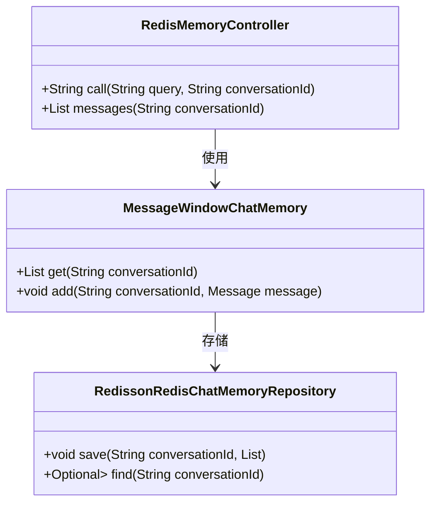
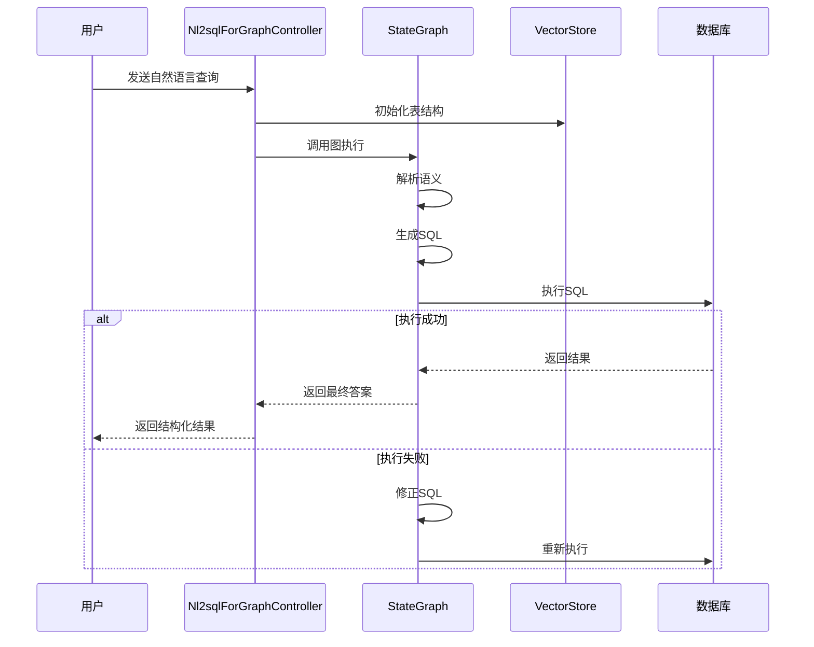
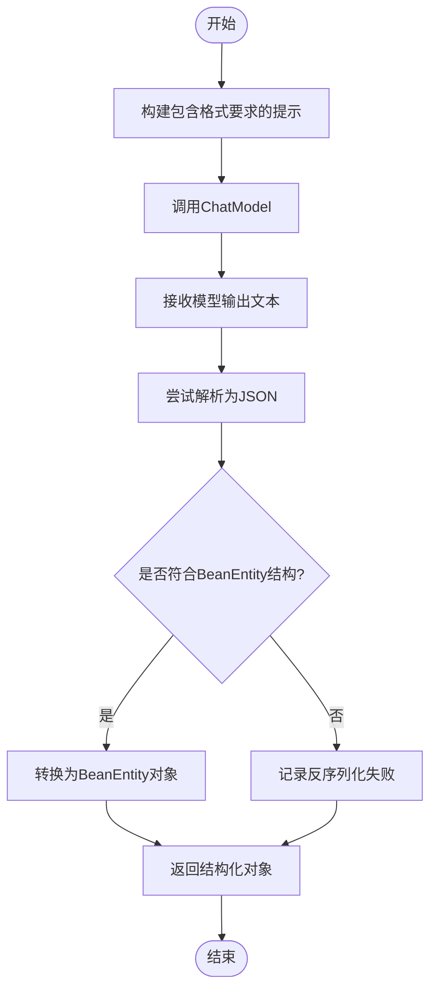

# 高级功能

<cite>
**本文档中引用的文件**  
- [RedisMemoryController.java](file://spring-ai-alibaba-chat-memory-example/src/main/java/com/alibaba/example/chatmemory/controller/RedisMemoryController.java)
- [Nl2sqlForGraphController.java](file://spring-ai-alibaba-nl2sql-example/chat/src/main/java/com.alibaba.cloud.ai.example/controller/Nl2sqlForGraphController.java)
- [BeanController.java](file://spring-ai-alibaba-structured-example/src/main/java/com/alibaba/cloud/ai/example/outparser/controller/BeanController.java)
- [BeanEntity.java](file://spring-ai-alibaba-structured-example/src/main/java/com/alibaba/cloud/ai/example/outparser/entity/BeanEntity.java)
</cite>

## 目录
1. [会话记忆](#会话记忆)
2. [NL2SQL功能](#nl2sql功能)
3. [结构化输出](#结构化输出)

## 会话记忆

会话记忆功能允许AI应用在多轮对话中保持上下文连贯性，通过将对话历史持久化到外部存储系统（如Redis、MySQL）来实现跨会话的状态管理。该机制对于构建具有长期记忆能力的聊天机器人至关重要。

在`RedisMemoryController`中，系统利用`RedissonRedisChatMemoryRepository`作为后端存储，结合`MessageWindowChatMemory`实现基于滑动窗口的消息存储策略。每个会话由唯一的`conversation_id`标识，最多保留100条历史消息，确保性能与记忆深度的平衡。

当客户端发起请求时，`call`方法接收查询内容和会话ID，并通过`ChatClient`调用AI模型。在此过程中，`MessageChatMemoryAdvisor`会自动从Redis加载对应会话的历史消息并注入到当前上下文中，使模型能够基于完整对话历史生成响应。此外，`/messages`端点提供了直接访问指定会话消息列表的能力，便于调试和监控。

**图示来源**  
- [RedisMemoryController.java](file://spring-ai-alibaba-chat-memory-example/src/main/java/com/alibaba/example/chatmemory/controller/RedisMemoryController.java#L1-L60)

**本节来源**  
- [RedisMemoryController.java](file://spring-ai-alibaba-chat-memory-example/src/main/java/com/alibaba/example/chatmemory/controller/RedisMemoryController.java#L1-L60)

## NL2SQL功能

NL2SQL（自然语言转SQL）功能使用户能够以自然语言形式提出数据查询请求，系统自动将其转换为结构化SQL语句并在数据库上执行。此功能极大降低了非技术人员访问数据库的门槛，提升了数据分析的效率。

`Nl2sqlForGraphController`通过图结构（Graph）编排整个处理流程。其核心是`StateGraph`，该图由多个节点组成，包括自然语言解析、SQL生成、语法校验和执行反馈等阶段。图的编译实例`CompiledGraph`负责驱动整个流程的状态流转。

在`search`方法中，首先初始化数据库元数据（如表结构`categories`, `orders`, `products`等）至向量存储，以便模型理解数据模式。随后，用户查询被作为输入传递给图引擎，触发一系列节点的执行。最终结果通过`OverAllState`对象返回，包含生成的SQL语句及其执行结果。

该实现支持复杂的多轮修正机制，允许模型在SQL执行失败时自我修正，直至获得有效查询。同时，通过设置`setMaxIterations(100)`防止无限循环，保障系统稳定性。

**图示来源**  
- [Nl2sqlForGraphController.java](file://spring-ai-alibaba-nl2sql-example/chat/src/main/java/com.alibaba.cloud.ai.example/controller/Nl2sqlForGraphController.java#L1-L80)

**本节来源**  
- [Nl2sqlForGraphController.java](file://spring-ai-alibaba-nl2sql-example/chat/src/main/java/com.alibaba.cloud.ai.example/controller/Nl2sqlForGraphController.java#L1-L80)

## 结构化输出

结构化输出功能允许AI模型返回预定义格式的数据（如JSON、Java Bean），而非自由文本。这对于需要将AI输出集成到程序逻辑中的场景至关重要，确保了数据的可解析性和类型安全性。

`BeanController`展示了如何使用`BeanOutputConverter`将模型输出转换为`BeanEntity`对象。该类定义了标题、作者、日期和内容等字段，模型需按照指定格式生成JSON字符串。系统通过注入`format`提示词引导模型输出合规结构。

`simpleChatFormat`方法直接调用`call().entity(BeanEntity.class)`，由框架自动完成反序列化。而`play`方法则采用流式响应（stream），逐步接收模型输出并拼接成完整JSON，最后统一转换。这种方式适用于大模型输出延迟较高的场景，提升用户体验。

此外，`chatModel`方法展示了如何手动构造包含格式约束的提示模板（PromptTemplate），通过ST模板渲染器动态插入格式说明，增强控制力。

**图示来源**  
- [BeanController.java](file://spring-ai-alibaba-structured-example/src/main/java/com/alibaba/cloud/ai/example/outparser/controller/BeanController.java#L1-L140)
- [BeanEntity.java](file://spring-ai-alibaba-structured-example/src/main/java/com/alibaba/cloud/ai/example/outparser/entity/BeanEntity.java#L1-L20)

**本节来源**  
- [BeanController.java](file://spring-ai-alibaba-structured-example/src/main/java/com/alibaba/cloud/ai/example/outparser/controller/BeanController.java#L1-L140)
- [BeanEntity.java](file://spring-ai-alibaba-structured-example/src/main/java/com/alibaba/cloud/ai/example/outparser/entity/BeanEntity.java#L1-L20)